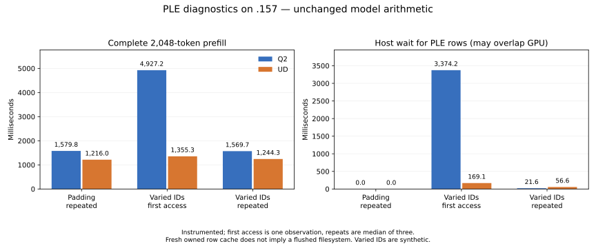

# PLE n-gram cost: new inputs expose an I/O bottleneck

<!-- SPDX-License-Identifier: MIT -->

On `.157`, the first synthetic varied 2,048-token input spends **3,374 ms
waiting for Q2 PLE rows**, in a **4,927 ms complete prefill**. UD waits 169 ms
in a 1,355 ms prefill. Hashing the n-grams takes less than 0.08 ms. This is a
real host row-I/O bottleneck in this observation, distinct from the remaining
GPU kernel gap in repeated-padding benchmarks.

The [follow-up I/O/cache experiment](Q2-PLE-CACHE.md) now measures approximately
21x physical read amplification for new Q2 row sets and rejects descriptor-local
RANDOM advice. Enlarging BF16 retention to 64K rows halves repeated row-gather
latency, but improves complete repeated varied prefill only 1.09%; forced decode
is unchanged and all compared outputs are exact. This narrows the next work to
new-row storage/prefetch costs and the separate remaining GPU bottleneck.

The previous C1 prompt mostly repeats `x `. It requests 32,768 rows but only
664 distinct rows; the varied input requests 32,766 distinct rows. Consequently,
the old warmup and repeated prompt do not characterize new-input PLE latency.
The earlier benchmark numbers remain valid for their stated repeated-padding
workload; they cannot represent arbitrary uncached prompts or long contexts.



## Full-model diagnostic on original weights

| 2,048-token input | Q2 prefill ms | UD prefill ms | Q2 blocked row wait ms | UD blocked row wait ms |
|---|---:|---:|---:|---:|
| Padding, repeated | 1,579.758 | 1,216.017 | <0.001 | <0.001 |
| Varied IDs, first access | 4,927.224 | 1,355.307 | 3,374.176 | 169.122 |
| Varied IDs, repeated | 1,569.673 | 1,244.266 | 21.602 | 56.642 |

First access is one observation with a fresh owned `NgramTable`; the filesystem
and drive are **not flushed**. Repeated rows are the median of three fresh model
sessions sharing that table. Host waiting can overlap already queued GPU work;
it is not an additive decomposition of prefill latency. The complete path has
unchanged kernels, original GGUF bytes, MTP disabled, max context 9,216 and
2,048-token prefill chunks. Five-second pauses are outside the timed requests.
Instrumentation uses clocks and atomic counters; these are diagnostics, not
replacement throughput acceptance results or independent quality qualification.

The varied prompt consists of deterministic ordinary token IDs, not natural
language. The 32 decode calls use the same forced continuation for both models.
Repeated median per-call values:

| Input | Q2 decode ms | UD decode ms | Q2 hash/start/wait ms | UD hash/start/wait ms |
|---|---:|---:|---:|---:|
| Padding | 41.243 | 39.155 | 0.019 | 0.009 |
| Varied IDs | 41.404 | 39.178 | 0.030 | 0.289 |

The first forced continuation after padding is much more expensive: median
blocked waits of 3.396 ms Q2 and 8.077 ms UD. These are deliberately new token
combinations, not the old greedy counting benchmark. PLE latency depends on
which rows have been touched, in addition to the model format.

## Row cache and on-disk representation

| Property | Q2 | UD |
|---|---:|---:|
| PLE type | BF16 | IQ4_NL |
| Bytes per 160-value row | 320 | 90 |
| Table bytes | 102,400,491,520 | 28,800,138,240 |
| Cache slots | 16,384 | 65,536 |
| Actual encoded-row cache bytes | 5,242,880 | 5,898,240 |
| Reader threads | 32 | 32 |
| Varied repeated prefill cache hits | 13.50% | 60.26% |
| Varied repeated prefill returned MiB | 117.66 | 52.21 |

This is the **PLE embedding-row cache, not the KV cache**. Both sources cap it
at 8 MiB and round the slot count down to a power of two. Q2 therefore retains
four times fewer rows. Each slot holds one row; colliding row IDs evict one
another. Large gathers sort jobs by row and can repeatedly evict rows before
their next access. The cache also stores encoded data, so hits still decode
the row into F32. These properties explain the measured low hit rate without
implying that the entire 102 GB table is read per request.

Both opens report `O_DIRECT`, but the storage is **not equivalent**. Read-only
GGUF metadata and five bounded FIEMAP windows inside each PLE table show:

- Q2: every sampled region is encoded, in 128-KiB extents.
- UD: every sampled PLE region is unencoded, in roughly 64-MiB extents.
- Both are on Btrfs `/home` with `compress=zstd:1`, kernel `7.2.2-1-cachyos`.

Btrfs documents that reads of compressed extents fall back to buffered I/O
even with `O_DIRECT`. It also describes 128-KiB compression chunks. This is a
concrete explanation consistent with the expensive first Q2 access and fast
subsequent reads despite continued row-cache misses. It is **not yet an isolated
compressed-versus-uncompressed causal benchmark**, nor a whole-file compression
inventory. The mount option alone would not establish the existing file's
encoding; the sampled extent flags provide that additional evidence.
[Btrfs compression documentation](https://btrfs.readthedocs.io/en/latest/Compression.html).

No model file, filesystem setting, foreign cache or service was modified.
Successful `O_DIRECT` open alone must not be documented as proof that PLE
never uses the page cache on this filesystem.

## Isolated row gathering

These measurements open another fresh owned row cache **after** full-model
execution. The 2K data has already been accessed through the filesystem. The
8K varied sample extends that set. It is a row-gather diagnostic, **not an 8K
model prefill**, and does not use the model executor's 2K chunking.

| Input | Tokens | Q2 first / repeated ms | UD first / repeated ms |
|---|---:|---:|---:|
| Padding | 2,048 | 1.571 / 0.559 | 5.017 / 0.664 |
| Varied IDs | 2,048 | 49.188 / 43.391 | 172.478 / 74.456 |
| Padding | 8,192 | 6.539 / 5.706 | 9.590 / 5.813 |
| Varied IDs | 8,192 | 4,016.738 / 195.228 | 644.910 / 512.493 |

Repeated 8K varied gathers hit only 0.027% of Q2 rows and 13.527% of UD rows.
The much lower repeated Q2 time therefore cannot be attributed to its small
row cache alone. Summed worker `pread` durations are concurrent wall time;
the report preserves them but never adds them to the critical-path duration.

## Consequences and next experiment

The warm-padding performance deficit remains: total prefill differs by about
364 ms while the complete host hash/start/wait sum is about 2.1–2.2 ms in both
models. PLE I/O cannot explain that GPU-dominated result. Matching the complete
11-dispatch `Executor::Ple` sequence in retained warm traces gives **11.060 ms
Q2 versus 11.084 ms UD**, including conversion, projections, norms, gating,
convolution, history and injection. H2D and host work are excluded. The three
kernels explicitly named PLE account for about 4.5 ms of that segment.

For new varied inputs, PLE I/O deserves its own optimization track. The next
bounded hypotheses are a cache sized by retained rows (with explicit memory
accounting), fewer collision evictions, and prefetch of a bounded number of
future prompt chunks while the GPU processes the current chunk. The current
executor already starts the current gather before layer 0 and waits at the
PLE injection boundary; merely adding callbacks cannot hide a multi-second
read behind that short GPU prefix. Storage encoding also needs a controlled
comparison on task-owned data, preserving the original model files and values.

Natural-language/code inputs and first/repeated access must be separate benchmark
cases before 128K–1M or serving conclusions. This diagnostic does not implement
those long-context tests or change the C17 reactive/HTTP path.

## Reproduction and evidence

`tools/prepare-q2-ple.py` derives two isolated sources from the retained Q2
MoE/HC checkpoint and independently fetched official UD source at
`f783fedb9bea2ec7de941f6da4e02f4a4596b29e`. Only `ngram.cpp` and an added
first-party diagnostic header differ. The GPU kernels and executor are unchanged.
Both complete 1,020-file source reconstructions and format/syntax checks pass.

```sh
python3 tools/prepare-q2-ple.py
python3 tools/q2-remote.py ple-cpu q2-ple-host-r2
python3 tools/q2-remote.py q2-ple q2-ple-model-r2
python3 tools/q2-remote.py ud-ple q2-ple-ud-r2
python3 tools/analyze-q2-ple.py --q2 evidence/q2-ple-model-r1 \
  --ud evidence/q2-ple-ud-r1 --output config/q2-ple-results.json
python3 tools/plot-q2-ple.py config/q2-ple-results.json docs/figures/q2-ple
```

Use new lowercase labels; source generation refuses existing destinations.
Every GPU arm requires the acknowledged enclosing window and four fresh leases.
Collect each completed arm before analysis with `tools/q2-remote.py collect`.

The `.157` host capsule passes 11/11 Debug and 11/11 ASan/UBSan checks, including
upstream independent hash/row-I/O fixtures. All eight model commands exit 0;
46 model artifacts and seven host artifacts are collected and hash verified.
All 33 saved frontier hashes per input repeat exactly across four sessions in
each model; the padding prefill also matches the previous uninstrumented model
frontier byte for byte. Q2 and UD logits need not match each other.

Machine-readable records: `config/q2-ple-{source,static,results,prior-gpu,validation}.json`,
the two isolated patches, and persistent `evidence/q2-ple-*`. Storage metadata
is retained in `evidence/q2-ple-storage-r1.json`; filesystem observations in
`evidence/q2-ple-filesystem-r1.json`. Source provenance and actual failures of
the unrelated HC tile experiments remain separate.

The enclosing window is released at 17:43:35 UTC; seven runners and 32 commands
from the combined HC-down/PLE campaign are retired. Fresh KFD and four-lease
closure plus independent observer retirement are recorded in
`config/q2-hc-down-ple-window-release.json` and `docs/COORDINATION.md`.
