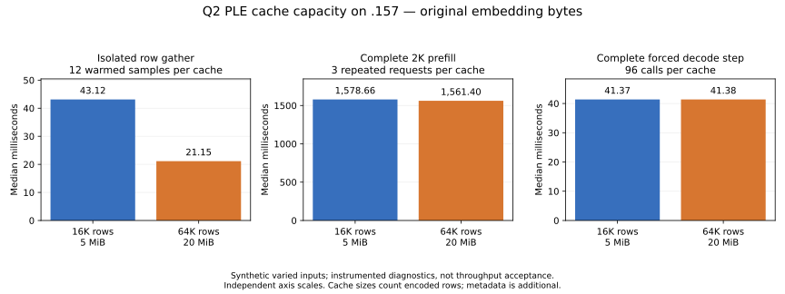

# PLE row I/O and cache capacity

<!-- SPDX-License-Identifier: MIT -->

The larger BF16 PLE cache halves repeated row-gather latency on `.157`, but
the complete repeated 2K prefill improves only **1.09%** in the instrumented
comparison. Forced decode is unchanged. All compared embedding and model
outputs replay exactly. This is a useful bounded cache hypothesis, not a
solution to the remaining Q2/UD GPU performance gap or a runtime promotion.

The [preceding investigation](Q2-PLE-ANALYSIS.md) measured a separate first-access
bottleneck: 3,374 ms blocked on Q2 PLE rows in a 4,927 ms varied-input prefill.
The experiments below investigate that I/O path and cache retention separately.
They do not flush the filesystem, modify model files or change device policy.
Here, cache means **PLE embedding rows, not KV state**.

## Descriptor-local advice does not help

Eight distinct synthetic 2K token sets are visited in ABBA-balanced first-policy
order, with a fresh owned row cache for each policy. The second policy reads
the same rows, verifying exact embedding bytes after filesystem warming. Each
policy then repeats once. Requested-page residency is observed with `mincore`
outside the timer; `/proc/self/io` read bytes are observed around each gather.
These diagnostics bind original GGUF metadata and read original PLE rows but
perform no model upload, GPU launch or CPU model forward.

`POSIX_FADV_RANDOM` is applied only to the table's separately opened reader
descriptor. Linux documents that this disables readahead for that open handle;
other open handles are unaffected. This does not evict shared pages or alter
the file's compression. [Linux posix_fadvise documentation](https://man7.org/linux/man-pages/man2/posix_fadvise.2.html).

Each first-position row below contains four observations on different sets.
Resident percentages and elapsed times are medians; MiB columns are means.
The sets are order-balanced, not identical cold storage states.

| Model / advice | Gather ms | Requested pages resident before | Physical read MiB | Returned MiB |
|---|---:|---:|---:|---:|
| Q2 NORMAL | 1,546.242 | 13.29% | 2,847.890 | 136.016 |
| Q2 RANDOM | 1,561.589 | 13.22% | 2,846.471 | 136.145 |
| UD NORMAL | 171.377 | 0.00% | 130.777 | 130.777 |
| UD RANDOM | 171.394 | 0.00% | 130.719 | 130.711 |

RANDOM gives no measured improvement and is rejected. Q2 reads approximately
**21 times** as many physical bytes as its row reader returns, versus about
one for UD. Alongside the prior bounded FIEMAP observations, this supports
compressed-extent read amplification as an explanation. It is not a controlled
compressed/uncompressed A/B on otherwise identical storage.

The second-policy Q2 gather, still with an empty owned cache, takes about
47–48 ms when roughly 99.95% of requested pages are resident, with about
0.06 MiB physical traffic despite 136 MiB returned. A successful `O_DIRECT`
open consequently does not establish that these compressed reads bypass the
filesystem cache. Complete policy order, residency, ranges and counters remain
in `config/q2-ple-io-results.json` and the collected logs.

## Retaining the same number of rows

The original 8-MiB budget rounds down to 16,384 BF16 rows, only 5 MiB of encoded
data. IQ4_NL already retains 65,536 rows. The candidate changes only the budget
for BF16 rows of dimension 160 to 32 MiB, yielding 65,536 slots and **20 MiB of
encoded data**. The incremental cost is 15 MiB of encoded rows plus metadata
for another 49,152 entries. Other shapes/formats retain their original budget.
The direct-mapped replacement policy and original embedding values are unchanged.

Four previously accessed row sets compare both capacities in alternating order,
with four gathers per fresh table. The following medians use the three repeated
gathers per set, twelve observations per capacity; requested pages are about
99.96% resident. Allocation and destruction are outside these timers.

| Repeated row gather | Original 16K slots | Candidate 64K slots |
|---|---:|---:|
| Elapsed ms | 43.123 | 21.148 |
| Row-cache hits | 13.65% | 60.70% |
| Returned MiB per gather | 117.534 | 53.498 |

The component is **2.04 times faster**, with 50.96% lower latency. Both fresh
owned caches take about 48 ms before retention can help. Capacity does not
remove the cost of reading genuinely new rows; it prevents some subsequent
evictions and reads. All 96 row-I/O observations across Q2 and UD retain exact
per-set embedding hashes across policies/repetitions.

## Complete model comparison

Fresh reference and candidate binaries are built and run sequentially on `.157`
using the existing PLE diagnostic harness. Only the candidate's BF16 cache
allocation differs; the candidate has no advice override. Original Q2 model
bytes, kernels, executor arithmetic and input IDs are unchanged. Each case
has four fresh sessions sharing its own table, 2,048 input tokens and 32 forced
decode calls; MTP is disabled. Five-second inter-request pauses are outside
the timers. Filesystem data has been accessed in previous diagnostics, so a
fresh owned cache here must not be presented as a cold-storage experiment.

Repeated prefill values are medians of three requests. Repeated decode values
are medians of 96 individual forced calls, not a greedy-generation benchmark.

| Complete repeated operation | Original ms | Candidate ms | Elapsed change | Original / candidate blocked row wait ms |
|---|---:|---:|---:|---:|
| Padding 2K prefill | 1,584.334 | 1,582.157 | -0.14% | <0.001 / <0.001 |
| Varied 2K prefill | 1,578.660 | 1,561.402 | -1.09% | 27.401 / 3.288 |
| Padding decode call | 41.367 | 41.313 | -0.13% | <0.001 / <0.001 |
| Varied decode call | 41.373 | 41.375 | +0.005% | 0.013 / <0.001 |

Varied prefill cache hits increase from 13.46% to 60.26%. The reduction in
host wait is real, but host work can overlap queued GPU work. Subtracting
host-wait medians from prefill medians would not produce a valid GPU-time
decomposition. The remaining complete prefill is still about 1.56 seconds.
Sequential arm order, instrumentation and three repeated requests also limit
any conclusion about a small throughput improvement.

For completeness, first-owned-cache prefill is 1,578.929 / 1,578.811 ms for
padding and 1,584.969 / 1,570.605 ms for varied IDs. Both arms' row-cache hit
counts are zero on these first requests. Those differences are not evidence
that capacity accelerates first reads; filesystem state and run order differ.
Every per-call sample is retained in `config/q2-ple-cache64k-results.json`.

Standalone varied gathers after the model show 44.112 -> 22.279 ms at 2K and
196.900 -> 172.766 ms at 8K, for repeated gathers. At 8K, hit rate is only
0.027% -> 13.53%, so this small cache cannot retain a large varied prompt.
These are **row gathers, not 8K model inference**.

## Qualification and disposition

The independent BF16 row oracle exercises cache collisions, repeated rows,
output guards, rejected overlap/out-of-range reads and destruction while a
read is pending. On `.157`, the I/O source passes 12/12 CTest checks in Debug
and 12/12 under ASan/UBSan. The fixed-capacity model source separately passes
11/11 in each configuration. Both complete model arms exit 0 and retain:

- all 264 per-forward frontier hashes;
- all 16 standalone gather embedding hashes;
- all 18 saved complete input/output files, byte for byte.

This is replay against the retained experimental Q2 baseline, not an independent
full-model Q2 teacher. It does not resolve earlier checkpoint drift or qualify
natural-language quality, long contexts, HTTP serving or C17 reactive scheduling.
The cache candidate remains isolated pending an uninstrumented representative
performance comparison and explicit resource accounting at integration.

Both source variants reconstruct exactly; changed-file formatting and syntax
checks pass. Current full-tree formatting exits 1 on the same two unchanged
upstream test files in both bases and candidates, using clang-format 23.1.1.
Those exits, including the first aborted static script, are retained. Unrelated
upstream tests are not reformatted to conceal the inherited failures.

Source generators and patches: `tools/prepare-q2-ple-{io,cache}.py`,
`experiments/q2-ple-io-{q2,ud}.patch` and
`experiments/q2-ple-cache64k-{raw,diagnostic}.patch`. Source/static identities,
complete results and collection receipts are in the corresponding `config/`
JSON files; all original evidence stays under `evidence/`. Analysis and graph
reproduction use `tools/analyze-q2-ple-{io,cache}.py` and
`tools/plot-q2-ple-cache.py`.

The six-arm window closes at **18:25:33 UTC** on 2026-10-02, with all 26
remote command exits 0 and 68 artifacts hash verified. All owned processes
are retired, KFD is empty and four original leases are free; independent
observer retirement passes at 18:26:08. The next window returns to core.
`config/q2-ple-cache-window-release.json` and `docs/COORDINATION.md` record
the handover. No Q2 remote job or automatic retry remains.
