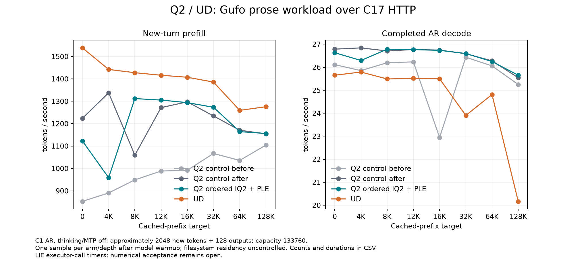

<!-- SPDX-License-Identifier: MIT -->
# PLE cache-first on the canonical context curve

The four-arm comparison completes on `.157` on 2026-10-04. Consuming resident
PLE rows before publishing misses does **not establish a stable full-model
speedup** over the unchanged ordered-IQ2 control. Candidate prefill remains
below UD at all eight depths. The candidate is not promoted; full Q2/UD PP/TG
parity and independent numerical/task-quality qualification remain open.

The first control, PLE candidate, repeated unchanged control and pristine UD
run sequentially with the same pinned Gufo prose HTTP recipe, C17 executor-call
timers and host-qualified harness. Both Q2 comparisons preserve all 20 complete
request payloads, outputs, finish reasons and work counts, including calibration,
warmup and prefix preparation. No numerical kernel changes in this candidate.
Exact replay is separate from independent numerical acceptance.

[SVG](figures/q2-ple-canonical/curve.svg),
[all 32 observations with counts, durations and cache times](figures/q2-ple-canonical/samples.csv),
[verified comparison](../config/q2-ple-canonical-results.json).

## Prefill — tokens per second

| Prefix target | Q2 control before | Q2 + PLE | Q2 control after | UD |
| ---: | ---: | ---: | ---: | ---: |
| 0 | 852.935 | 1122.526 | 1223.777 | 1538.521 |
| 4096 | 890.555 | 958.657 | 1337.940 | 1442.191 |
| 8192 | 948.968 | 1312.087 | 1059.414 | 1427.631 |
| 12288 | 988.402 | 1305.337 | 1271.633 | 1416.271 |
| 16384 | 991.849 | 1293.975 | 1297.501 | 1407.255 |
| 32768 | 1066.778 | 1273.262 | 1234.497 | 1385.877 |
| 65536 | 1035.898 | 1164.388 | 1170.715 | 1259.388 |
| 131072 | 1104.323 | 1156.229 | 1154.364 | 1275.705 |

## Decode — tokens per second

| Prefix target | Q2 control before | Q2 + PLE | Q2 control after | UD |
| ---: | ---: | ---: | ---: | ---: |
| 0 | 26.114 | 26.633 | 26.787 | 25.654 |
| 4096 | 25.854 | 26.295 | 26.843 | 25.792 |
| 8192 | 26.197 | 26.785 | 26.709 | 25.491 |
| 12288 | 26.234 | 26.767 | 26.771 | 25.520 |
| 16384 | 22.948 | 26.736 | 26.746 | 25.499 |
| 32768 | 26.436 | 26.598 | 26.588 | 23.906 |
| 65536 | 26.059 | 26.249 | 26.280 | 24.814 |
| 131072 | 25.252 | 25.654 | 25.544 | 20.169 |

## Attribution and limits

The unchanged second Q2 control improves prefill by 4.531–50.237% relative to
the first. Consequently, the candidate's increase over the first control cannot
be assigned to the PLE change. Relative to the repeated control, candidate PP
is −8.274% at 0, −28.348% at 4K, +23.850% at 8K and −0.540% to +3.140% at the
remaining depths; at 128K it differs by only +0.161%. Every observation is retained.
These single sequential observations do not isolate storage residency, run order,
thermal/frequency effects or prove a causal regression at a particular depth.
The [three-arm order report](../config/q2-ple-order-control.json) was captured
before UD completed and remains a historical partial report.

Candidate decode differs from the repeated Q2 control by −0.575% to +0.433%
except 4K (−2.040%). Both already contain the previously measured ordered-IQ2
optimization, so their advantage over UD is not a new PLE decode gain. UD drops
to 23.906 at 32K and 20.169 at 128K in this run; those samples are retained, without
claiming their cause or crediting the resulting large ratios to the candidate.
The earlier [ordered-IQ2 comparison](Q2-IQ2-CANONICAL.md) remains separate.

Candidate PP is 27.039%/33.528% below UD at 0 / 4K and 7.543–9.366% below at 8–128K.
At 128K, 2046 new tokens follow 130933 physically cached tokens; candidate PP is
1156.229 versus UD 1275.705 tokens/s. The acceptance curve is still the complete
0–128K workload, including short contexts. No counting-prompt or instrumented
result substitutes for it.

The host collision test confirms zero rereads of initially resident rows with
identical values. This does not remove the read cost of genuinely new rows,
and moving cache-hit conversion onto the caller can impose a cost. The full
model comparison has not demonstrated a worthwhile net effect. Further prefill
work should measure active kernel/routing geometry on this canonical workload;
the source-audit opportunity of mixed full/tail expert tiles remains untested.

## Validation and release

The fresh host cohort passes 21/21 Debug and 21/21 ASan/UBSan. Each model arm
completes all eight depths with five zero command exits and 30 verified artifacts.
The analyzer validates the host-qualified source/harness identities, the one-file
PLE composition, complete histories and actual counts/durations. All 32 exported
CSV rows match the report, and the graph is visually inspected. Every accepted
cell completes 128 autoregressive outputs; C1, thinking/MTP/vision/SSD off,
RAM prefix budget 16384 MiB, capacity 133760 and chunk 2048 are unchanged.

At **2026-10-04T03:51:19.663070+00:00**, verified release confirms 39 owned
process identities and 26 groups retired, empty KFD, all four original leases
unchanged/free and five model stat identities unchanged. All 26 commands exit
zero and 127 artifacts verify. No model payload rehash, cache flush, tuning,
foreign process termination or dependency installation is performed. Remote/main
receipts and the shared registry record closure. Outgoing thread-message transport
fails; persistent ready/release receipts provide the agreed handover evidence.
No Q2 workload, waiter or automatic restart remains.

[Release receipt](../config/q2-ple-curve-window-release.json),
[artifact validation](../config/q2-ple-canonical-artifact-validation.json),
[host validation](../config/q2-ple-ordered-host-results.json),
[UD arm validation](../config/q2-ple-curve-ud-r1-validation.json),
[repeated-control validation](../config/q2-ple-curve-control-r2-validation.json).
