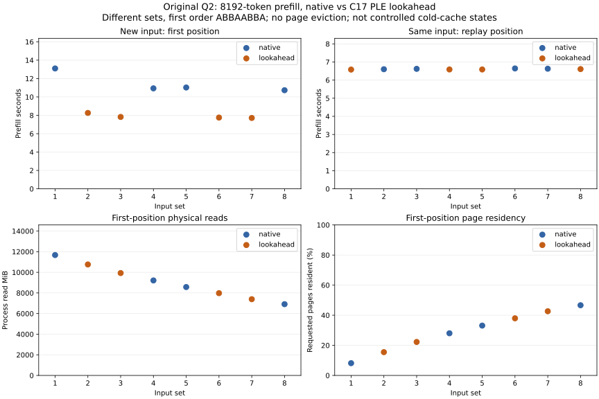

<!-- SPDX-License-Identifier: MIT -->
# Reactive PLE on new inputs

The [repeated-input experiment](Q2-PLE-LOOKAHEAD.md) verifies overlap and exact
results but measures only a 0.36% warm prefill rate change. Its first ordered
native request populated pages for the following arms, so those observations
cannot establish a first-access benefit. This follow-up makes first-position
assignment explicit and measures the observed I/O state.

## Measured result — 2026-10-02

On `.157`, lookahead reduces median first-position 8K prefill from **10.982155
s to 7.791053 s**: **29.06% less elapsed time / 40.96% more tokens/s**. Each
mode occupies first position on four different input sets. Median requested
page residency before prefill is 30.58% / 30.11%, and mean physical read traffic
is 9,093.921 / 9,017.233 MiB. The gain is not explained by one mode always
replaying the other's input. It remains an observed, balanced comparison rather
than an identical-state cold-storage trial or a general workload speedup.

| Position / mode | 8K prefill median s | Prefill tokens/s | 32 forced decode median s | Pages resident before, median | Read MiB, mean |
| --- | ---: | ---: | ---: | ---: | ---: |
| First / native | 10.982155 | 745.937 | 1.323606 | 30.58% | 9093.921 |
| First / lookahead | 7.791053 | 1051.463 | 1.326309 | 30.11% | 9017.233 |
| Replay / native | 6.625901 | 1236.360 | 1.313645 | 99.95% | 0.257 |
| Replay / lookahead | 6.588115 | 1243.451 | 1.312970 | 99.95% | 0.255 |

Lookahead hides 3.318–3.817 seconds of row preparation, median **3.380 s**.
Its readiness wait is 1.073–1.613 s, predominantly the first chunk. Both modes
still read roughly 9 GiB physically per new prompt in this sequence. Scheduling
hides much of that work; it does not remove the amplification or prove its
filesystem cause. On replay, roughly 99.95% of requested pages are resident
and throughput changes only **+0.57%**, consistent with the earlier warm result.
Forced decode is effectively unchanged; it uses ordinary forward without
lookahead of future forced tokens.

All **576 full-vocabulary frontier hashes** match within their input pair, and
all 16 complete 36-row buffers pass finite and byte-for-byte comparisons.
The 32 saved final prefill/decode files also match their counterparts. No
numerical tolerance is weakened. This is the first measured substantial
benefit for this isolated reactive PLE path, not a production integration or
a resolution of the warm Q2/UD kernel gap. The prepared executor and C17 flow
are unchanged from the preceding validated experiment.

[Machine-readable complete results](../config/q2-ple-first-access-results.json)
and [all-value CSV](figures/q2-ple-first-access.csv) retain every sample and
callback interval. The full per-run wall values follow; zero-based input set
IDs match the event log, while the plot labels sets 1–8 for readability.

| Set | Mode | Position | Prefill s | Prefill tokens/s | 32 forced decode s | Pages resident before | Physical read MiB |
| --- | --- | --- | ---: | ---: | ---: | ---: | ---: |
| 0 | native | First | 13.102079 | 625.244 | 1.336545 | 8.16% | 11675.172 |
| 0 | lookahead | Replay | 6.582028 | 1244.601 | 1.312976 | 99.95% | 0.250 |
| 1 | lookahead | First | 8.261760 | 991.556 | 1.330302 | 15.49% | 10763.059 |
| 1 | native | Replay | 6.601714 | 1240.890 | 1.313238 | 99.96% | 0.223 |
| 2 | lookahead | First | 7.824965 | 1046.906 | 1.326496 | 22.26% | 9930.297 |
| 2 | native | Replay | 6.622384 | 1237.017 | 1.313812 | 99.95% | 0.266 |
| 3 | native | First | 10.936451 | 749.055 | 1.323572 | 28.03% | 9214.457 |
| 3 | lookahead | Replay | 6.588598 | 1243.360 | 1.312964 | 99.95% | 0.285 |
| 4 | native | First | 11.027859 | 742.846 | 1.323640 | 33.14% | 8573.555 |
| 4 | lookahead | Replay | 6.587632 | 1243.542 | 1.313752 | 99.96% | 0.242 |
| 5 | lookahead | First | 7.757141 | 1056.059 | 1.326121 | 37.97% | 7980.266 |
| 5 | native | Replay | 6.644616 | 1232.878 | 1.314152 | 99.95% | 0.297 |
| 6 | lookahead | First | 7.714678 | 1061.872 | 1.324449 | 42.66% | 7395.312 |
| 6 | native | Replay | 6.629419 | 1235.704 | 1.313478 | 99.96% | 0.242 |
| 7 | native | First | 10.731148 | 763.385 | 1.322150 | 46.66% | 6912.500 |
| 7 | lookahead | Replay | 6.609506 | 1239.427 | 1.311646 | 99.96% | 0.242 |

## Comparison contract

The fixed `q2-ple-first-access` remote mode selects the same prepared-input
executor and C17 two-slot scheduler as the earlier experiment. No kernel, row
decoder, owned row-cache capacity or original model byte changes. The harness
adds `--first-access`; the existing repeated-input protocol remains available.

The model uploads once. A separate 8192-token padding prompt with 32 forced
decode calls warms execution paths before measurement. Eight new deterministic
varied-token sets then run through both native and lookahead, in first-position
order **native, lookahead, lookahead, native, native, lookahead, lookahead,
native**. Every request uses an empty owned row cache and fresh session/executor.
Each pair shares identical tokens, 8192 prefill tokens, four 2048-token chunks
and 32 forced decode tokens; seeds and full input files are retained.

First-position comparisons use four different sets per mode. Second-position
requests replay the same input after the other mode and are reported separately.
They verify exact output and provide a warmer control. No global cache is
flushed. Distinct row sets may share pages or compressed extents, so these are
balanced observations of new inputs, **not identical controlled cold states**.

Requested-page residency is observed with `mincore` before/after each prefill,
outside all forward timers. The page set includes every page touched by the
original BF16 PLE rows for the complete prompt. `/proc/self/io` physical read
bytes bracket prefill, including both producer and consumer threads. They are
process counters, not an isolated per-device or PLE-only hardware counter.
Five-second pauses, allocation, page observation, output hashing and evidence
writes are excluded. Preparation, producer admission/drain, GPU forward and
full-vocabulary final-token copies from every chunk are included.

The n-gram table in the Q2-named model is **BF16**, not Q2. Its 160-value rows
occupy 320 bytes, versus 90 bytes for UD IQ4_NL; table sizes are
102,400,491,520 and 28,800,138,240 bytes. Both models reside on the same disk.
The [earlier I/O observations](Q2-PLE-CACHE.md) measure different physical read
amplification and the [bounded extent inspection](Q2-PLE-ANALYSIS.md) finds
encoded Q2 extents and unencoded UD extents on the same Btrfs filesystem.
Filesystem compression and numerical quantization are independent. These
observations do not establish causality without an identical-content storage
control, and this scheduling experiment does not perform one.
Other sampled parts of UD are compressed, and a sampled non-PLE part of Q2 is
uncompressed. The observed distinction concerns the PLE regions, not entire
models; their historical compression decisions are not known.

A fresh [read-only attribute observation](../config/q2-ple-storage-flags.json)
at 20:43:20 UTC finds no per-file compression property and zero inode flags on
both Q2 and UD shard 2, which contains PLE. UD shard 3 has `NOCOMPRESS`, but is
not the PLE shard. Thus the PLE distinction cannot be explained by a currently
set `NOCOMPRESS` bit on its UD file. Historical writes/preallocation and
content-dependent compression remain possible explanations, not findings.
Current flags do not describe all existing extents. No attribute is changed.

## Validation and status

Every pair compares all 36 complete vocabulary rows byte-for-byte, checks
finite values and records per-frontier SHA256. The first member's complete
output and both members' final prefill/decode rows are saved with manifests.
All chunk callback intervals and flow counters are retained, including evidence
that preparation follows prior slot release. Existing stale/malformed input
rejection and real in-flight cancellation/drain remain in the GPU protocol.
No independent full-model teacher, natural-language quality or UD performance
parity is implied by exact replay.

The changed harness passes editing-host syntax and formatting. CPU fixtures
pass 12/12 Debug and 12/12 ASan/UBSan on `.157`, including the final collection
parser repair. All four original-model arm commands exit 0. The first
collection exits 1 because the eight complete reference outputs exceed its
original 128-MB total cap. That archive is retained and recovered locally after
qualifying a mode-specific 384-MB bound; other modes keep 128 MB. Unsafe paths,
links, duplicates and oversized archives are rejected, and existing results
are never overwritten. All 53 model artifacts verify; no model rerun is used.

The enclosing HC/PLE campaign has six runners, 28 command exits and 170
hash-verified artifacts. Twenty-six commands exit 0; the two preceding HC
component commands retain their known numerical-control exit 1. Model-arm
observed maxima are GPU96 C / CPU94.625 C, within the owner-authorized bounds.
Closure at **20:50:13 UTC** verifies all owned identities retired, empty KFD
and four original leases free. Independent observer retirement passes at
**20:50:40 UTC**. [Validation](../config/q2-coalesced-ple-validation.json),
[release](../config/q2-coalesced-ple-window-release.json) and actual failure
receipts remain available. No Q2 job or automatic retry remains. The qualified
runtime, original models, filesystem settings and public C ABI are unchanged.

Reproduction uses `tools/q2-remote.py q2-ple-first-access LABEL` in an admitted
window, followed by `collect LABEL` and
`tools/analyze-q2-ple-first-access.py RESULTS OUTPUT`. For a previously
downloaded but unextracted archive, `collect LABEL --existing-collection`
performs local validation/extraction without another SSH transfer. Graphs use
`tools/plot-q2-ple-first-access.py REPORT OUTPUT_STEM`. Source and
resource ownership follow [the original PLE experiment](Q2-PLE-LOOKAHEAD.md).
