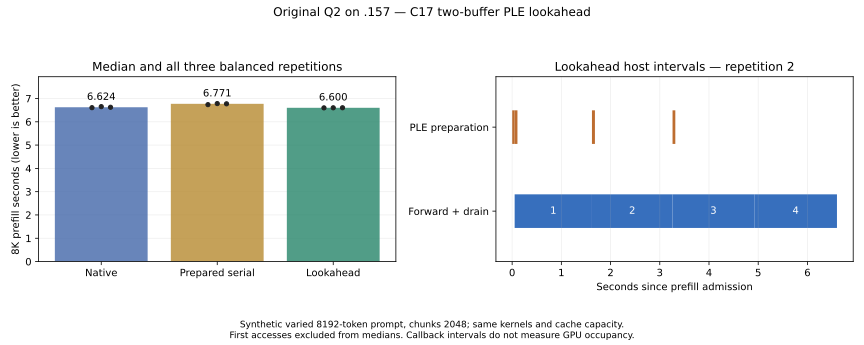

<!-- SPDX-License-Identifier: MIT -->
# Reactive PLE lookahead

The prompt tokens are known before prefill. Their PLE n-gram row IDs and row
values can therefore be prepared for the next chunk while the GPU consumes
the current chunk. KV/SSM state remains sequential. This experiment changes
that scheduling boundary, with the measured MoE/HC Q2 kernels, row decoder,
encoded cache capacity and original GGUF bytes held fixed.

The original-weight `.157` run verifies overlap and byte-exact results, but
the balanced repeated-input median is only **0.36% faster than native**. This
is too small to establish a robust performance gain from three repetitions.
Native already hides much of the warm row-read cost within each chunk.
Debug and ASan/UBSan each pass 12/12 CTest checks. This remains an isolated
experiment; it is not promoted to the qualified runtime.

## Measured result — 2026-10-02

| Mode | 8K prefill median | Prefill tokens/s | 32 forced decode median | Decode steps/s |
| --- | ---: | ---: | ---: | ---: |
| Native | 6.623813 s | 1236.750 | 1.310417 s | 24.4197 |
| Prepared serial | 6.771089 s | 1209.850 | 1.309754 s | 24.4321 |
| C17 lookahead | 6.600349 s | 1241.146 | 1.309427 s | 24.4382 |

The lookahead saves 23.464 ms versus native (0.35% less wall time, 0.36% more
tokens/s). Decode is effectively unchanged. Against prepared serial it saves
170.740 ms, but that control loses native's existing within-chunk overlap;
using only that comparison would overstate the improvement.

| Measured repetition | Native prefill | Prepared serial prefill | Lookahead prefill |
| --- | ---: | ---: | ---: |
| 1 | 6.605825 s | 6.735974 s | 6.597380 s |
| 2 | 6.650061 s | 6.781618 s | 6.600349 s |
| 3 | 6.623813 s | 6.771089 s | 6.601981 s |

Lookahead overlaps **173.6–187.4 ms** of row preparation with the previous
chunk's forward; median 176.2 ms. Its consumer waits only 50.2–57.4 ms total,
mostly for the first chunk. GPU forward plus drain still occupies about
6.54–6.55 s. Two slots are the observed maximum; interval checks find no early
reuse. The producer's elapsed preparation remains about 224–244 ms: reactive
scheduling hides work, it does not remove that work or accelerate Q2 kernels.

The first ordered native observation is **14.109431 s**, followed by serial
6.735315 s and lookahead 6.583732 s. Those later runs reuse pages populated by
earlier reads. This is **not** evidence of a 2x reactive speedup. A controlled
first-access comparison remains necessary to quantify the larger-I/O case;
no shared cache was flushed.

The [subsequent eight-set comparison](Q2-PLE-FIRST-ACCESS.md) balances native
and lookahead first position on new inputs and observes page residency/I/O.
It measures +40.96% first-position throughput with similar group residency,
versus +0.57% on replay, while preserving all 576 frontiers. That positive
I/O-bound result remains distinct from this warm comparison and from a
controlled identical-state filesystem trial.

All **432** full-vocabulary frontier hashes match, and every complete 36-row
output is compared byte-for-byte in memory. All values are finite. The saved
native complete output and 24 final prefill/decode arrays agree. Stale/malformed
input rejection and real in-flight cancellation/drain pass. Both runner command
sequences exit 0; all 38 collected artifacts verify. The two runs close cleanly,
with empty KFD, four unchanged/free leases and observer retirement independently
verified. [All samples and intervals](../config/q2-ple-lookahead-results.json),
[CSV](figures/q2-ple-lookahead.csv), [validation](../config/q2-ple-lookahead-validation.json)
and [release receipt](../config/q2-ple-lookahead-window-release.json) are retained.

## Ownership and cancellation contract

`experiments/ple_flow.{h,c}` owns admission, slot readiness, ordering,
backpressure, cancellation and metrics. It is C17, with no upstream types.
There are exactly two caller-owned disjoint slots. The producer handles one
chunk at a time; the caller thread consumes chunks in order. Serial mode uses
the same callbacks and buffers. A third preparation waits until its slot is
released. There is no polling loop, unbounded queue or model execution on CPU.

Each slot contains all row IDs and decoded F32 embeddings. At 2048 tokens,
16 heads and 160 values per head this is 20.125 MiB per slot (40.25 MiB total).
`lie_ple_flow_bytes` also reserves control metadata and rejects an insufficient
budget, overflow, null or overlapping storage. OS thread stacks, the unchanged
upstream row reader/cache and executor allocations are outside this explicit
slot reservation. The experiment does not claim that this is total RSS.

Only the producer accesses the table during prepared prefill. It advances its
own copy of n-gram history through immutable prompt tokens. The transitional
C++/HIP `ForwardPrepared` rehashes row IDs against the current session before
mutation and rejects stale/wrong IDs or shapes. It trusts the embedding values
provided by its adapter. Normal forward arithmetic advances KV/SSM/PLE history;
only the source of the host PLE upload changes. Plain forward remains available.

A slot remains owned until every asynchronous GPU reader has drained, even on
error or cancellation. Cancellation stops new admission, wakes waiters and
waits for in-flight callbacks. It cannot forcibly interrupt an existing disk
read. First failure is retained. Runs are one-shot; destroy during a run is
refused. A failed model call invalidates its session. If HIP cannot establish
drain, the harness records failure and retires its own process without freeing
or reusing borrowed storage. This is not a qualified GPU fault recovery claim.

The adapter hook is an experimental C++ executor API. It does not change the
public LIE C ABI or HTTP service. Production adoption needs the owning adapter
to account for pinned memory, cancellation and poisoned resources under its
versioned state contract; no borrowed upstream type belongs in the C ABI.

## Comparison and timing contract

The fixed `q2_ple_lookahead` target uses original Q2 weights on `.157` and an
explicitly synthetic, deterministic varied-token 8192-token prompt, four
2048-token chunks and 32 identical forced decode steps. It compares:

1. `native`: unchanged forward, including its existing within-chunk asynchronous
   PLE read and overlap with the layers preceding PLE.
2. `prepared_serial`: the new prepared-input interface without lookahead.
3. `lookahead`: the same prepared interface with the bounded C17 producer.

The native arm is the performance baseline. Serial prepared input may lose
existing within-chunk overlap and is only a mechanism control. All arms use
the same binary, kernels, table capacity, token sequence and chunking. Every
run gets a new row table, executor and session. Original weights are uploaded
once; there is no prefix reuse, model conversion, system cache eviction or
descriptor advice change. All arms retain the same two pinned buffers.

Initial accesses are saved separately. They are ordered observations, not a
controlled cold-cache comparison. Three subsequent repetitions rotate arm
order so every mode occupies each position once. Five seconds idle outside
timing separates runs. The enclosing runner retains thermal telemetry and
fresh four-lease admission; a complete MMQ/executor build is used.

Prefill wall time includes producer thread creation, hash/gather, readiness
wait, GPU work, logits copies and producer drain. Model upload, allocation,
idle, hashing output evidence and file writes are excluded. Every chunk
downloads its full final-token vocabulary logits in all arms; these rates are
specific to this comparison, not the ordinary final-chunk-only benchmark.

`prepare_ns` and `consume_ns` are elapsed callback durations and overlap in
lookahead mode; summing them does not give wall time. `consumer_wait_ns` is
readiness/mutex wait, not a device-only or disk-only counter. Per-chunk host
intervals establish preparation/consumption overlap and prove that a reused
slot follows the previous consumer's drain. They do not measure GPU occupancy.

All four prefill frontiers and 32 decode frontiers are compared byte-for-byte
in memory against native output, with SHA256 for every complete vocabulary
row. The native complete output and each run's final prefill/decode rows are
saved. Timing is retained even if numerical comparison fails. Stale/malformed
input rejection and a real in-flight prepared cancellation are checked. CPU
fixtures separately exercise overlap, two-slot backpressure, order, failure
drain, cancellation from either callback and invalid reservations.

## Limits and next acceptance gates

This hypothesis targets host row-I/O stalls. It cannot make the GPU's remaining
Q2 matrix kernels faster. The [preceding I/O/cache report](Q2-PLE-CACHE.md)
shows why first-access and repeated-input effects must be distinguished.
The first prompt block still pays its initial read. Ordinary autoregressive
decode cannot prepare an unknown next token's rows without speculation.

An 8K scheduling result does not establish 128K–1M context support, Q2/UD
performance parity, production HTTP integration or semantic model quality.
Those acceptance gates remain separate. The currently qualified runtime patch
is unchanged; this source derives from the retained experimental MoE/HC Q2
checkpoint, whose earlier numerical deviation from qualified Q2 remains open.

Reproducible source: [preparer](../tools/prepare-q2-ple-lookahead.py),
[patch](../experiments/q2-ple-lookahead.patch),
[source receipt](../config/q2-ple-lookahead-source.json),
[static checks](../config/q2-ple-lookahead-static.json). The full formatter's
inherited failures in two unchanged upstream test files remain recorded;
changed-file formatting and C17/C++ syntax checks pass. Runtime logs and real
exit codes remain in persistent `evidence/q2-ple-lookahead-*` directories.

The fixed remote modes are `ple-lookahead-cpu` and `q2-ple-lookahead` through
`tools/q2-remote.py`. The latter owns a fresh GPU lease only inside an explicitly
coordinated window. `tools/analyze-q2-ple-lookahead.py` retains all samples,
verifies evidence and keeps first accesses separate from the balanced median.
