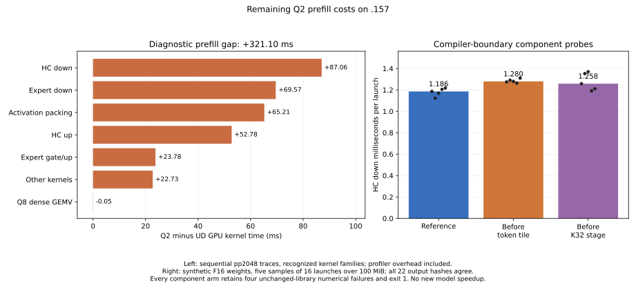

# Remaining Q2 prefill GPU costs

<!-- SPDX-License-Identifier: MIT -->

Fresh `.157` profiles of the measured affine-palette Q2 candidate and pristine
UD find **321.095 ms additional Q2 prefill kernel time** at 2,048 tokens.
Recognized HC down, expert down, activation packing and HC up account for most
of the difference. Two compiler-boundary experiments on HC down preserve all
22 complete synthetic outputs but increase component median time by **7.93%**
and **6.12%**. Both are rejected; neither receives a complete-model run.

The selected development source remains the [affine palette](Q2-AFFINE-PALETTE.md).
Its preceding unprofiled C1 comparison measured 1313.327 prefill tokens/s and
24.099602 decode calls/s against fresh UD 1660.101 and 24.309297. Those gaps
remain 20.89% PP and 0.86% TG; this diagnostic campaign supplies no new
throughput improvement or parity result. Independent model quality, earlier
checkpoint drift and broader context/concurrency qualification remain open.



## Matched diagnostic profiles

The sequential profile arms use original model files, the existing pp2048/tg16
harness, MTP disabled, repeated-padding input and one marked prefill plus 15
decode calls. Kernel sums include profiling overhead. They are not the
unprofiled pp2048/tg128 request-rate benchmark. Each engine replays its own
prior unprofiled control exactly in all 14 saved comparisons; this is 28
checks, not a cross-quantization quality claim.

| Phase | Q2 kernel sum ms | UD kernel sum ms | Q2 kernel span ms | UD kernel span ms |
|---|---:|---:|---:|---:|
| Prefill | 1582.091 | 1260.996 | 1587.369 | 1265.464 |
| Decode, 15 calls | 560.054 | 549.993 | 640.143 | 641.684 |

Decode inter-kernel gaps differ: 80.089 ms Q2 versus 91.691 ms UD. Consequently,
profiled wall ordering must not replace the retained unprofiled decode result.
The following prefill groups reconcile to the complete 321.095 ms difference.

| Recognized kernel family | Q2 ms | UD ms | Q2 minus UD ms |
|---|---:|---:|---:|
| HC down | 128.129 | 41.067 | +87.062 |
| Expert down | 263.114 | 193.544 | +69.570 |
| Explicit activation packing | 72.225 | 7.012 | +65.212 |
| HC up | 108.592 | 55.808 | +52.785 |
| Expert gate/up | 265.852 | 242.067 | +23.784 |
| Other kernels | 741.100 | 718.372 | +22.727 |
| Q8 dense GEMV | 3.079 | 3.125 | -0.046 |

Only recognized families are grouped: library/fallback projections remain in
`other`, and decode's Q8 dense group also contains UD HC up. These labels are
not a complete semantic allocation of every projection. The JSON and CSV
retain full counts and both phases. The dominant HC down path is 96 F16 WMMA
calls in Q2 versus 94 Q8 WMMA calls in UD, costing 128.083 and 41.034 ms.
The common GDN recurrence and dense SSM kernels remain comparable.

This is the warm repeated-input GPU gap. The separate [PLE diagnosis](Q2-PLE-ANALYSIS.md)
and [first-access scheduling comparison](Q2-PLE-FIRST-ACCESS.md) characterize
host row I/O for varied inputs. Btrfs encoding differs in the sampled PLE
regions, but both complete model files contain mixed compressed/uncompressed
regions. The reason for their historical extent choices and the causal
compression-only latency difference remain unverified. Nothing in these GPU
traces isolates filesystem compression.

## HC compiler-boundary experiments

The affected specialization is F16 HC down, M320/K10240, with 64-row/128-token
tiles, BK2, two row waves, four token waves and row grouping five. One candidate
adds an empty compiler memory barrier before each token-tile fragment load;
the other places it before each K32 stage. Each derives independently from
the same measured palette kernel. Neither adds a device synchronization, changes
LDS geometry, alters model bytes or reorders the two accumulation chains.

The proposed mechanism was a smaller live register set. Device-only gfx1151
assembly does not support that expectation: both use **253 VGPR versus 251**,
20 SGPR versus 22, unchanged 24 KiB LDS and zero private scratch. Their emitted
instruction streams differ despite identical resource counts.

Fresh synthetic GPU measurements rotate 16 F16 weight matrices over 100 MiB,
with five samples of 16 launches. Transfers, allocation and independent checks
are outside the GPU-event timer; HC up is an unchanged control.

| Arm | HC down median us | Down min–max us | Down time change | HC up control median us |
|---|---:|---:|---:|---:|
| Affine-palette reference | 1185.728 | 1122.323–1217.147 | — | 954.395 |
| Barrier before token tile | 1279.736 | 1263.912–1310.266 | +7.93% | 928.271 |
| Barrier before K32 stage | 1258.260 | 1190.989–1369.746 | +6.12% | 935.281 |

The controls are 2.74% and 2.00% faster, while the changed path has slower
medians. K32 samples also vary substantially. This screen provides no reason
to retain either candidate or spend a complete-model arm on it. The barrier
does not solve HC down's remaining performance cost; source geometry/register
counts alone do not establish its limiting hardware mechanism.

All 22 full-output hashes, sampled FP64 oracle results and coordinate files
match the reference for each candidate. The fixture retains four pre-existing
library control failures under its original 2e-5 limits: down n32/n95,
ragged M319 and ragged K10208. Every component arm therefore records actual
**exit 1** and `FAILED`, while emitting all performance samples. These failures
are not passes or evidence of final model quality; no new failure is introduced.

## Reproduction, provenance and closure

Analysis and figure inputs are retained in
[`q2-prefill-gap-profile.json`](../config/q2-prefill-gap-profile.json),
[`q2-hc-fragment-bound-results.json`](../config/q2-hc-fragment-bound-results.json)
and [`q2-hc-stage-bound-results.json`](../config/q2-hc-stage-bound-results.json).
All component samples are in [CSV](figures/q2-prefill-gap.csv); the exact
profile group accounting is in [group CSV](figures/q2-prefill-gap-groups.csv).

```sh
python3 tools/analyze-q2-profile-pair.py \
  --q2 evidence/q2-prefill-gap-q2-profile-r1 \
  --ud evidence/q2-prefill-gap-ud-profile-r1 \
  --q2-baseline evidence/q2-affine-palette-model-r1 \
  --ud-baseline evidence/q2-affine-palette-ud-r1 \
  --output config/q2-prefill-gap-profile.json
python3 tools/plot-q2-prefill-gap.py \
  config/q2-prefill-gap-profile.json \
  config/q2-hc-fragment-bound-results.json \
  config/q2-hc-stage-bound-results.json docs/figures/q2-prefill-gap
```

Both isolated patches reconstruct all 1,019 source files exactly and retain
official Gufo pin `f783fedb9bea2ec7de941f6da4e02f4a4596b29e` and its notices.
The generator, analysis, plotting and runner guards are first-party MIT.
No external engine implementation or sibling project artifact is imported.
Source/static receipts retain precise identities; the qualified runtime is
unchanged. Each device-only compile and changed-file formatting check passes.
Whole-upstream formatting retains exit 1 in the same two unrelated upstream
test files. An initial local assembly-symbol parser also exits 1; the corrected
comparison is retained without replacing that failure.

The [validation manifest](../config/q2-prefill-gap-validation.json) verifies
all six runners, 29 completed commands and 203 artifacts, including the three
retained component command failures. Updated source guards pass 12/12 Debug
and 12/12 ASan/UBSan on `.157`. Maximum observed temperatures are GPU 79 C and
CPU 92.75 C, within the 98 C inclusive and lower exposed limits.

Closure at **2026-10-02 23:11:56.422703 UTC** verifies all owned runner/command
identities and groups absent, empty KFD, four original leases EX|NB/free and
five unchanged original-model stat witnesses. Independent observation at
**23:12:27.986027 UTC** verifies the closure observer and its group/session
retired, with empty KFD. Both observers exit 0. The persistent receipt and
shared registry record release; direct interthread transport fails, so delivery
is not claimed. No Q2 remote job, waiter or automatic retry remains.
