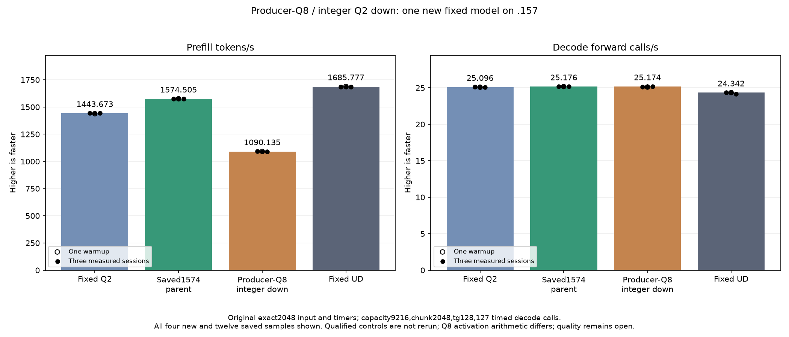
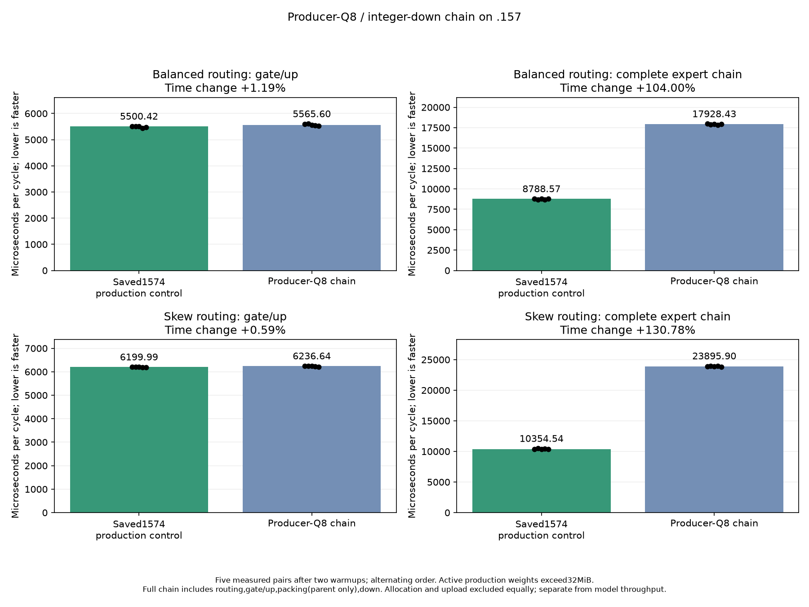

<!-- SPDX-License-Identifier: MIT -->
# Routed IQ2 producer-Q8 and bounded integer Q2 down

This experiment completes at **1090.135499 PP /25.17363991 TG**, versus the
retained scaled-wave-pack1574.505432 PP /25.17589001 TG: **-30.763307% PP**.
Keep saved1574 as the base; preserve all source revisions and negative evidence.
The fixed original Q2/UD references1443.672867/1685.777092 and their input/timers
are unchanged and were not rerun. Full point/curve parity remains unmet.

The paired IQ2 WMMA gate/up retains its weight decoding, K accumulation and
rounded F32 SwiGLU operations. Its epilogue emits64-value Q8 groups directly
in the existing expert routing layout. A new bounded consumer uses original
Q2_K weights, integer MMQ arithmetic and a single F16 output rounding. It
masks all nonlive rows before loading and initializes the full640..767 stored
activation tail. At2048/top10/512,24,330,240 packed bytes fit in the existing
52,428,800-byte gate allocation. No allocation or stream is added; the F32
gate materialization and separate scaled-half packing dispatch disappear.

This explicitly changes activation arithmetic from row-scaled F16 to Q8.
It is not an exact numerical replacement claim. Existing fallback and scalar
paths remain in the source. Safe numerical differences retain exit1 and do
not suppress performance measurement; memory faults/nonfinite outputs stop
further device work. Independent model task quality remains unqualified.

## Static evidence and retained initial revision

The original prototype preserves all162 parent kernel instruction bodies,
operands and resource metadata, but its new integer consumer spills. The
bounded revision adds the original MMQ128-thread launch contract and keeps
ordered K loops rolled. The copied dot helper has exactly the upstream
arithmetic tokens after removing its name and the new loop directive.
All initial source, assembly and actual command exits remain available.

| Consumer token width | Initial private bytes, full/ragged M | Bounded private bytes | Bounded VGPR |
| --- | ---: | ---: | ---: |
| 16 | 612 /620 | 0 | 241 |
| 48 | 1672 /1712 | 0 | 241 |
| 64 | 2512 /2540 | 0 | 241 |

The producer specializations also have zero private scratch. These are static
compiler resources, not occupancy measurements or throughput evidence.
[Initial source](../config/q2-producer-q8-source.json),
[bounded source](../config/q2-producer-q8-source-v2.json),
[bounded static audit](../config/q2-producer-q8-bounded-static.json).

## Completed qualification

The new fixture compares the retained F16 and candidate Q8 full chains in
one binary.60 small cases cover1/9/17/33/97 tokens, four gate widths, three down
widths, ragged M129 and allocation-end inputs. Four production checks surround
timing on balanced/skew2048/top10/512 routing, with762,839,040 active weight
bytes beyond MALL capacity. Zero inputs, poisoned inactive rows,640/768 tails,
immutable inputs/weights/maps and leading/trailing output guards are checked.

Every case saves17 complete arrays. Actual GPU slot maps canonicalize the
D2S6 bytes against the unchanged original GPU quantizer, and the down outputs
against the existing raw MMQ reference narrowed by an independent IEEE half
conversion. These are implementation comparisons. A separate96-sample FP64
affine Q2 operator decodes original weights and actual Q8 data, including the
six original sums and two reconstructed sums per128 values. Its unchanged
0.002 RMS/scaled limits are not waived if either implementation disagrees.
Parent F16 output changes are recorded separately and expected.

Gate/up and routing+gate/up+packing+down timings each retain two warmups and
five alternating measured pairs, three iterations each:56 samples total.
Allocation, uploads and checking stay outside timers. Only the new candidate
then uses the original exact2048/tg128 direct-executor model recipe, including
one warmup, three measurements, capacity9216/chunk2048, C1 greedy/MTP off.
The saved parent and original Q2/UD cohorts are reused without rebuild/rerun.

Local host/device syntax checks for both fixture translation units pass, as
do138 launcher guards. Staging verifies1029 provider files and82 frozen
fixtures in both capsules without executing SSH. The shared provider format
check retains exit1 with the same88 historical findings across the same seven
files as the preceding experiment; every changed numerical file passes the
focused check preserving include order. No GPU/device execution or .157 host
qualification is implied by those editing-host checks.

[Plan](../config/q2-producer-q8-plan-v2.json),
[staging audit](../config/q2-producer-q8-staging.json).
Fresh admission from release88dcb8d8 completes before the new GPU work.
The collected window releases at18:39:19UTC; receiptb52d7308 is canonical.
No remote cleanup occurs and subsequent ownership requires fresh admission.

## Provenance and boundaries

The independently fetched official Gufo pin remains
f783fedb9bea2ec7de941f6da4e02f4a4596b29e. The new numerical consumer adapts that
Qwen MMQ port's Q2 load/dot helpers; their original llama.cpp/Gufo attribution
and mmq/VENDOR.md remain. The official DeepSeek source is a design reference,
not an import from another agent's DS4 or the sibling CachyOS workspace.
The manifests bind inspected files, full inventories and patches. No core C17
ABI, persistent state, scheduler or public metrics contract changes.

The second plan revision corrects only the copied window receipt label and
scope before any admission. The initial plan/helper are preserved; all82
fixture and four manifest hashes, component geometry and benchmark stay exact.

The .157 host cohort now completes27 Debug and27 ASan/UBSan checks, six
commands exit0 and seven artifacts collected. All82 frozen fixtures and1020
host-provider files verify. This is CPU qualification only. Root freshly
confirms .157 exclusion through collected numerical-window release.
[Host evidence](../config/q2-producer-q8-host-results.json).

## Complete results

All64 Q8 comparisons are byte-exact after canonicalizing the saved routing
maps, all640/768 tails and poisoned holes pass, and all64 sampled FP64 checks
(6144 sampled outputs) pass. The strict existing-MMQ comparison retains exit1:
102464 half-output changes across all cases. Production balanced/skew checks
change25720/25428 of52,428,800 outputs, at most one half ULP (including1/2
signed-zero pairs). This does not establish independent original-model quality.

| Complete GPU scope | Parent microseconds | Candidate microseconds | Time change |
| --- | ---: | ---: | ---: |
| balanced / gate_up | 5500.419617 | 5565.603892 | +1.185078% |
| balanced / expert_chain | 8788.566589 | 17928.429921 | +103.997202% |
| skew / gate_up | 6199.986776 | 6236.638387 | +0.591156% |
| skew / expert_chain | 10354.536056 | 23895.904541 | +130.777163% |

The down change dominates the measured regression; the producer alone adds
only0.59–1.19% gate/up time. Removing intermediate passes does not compensate
for this integer consumer's cost. The current experiment does not isolate
bandwidth/cache/occupancy or reject all possible integer kernels.

| New original-model sample | Prefill seconds | Prefill tokens/s | Decode seconds | Decode calls/s |
| --- | ---: | ---: | ---: | ---: |
| Warmup | 1.875298859 | 1092.092596 | 5.059709741 | 25.10025407 |
| Measured 1 | 1.876205209 | 1091.565033 | 5.052238655 | 25.13737150 |
| Measured 2 | 1.879687617 | 1089.542742 | 5.043103164 | 25.18290740 |
| Measured 3 | 1.878665544 | 1090.135499 | 5.044959745 | 25.17363991 |

All128 generated tokens match the saved parent; eight logit arrays differ,
max matched-history KL0.009712839842. Within-arm replay is9/9 exact. The scalar
decode implementation is unchanged; its small observed timing difference is
not attributed causally. Greedy agreement on this input is not Core-19 quality.

[Model CSV](figures/q2-producer-q8-model-wrapped.csv),
[component CSV](figures/q2-producer-q8-component.csv),
[model analysis](../config/q2-producer-q8-model-results.json),
[component analysis](../config/q2-producer-q8-component-results.json),
[final audit](../config/q2-producer-q8-final-audit.json),
[disposition](../config/q2-producer-q8-disposition.json).

All13 runtime command exits are retained: twelve0 and the component's numeric1.
1125 artifacts include1088 full arrays;82 fixtures/four manifests/1029 numerical
provider files verify. CPU/GPU peaks are78.875/70C in the component and78.625/75C
in model/build; no thermal stop. Collection precedes release, which verifies
1083 identities/863 groups retired, KFD empty, four original leases free and
seven unchanged model stat tuples. Main/remote receipt mirrors agree; core is
notified. No Q2 job, build, client, lease, waiter, reservation or restart remains.

## Retained new source opportunity

A separate local-only prototype reuses dead weight LDS for output route IDs,
after the final K barrier and before one added terminal barrier. This lowers
BN48 LDS from32960 to32768 bytes, with241 VGPR and zero private scratch. It
crosses a shared-memory size boundary, but hardware occupancy and GPU speed
are unmeasured. It was not included in the completed candidate or model run.
[Opportunity and source identity](../config/q2-producer-q8-ids-opportunity.json).
Producer/down fusion preserving F16 and direct ordered expert consumption
remain separate open hypotheses; saved1574 remains the common starting point.
