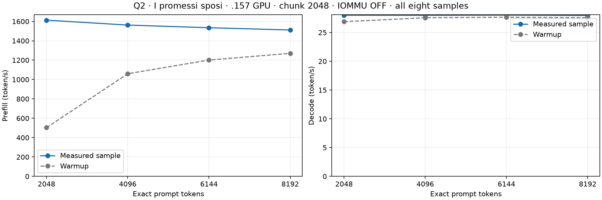

<!-- SPDX-License-Identifier: MIT -->

# Q2 with I promessi sposi: exact 2K through 8K

Requested GPU .157 test, 2026-10-08; IOMMU off. Native child and runner exit0.
Original raw book text, starting with the title and introduction; exact prefixes of one tokenized corpus.
Chunk2048, capacity133760, C1 reactive greedy AR, MTP off, TG128, warm1 + measured1.
Every sample starts with an empty sequence and times the complete prefill across all chunks.
Loading, tokenization and sequence allocation occur outside the prefill interval.
One model load serves all four points. No inserted pauses or prefix-cache restoration.
One measured repetition per point; every warmup is reported separately below.

Corpus: 1329139 bytes, 383792 raw tokens, SHA256 `f53e0d80cb2d4492d24ebd63c7000c397b16ae70f9bf09b3763e5d8323ec209f`.

[Frozen plan](../config/q2-promessi-short-plan.json), [validated results](../config/q2-promessi-short-results.json),
[all eight samples with full precision (CSV)](figures/q2-promessi-short.csv).

## Measured samples

| Exact prompt tokens | Prefill calls | PP token/s | Full PP seconds | TG token/s | TG seconds | Output tokens |
| ---: | ---: | ---: | ---: | ---: | ---: | ---: |
| 2048 | 1 | 1612.737061 | 1.269890827 | 28.006495 | 4.570368489 | 128 |
| 4096 | 2 | 1562.428666 | 2.621559684 | 27.981235 | 4.574494304 | 128 |
| 6144 | 3 | 1535.011659 | 4.002575462 | 28.016228 | 4.568780625 | 128 |
| 8192 | 4 | 1511.433870 | 5.420018807 | 27.949875 | 4.579626978 | 128 |

## Warmup samples

| Exact prompt tokens | Prefill calls | PP token/s | Full PP seconds | TG token/s | TG seconds | Output tokens |
| ---: | ---: | ---: | ---: | ---: | ---: | ---: |
| 2048 | 1 | 503.083668 | 4.070893430 | 26.878858 | 4.762107156 | 128 |
| 4096 | 2 | 1059.595702 | 3.865625343 | 27.564188 | 4.643706596 | 128 |
| 6144 | 3 | 1201.122150 | 5.115216631 | 27.654198 | 4.628592037 | 128 |
| 8192 | 4 | 1270.444165 | 6.448138552 | 27.569351 | 4.642836955 | 128 |

The remaining counting-prompt curves were stopped at the owner's request; they are not resumed by this test.
[Stopped campaign](Q2-IOMMU-COMPARISON.md).
