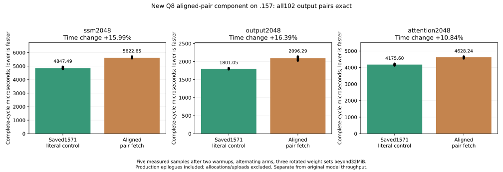
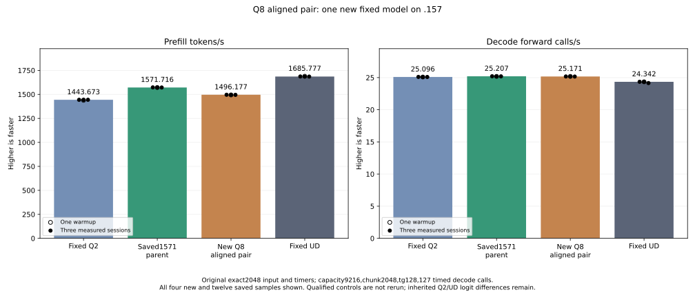

<!-- SPDX-License-Identifier: MIT -->
# Cooperative aligned Q8 weight-pair fetch

## Completed result — 5 October 2026

The candidate completes at1496.176691 PP /25.17052112 decode forward calls/s,
nominal-4.806197% /-0.145989% against saved1571.716479 /25.20732109. Keep the
saved1571 source as the base and retain this negative candidate. Fixed original
Q2/UD input, timers and controls remain unchanged; no control was rerun.

| Component,2048 rows | Parent microseconds | Candidate microseconds | Time change |
| --- | ---: | ---: | ---: |
| SSM | 4847.487450 | 5622.653325 | +15.991086% |
| Output | 1801.046371 | 2096.292019 | +16.393006% |
| Attention | 4175.598145 | 4628.239632 | +10.840159% |

All102 full component pairs,21 parent model files and nine within-arm logit
checks are exact; all42 timing rows remain. Guarded and allocation-end cases
pass. The three model PP samples are1496.176691,1496.474389,1495.165943;
decode samples25.17382639,25.17052112,25.16030796. Complete samples include
the warmup separately in the CSV. Exactness to the parent does not close the
inherited independent F16 task-quality gap. No runtime default is promoted.

Host27/27 Debug and27/27 ASan/UBSan pass. All13 runtime commands exit0,
37 artifacts verify,74 fixtures/four manifests and1026 provider files match.
The initial preparation include-sort failure remains recorded as exit1.
After terminal collection, release at15:04:53.959507UTC retires1003 process
identities/798 groups, with empty KFD, four original leases free and seven
unchanged model stat tuples. Canonical/main/remote release-active-ready mirrors
match986ffa094380f4448d8dcdcf9e889e1200200a859b9d20f52789061dd8a8e63f;
core acknowledges closure. No Q2 GPU job or reservation remains.

[Component result](../config/q2-q8-aligned-pair-component-results.json),
[model result](../config/q2-q8-aligned-pair-model-results.json),
[final audit](../config/q2-q8-aligned-pair-final-audit.json),
[all model samples](figures/q2-q8-aligned-pair-model-wrapped.csv).

## Retained preparation record

One new candidate starts from retained half-consumer-eight,1571.716479 PP /
25.20732109 TG, preserving the original exact2048/tg128 tester and fixed Q2
1443.672867 /UD1685.777092 PP. The current trace attributes293.227373ms to
Q8/F16 dense and160.217893ms to its fused SSM projection. This motivates a
new fetch mechanism, not a new baseline or an inferred speedup.

Two adjacent lanes already own the two K32 blocks of one weight row at BK2.
The new wide BM256/BN128/WM8/WN1 loader jointly reads all68 original bytes as
four16-byte payload copies and one4-byte copy at aligned-word addresses.
The even lane reassembles its payload with16-bit shifts; a shuffle supplies
the odd lane's scale. All lanes participate in the shuffle after conditional
loads. Original header bits, signed codes, zero-scale row masks, half add/FMA,
LDS layout, ordered K16 WMMA and epilogues remain the contract. Other shapes,
odd K32 counts and bases not aligned to4 bytes retain the original fetch.
There is no persistent weight copy, model conversion, new allocation/table,
stream, core ABI/state/metrics change or CPU model forward.

Same-flag local gfx1151 compilation changes only three dense bodies;158
other instruction/operand/resource bodies match the saved parent assembly.
All three retain VGPR241,LDS49152 and zero private bytes. Instructions change
3198→3403 plain,4027→4243 SSM and14400→14605 attention; scalar registers also
increase. Logical source loads fall from six to five per encoded pair, but
hardware transactions/bandwidth/stalls remain unmeasured. Extra shifts, lane
exchange and fallback branches can outweigh alignment. The first compile
exits1 because clang-format reordered dependent numerical includes; its
source,manifest,patch,control and generator are retained. Disabling include
sorting fixes preparation without altering the intended fetch mechanism.

The new fixture includes the literal current parent and102 full output pairs.
Original odd-K96 ragged n1/15/17/129/1025 cases are joined by even-K64 cases.
Allocation-end weights cover m1/255/256/257/513, a two-byte-misaligned tensor
base and K32 odd tail. Full SSM raw/live-mask plus convolution cover
1024/1025/1057/2048 rows; attention1025/2048 includes complete Q/gate/K/V.
Guarded outputs are poisoned before launch. Weight allocations used for tail
checks end exactly after the last code; all immutable input bytes are compared.
No oversized trailing weight buffer supplies missing bytes.

Three rotations exceed32MiB:133693440bytes SSM,50135040 ordinary output and
108625920 attention. Two warmups and five measured pairs alternate order,
retaining42 timing rows for projection plus actual epilogue. Numerical
mismatches retain arrays and timings. Runtime/guard faults stop device work;
unwritten/nonfinite required outputs prevent model admission. Safe numerical
or timing rejection still permits the requested original model performance.

128 local launcher guards and production/fixture compilation pass. The plan
freezes74 runtime fixtures,four manifests and1026 provider files. .157 host
Debug/ASan runs separately; fresh coordinated admission follows terminal host
collection before any remote GPU build/run. Only the new component and original
model are planned. Saved parent/Q2/UD controls and old cohorts remain read-only;
Q4/full curve,cleanup,tuning,dependencies and deployment are outside this scope.
No GPU/runtime performance or independent task-quality acceptance is claimed
at preparation. The inherited F16 quality difference remains open.

Source derives from independently fetched official Gufo pin
`f783fedb9bea2ec7de941f6da4e02f4a4596b29e` and the recorded LIE parent chain,
retaining MIT/SPDX and third-party notices. No sibling DS4 source is imported.

[Plan](../config/q2-q8-aligned-pair-plan.json),
[source](../config/q2-q8-aligned-pair-source.json),
[static evidence](../config/q2-q8-aligned-pair-static.json),
[patch](../experiments/q2-q8-aligned-pair.patch).
