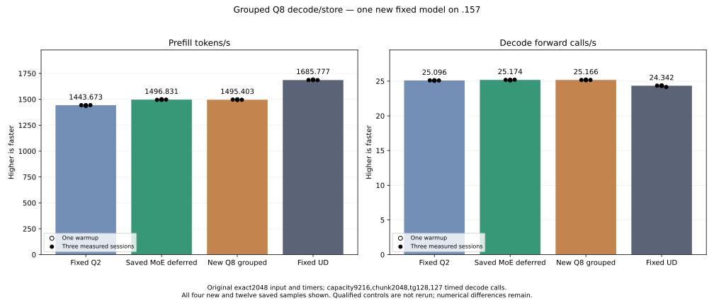

<!-- SPDX-License-Identifier: MIT -->
# Grouped Q8 decode/store experiment

This candidate starts from the measured MoE-deferred provider and changes only
`kernels.hip.cpp`, one of 1025 provider files. It evaluates a Q8 dense-weight
preparation cost identified by the saved fixed-input trace. The comparator
remains original exact2048/tg128: fixed Q2 1443.672867 PP / 25.09595499 TG,
saved MoE parent 1496.830907 / 25.17435733 and fixed UD 1685.777092 / 24.34174251.
No qualified model or previous component cohort is rerun.

The parent expands all 32 signed Q8 codes into 16 half2 registers before four
LDS stores. The candidate decodes eight codes, stores one 16-byte group and
uses a compiler scheduling barrier before the next group. It retains the same
sign transform, byte permutations, half additions/FMA including the zero bias,
LDS addresses, macro/wave tile geometry, K16 WMMA accumulation order and
fused-convolution operations. The barrier does not add
a GPU stream synchronization or a reactive scheduling policy. The candidate
adds no allocation, persistent weight conversion, KV change or public ABI change.

The affected SSM instantiation still has 222 VGPRs, 49152 LDS bytes and zero
private bytes/thread. Static instructions increase from 4027 to 4067. There
is no static resource or instruction-count improvement; runtime evidence is
required. Device and component device/host syntax checks pass. Shared provider
formatting retains exit 1 and 11 violations; the new test is formatted. The
first source extractor matched a default-argument brace, and the first launcher
edit found an ambiguous anchor and wrote no launcher. Their failures and the
first guard expectation failure remain under local evidence. The corrected
source preparation succeeds and the final launch guards pass 80/80.

The new standalone fixture contains a literal retained parent numerical
control. Both paths use one owned nonblocking stream, including initialization,
copies and launches. It checks the complete ragged 129×257×96 projection,
2048×16384×2560 projection with fused SSM convolution and 2048×2560×6144
output projection. Original input buffers remain unchanged. Three weight
rotations use 133693440 bytes for SSM and 50135040 bytes for output, exceeding
the 32 MiB MALL. Two warmups and five measured samples alternate launch order;
all timings are retained even if the numerical verdict fails. This literal
differential control does not establish independent model quality.

The `.157` CPU capsule passes 24/24 Debug and 24/24 ASan/UBSan; all six command
exits are zero. The frozen plan binds 26 fixtures, four manifests and the window
helper. Admission at 2026-10-04T23:39:35.710044Z uses checkpoint `82e31ff`,
four original lease identities, empty KFD, 575 retired identities / 450 groups
and six unchanged model stat tuples. CPU is 37.5 C and GPU 35 C at admission.

The new GPU component completes with configure/build/operator exits 0/0/0,
four verified artifacts, 12 exact whole-output pairs and all 28 timing rows.

| Component | Parent samples, microseconds | Candidate samples, microseconds | Median time change |
| --- | --- | --- | ---: |
| SSM projection + convolution | 4844.354, 4845.167, 4818.061, 4788.702, 4795.809 | 4727.224, 4708.225, 4721.251, 4697.358, 4705.771 | -2.279684% |
| Output projection | 1684.538, 1666.019, 1667.619, 1669.672, 1667.152 | 1650.993, 1647.473, 1646.646, 1634.646, 1657.752 | -1.208064% |

These are isolated synthetic kernel timings, not whole-model throughput.
The one new original-weight model retains the original input, capacity 9216,
chunk 2048, one warmup / three measured sessions, 128 outputs / 127 timed
decode calls and 15-second waits outside timers. It rebuilds its own MMQ and
records performance independently of numerical acceptance.
The original input SHA256 is
`75343e606f5b815fe01f69ddc6ce50a997e2de96d8a20304a82a7f24f1180b35`.

| Model sample | Prefill seconds | Prefill tokens/s | Decode seconds | Decode forward calls/s |
| --- | ---: | ---: | ---: | ---: |
| Warmup | 1.367874455 | 1497.213427 | 5.043544628 | 25.18070313 |
| Measured 1 | 1.367619072 | 1497.493010 | 5.046388567 | 25.16651231 |
| Measured 2 | 1.370363377 | 1494.494113 | 5.046450383 | 25.16620404 |
| Measured 3 | 1.369530344 | 1495.403157 | 5.046612656 | 25.16539482 |

| Fixed model comparison | Median prefill tokens/s | Median decode forward calls/s |
| --- | ---: | ---: |
| Saved fixed Q2 | 1443.672867 | 25.09595499 |
| Saved MoE-deferred parent | 1496.830907 | 25.17435733 |
| New grouped Q8 | 1495.403157 | 25.16620404 |
| Saved fixed UD | 1685.777092 | 24.34174251 |

The new median PP differs by -0.095385% and TG by -0.032387% versus the saved
parent. Their measured PP ranges overlap; a full-model improvement is not
observed. Historical arms are reused without contemporaneous bookends, so this
small difference does not establish a repeatable regression either. The new
candidate stays isolated and available for future composition; its component
gain does not replace the best measured model. The best remains 1496.830907 PP,
3.682139% above fixed Q2, needing 12.623081% more throughput to reach fixed UD.
No full-context sweep or promotion follows this result.

All four model command exits are zero; 26 artifacts, 26 fixtures and 1025
provider files verify. Nine within-arm replay checks are exact. All 21 saved
input/output/full-logit files match the MoE parent byte-for-byte, including
the small smoke prompts and all 128 output tokens. This new Q8 change adds no
observed logit drift at the measured inputs. Eight large-point logit files
still differ from original Q2, with maximum matched-history KL 0.001256655,
inherited from the parent. Independent task quality remains open. Compilation
is outside PP/TG timers; the runtime's 51 library hashes are retained. Observed
maxima, including compilation, are CPU 85.375 C and GPU 74 C.

Release at 2026-10-04T23:51:12.818938Z checks 584 retired process identities,
457 groups, empty KFD, four original leases free and six model stat tuples
unchanged. The canonical remote/main release and active/ready mirrors share
SHA256 `5f9870a0d33b98de64236275a9b69b5ddf6802cb52d91f2efb6ed88da2183e00`.
Core acknowledges. No Q2 GPU job, reservation, waiter, restart or cleanup
remains; another GPU run needs fresh coordinated admission.

The historical nineteen rejected reports represent fifteen candidate records
in eleven families plus four host/status reports. Five families were already
included in fixed Q2; four have new measured compositions, one has a measured
regression and selective scaled-tile integration is still open. Only the
shared-Q8 fixture race has a confirmed false format-rejection cause. This new
grouped Q8 candidate is additional work, not a nineteenth recovered gain.
Component percentages cannot be added to predict full-model throughput.

[Source identity](../config/q2-q8-grouped-source.json),
[reconstructed patch](../experiments/q2-q8-grouped.patch),
[static results](../config/q2-q8-grouped-static.json),
[host receipt](../config/q2-q8-grouped-host-results.json),
[frozen scope](../config/q2-q8-grouped-plan.json),
[component outputs and all timings](../config/q2-q8-grouped-component-results.json),
[model results and complete replay](../config/q2-q8-grouped-model-results.json),
[all model samples](figures/q2-q8-grouped-model.csv),
[window release](../config/q2-q8-grouped-window-release.json),
[rejected-family inventory update](../config/q2-rejected-recovery-moe-update.json).

