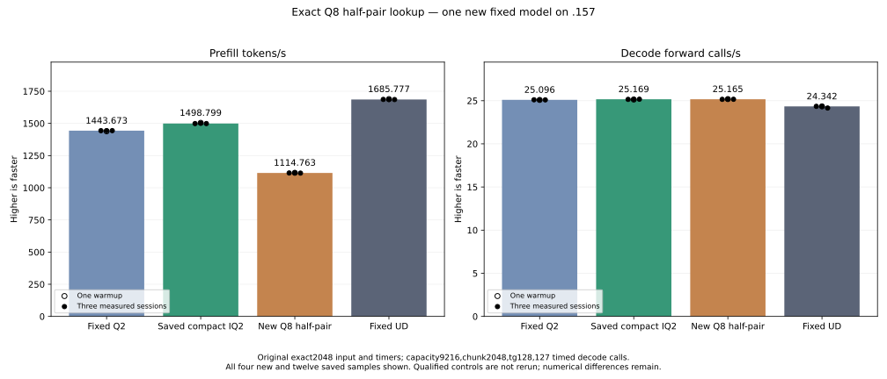

<!-- SPDX-License-Identifier: MIT -->
# Exact Q8 integer-half pair lookup

This new candidate starts from the measured compact IQ2 provider, PP1498.799455 /
TG25.16866636 on the original exact2048/tg128 input. It changes the Q8-weight
branch of the dense F16 matrix-core projection, keeping the compact IQ2 change
and all prior parent composition. Fixed Q2 remains1443.672867 /25.09595499 and
fixed UD1685.777092 /24.34174251. No qualified control or old component cohort
is rerun. The new original-weight model measures PP1114.763382 /TG25.16483410,
a 25.622913% PP regression versus the compact parent. That parent remains the
retained composition base; this lookup is retained as a measured rejection.

The saved parent profile assigns293.725ms,21.183% of its prefill kernel work,
to Q8/F16 dense projections. That diagnostic is reused rather than profiled
again. Removing this stage's integer-to-half preparation is a new hypothesis,
distinct from the already measured grouped decode/store scheduling barrier,
Q2 affine-palette staging, raw code-byte caching and half-wave exchanges.

## Mechanism and scope

Every signed Q8 integer is exactly representable as F16. A generated65536-entry
table maps two original encoded bytes to their exact two half values. The
table occupies262144 device bytes. It contains only the full signed-int8 domain,
not model weights or an expanded model cache. This size is an explicit added
resource cost even though no runtime allocation or model conversion is needed.

Two indexed32-bit loads replace each four-code word's byte permutations and
magic half additions. The original packed half FMA applies the same F16 scale
and zero bias. Weight fetch, stage layout, LDS stores, activation halves, tile
geometry, K16 WMMA order, epilogues and fused SSM convolution are unchanged.
F16-weight projections, routed IQ2/Q2 and integer W8A8 bodies remain unchanged.
There is no new stream, launch, public ABI/state/metrics contract or CPU model
forward. Added indexed loads can be slower or compete with activation/weight
caches; fewer conversion operations are not a predicted runtime improvement.

All131072 scalar integer checks pass. These use the complete byte-pair domain
and an independent reconstruction of the parent's exact1152+q magic operand;
they are host format checks, not original-weight inference or model quality.
Matched local gfx1151 assembly changes eight Q8 dense bodies and preserves149
other bodies exactly. All affected bodies keep their LDS size, VGPR demand and
zero private scratch. Static half adds change16/32 to zero; half FMA counts
are unchanged. The SSM body grows4027 to4082 instructions because indexed
lookup/address work replaces the removed operations. The saved parent assembly
is reused without rebuilding its source or qualified binaries.

## New-only component and model plan

The new component contains the literal retained parent dense kernel. Static
source comparison verifies that control matches this candidate's compact
parent; it is a test control in the new binary, not a qualified cohort rerun.
The GPU format replay exhausts65536 code pairs at16 scale edges, with
1048576 entries and2097152 packed word comparisons. Low/high word inputs
differ by xor0x5aa5. Scale edges include signed zero, subnormals, signed normals,
overflow, infinity and NaN payloads. Raw-bit comparisons and unique write stamps
retain exceptional values rather than treating them as finite-output failures.

Whole guarded output comparisons cover ragged129x257x96, fused SSM
2048x16384x2560 and output2048x2560x6144, each at three immutable weight
rotations. All allocations have64-byte guards on both sides. Output data starts
with a nonfinite poison so two missed stores cannot pass as equal zeros.
Initialization, uploads, launches and readback share one owned nonblocking stream.
Numerical failures save complete arrays and keep all timing samples; guard or
runtime faults stop GPU work. SSM/output weight rotations occupy133693440 /
50135040 bytes, both above32MiB MALL. Two warmup and five measured pairs alternate
order and time three kernel launches per sample. Transfers, allocations, checks
and hashes remain outside the timing scope; this is not model throughput.

One new original-weight model follows even if the numerical or timing verdict
rejects the component, subject to safe runtime/guards. It preserves the original
exact2048 input, capacity9216, chunk2048, warmup plus three measured sessions,
128 output tokens/127 timed decode calls and15-second waits outside timers.
Only the new candidate is built/run; saved Q2, compact parent and UD are read-only
references. A full-context curve still waits for original-point parity.

## Local checks and provenance

Production device assembly, fixture device compilation and host syntax pass.
All84 launch guards pass before any staging or SSH. The shared provider CI
formatter retains exit1 for seven byte-identical inherited files. A separate
new-file formatting invocation initially omits the explicit Gufo style used to
format the fixture; the corrected invocation passes without changing its bytes.
The first static analyzer refuses that unclassified local failure. The final
static receipt retains both failures and the successful check, with no numerical
failure reclassification or altered qualified evidence.

The new `.157` CPU cohort passes25/25 Debug and25/25 ASan/UBSan CTest.
All six commands exit0; these checks access no model or GPU and are separate
from the completed new component and original-weight performance evidence.

## Completed component and write-coverage diagnosis

The new `.157` component finishes with command exits0/0/1 and ten verified
artifacts. All1048576 format entries /2097152 packed word pairs match exactly,
including scale exceptional values, stamps and guards. All twelve complete
output-buffer hashes also match the control. The fixture nevertheless reports
three SSM raw-projection coverage failures; its original verdict and exit1
remain retained.

Read-only analysis of all six saved134217728-byte arrays proves that every
nonfinite/poison value is in the raw buffer region intentionally not written by
the fused SSM kernel. It publishes first/last three raw rows per32-token tile
for channels0..10239, plus all channels10240..16383; convolution consumes the
interior directly from LDS. Each saved array has exactly17039360 such unused
cells. All16515072 required raw values are finite/written, with zero unexpected
poison positions; every convolution cell is finite/written and exact in the
recorded full-buffer comparison. This diagnoses a fixture contract mistake,
not a numerical disagreement. No production byte, frozen fixture, old verdict
or qualified report is replaced, and no component is rerun for the diagnosis.

| Rotated-weight component | Parent median microseconds | New lookup median microseconds | Time change |
| --- | ---: | ---: | ---: |
| SSM projection + convolution | 4805.734952 | 12515.633901 | +160.431214% |
| Output projection | 1728.428682 | 4790.042241 | +177.132768% |

All28 samples remain in the result and CSV. The lookup is a strong component
regression despite exact arithmetic. Static SSM code adds32 indexed global
32-bit loads and31 wait instructions while removing32 half adds and32 byte
permutations; physical cache misses/bandwidth were not measured. This supports
rejecting this lookup placement, not claiming a measured cache bottleneck.
The planned new original-weight model also completes to measure its full effect;
no qualified control, old component or full curve is relaunched.

[Component outputs and every timing](../config/q2-q8-halfpair-component-results.json),
[all28 samples](figures/q2-q8-halfpair-component.csv),
[saved-array coverage diagnosis](../config/q2-q8-halfpair-write-coverage-diagnostic.json).

## Original fixed model result

Only the new lookup model runs on `.157`. All four configure/build/link/model
commands exit0. Compilation takes154.248971 seconds outside PP/TG timers.
The fixed input remains2048 tokens, capacity9216, chunk2048, one warmup and
three measured sessions,128 output tokens/127 timed decode calls, with15-second
waits outside timers. The saved fixed Q2, compact parent and UD are not rebuilt
or rerun; the original benchmark and reference definition stay unchanged.

| Session | Prefill seconds | Prefill tokens/s | Decode seconds | Decode calls/s |
| --- | ---: | ---: | ---: | ---: |
| Warmup | 1.835180734 | 1115.966380 | 5.042038112 | 25.18822690 |
| Measured1 | 1.837161171 | 1114.763382 | 5.048160359 | 25.15767943 |
| Measured2 | 1.833598383 | 1116.929432 | 5.044107628 | 25.17789258 |
| Measured3 | 1.838991929 | 1113.653610 | 5.046725104 | 25.16483410 |
| Original measured median | 1.837161171 | 1114.763382 | 5.046725104 | 25.16483410 |

| Same saved fixed comparison | Prefill tokens/s | Decode calls/s |
| --- | ---: | ---: |
| Original Q2 | 1443.672867 | 25.09595499 |
| Retained compact IQ2 parent | 1498.799455 | 25.16866636 |
| New Q8 lookup | 1114.763382 | 25.16483410 |
| Original UD | 1685.777092 | 24.34174251 |

New PP is25.622913% below the retained parent and33.872433% below UD. All21
parent input/output/full-logit files are byte-exact, and all nine within-arm
replays are exact. The128 generated tokens match fixed Q2 and UD. The eight
large-logit differences to fixed Q2 are inherited from the measured MoE parent;
matched-history KL maxima remain0 to compact parent,0.001256655237 to Q2 and
0.008626378682 to UD. This is differential evidence, not independent task-quality
qualification. The decode change versus parent is only−0.015226%; no stable
change is established by saved historical comparators.

The256KiB indexed device table remains an added resource cost. The model logs
resident_bytes43156012544, session_bytes376777748 and deferred scratch7946240;
the static module table is not part of that resident weight allocation metric.
Maximum recorded CPU/GPU temperatures, including compilation, are83.625/72 C.
No default promotion or full-curve admission follows. The best measured Q2
composition remains1498.799455, nominally3.818496% above original Q2 and needing
12.475160% more PP throughput to reach original UD.

The first local model analyzer exits1 because it checks the previous IQ2
window's enum name. Its log is preserved; the corrected Q8-window name verifies
the actual closed window and publishes the report with exit0. This is an
analysis-script error, not a model or GPU failure, and requires no new run.

The window is released at02:49:29.395288 UTC. Closure verifies644 retired
identities/506 groups, empty KFD, four free original leases and unchanged six
model stat tuples. Main/remote canonical/active/ready mirrors match release
SHA256 `d11f482be0b9dc71a6c9c43a5178aaf4d751af47212326c359f04ea425cc6943`.
Core receives the release; no Q2 GPU job, reservation or waiter remains.
All43 host/component/model artifacts and33 frozen fixture identities verify.

[Full model report](../config/q2-q8-halfpair-model-results.json),
[all16 model samples](figures/q2-q8-halfpair-model.csv),
[retained composition decision](../config/q2-q8-halfpair-retained-update.json),
[release](../config/q2-q8-halfpair-window-release.json).

The isolated provider has1026 files:1024 inherited files stay exact, one kernel
file changes and one generated table is added. It derives from this workstream's
independently fetched official Gufo pin
`f783fedb9bea2ec7de941f6da4e02f4a4596b29e`. First-party generator/table/delta are
MIT; original upstream notices and licenses remain unchanged. No sibling DS4
source, build, model, cache, profile or qualification artifact is imported or
mutated. Source and remote runs stay in persistent project directories, with
no cleanup, dependency installation, tuning, deployment or publication.

[Generator](../tools/prepare-q2-q8-halfpair.py),
[source identity](../config/q2-q8-halfpair-source.json),
[static report](../config/q2-q8-halfpair-static.json),
[new fixture](../tests/q2_q8_halfpair.hip),
[frozen plan](../config/q2-q8-halfpair-plan.json),
[provenance](../third_party/gufo/LIE-Q2-Q8-HALFPAIR.md).
