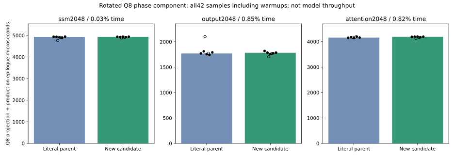
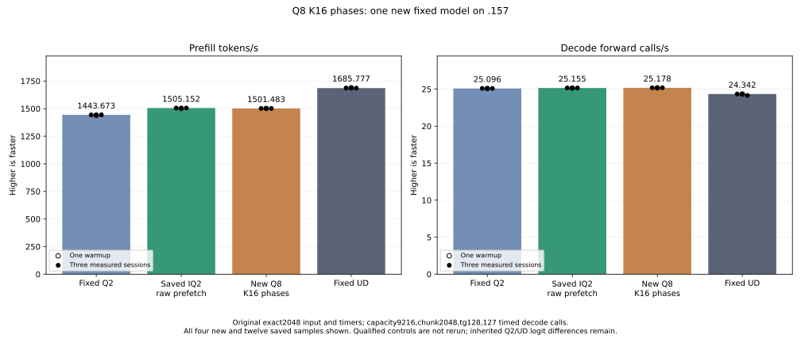

<!-- SPDX-License-Identifier: MIT -->
# Ordered K16 phases in wide Q8 dense prefill

One new candidate starts from the measured IQ2 raw-prefetch composition at
1505.152258 PP / 25.15493858 TG. It targets the wide Q8 dense plain, SSM and
attention specializations with BM256/BN128/BK2/WM8/WN1. For each K32 block,
all independent outputs consume the low K16 product, followed by their high
K16 product. Every individual accumulator preserves the original low/high
and K32 sequence, operands and F32 WMMA arithmetic.

The initial hypothesis was shorter simultaneous half-fragment lifetimes and
more independent WMMA operations between dependent updates. Compiled peak
VGPR does not fall, so only scheduling effects remain to measure. The saved
profile attributes 293.725 milliseconds (21.183% of GPU kernel time) to Q8
weight/F16 activation dense projections; it is target evidence, not candidate
performance. No cache, table, allocation, new stream or dispatch geometry is
introduced. F16 weight paths and all routed/decode paths remain unchanged.
Public ABI, state and metrics contracts are unchanged.

The independently fetched upstream ledger at pin
`f783fedb9bea2ec7de941f6da4e02f4a4596b29e` already records rejected SSM K16
fragment-lifetime and compiler-scheduling experiments. This candidate measures
the current Q2 composition across plain, SSM and attention projections; it is
not presented as a previously unexplored technique. See the upstream
[experiment ledger](https://github.com/gufo-org/gufo/blob/f783fedb9bea2ec7de941f6da4e02f4a4596b29e/docs/models/qwen3.8-flash-next/EXPERIMENTS.md).

Matched production assembly reuses the saved parent without a rebuild. It
verifies three changed bodies and 154 other bodies exact, including the retained
IQ2 improvement. All three retain LDS49152, zero private bytes, next-free
VGPR241 and64 WMMA instructions. Static instructions change as follows:

| Projection | Parent instructions | New instructions |
| --- | ---: | ---: |
| Plain |3198 |3201 |
| SSM |4027 |4030 |
| Attention |14400 |14403 |

There is no static instruction/register saving, occupancy claim or inferred
speedup. Changes in dependency distance and LDS read scheduling require GPU
measurements. Source arithmetic and each output's accumulation order stay fixed.

The new fixture compares66 guarded complete output pairs across three distinct
weight rotations. Five plain ragged token counts1/15/17/129/1025 use m257/k96,
exercising token/row edges and an odd K32 count inside BK2. SSM tests1024/1025/
1057/2048 rows with m16384/k2560 and original boundary convolution. Attention
tests1025/2048 rows with m13312/k2560, complete F32 query/gate outputs, F16
key/value outputs, nontrivial gamma and the original norm/RoPE epilogue.

SSM raw projection intentionally leaves interior convolved cells unpublished.
Their expected poison bytes are verified separately from required raw cells
and complete convolved output. Missing/nonfinite required output, unexpected
unused-cell writes and any byte difference preserve arrays and timings. Guard
or runtime faults stop device work. All inputs, gamma, position, original Q8
weights, convolution parameters and history are checked immutable at completion.
Initialization, poison, launches and readback share one nonblocking stream.

Three rotated weights occupy133693440 /50135040 /108625920 bytes for SSM/plain/
attention, above32MiB MALL. Forty-two alternating observations include two
warmups and five measurements per arm/shape. Device event timing excludes
allocations/uploads and includes only the projection plus its production
epilogue, not an entire model or MoE cycle.

The original model is always measured after any safe component verdict, using
exact2048/tg128,127 timed decode calls, capacity9216/chunk2048,MTP off,one warmup
and three measured sessions with15-second waits outside timers. The saved
fixed Q2 PP1443.672867 /TG25.09595499, fixed UD PP1685.777092 /TG24.34174251,
and best IQ2 parent PP1505.152258 /TG25.15493858 are reused without rebuilding or
rerunning old controls or component cohorts. No curve, cleanup, dependency
installation, tuning or deployment is admitted.

Local generation, production/fixture device compilation, fixture host
compilation,91 guards and new-file formatting pass. Three exploratory tooling
failures are preserved: a display reader used the wrong field name; a shared
formatter was invoked from the wrong directory; a static selector incorrectly
matched the first template parameter. Corrected reader/working directory/
selector checks pass. No failed GPU, model or remote build is inferred from
those preparation failures. The shared formatter still records exit1 on nine
unchanged inherited files. No qualified source or previous report is rewritten.

The plan freezes40 fixtures,four manifests and all1025 provider files. Local
staging verifies the complete component capsule and stops before SSH. New .157 host
qualification passes25/25 Debug and25/25 ASan/UBSan: six commands zero,seven
artifacts and40 frozen files verify, with neither model nor GPU access. Fresh
coordinated admission remains required before remote GPU build/run. At initial
preparation no new component or original model has run; compile/host checks are
not numerical acceptance, independent task quality or performance evidence.

[Frozen plan](../config/q2-q8-k16-phases-plan.json),
[source inventory](../config/q2-q8-k16-phases-source.json),
[static evidence](../config/q2-q8-k16-phases-static.json),
[staging evidence](../config/q2-q8-k16-phases-staging-results.json),
[patch](../experiments/q2-q8-k16-phases.patch),
[literal parent](../experiments/q2-q8-k16-phases-control.inc),
[new fixture](../tests/q2_q8_k16_phases.hip).

## Component measurement completed

The new component completes at04:59:26.470463UTC with three zero command exits.
Four artifacts,40 frozen fixtures and1025 provider files verify. All66 output
pairs are byte-exact, including required SSM raw cells/full convolution and
complete Q/gate/K/V outputs. Original inputs remain immutable. All42 timings
are retained regardless of the differential verdict.

| Projection | Literal parent median microseconds | New median microseconds | Time change |
| --- | ---: | ---: | ---: |
| ssm2048 |4934.030533 |4935.644468 |+0.032710% |
| output2048 |1769.740264 |1784.793377 |+0.850583% |
| attention2048 |4157.824198 |4192.090352 |+0.824137% |

No component speedup is established; the original model is still measured as
requested, without qualified historical controls/cohorts. All alternating
samples, including warmups, are retained in the
[CSV](figures/q2-q8-k16-phases-component.csv) and
[report](../config/q2-q8-k16-phases-component-results.json).

## Completed original-weight comparison

One new candidate is measured with the original fixed input and tester; all26 artifacts,40 frozen fixtures and1025 provider files verify. The four command exits are zero.

| Arm | Sample | PP tokens/s | TG calls/s | PP seconds | TG seconds |
| --- | --- | ---: | ---: | ---: | ---: |
| Fixed Q2, saved |Warmup |1438.259006 |25.08847266 |1.423943804 |5.062085753 |
| Fixed Q2, saved |Measured 1 |1443.398207 |25.10565683 |1.418873870 |5.058620886 |
| Fixed Q2, saved |Measured 2 |1443.672867 |25.08698337 |1.418603928 |5.062386263 |
| Fixed Q2, saved |Measured 3 |1443.841794 |25.09595499 |1.418437954 |5.060576497 |
| IQ2 raw parent, saved |Warmup |1501.690147 |25.15123490 |1.363796655 |5.049453854 |
| IQ2 raw parent, saved |Measured 1 |1505.152258 |25.16777240 |1.360659687 |5.046135906 |
| IQ2 raw parent, saved |Measured 2 |1503.530071 |25.14904438 |1.362127728 |5.049893669 |
| IQ2 raw parent, saved |Measured 3 |1505.315370 |25.15493858 |1.360512249 |5.048710399 |
| New Q8 phases |Warmup |1501.972313 |25.17932092 |1.363540448 |5.043821492 |
| New Q8 phases |Measured 1 |1501.638312 |25.17806319 |1.363843732 |5.044073448 |
| New Q8 phases |Measured 2 |1500.630746 |25.17709169 |1.364759456 |5.044268081 |
| New Q8 phases |Measured 3 |1501.482502 |25.18935283 |1.363985259 |5.041812740 |
| Fixed UD, saved |Warmup |1689.043527 |24.34239962 |1.212520558 |5.217234208 |
| Fixed UD, saved |Measured 1 |1686.364042 |24.34621613 |1.214447147 |5.216416355 |
| Fixed UD, saved |Measured 2 |1685.777092 |24.34174251 |1.214869991 |5.217375049 |
| Fixed UD, saved |Measured 3 |1685.400011 |24.15102104 |1.215141798 |5.258576845 |

| Arm | Median PP tokens/s | Median TG calls/s | Median PP seconds | Median TG seconds |
| --- | ---: | ---: | ---: | ---: |
| Fixed Q2, saved |1443.672867 |25.09595499 |1.418603928 |5.060576497 |
| IQ2 raw parent, saved |1505.152258 |25.15493858 |1.360659687 |5.048710399 |
| New Q8 phases |1501.482502 |25.17806319 |1.363985259 |5.044073448 |
| Fixed UD, saved |1685.777092 |24.34174251 |1.214869991 |5.217375049 |

New PP changes-0.243813% versus the saved parent and+4.004344% versus fixed Q2. The measured IQ2 raw-prefetch parent remains the next retained base. All candidate source, failures, samples and comparisons stay preserved; no default promotion or stable increment is established.

The retained base still requires12.000436% extra prefill throughput to match fixed UD; goal parity remains open. All21 parent input/output/full-logit files are exact and nine internal replay checks pass. The inherited Q2 versus original/UD logit differences remain; this is differential evidence, not independent task-quality qualification.

Fresh build/configure/ldd/model command durations are[1.52131, 153.747593, 0.521276, 98.293529]; build, loading and15-second waits stay outside PP/TG. GPU closure at2026-10-05T05:05:32.390541+00:00 verifies original leases, empty KFD, retired processes and unchanged model stats.

The model cohort records maxima of 83.25 C for the CPU (`k10temp`) and 73 C
for the GPU (`amdgpu`), with no thermal stop. The user-authorized inclusive
98 C threshold concerns the CPU; it is not a GPU temperature allowance.

Final read-only verification passes: all 13 command exits and 37 artifacts,
40 frozen fixtures/four manifests/1025 provider files, all 66 component pairs,
21 exact parent files/nine replays, all 16 CSV samples and release mirrors
verify. All 19 original rejection reports remain unchanged. The verification
does not run another GPU build, model, component or qualified control.

The [MMQ reuse audit](Q2-MMQ-REUSE-AUDIT.md) records already implemented paired
routing/quantization and the differences a future fused route must address.

[Complete16-sample CSV](figures/q2-q8-k16-phases-model-wrapped.csv), [model report](../config/q2-q8-k16-phases-model-results.json), [retained disposition](../config/q2-q8-k16-phases-retained-update.json) and [release](../config/q2-q8-k16-phases-window-release.json) preserve full values.

