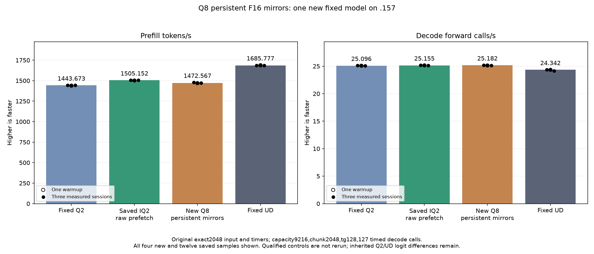

# Persistent Q8 mirrors — prepared experiment

The new Q2 candidate derives96 read-only F16 dense-weight mirrors once on the
GPU after upload. It preserves the native Q8 single K16 accumulation chain,
SSM/convolution and attention epilogues. Original encoded Q8 tensors remain
available for decode and narrow prefill. The measured raw-prefetch1505 parent
is unchanged and no qualified cohort is rebuilt or rerun.

The own C17 admission helper checks shape/type/expert count, overflow and a
6GiB auxiliary-memory quota before allocation. Expected additional resident
memory is5,348,130,816 bytes, including96 protected allocation tails. The model
owns every allocation and publishes only after conversion synchronization;
existing failure/destruction frees its own registered allocations.

The assembly audit compares157 original kernels after explicit default-argument
binding and removal of compiler-only comments/local function numbers. All
instructions, operands, relative block IDs, directives and resources match.
Four new kernels comprise conversion and three projection paths. The mirrors
remove54–56 static instructions from large projection kernels, but double
dense weight traffic and consume more memory. No performance gain is inferred.

Prior pinned Gufo staging/hipBLASLt experiments were negative. This experiment
instead amortizes conversion at upload and keeps original Q8 decode, native
WMMA order and epilogues. It does not introduce a new stream, reactive gain,
model-file conversion, CPU model forward or new external dependency.

The frozen plan binds48 fixture files and four manifests. New component checks
cover11,534,848 code/scale combinations,66 complete guarded output pairs and42
alternating projection timings with three weight rotations exceeding32MiB.
Both full format arrays are saved. Safe numeric/timing rejection still proceeds
to the original2048/tg128 full-model test; guard or missing-store failures stop.

Fixed comparisons remain Q21443.672867/TG25.09595499, saved best
1505.152258/TG25.15493858 and UD1685.777092/TG24.34174251. None is rerun.
Q4 and the full curve remain suspended. GPU admission/results are pending.

## New component completed — 2026-10-05 UTC

All66 whole-output pairs and11,534,848 integer-oracle format combinations
are exact. Both23,069,696-byte format arrays are retained, with identical
SHA256da4b2b72e171fdddd993b2446ba6786dda9eb1839dfe20cb60939590836158e7.
All guards and required stores pass; original inputs and mirrors remain
unchanged. Three command exits are zero and six artifacts verify.

The retained42 timings alternate original Q8 and the new F16 mirror, use two
warmups/five measured iterations per path, and rotate three sets of weights.
Original Q8 and mirror sets each exceed32MiB. Allocation, upload, conversion
and checking are excluded from projection timers. Native arithmetic/epilogues
remain identical. These are operator latencies, not model throughput.

| Shape | Original Q8 median µs | New mirror median µs | Time change |
| --- | ---: | ---: | ---: |
| ssm2048 | 4892.505010 | 5509.019852 | +12.601210% |
| output2048 | 1741.920630 | 4115.129153 | +136.240910% |
| attention2048 | 4180.193265 | 4431.465785 | +6.011026% |

The format conversion diagnostic takes9.26291465759ms for
11,534,848 values and is not the production upload cost or a repeated timing.
The experiment removes54–56 static instructions but increases encoded
dense weight representation34→64 bytes per32 values. This observation does
not identify a hardware cache/bandwidth bottleneck: no counters were measured.
The original tester model still runs despite the timing regression, per the
owner's instruction. No numerical or performance promotion is implied.

[Every timing sample](figures/q2-q8-mirror-component.csv),
[full component report](../config/q2-q8-mirror-component-results.json).

## Completed original model — 2026-10-05 UTC

The new model completes at 07:56:38.310074 UTC. Median prefill is1472.566824
tokens/s, down2.164926% from saved best1505.152258. Decode is25.18240342
forward calls/s versus saved25.15493858 (+0.109183%); sample ranges overlap
and original decode paths are unchanged, so this is not a decode speedup claim.
Keep the mirror source as a measured negative experiment; raw-prefetch1505
remains the base. Fixed UD1685.777092 remains the unchanged target. No curve
or independent task-quality promotion follows from this result.

All21 full model input/output/logit files match the saved best parent, and all
nine internal replays are exact. The eight inherited fixed-Q2 logit differences
and KL0.001256655237 remain unchanged; the inherited maximum vs UD is
0.008626378682. The storage experiment introduces no observed numerical drift
on these inputs. This does not independently qualify task quality or GPU faults.

Memory accounting rises from43,156,012,544 to48,504,143,360 bytes: the expected
96 mirrors plus allocation tails add5,348,130,816 bytes. Loading takes
11.00257702s versus the saved parent's10.97909399s; single observations are not
an upload-performance verdict. New compilation takes155.262056s and is excluded
from PP/TG. Deferred scratch remains7,946,240 bytes; session memory376,777,748.

One new model arm alone runs. Values below show the warmup and every measured
sample; the other three columns are historical and were not rebuilt or rerun.
All retain the original exact2048 input, capacity9216/chunk2048, tg128 and127
timed decode forwards, greedy C1 with MTP off and15s cooldowns outside timers.
PP means prefill tokens/s; TG means decode forward calls/s.

| Session | Fixed Q2 PP / TG | Saved best PP / TG | New mirror PP / TG | Fixed UD PP / TG |
| --- | ---: | ---: | ---: | ---: |
| Warmup | 1438.259006 / 25.08847266 | 1501.690147 / 25.15123490 | 1469.608106 / 25.13169454 | 1689.043527 / 24.34239962 |
| Measured 1 | 1443.398207 / 25.10565683 | 1505.152258 / 25.16777240 | 1477.290126 / 25.18676980 | 1686.364042 / 24.34621613 |
| Measured 2 | 1443.672867 / 25.08698337 | 1503.530071 / 25.14904438 | 1472.102429 / 25.18240342 | 1685.777092 / 24.34174251 |
| Measured 3 | 1443.841794 / 25.09595499 | 1505.315370 / 25.15493858 | 1472.566824 / 25.13537057 | 1685.400011 / 24.15102104 |
| Median measured | 1443.672867 / 25.09595499 | 1505.152258 / 25.15493858 | 1472.566824 / 25.18240342 | 1685.777092 / 24.34174251 |

[Complete CSV](figures/q2-q8-mirror-model-wrapped.csv),
[SVG](figures/q2-q8-mirror-model-wrapped.svg),
[full model report](../config/q2-q8-mirror-model-results.json).

## Verified closure and decision

All13 runtime command exits are zero and39 artifact sizes/hashes verify across
host, component and model. Host gates pass26/26 Debug and26/26 ASan/UBSan;
99 local launch guards pass. Source inventories and all48 fixture/four manifest
bindings verify. The original missing executor include-path failure is retained
with exit1 and the corrected command with exit0; it is separate from GPU evidence.

Release at07:57:20.795336 UTC retires777 process identities/614 owned groups,
with empty KFD, four unchanged original leases free EX|NB and seven model stat
tuples unchanged. Canonical remote/main release/active/ready receipts and the
shared registry record the closure, SHA256
2fa8f9c0e8268dcf44800ad1494faa79eb14723af786b6d7c9f56d893a86a709.
No Q2 job, waiter, reservation, restart, cleanup, Q4 run or full curve remains.

The new mirror removes repeated Q8 conversion but increases representation
34→64 bytes per32 weights. Component and full-model regressions reject this
storage mechanism for the current prefill. No hardware counter was recorded,
so the relative causes from bandwidth, cache layout and load scheduling are
not isolated. No new stream or reactive scheduler is introduced: this result
measures a numerical-port storage change, not a reactive-inference improvement.
Further optimization should preserve compact weights and use the fixed tester.
Whole-curve equality remains open, with the best parent's fixed PP still needing
12.000436% improvement to reach saved UD.

[Frozen plan](../config/q2-q8-mirror-plan.json),
[final audit](../config/q2-q8-mirror-final-audit.json).
