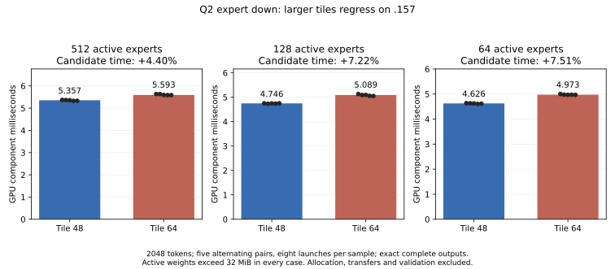

<!-- SPDX-License-Identifier: MIT -->
# Q2 performance reassessment — 2026-10-03

The retained development candidate reaches **1335.84 prefill tokens/s** and
**24.092 decode calls/s** at C1 pp2048/tg128. Its fresh UD control reaches
1671.71 and 24.333. Parity remains unmet: Q2 needs approximately **25.14% more
prefill throughput**, equivalent to **20.09% less elapsed prefill time** with
the same work. The median wall-time gap is 308.028 ms per 2048-token prompt.
These are sequential three-sample screens, not a zero-margin statistical
acceptance result. The latest candidate has not completed the 128K–1M matrix.

## Expert matrix instructions are already active

The retained Q2 prefill does not depend on the rocWMMA C++ library. Its executor
selects `RoutedGatedIQ2GemmPacked` for IQ2_XXS gate/up and `RoutedQ2GemmPacked`
for Q2_K down at the qualified model dimensions. Both use custom HIP kernels
calling `__builtin_amdgcn_wmma_f32_16x16x16_f16_w32` directly. The Q2 down path
retains high/residual activation planes and F32 accumulators. Single-token
decode instead follows the matrix-vector dispatch; small decode batches and
prefill have distinct selection rules. The warm gap is therefore not explained
by missing matrix instructions. Merely replacing the intrinsic wrapper with
the rocWMMA API has no measured speed benefit in this workstream.

## What has improved

| Checkpoint | Prefill tokens/s | Decode calls/s | Scope |
|---|---:|---:|---|
| Initial Q2 | 606.29 | 20.40 | Historical initial 2K screen |
| HC plus compensated expert down | 1037.26 | 22.97 | Historical development checkpoint |
| Paired IQ2 gate/up | 1240.52 | 23.01 | Historical development checkpoint |
| Latest paired HC up | 1335.84 | 24.09 | Retained development candidate |
| Latest matched UD control | 1671.71 | 24.33 | Same latest C1 protocol |

The historical progression is substantial, but its rows are not one interleaved
experiment. See [the expert stack](Q2-EXPERT-STACK.md) and
[the latest complete comparison](Q2-HC-UP-CHAINS.md), including every sample.
Later exact changes preserve their immediate Q2 baseline; they do not close
the earlier independent-model numerical qualification gap.

## The remaining warm GPU cost

The latest Q2/UD diagnostic pair predates the final paired-HC-up improvement.
It measures 1582.091 versus 1260.996 ms of prefill kernel work, a 321.095 ms
difference. Only 5.278/4.468 ms lies between kernels in the measured GPU spans.
This attributes that workload to GPU work rather than hundreds of milliseconds
of scheduler gaps; it is not a complete CPU/wall decomposition.

| Recognized kernel family | Additional Q2 time, ms |
|---|---:|
| HC down projection | 87.062 |
| Routed expert down | 69.570 |
| Explicit activation packing/conversion | 65.212 |
| HC up projection | 52.785 |
| Routed gate/up | 23.784 |
| Other, net | 22.681 |

The first four groups account for 85.53% of that historical kernel difference.
The subsequent HC-up change saves 26.766 ms in an unprofiled complete request;
subtracting it from individual old profile groups would not constitute a new
profile. Refresh the selected-source attribution before sizing the next change.
The grouping has explicit fallback limits: [profile report](Q2-PREFILL-GAP.md).

Lower-bit model storage does not imply less work at every boundary. This Q2
model contains IQ2_XXS gate/up, Q2_K down, F16 HC and BF16 PLE. Its routed down
preserves F32 SwiGLU input using high/residual half planes and two WMMA sums;
the selected output is F32. UD's corresponding path consumes a single half
plane and can write F16 expert output. Q2 also preserves two ordered K16 sum
chains in its raw-F16 HC path. These are distinct mechanisms: HC's two chains
are not the compensated high/residual representation used by Q2 expert down.

The F32 MoE/HC fusion, packed activations, affine palette, F16 HC projection
and paired gate/up already exist. Recommending their implementation again
would not identify a new optimization. Broadening tiles or reducing registers
has repeatedly failed to predict model performance. In particular, moving
narrowing into HC down saved 60.191 ms of conversion kernels but added
90.674 ms to the consuming projection. That experiment regressed complete
prefill despite a faster isolated component: [measured attribution](Q2-HC-INPUT.md).
The mechanism behind that projection slowdown is not established as a cache
or bandwidth effect by the available counters.

## Flash-style fused attention is already active

The retained Gufo backend dispatches `WmmaCausalAttention` for wide batches.
Its tiled WMMA kernel uses online softmax, staged K/V and fused output gating.
The saved marked 2K prefill contains **12 calls in each model**:
**44.252 ms Q2 versus 45.696 ms UD**. This component does not explain the
measured Q2 deficit. These counts exclude warmup and smoke, unlike a search
over the whole trace. This verifies execution in the integrated Gufo backend,
not completion of LIE's eventual autonomous C model executor or performance
at unmeasured long contexts.

## What the historical DS4 experiment actually contributes

Read-only historical qualification reports, not DS4 source or binaries, were
consulted after the owner's pointer to approximately 1100 tokens/s. The sealed
`gufo-formats-closure-r1/result.json` has SHA256
`80ef9ec9a43c50283cbf01ea64913c1c6161c21a171db10dee7f81aae5ef9aef`.
Its Q2 result is **338.46 -> 1053.50 tokens/s at 2K**, with 21.12 decode
evaluations/s. Q2 at 4K/8K is 1029.55/1009.71. The 1097.59 result belongs
to Q4. The later HC wave32 study's 1150.93/1194.26/1125.37 values are also
Q4; it gives Q2 only a numerical-admission pair, not a replicated speed claim.

That first large gain came from adapting Gufo's optimized routed kernel,
retaining compact routing, prefetch, packed LDS, paired gate/up and scatter.
LIE's current Q2 experiments already use that general approach. DS4's 1053.50
does not establish a faster current implementation: prompts, engine revisions,
activation boundaries and timing contracts are not a matched comparison.
DS4 timed 128 greedy evaluations beyond EOS; this workstream times 127 decode
calls after the first prefill-produced token. Do not compute a cross-project
causal speedup from those historical headline numbers.

Two documented numerical/dataflow differences deserve further investigation:

1. **F16 expert intermediate.** DS4's R2 report preserves the old new-format
   F32 SwiGLU expression before narrowing the paired result to half. Its static
   Q2 BN48 resource audit records 98 VGPRs and 12,416 LDS bytes. Our compensated
   down consumes two planes and the profiled BN48 uses 24,832 LDS bytes. The
   documented arithmetic boundaries differ; lower resource counts alone do not
   prove a speed or accuracy advantage. Our earlier single-half down tests
   exceeded the unchanged FP64 operator limit, so this is not an untested free
   replacement. Compare the original-F32 and narrowed-input oracles explicitly.
2. **One HC accumulation chain.** DS4's isolated F16 HC wave32 study records
   a single K16 chain, 78 VGPRs, 24 KiB LDS and exact replay against its own
   library baseline. Our retained HC has two chains to preserve a different
   reduction order. A separately derived one-chain experiment could reduce
   register pressure, but would change that order and needs fresh numerical
   and complete-model evidence. DS4's exactness does not transfer to our source.

The historical reports are `GUFO-FORMATS-RESULT-r2.md`,
`qualification/gufo-packed-audit-r1/REPORT.md` and
`HC32-MODEL-RESULT-r1.md` under the read-only DS4 qualification workspace.
Their paths and hashes are recorded in [the reassessment data](../config/q2-reassessment.json).
No source/archive extraction, object reuse, foreign mutation or model conversion
was performed. Any new implementation must derive independently from the pinned
official Gufo source. The DS4 evidence is reference material, not code provenance.

## N-grams and reactive execution: a different measured problem

The Q2-named model's n-gram table is BF16, not Q2. Its 320-byte rows are larger
than UD's 90-byte IQ4_NL rows, and its observed first-access read traffic is much
higher. Same-disk placement does not make row size or stored extent layout equal.
Compressed Q2 and unencoded UD PLE extents were observed in bounded samples;
an identical-content storage experiment has not isolated the compression effect.
The issue concerns the PLE row/page caches, not the KV cache.

The [balanced first-access experiment](Q2-PLE-FIRST-ACCESS.md) already shows
the C17 two-slot reactive lookahead helping: median 8K prefill changes
**10.982 -> 7.791 s**, 29.06% less time or **40.96% higher throughput**, with
all 576 frontier hashes exact. First-position prompts differ between modes,
with observed residency balanced; these are not identical cold states.
On replay the gain is only 0.57%. The experiment overlaps bounded preparation
of future prompt chunks with GPU work and preserves original model values.
It remains an isolated source, not integration into the current HC-up candidate.

Reactive scheduling therefore has a measured benefit when preparation can
overlap independent work. It cannot eliminate the dependent WMMA arithmetic
seen in the warm GPU trace. Concurrent serving gains and this PLE overlap must
remain separate from C1 kernel changes. Larger row retention alone improved
complete varied warm prefill only 1.09% in its measured experiment.

## Latest tile experiment and revised next work

The existing packed Q2 48/64 dispatches were compared at three routings with
39.375–315 MiB of active weights, five alternating pairs and eight launches
per sample. All 52,428,800 output values agree exactly per routing and all
3072 independent sampled FP64 dots pass the original limits.

| Active experts | Tile48 median ms | Tile64 median ms | Time increase |
|---|---:|---:|---:|
| 512 | 5.357 | 5.593 | 4.40% |
| 128 | 4.746 | 5.089 | 7.22% |
| 64 | 4.626 | 4.973 | 7.51% |



[Complete numerical and timing data](../config/q2-down-tiles-results.json),
[CSV](figures/q2-down-tiles.csv) and
[campaign verification](../config/q2-down-tiles-validation.json) are retained.
The historical matched UD trace uses tile48 for **all 48 expert-down calls**;
the absence of Q2 tile64 selection cannot explain that recorded deficit.
The prepared tile16 GPU test was withdrawn before launch for this reassessment.
No new kernel candidate or complete-model throughput was produced here.

The next work should test the numerical/dataflow hypotheses above rather than
continue tile sweeps: establish the selected-source profile, capture real routed
activation distributions, compare the two documented precision boundaries and
evaluate one mechanism per candidate. Keep oracle failures visible, and measure
complete prefill even when user-authorized exploratory numerical flags remain.
An isolated component win still needs a model win. Preserve original weights;
do not obtain a faster number by silently changing quantization or acceptance.

Then combine any retained compute gain with the separately qualified PLE
lookahead, measuring repeated padding, fixed prose/code and first/replayed
inputs separately. The current 2K repeated prompt, often with very confident
greedy choices, is insufficient for broad quality or context acceptance.
Fresh PP/TG sweeps and appropriate numerical controls remain required through
128K and the admitted model frontier before making long-context parity claims.

The completed tile campaign has three runners, fifteen command exits (all 0)
and 21 verified artifacts. Two guard cohorts pass 12/12 Debug and 12/12
ASan/UBSan on `.157`; the second qualifies the prepared but unexecuted tile16
mode. No original model was opened. Release is verified at 04:17:41 UTC,
followed by observer retirement at 04:18:26. No GPU work or retry is queued.
The retained engine, public C ABI and qualified runtime patch are unchanged.

Offline reproduction:

```sh
python3 tools/analyze-q2-down-tiles.py evidence/q2-down-tiles-micro-r1 --output config/q2-down-tiles-results.json
python3 tools/plot-q2-down-tiles.py config/q2-down-tiles-results.json docs/figures/q2-down-tiles
```
