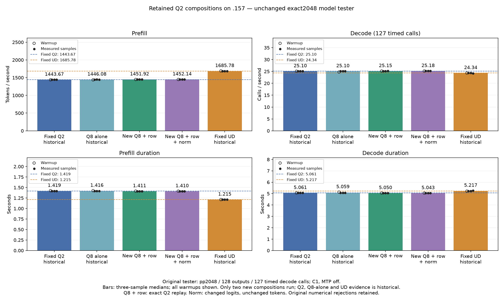

<!-- SPDX-License-Identifier: MIT -->
# Retained Q2 compositions on the fixed reference

Two new original-Q2 providers are measured on .157 at checkpoint `69f6d82`.
Only these candidates run. Historical Q2/UD controls and the previous Q8-alone
run are locally verified and reused without relaunching. The owner explicitly
requests performance despite retained component numerical rejections.

The original direct executor receives exactly 2048 input tokens, emits 128
outputs and times 127 decode calls. Capacity 9216, chunk 2048, C1, greedy,
MTP off, one warmup plus three measurements, 15-second pauses outside timers.
The input and timing contract are unchanged from the fixed Q2 1443.672867 /
UD 1685.777092 prefill comparator.

| Arm | Sample | PP token/s | TG calls/s | PP seconds | TG seconds |
|---|---|---:|---:|---:|---:|
| Fixed Q2 historical | Warmup | 1438.259006 | 25.08847266 | 1.423943804 | 5.062085753 |
| Fixed Q2 historical | Measurement 1 | 1443.398207 | 25.10565683 | 1.418873870 | 5.058620886 |
| Fixed Q2 historical | Measurement 2 | 1443.672867 | 25.08698337 | 1.418603928 | 5.062386263 |
| Fixed Q2 historical | Measurement 3 | 1443.841794 | 25.09595499 | 1.418437954 | 5.060576497 |
| Q8 alone historical | Warmup | 1436.624960 | 24.74499304 | 1.425563426 | 5.132351413 |
| Q8 alone historical | Measurement 1 | 1445.840323 | 25.11034503 | 1.416477302 | 5.057676421 |
| Q8 alone historical | Measurement 2 | 1447.807929 | 25.09939089 | 1.414552275 | 5.059883747 |
| Q8 alone historical | Measurement 3 | 1446.083285 | 25.10338822 | 1.416239314 | 5.059078038 |
| New Q8 + row reuse | Warmup | 1447.149606 | 25.15299548 | 1.415195769 | 5.049100419 |
| New Q8 + row reuse | Measurement 1 | 1451.197650 | 25.14783385 | 1.411248151 | 5.050136754 |
| New Q8 + row reuse | Measurement 2 | 1451.924906 | 25.14929256 | 1.410541269 | 5.049843835 |
| New Q8 + row reuse | Measurement 3 | 1452.534587 | 25.16696049 | 1.409949215 | 5.046298699 |
| New Q8 + row reuse + norm | Warmup | 1448.006676 | 25.16994976 | 1.414358120 | 5.045699385 |
| New Q8 + row reuse + norm | Measurement 1 | 1452.143206 | 25.18103518 | 1.410329223 | 5.043478121 |
| New Q8 + row reuse + norm | Measurement 2 | 1450.324914 | 25.19930070 | 1.412097372 | 5.039822394 |
| New Q8 + row reuse + norm | Measurement 3 | 1452.295326 | 25.17586040 | 1.410181499 | 5.044514784 |
| Fixed UD historical | Warmup | 1689.043527 | 24.34239962 | 1.212520558 | 5.217234208 |
| Fixed UD historical | Measurement 1 | 1686.364042 | 24.34621613 | 1.214447147 | 5.216416355 |
| Fixed UD historical | Measurement 2 | 1685.777092 | 24.34174251 | 1.214869991 | 5.217375049 |
| Fixed UD historical | Measurement 3 | 1685.400011 | 24.15102104 | 1.215141798 | 5.258576845 |

| Arm | Median PP token/s | Median TG calls/s | PP vs fixed Q2 | PP vs fixed UD |
|---|---:|---:|---:|---:|
| New Q8 + row reuse | 1451.924906 | 25.14929256 | +0.571600% | -13.872070% |
| New Q8 + row reuse + norm | 1452.143206 | 25.18103518 | +0.586721% | -13.859121% |

Q8 plus row reuse measures +0.403962% PP over the retained Q8-alone run.
Adding norm to that composition changes observed median PP by +0.015035%
and TG by +0.126217%; the PP sample ranges overlap. These are descriptive
historical comparisons with three measurements, not contemporaneous controls
or independent statistical acceptance. Every sample is preserved.

Q8 plus row reuse keeps all 21 saved Q2 inputs, outputs and full logits exact
to every retained Q2 control. All nine within-arm checks pass and KL is zero.
The norm composition changes eight logits files relative to Q2 while preserving
all generated tokens. Its 21-file replay is exact to the previous isolated norm
model run: row reuse and Q8 add no further observed numerical difference.
Maximum matched-history KL remains 0.004092912681 and maximum absolute logit
delta remains 2.693255663. Within-arm nine of nine checks pass for both candidates.

Both new source inventories contain 1022 verified files. Each differs in five
files from the fixed parent and introduces no new tensor buffers or streams.
The first combines the retained shared-Q8 host dispatch with 640-column row
reuse. The second additionally replaces only the two retained norm kernel
bodies. Original weights, mixed IQ2 routing, decode dispatch and MTP stay fixed.

All eight configure/build/link/model command exits are zero; 52 result artifacts
verify. Builds take 153.242186 / 153.250737 seconds outside PP/TG timers.
The shared host gate passes 23/23 Debug and 23/23 ASan/UBSan CTest on .157.
Original numerical failures and thresholds remain retained. These runs do not
supply independent terminal-task quality, promotion, high-context or concurrency
qualification. Fixed UD prefill parity remains open: the norm composition is
13.859121% below UD, needing a further 16.088901% PP increase to equal it.

The window is released at 2026-10-04T19:29:44.457368Z. Fresh closure retires
457 process identities and 353 groups, with empty KFD, four original leases
free and six model stat tuples unchanged. No Q2 job, reservation, waiter, restart
or remote cleanup remains; core receives the verified release.

[Audited report](../config/q2-reaudit-composition-results.json),
[frozen plan](../config/q2-reaudit-composition-plan.json),
[source inventory](../config/q2-reaudit-composition-source.json),
[host gate](../config/q2-reaudit-composition-host-results.json),
[release](../config/q2-reaudit-composition-window-release.json).

[SVG](figures/q2-reaudit-composition/comparison.svg) and
[all twenty CSV rows](figures/q2-reaudit-composition/comparison.csv).
