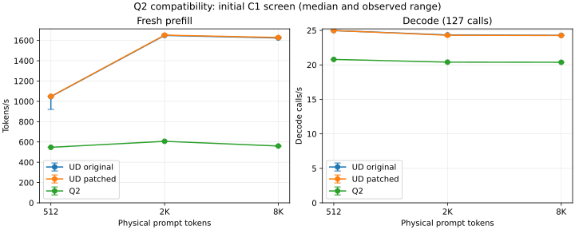

# Q2 C1 results — performance gate not met

<!-- SPDX-License-Identifier: MIT -->

The original Q2 file runs through the official Gufo candidate and passes the
bounded semantic/operator checks, but this first implementation is **not
accepted for performance**. Its median fresh PP is 48–66% slower than existing
UD-Q4, and decode is 16–17% slower in this matched-input C1 screen.

The unchanged UD model, before/after the patch, has 47/47 input/output/frontier
files byte-identical. Median UD PP changes by +0.22/+0.19/+0.30%; TG by
+0.02/-0.19/-0.09% at 512/2K/8K. These small observed losses are retained, not
rounded into a formal zero-regression pass. Three samples and noninterleaved
arms do not provide a zero-margin confidence bound. The large Q2 gap is clear.

Initial noninterleaved C1 screen; no formal zero-margin non-regression verdict

| Arm | Prompt | PP tok/s min / median / max | TG steps/s min / median / max |
|---|---:|---:|---:|
| UD original | 512 | 920.95 / 1046.71 / 1050.76 | 24.98 / 24.98 / 24.99 |
| UD original | 2048 | 1646.75 / 1649.36 / 1649.41 | 24.33 / 24.34 / 24.36 |
| UD original | 8192 | 1620.44 / 1624.14 / 1631.98 | 24.24 / 24.28 / 24.28 |
| UD patched | 512 | 1044.89 / 1049.00 / 1051.83 | 24.97 / 24.98 / 24.98 |
| UD patched | 2048 | 1650.48 / 1652.54 / 1658.73 | 24.18 / 24.30 / 24.34 |
| UD patched | 8192 | 1627.21 / 1629.05 / 1636.38 | 24.26 / 24.26 / 24.28 |
| Q2 | 512 | 546.96 / 547.20 / 548.72 | 20.75 / 20.79 / 20.80 |
| Q2 | 2048 | 606.04 / 606.29 / 607.02 | 20.38 / 20.40 / 20.40 |
| Q2 | 8192 | 559.59 / 559.89 / 560.05 | 20.36 / 20.38 / 20.39 |

UD token/frontier files compared exactly: 47; changed: 0.
TG counts 127 completed decode calls after the first output token from prefill.
Each profile retains one warmup and three measured fresh sessions. MTP is disabled.

## Conditions and limits

All arms ran on `.157`/gfx1151, official source pin `f783fedb`, same harness,
compiler/dependencies, original read-only GGUFs, greedy decoding, thinking off,
MTP off, 2048-token prefill chunks and 9216-token session capacity. Physical
input IDs and every generated output ID match across Q2/UD in these samples.
The full logits need not match across different quantizations. Q2 has no
independent full-model teacher result; independent synthetic operators and two
semantic prompts are a narrower correctness check.

One retained warmup at each length, then measured ascending/descending/ascending
profile order. Each request creates a fresh full hybrid session. Model and
bounded PLE row cache remain resident; no prefix reuse, SSD snapshots, cache
flush, power tuning or HTTP transport. Times include synchronous forward work,
PLE gathers and host frontier transfer; decode additionally includes finite
logit scanning and greedy selection. File saving and text rendering are outside
the timers. See `Q2-VALIDATION.md` for first-token/EOS conventions. This is not
an end-to-end HTTP or production serving throughput result.

Q2 resident weights: 43,156,012,544 bytes, load 11.7014 s. UD resident weights:
82,384,141,824 bytes. Lower memory does not compensate for a failed PP/TG gate.
The first Q2 arm's printed seconds/rates inherited two-decimal diagnostic stream
formatting; rates use unrounded clocks. UD arms restore ten significant digits.
The observed precision is sufficient to expose the large gap, not exact equality.

## Diagnosed dispatch difference and next experiment

Source inspection identifies a concrete missing optimization: `MoeExperts`
selects its dedicated compacted F16 WMMA expert pipeline for UD's Q4_K/Q5_K
with Q5_1/Q8_0 down projections. IQ2_XXS/Q2_K take generic MMQ/vector routes.
The UD route also keeps the large routed intermediate in F16 and can fold its
MoE epilogue into the following combine. The Q2 port already shares the PP
activation quantization for gate/up and fuses gate/up/SwiGLU in the small-batch
path; zero padding is fused into quantization, without an extra float buffer.

Therefore larger buffers alone are not an evidence-based remedy. The next
bounded experiment is a 2K PP plus 16-output GPU kernel trace to quantify routed
math, quantization, gather/scatter, dense operations and synchronization. It
must precede selecting a lossless packed layout or extending the WMMA route.
A change to F16 activation arithmetic must pass independent operator checks and
matched model-frontier validation; faster output alone is insufficient.

`experiments/q2-profile.patch` preserves that diagnostic preparation separately.
It is **not applied or qualified**: first test its owned-session process handling
on `.157` before GPU use. Profiling wall times are not benchmark replacements.
No performance optimization or 128K/256K sweep has been accepted after this loss.

## Evidence and coordination

`q2-bench-r1`, `q2-ud-base-r1` and `q2-ud-patched-r1` each retain 52 hash-verified
collected artifacts, model stat checks, binary hashes, real child/transport
exit 0 and telemetry. All four leases were acquired nonblocking per arm. Final
run retired at 2026-10-02 01:31:56 UTC: KFD empty, lease paths unchanged, leases
released and owned children reaped. Desktop DRI clients and inaccessible process
observations remain limitations; no universal exclusivity claim is made.
The GPU window was handed to the coordinated core test thread after retirement;
no Q2 GPU job or waiter remains active.

Machine-readable summaries: `config/q2-c1-screen.json`, `config/q2-comparison.json`.
Raw receipts remain under persistent local `evidence/` and remote project `run/`.
Recreate the table/plots with `tools/analyze-q2.py` and the three collected arms.
