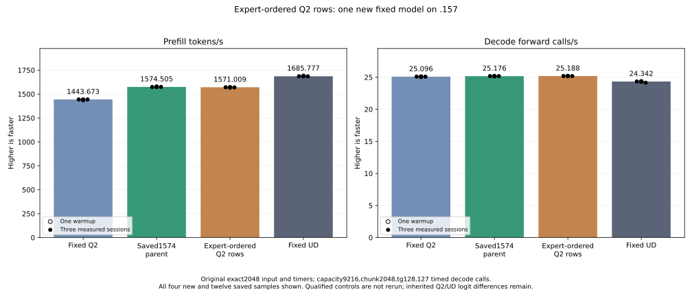
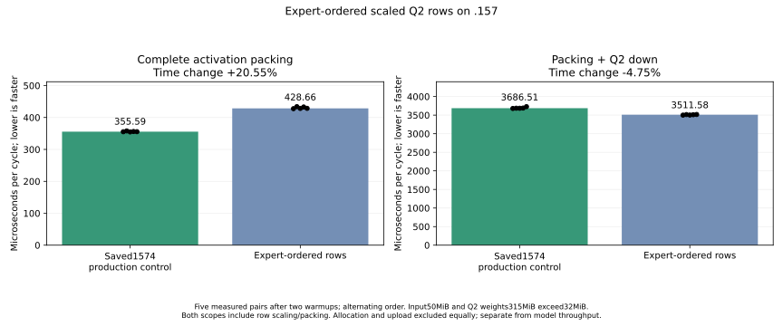

<!-- SPDX-License-Identifier: MIT -->
# Expert-ordered scaled Q2 activations

The completed .157 model measures1571.009498 PP /25.18779712 TG, nominal
-0.222034% /+0.047296% against retained1574.505432 /25.17589001. Every measured
PP sample is below the saved parent range. These historical cohorts do not
establish a stable causal regression, but this trial supplies no model gain.
Retain the source and the component benefit; keep `scaled-wave-pack` as the
next composition base. Fixed UD1685.777092 still requires7.067086% more PP
from that retained base. Full-curve and independent quality acceptance stay open.

All21 complete parent files, all128 output tokens and nine within-arm checks
match exactly. Scalar decode arithmetic/dispatch is unchanged, so its observed
rate difference is not assigned to this prefill layout.

| Sample | Prefill seconds | Prefill tokens/s | Decode seconds | Decode calls/s |
| --- | ---: | ---: | ---: | ---: |
| Warmup | 1.304823932 | 1569.560421 | 5.042341592 | 25.18671091 |
| Measured1 | 1.303373393 | 1571.307203 | 5.042124145 | 25.18779712 |
| Measured2 | 1.303620381 | 1571.009498 | 5.039865060 | 25.19908737 |
| Measured3 | 1.304806675 | 1569.581180 | 5.042821072 | 25.18431612 |

The complete component cycle improves4.745116%, while model PP does not.
The component uses512 equally populated40-row experts; the full model has
layer-dependent routing and different surrounding cache traffic. Those are
relevant scope differences, not an isolated explanation for the discrepancy.
Further useful layout work would have to move ordering into the gate/up
producer and avoid the new packing gather/padding cost. Expanding its F32
rows to the padded28160 capacity would exceed the existing52,428,800-byte
`gate_e` allocation; a compact logical layout and explicit routing adaptation
are needed. No such producer fusion is implemented or measured by this result.

Host/component/model are terminal and collected before release at
2026-10-05T17:11:36.064569UTC, SHA256
`13ba43fc1b39ae5906d62f36515a3f6061059912f76c9bfa9dd41b99a4360571`.
251 verified artifacts include214 complete arrays. Thirteen commands preserve
component numeric1 and twelve zero exits.1051 process identities/837groups
are retired, KFD empty, four original leases free and seven model stat tuples
unchanged. Canonical/main/remote mirrors match and core is notified. Model
CPU/GPU peaks are80.25/77C including compilation; no thermal stop. No job,
reservation, waiter, restart or cleanup remains. Any next window needs fresh
admission.

[Disposition](../config/q2-scaled-expert-order-disposition.json),
[model result](../config/q2-scaled-expert-order-model-results.json),
[final audit](../config/q2-scaled-expert-order-final-audit.json),
[all model samples](figures/q2-scaled-expert-order-model-wrapped.csv).

The following records the implementation and component boundaries.

This candidate starts from retained1574.505432 PP /25.17589001 TG. It gathers
slot-major F32 SwiGLU rows once during the existing scaled-half packing pass,
then stores them in the existing padded expert-row order. Q2 down reads this
contiguous layout instead of gathering slot-major activation rows independently
for every output-row block. Inverse scales and down outputs retain slot order;
the weighted expert consumer, original weights and arithmetic remain intact.

At2048/top10/512 experts, the conservative padded capacity is28160 rows. Half
rows plus slot scales consume36,126,720 bytes within the existing52,428,800-byte
F32 up allocation. No allocation, stream, model conversion or public contract
changes. Only the eligible compact-down path uses this layout, after an explicit
capacity check; other shapes retain their existing representation. Zero-filled
padding prevents stale values from entering WMMA. Routing maps remain alive
through packing and down on the original stream.

This changes memory traversal, not the logical matrix operation. Packing now
gathers its input and writes padding, so its extra work can erase a consumer
benefit. Contiguous addresses do not prove fewer hardware transactions. The
component measures both complete packing and packing-plus-down, with50MiB
activation input and315MiB weights independently larger than MALL. Allocation,
upload and checking remain outside timing; all packing/reordering is inside.

The new guarded fixture covers36 packing layouts and35 full down comparisons,
including randomized within-expert permutations, empty experts, padded holes,
ragged rows/outputs and16/48/64-token tiles. Every scale/half is independently
checked with scalar double-ldexp/integer half conversion. The extreme-input
case retains the strict signed-zero oracle, including any inherited failure.
Safe numerical or timing failure does not suppress the original2048/tg128
model performance arm. A device fault, nonfinite/unwritten output or guard
violation stops further device work. Qualified model controls are reused.

The local production assembly preserves all162 existing kernel instruction,
operand and resource bodies and adds four kernels without private scratch.
The GPU component completes with107 exact layout/scale/down comparisons and214
full output arrays. Packing time rises355.585992 to428.663999us (+20.551430%),
while complete packing-plus-down falls3686.505953 to3511.576970us (-4.745116%).
All five candidate complete-cycle samples precede every parent sample. These
measurements include reordering and padded writes; they are not a model gain.
Resources remain identical for each corresponding16/48/64-row down tile.

The strict scalar fixture exits1:20800 negative-zero-to-positive-zero half-bit
differences occur in each arm, all in the extreme-input case. Reconstructing
the permutation independently and reading the saved full arrays accounts for
every reported oracle discrepancy. The35 ordinary cases pass the independent
packing oracle. Preserve the actual failure and expected values unchanged.
Model performance is admitted after this safe component result.

The separate .157 host checks pass27/27 Debug and27/27 ASan/UBSan. The shared
format check retains88 findings, including two pre-existing include-order
findings in modified files. Checking changed files with include order preserved
passes; the strict default check remains recorded as failed. No accepted source
or qualified result is reformatted or overwritten.
The first fixture compilation fails on a pointer field accidentally called as
a function; the source and both host/device exit1 logs are preserved before
the one-line correction. No numerical result is inferred from compilation.

The associated MMQ source review confirms that directly selecting existing
`qfn_mmq_q2_K_moe_raw` would rebuild expert maps, quantize the640 logical values
with768 stored-width padding, and write F32 outputs. A fair producer-Q8/down
adaptation still needs a direct consumer and explicit numerical qualification;
it is not implemented by this layout experiment. Official source provenance
remains Gufo f783fedb9bea2ec7de941f6da4e02f4a4596b29e, independently fetched.

Original fixed references remain Q2 PP1443.672867 and UD1685.777092. No Q4,
full context curve, reference rebuild/rerun, cleanup or tuning is scheduled.
Independent inherited F16 quality and full PP/TG parity remain open.

[Source](../config/q2-scaled-expert-order-source.json),
[static evidence](../config/q2-scaled-expert-order-static.json),
[component evidence](../config/q2-scaled-expert-order-component-results.json),
[plan](../config/q2-scaled-expert-order-plan.json).

