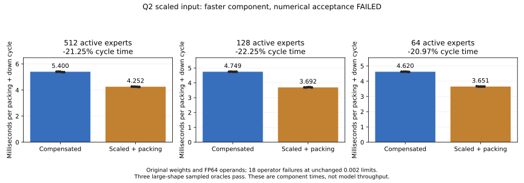
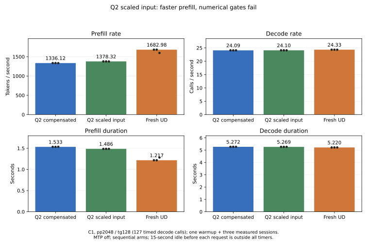

<!-- SPDX-License-Identifier: MIT -->
# One-plane Q2 activation scaling

The candidate reduces original-shape packing/down component time by
20.97–22.25%, but **fails all eighteen targeted independent operator cases**.
It remains an arithmetic experiment, with the numerical rejection preserved.
No tolerance, golden, encoded weight or qualified runtime is changed.
The complete Q2/UD performance and quality objective remains open.

## Hypothesis and implementation

The retained routed Q2 down consumes a half-precision high part and a scaled
half-precision residual, using two F32 WMMA accumulators. This experiment asks
whether normalizing each activation row by an exact power of two can preserve
the required accuracy with a single half plane. The measured answer for the
targeted synthetic data is no: scaling cannot restore discarded mantissa bits.

The paired IQ2 gate/up still evaluates its original F32 SwiGLU expression.
An added GPU kernel finds each 640-element slot's absolute maximum, constructs
bounded reciprocal power-of-two factors, and packs the scaled row into F16.
One F32 WMMA sum consumes that plane; the inverse scale is applied to its F32
output. Original Q2 weight decoding and the four-value rounded weight palette
are retained. The scale's IEEE exponent bits are constructed directly; this
avoids a general floating division but does not improve F16 mantissa precision.

The model uses the existing, unused-on-this-route `up_e` allocation for the
half plane and per-slot F32 inverse scales. With K640 this uses 1284 bytes
per slot inside an existing 2560-byte allocation. Input and output owners are
separate and remain ordered on the parent stream. No new tensor allocation,
weight conversion, persistent repacking, CPU model forward or side stream is
introduced. Scalar decode retains its existing route. Factors are bounded to
powers [-120,120]; zero rows retain a unit factor. This experiment does not
establish a universal accuracy guarantee over every finite F32 input.

The [generator](../tools/prepare-q2-scaled-input.py),
[patch](../experiments/q2-scaled-input.patch) and
[source manifest](../config/q2-scaled-input-source.json) derive independently
from the retained `hc-up-chains` source at official Gufo pin
`f783fedb9bea2ec7de941f6da4e02f4a4596b29e`. The new packing/dispatch include is
first-party MIT. Upstream notices remain. No DS4 or sibling-workspace code or
artifact is imported. All 1020 source files reconstruct with zero fuzz.

Local device compilation and executor/fixture syntax pass. For packed tile48,
static VGPRs decrease 144 to 96 and LDS 24,832 to 18,560 bytes; neither route
uses private scratch. The [resource metadata](../config/q2-scaled-input-resources.json)
retains full kernel identities. Resources alone are not the performance gate.

## Component protocol and numerical result

All runtime work uses `.157`, with fresh original four-lease/process/thermal
admission for each arm. The owner-approved limit is 98 C inclusive, retaining
any lower exposed hardware threshold. Debug and ASan/UBSan each pass 13/13.

The original operator fixtures cover 65 tokens, two selected experts, 129
output rows, logical/stored K640/768 and tile rows 16/48/64. Both ordinary and
small inputs are tested at additional exponent shifts -12/0/+12, producing
eighteen cases. Every packed activation is checked against a scalar IEEE
conversion with an independently calculated scale: 1,497,600 half values in
total. Complete outputs, finite values and output guards are checked.
The oracle still multiplies the **original F32 inputs** and original decoded
weights in FP64; it is not replaced with a rounded-input oracle.

| Candidate error | All eighteen cases | Unchanged limit |
|---|---:|---:|
| Relative RMS | 0.00559642778534 | 0.002 |
| Maximum error / reference peak | 0.00267161428978 | 0.002 |

The errors are identical at all tested scales and tiles. This contradicts an
explanation based only on tiny-value underflow. F16 mantissa rounding and the
dot product's sensitivity to it remain; dynamic scaling is not a substitute
for the retained correction plane. Every candidate output buffer differs from its
compensated counterpart. Full saved buffers and the actual exit code **1** are
retained. Only the known numerical-threshold exception permits later timing
samples; GPU/runtime errors terminate the process.

## Complete packing/down component timing

The benchmark uses 2048 tokens, ten experts per token, 2560 output rows and
640 logical input columns. Active expert counts 512/128/64 exercise distinct
reuse levels with 315/78.75/39.375 MiB of original weights, all beyond 32 MiB.
Five alternating pairs each time eight launches. Warmup, allocations, copies
and oracles are outside the interval. Candidate normalization/packing is
**inside every timed call**. The reference starts from its retained packed
input; the gate/up producer that normally makes that input is not timed here.
This is a component comparison, not the entire gate/up/down path.

| Active experts | Compensated median, µs | Scaled + packing median, µs | Time change |
|---|---:|---:|---:|
| 512 | 5399.522781 | 4252.296925 | -21.247% |
| 128 | 4748.886108 | 3692.469358 | -22.246% |
| 64 | 4620.238781 | 3651.390076 | -20.970% |

All three 52,428,800-value reference output hashes reproduce the retained tile
experiment. Candidate outputs are finite and guarded but are not byte-exact.
Each routing samples 1024 independent FP64 dot products: all 3072 satisfy the
original limits, with maximum RMS 0.000954715 and peak-scaled error 0.000673174.
That sample result does not override the eighteen full operator failures.
The [report](../config/q2-scaled-input-results.json) preserves all thirty
timings, saved-buffer witnesses and the rejected numerical verdict.

[CSV samples](figures/q2-scaled-input-component.csv) and a
[PNG](figures/q2-scaled-input-component.png) accompany the plot.

## Complete-model exploration

The owner requested performance measurements even when numerical flags remain.
After recording the failed component gate, the coordinated window explicitly
admits an exploratory retained/candidate model pair to measure error propagation
and the actual speed ceiling. This is not numerical promotion.

Both arms fully rebuild MMQ and use the original Q2 file in place, C1
pp2048/tg128, MTP/prefix off, capacity 9216, chunk2048, one warmup plus three
measured sessions, and 15-second idle excluded from timing. The complete token
and logit files are compared to the retained path and historical qualified Q2.
KL is meaningful for a numerical comparison only when token histories match.
An identical greedy sequence alone does not establish independent task quality.

The fresh Q2 pair produces these medians:

| Measurement | Retained Q2 | Scaled-input Q2 | Change |
|---|---:|---:|---:|
| Prefill token/s | 1336.120648 | 1378.318646 | +3.15825% |
| Prefill seconds | 1.532795712 | 1.485868312 | -3.06156% |
| Decode calls/s | 24.09013277 | 24.10368965 | +0.05628% |
| Decode seconds, 127 calls | 5.271867998 | 5.268902888 | -0.05624% |

All nine token files match; all twelve logit buffers differ. Each arm passes
its nine within-arm replay checks. Saved KL against the retained path peaks
at 0.000579150; against the historical qualified Q2 it reaches **0.003770894**,
above the unchanged 0.002 diagnostic limit. All these histories match, so
different decoded tokens do not explain the logit discrepancy. This is a real
numerical difference, without a measured task-quality verdict. Both runtime
commands exit zero because the fixture completed; that does not clear the
separate operator/KL rejection. The selected source remains unchanged.

The reference reproduces the existing protocol, including the 15-second idle.
The qualified historical arm has additional 512/8192 frontiers; comparison
requires all twelve current frontiers to be present and never substitutes
different contexts. The first reader attempt rejected that larger inventory;
the subsequent explicit subset comparison and history annotations preserve
the original data and limits.

The fresh UD control completes at 2026-10-03 09:49:50 UTC. Its medians are
1682.975427 PP, 24.32964050 decode calls/s, 1.216892396 s prefill and
5.219970266 s for 127 decode calls. The scaled candidate remains **18.10227%
below UD prefill and 0.92871% below UD decode**. The minimum parity goal is
not met. These are full original-model C1 measurements; numerical gates still
fail and no candidate promotion follows.

The model plot includes all three measured samples per arm. Its
[CSV](figures/q2-scaled-input-model.csv) and
[PNG](figures/q2-scaled-input-model.png) retain complete values.

The separate pp2048/tg16 diagnostic profile completes at 10:00:37 UTC and
confirms 48 scaled-down calls (190.310223 ms) and 48 activation-packing calls
(22.097931 ms) inside the measured prefill interval. The complete interval has
2003 dispatches, 1511.193353 ms summed/union GPU time and 1516.548945 ms span.
These explain execution, not an additional wall-clock speed claim.

The owner requests [Terminal-Bench task comparisons](Q2-TERMINAL-BENCH.md) to
measure practical consequences of arithmetic drift. Operator error and KL
remain diagnostics; only real verified task outcomes can establish observed
functional regressions. The task campaign is not complete at this checkpoint.
