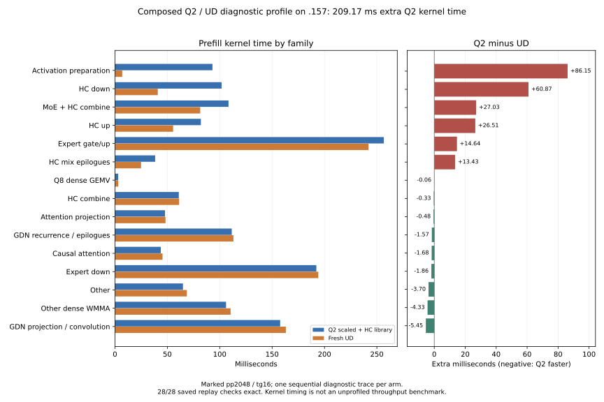

<!-- SPDX-License-Identifier: MIT -->
# Remaining cost after the scaled/library composition

Fresh `.157` traces locate the remaining Q2 deficit primarily in activation
preparation and HC down, together 70.29% of the net extra prefill kernel time.
Routed expert down is now comparable: Q2 192.213 ms, UD 194.073 ms. Continuing
to treat compensated expert down as the dominant remaining deficit would use
the earlier implementation's profile rather than the measured composition.

These are separate diagnostic pp2048/tg16 traces, with fifteen decode calls,
the existing GPU phase markers, MTP off, capacity 9216 and chunk2048. Each arm
fully rebuilds MMQ, then runs semantic checks, a warmup and the marked request.
Original weights, fan82 and the CPU98 inclusive/exposed GPU limits are unchanged.
All fourteen saved replay checks per arm match its preceding unprofiled model
control: 28/28 total. This qualifies the instrumentation against those controls,
not the experimental arithmetic against an independent teacher.

The later [decode sequence audit](Q2-HC-DECODE-ATTRIBUTION.md) separates Q2's
HC-up kernel from `other` and UD's HC-up calls from the generic Q8 group.
Its per-stage comparison retains every original dispatch and phase total;
the existing symbol-grouped decode data below remains historical evidence.

The unprofiled result remains [1412.563 versus 1660.059 PP token/s](Q2-SCALED-LIBRARY.md),
14.909% below UD. This profiling campaign introduces no new throughput result.

## Measured phase costs

| Phase and metric | Composed Q2 | Pristine UD |
|---|---:|---:|
| Prefill dispatches | 2003 | 1630 |
| Prefill kernel sum / union, ms | 1468.038619 | 1258.871940 |
| Prefill kernel span, ms | 1473.734012 | 1263.294680 |
| Prefill inter-kernel gaps, ms | 5.695393 | 4.422740 |
| Decode dispatches, fifteen calls | 23594 | 26144 |
| Decode kernel sum / union, ms | 561.231247 | 552.819814 |
| Decode kernel span, ms | 645.333561 | 639.901893 |
| Decode inter-kernel gaps, ms | 84.102314 | 87.082079 |

Q2 has 209.166679 ms more prefill kernel time and only 1.272653 ms more
inter-kernel gap. Its kernels occupy 99.6135% of the marked prefill span.
This is GPU activity during the request, not utilization over model loading;
it does not establish bandwidth or arithmetic saturation. Scheduling callbacks
alone cannot remove the measured kernel work. Real overlap of independent
work could still matter, but the previous shared/routed overlap experiment
[regressed complete prefill](Q2-SHARED-OVERLAP.md), and PLE overlap is a
[separate multi-chunk result](Q2-COMBINED.md).

| Kernel family | Q2 ms | UD ms | Extra Q2 ms |
|---|---:|---:|---:|
| Explicit activation preparation | 93.068 | 6.917 | +86.151 |
| HC down projection | 101.772 | 40.902 | +60.870 |
| MoE + HC combine | 108.388 | 81.362 | +27.026 |
| HC up projection | 82.008 | 55.498 | +26.510 |
| Routed expert gate/up | 256.627 | 241.983 | +14.645 |
| HC mix epilogues | 38.366 | 24.933 | +13.433 |
| Q8 dense GEMV | 3.076 | 3.133 | -0.058 |
| HC combine | 60.939 | 61.270 | -0.330 |
| Attention projection | 47.755 | 48.239 | -0.483 |
| GDN recurrence and epilogues | 111.490 | 113.064 | -1.574 |
| Causal attention | 43.724 | 45.409 | -1.685 |
| Routed expert down | 192.213 | 194.073 | -1.860 |
| Other | 64.902 | 68.598 | -3.696 |
| Other dense WMMA | 106.024 | 110.358 | -4.334 |
| GDN projection and convolution | 157.685 | 163.133 | -5.448 |

Each group reconciles to the complete marked trace. Small signed differences
between single sequential traces are observations, not new optimization claims.
Some dispatch counts differ because the models use different weight formats
and fused paths; a grouped cost is not a same-arithmetic component comparison.
The HC-down library attribution uses its unique measured kernel symbol,
96 wide calls and the isolated M320/K10240/n2048 source dispatch. One scalar
HC-down call is also included. Unknown kernels remain in `other`.



[Full JSON](../config/q2-scaled-library-profile-results.json) preserves every
kernel, phase, call count and replay check. [CSV](figures/q2-scaled-library-profile.csv)
contains all groups for both phases; [PNG](figures/q2-scaled-library-profile.png)
is available for export.

Q2 activation preparation consists of 193 F32-to-F16 narrowing calls
(61.307498 ms), 48 scaled-row packing calls (21.475373 ms), 72 tiled Q8
quantizations (10.283062 ms) and one final Q8 quantization (0.001960 ms).
UD's 34 preparation calls total 6.916515 ms. Moving a conversion into another
kernel does not save its full listed duration automatically: producer and
consumer costs must be measured together.

## Next experiment prepared from this evidence

The previously exact [paired F32/F16 norm producer](Q2-HC-NORM-FUSION.md)
removed 94 narrowing calls and saved 37.223 ms across combine plus narrowing,
but the following native HC-down consumer added 40.501 ms, erasing the gain.
The later complete-cycle test also rejected that native composition. The
current down consumer is the newly measured hipBLASLt algorithm, so its
response to the changed producer's memory access pattern is unmeasured.

An isolated `library-norm` source now composes that unchanged, corrected
paired-output patch with the measured `scaled-library` source. It preserves
the F32 norm for mixing/injection and creates the F16 copy already consumed by
HC down in the producer's pass. The existing half-buffer identity is invalidated
before writes and published after dispatch; recomputing the norm invalidates
both cached representations. There is no new allocation, original-weight
conversion, C ABI change or additional intended precision reduction.

[Preparation](../tools/prepare-q2-library-norm.py) verifies every base source
hash, applies the historical patch with zero fuzz (two hunks have line offsets),
and changes only `executor.cpp`, `kernels.hip.cpp` and `kernels.hpp`. The other
1017 files, including library dispatch and scaled expert kernels, remain exact.
[Static evidence](../config/q2-library-norm-static.json) records five successful
commands: patch, formatting, device-only assembly, executor syntax and existing
norm fixture syntax. These run locally and execute no GPU inference.

This preparation is not numerical or performance acceptance. The source is
not enabled in the remote launcher and no new GPU workload is admitted or
queued. The next GPU check must compare original and composed producers plus
the actual library consumer, preserve complete F32/F16 buffers and independent
oracles, and time the entire cycle with rotating weights. Only a useful result
justifies a fresh complete-model comparison; existing scaled/library operator
and KL rejection stays explicit. Do not repeat the old native-consumer test
and label it qualification of this new composition.

The expert output buffer is a secondary hypothesis: at these dimensions its
52,428,800 F32 values occupy 209,715,200 bytes per layer, versus 104,857,600 bytes
in F16. That representation change would introduce another rounding boundary
and is not implemented here. Logical byte counts do not measure actual DRAM
traffic or establish a speedup.

## Validation, failures and release

Two host cohorts pass 16/16 Debug and 16/16 ASan/UBSan on `.157`. The first
launcher change incorrectly required a bench2k-only flag for a profile; the
actual attempted launch exits 2 before staging or SSH. Profile mode already
rebuilds all MMQ automatically. The corrected guard and invocation retain the
original flag restriction and are qualified by the second host cohort. All
26 commands across the four remote runners exit zero. A local summary read
initially precedes collection completion and exits 1; collection and corrected
audit then pass. Both local failures remain under `evidence/`.

The [analyzer](../tools/analyze-q2-scaled-library-profile.py) verifies all 66
artifacts, four archives/capsules, 4079 source-file instances, frozen fixtures,
original model/binary witnesses and fresh lease/KFD admission. The first host
cohort is explicitly recorded as using the earlier guard version. Maximum
observed CPU/GPU readings are 89.375/71 C; there is no thermal stop.

[Closure](../config/q2-scaled-library-profile-window-release.json) at
2026-10-03 16:14:41.510 UTC verifies 30 recorded processes and owned groups
absent, KFD empty and original four leases acquired EX|NB then released.
CPU/GPU are 40.375/38 C. Remote `run/`, the shared registry and main-repository
release/ready receipts mark release. Direct thread delivery again fails at
MCP transport; the persistent fallback is updated. No GPU job or retry remains.
Full task quality, long-context acceptance and Q2/UD parity remain open.

Offline reproduction from the collected evidence and this source checkpoint:

```sh
python3 tools/analyze-q2-scaled-library-profile.py
python3 tools/plot-q2-profile-gap.py config/q2-scaled-library-profile-results.json docs/figures/q2-scaled-library-profile
```
