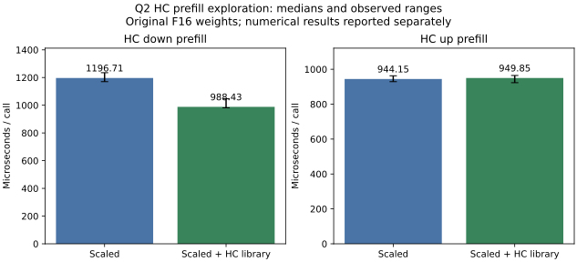
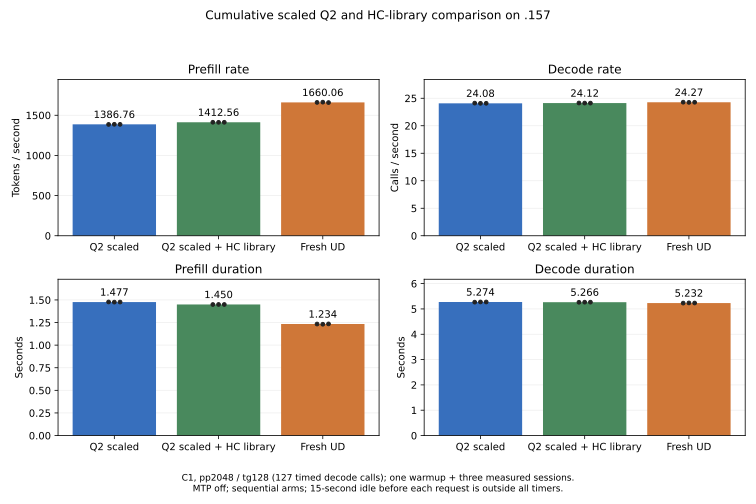

<!-- SPDX-License-Identifier: MIT -->
# Compose scaled Q2 down and HC-library down

Measured on `.157` on 2026-10-03, the composition raises C1 2K prefill from
1386.762 to 1412.563 token/s (+1.8605%), saving 26.974 ms per prefill.
Fresh UD reaches 1660.059 token/s, so Q2 remains 14.9089% slower in rate.
Existing numerical failures remain and the source is not promoted.

The preceding [cumulative comparison](Q2-COMBINED.md) finds no useful 2K gain
from adding vector conversion and PLE hooks. Most expert/HC improvements were
already cumulative. One remaining performance composition combines two
independent arithmetic experiments: scaled Q2 expert down and the faster
hipBLASLt HC-down algorithm. Neither currently passes all numerical gates.
Their historical percentage gains are not added to predict a joint result.

The [scaled route](Q2-SCALED-INPUT.md) improved prefill by 3.16% in its first
matched model cohort and by 3.25% in the latest same-fan control. The earlier
[HC-library route](Q2-HC-LIBRARY.md) improved its own model baseline by 2.06%.
They affect separate projections, so their composition can be measured without
selecting mutually exclusive implementations of the same kernel.

The isolated source derives from the measured `scaled-input` tree at official
Gufo pin `f783fedb9bea2ec7de941f6da4e02f4a4596b29e`. The unchanged library patch
applies with zero fuzz to `blaslt.cpp`, whose original bytes are identical in
the old palette and current scaled bases. Its resulting file matches the
previous HC-library experiment byte for byte. The other 1019 files, including
all numerical kernels, executor, paired HC up and scalar decode, are unchanged.
There is no model conversion, extra tensor buffer, new dependency or public
C ABI change. Vector conversion and PLE additions remain outside this screen.

Only F16 M320/K10240/n2048 selects supported, zero-workspace algorithm 7526.
The index is specific to the measured ROCm installation; a missing supported
match fails rather than selecting an unmeasured algorithm. The existing
arithmetic change and its position-dependent results remain explicit. The
scaled route's eighteen independent failures and the library route's additional
HC numerical failure are not waived by composing them.

[Preparation](../tools/prepare-q2-scaled-library.py),
[source identities](../config/q2-scaled-library-source.json) and
[static checks](../config/q2-scaled-library-static.json) preserve the patch,
full inventories and actual exits. Patch application, changed-file formatting
and host syntax all pass locally. No local GPU inference runs.

The [measurement plan](../config/q2-scaled-library-plan.json) uses `.157`,
fresh original four leases per GPU/build arm, the common fan82 policy and
CPU98 C inclusive/exposed GPU limits. The unchanged 22-case HC fixture compares
a fresh scaled reference and the new composition, preserving actual numerical
exit 1 and all timing samples. A recorded decision precedes any full-model
scaled/library/UD trio, with full MMQ builds and the same C1 pp2048/tg128,
one-warmup/three-measured-session protocol and 15-second untimed idle.
Saved token histories and full logits must be compared at unchanged thresholds.
No HTTP, broad context, task-quality or parity claim follows static preparation.

## Component result

Both sources complete the unchanged 22-case fixture and every timing sample.
The reference retains four numerical failures; the composition retains five.
Both actual operator exits are 1. Only `320x10240-n2048-p0` changes and all
22 candidate output hashes match the earlier library-dispatch experiment.
The changed case has relative RMS 3.195471529e-5 and error/peak 3.106058155e-5,
both above the original 2e-5 limits. No failure is relabeled as passing.

Down median falls 1196.710944 to 988.426447 microseconds (-17.4047%).
Plain HC up is an unchanged control, 944.152534 to 949.852467 microseconds
(+0.6037%, overlapping ranges). Each shape rotates 100 MiB of original-layout
F16 weights and records five GPU-event samples of sixteen launches.

| Repetition | Scaled down us | Library down us | Scaled up control us | Library up control us |
|---|---:|---:|---:|---:|
| 1 | 1234.839916229 | 982.239246368 | 928.890466690 | 926.815748215 |
| 2 | 1196.710944176 | 981.359362602 | 962.394535541 | 949.852466583 |
| 3 | 1170.029282570 | 991.411626339 | 941.735148430 | 961.824595928 |
| 4 | 1211.265444756 | 1046.899795532 | 947.592496872 | 922.798097134 |
| 5 | 1186.443805695 | 988.426446915 | 944.152534008 | 964.149534702 |



[Complete component data](../config/q2-scaled-library-components.json) and
[range CSV](figures/q2-scaled-library-components.csv) retain actual failures.
The measured component gain and exact reproduction of its prior arithmetic
motivate an explicitly recorded full-model exploration, not numerical promotion.
The updated launcher guards pass 16/16 Debug and 16/16 ASan/UBSan on `.157`.
A local reporting assertion initially expected a different CTest summary string;
its exit 1 is retained and corrected against the actual all-pass logs, without
rerunning tests or altering their results.

## Full-model result

Three fresh builds run sequentially with full MMQ rebuilds, original Q2/UD
weights, MTP disabled, context capacity 9216 and chunk 2048. Each arm runs
the same pp2048/tg128 prompt, one warmup and three measured sessions. Each
session produces 128 tokens. Prefill times the forward producing the first
token's logits; its argmax is outside that timer. The following 127 timed decode
calls include forward and argmax. Fifteen seconds of idle precedes each request outside
both timers. Model loading and builds are excluded from request rates.
All arms share fan82 and the CPU98 inclusive/exposed GPU threshold policy.

| Source | Prefill token/s median | Prefill seconds median | Decode calls/s median | Decode seconds median |
|---|---:|---:|---:|---:|
| Fresh scaled Q2 | 1386.762111 | 1.476821427 | 24.08079861 | 5.273911470 |
| Scaled Q2 + HC library | 1412.562577 | 1.449847273 | 24.11744601 | 5.265897556 |
| Fresh pristine UD | 1660.059096 | 1.233691020 | 24.27329718 | 5.232086893 |

The composition improves PP +1.8605% over its fresh base and lowers prefill
time 1.8265%. All three candidate PP samples exceed all three reference PP
samples. Decode changes +0.1522% while its implementation stays unchanged;
these sequential samples do not establish a decode optimization. Against UD,
Q2 remains 14.9089% below prefill rate and 0.6421% below decode rate. Matching
UD would require another 17.5211% PP throughput increase from this candidate,
or removing 216.156 ms from its median prefill time. No concurrency,
long-context, HTTP or independent quality acceptance follows this C1 screen.

All observations, including the excluded warmup:

| Source | Session | Prefill token/s | Prefill seconds | Decode calls/s | Decode seconds |
|---|---|---:|---:|---:|---:|
| Scaled | Warmup | 1385.261512 | 1.478421210 | 23.63650650 | 5.373044448 |
| Scaled | 1 | 1385.818980 | 1.477826491 | 24.11434157 | 5.266575479 |
| Scaled | 2 | 1387.531447 | 1.476002583 | 24.07681563 | 5.274783923 |
| Scaled | 3 | 1386.762111 | 1.476821427 | 24.08079861 | 5.273911470 |
| Scaled + library | Warmup | 1408.575457 | 1.453951217 | 24.12410451 | 5.264444115 |
| Scaled + library | 1 | 1412.859913 | 1.449542153 | 24.13421721 | 5.262238212 |
| Scaled + library | 2 | 1412.177639 | 1.450242479 | 24.11744601 | 5.265897556 |
| Scaled + library | 3 | 1412.562577 | 1.449847273 | 24.11486955 | 5.266460171 |
| UD | Warmup | 1604.460518 | 1.276441506 | 24.26858585 | 5.233102612 |
| UD | 1 | 1660.059096 | 1.233691020 | 24.28875649 | 5.228756772 |
| UD | 2 | 1663.128511 | 1.231414161 | 24.25346957 | 5.236364209 |
| UD | 3 | 1658.054939 | 1.235182232 | 24.27329718 | 5.232086893 |



[Validated JSON](../config/q2-scaled-library-results.json),
[measured-sample CSV](figures/q2-scaled-library-model.csv) and
[PNG](figures/q2-scaled-library-model.png) retain rates and durations.
Candidate measurement finishes at 15:43:12 UTC (17:43 Europe/Rome);
the final UD arm finishes at 15:47:49 UTC.

## Numerical result and interpretation

The fresh scaled base reproduces all 21 saved model files of the preceding
same-fan scaled control. The composition preserves all nine input/output token
files but changes eight logit files: prefill and final logits for each of the
four 2K sessions. Four short-prompt logit files stay exact. All 12 compared
logit frontiers have matching input and generated token histories. Within
each model arm all nine replay checks pass, including UD's own checks.

Candidate versus fresh scaled maximum KL is 0.001333176808; maximum absolute
logit difference is 2.191662997. Against the historical qualified Q2 reference,
matched-history maximum KL changes from 0.003770894186 for scaled to
0.002995927251 for the composition. Both exceed the unchanged 0.002 gate.
A lower maximum on these narrow prompts does not prove better task quality,
agreement with an independent teacher or cancellation of the operator errors.
The eighteen inherited scaled operator failures and the HC arithmetic failure
remain; combining them does not restore lost input precision.

The performance gain is measured across complete prefill, rather than obtained
by adding percentages from earlier experiments. It supports keeping this
composition as the next performance reference for investigation, while numerical
qualification and the actual Q2/UD performance objective remain incomplete.
The source is not selected for serving, the frozen three-variant Terminal-Bench
suite is unchanged, and full Core-19 has not resumed.

## Evidence and closure

The six immutable run labels have prefix `q2-scaled-library-`:

| Run suffix | Actual command exits | Verified artifacts | Verified source files | Maximum CPU C | Maximum GPU C |
|---|---|---:|---:|---:|---:|
| `host-r1` | 0/0/0/0/0/0 | 7 | 1020 | 67.125 | 40 |
| `component-reference-r1` | 0/0/1 | 48 | 1020 | 72.125 | 39 |
| `component-candidate-r1` | 0/0/1 | 48 | 1020 | 71.875 | 39 |
| `model-reference-r1` | 0/0/0/0 | 26 | 1020 | 84.250 | 72 |
| `model-candidate-r1` | 0/0/0/0 | 26 | 1020 | 84.625 | 71 |
| `model-ud-r1` | 0/0/0/0 | 26 | 1019 | 76.875 | 74 |

[The analyzer](../tools/analyze-q2-scaled-library.py) verifies all 181 collected
artifacts, 6119 source-file instances, capsule/archive hashes, frozen fixtures,
unchanged binary/model witnesses, original lease identities and KFD admission.
The reports preserve component numerical exits 1 alongside successful model
commands. No original model payload is rehashed or rewritten. Host fixtures
are distinct from original-weight GPU inference.

At 15:54:18.022 UTC the [release receipt](../config/q2-scaled-library-window-release.json)
verifies all 30 recorded processes and their owned groups absent, KFD empty,
and the four original leases acquired EX|NB then released. CPU/GPU are
38.75/37 C. Remote `run/`, the shared registry and main-repository local
release/ready records mark the window released, with no Q2 job or restart
scheduled. Direct core-thread delivery fails at the local MCP transport;
the durable coordination records remain available and delivery is not claimed.

Reproduce the offline report from the collected evidence:

```sh
python3 tools/analyze-q2-scaled-library.py
python3 tools/plot-q2-model-screen.py config/q2-scaled-library-results.json docs/figures/q2-scaled-library-model --reference-label 'Q2 scaled' --candidate-label 'Q2 scaled + HC library' --title 'Cumulative scaled Q2 and HC-library comparison on .157'
```

Reproduction of GPU runs requires a new coordinated window and new run labels.
