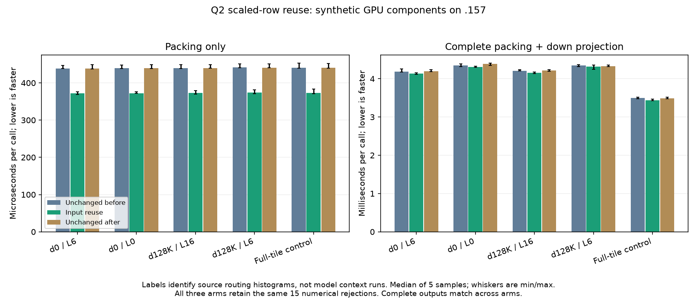

<!-- SPDX-License-Identifier: MIT -->
# Bounded activation reuse during Q2 prefill preparation

Further inspection of the independently fetched official Gufo DeepSeek port
suggests checking which inputs remain live across producer/consumer phases.
The existing Qwen `PackQ2ScaledRowsKernel` reads each 640-column F32 row for
its maximum, then reads it again to write scaled F16 values. Its actual device
assembly contains both global-read loops; the compiler does not retain these
inputs across the barriers. This is a first-party follow-up, not copied DS4 code.

The separate [candidate generator](../tools/prepare-q2-scaled-row-reuse.py)
retains up to three values per thread, with the existing 256-thread block.
It preserves maximum reduction order, scale/inverse bits, F16 conversion,
barriers, output layout and the host's exact 640-column admission contract.
It starts from ordered Q2, without the new IQ2 scale-reuse patch. Exactly one
file changes; the other 1019 source files remain identical.
[Source inventory](../config/q2-scaled-row-reuse-source.json),
[patch](../experiments/q2-scaled-row-reuse.patch).

## Static device compilation only

Both variants compile with the same production gfx1151 flags. All 154 other
emitted function bodies remain identical. The changed kernel has:

| Metric | Reference | Candidate |
| --- | ---: | ---: |
| Static instruction lines | 157 | 168 |
| Allocated VGPR index bound | 11 | 13 |
| LDS bytes | 36 | 36 |
| Private scratch bytes | 0 | 0 |
| Global input reads per valid element, from control flow | 2 | 1 |

The unrolled candidate contains three static load sites before the reductions;
the original has two load sites in loops. Counting static sites alone would
therefore misdescribe the executed reads. Candidate conversion remains
`v_fma_mixlo_f16`, and both barriers remain. More registers and the changed
control flow can still offset the saved read. [Static receipt](../config/q2-scaled-row-reuse-static.json).

For 2048 tokens, ten experts and 640 columns, the removed second source pass
is 52,428,800 logical bytes per layer. This is an address-traffic bound, not
measured DRAM traffic or a promised throughput improvement. Prior retained
profiles put this preparation phase at 21.5–22.1 ms, about 1.46% of the GPU
prefill interval; they used the older counting workload and are not a new
canonical-prose attribution. Even removing that whole phase would not close
the complete Q2/UD gap.

## Prepared component qualification

The [fixed plan](../config/q2-scaled-row-plan.json) and
[fixture](../tests/q2_scaled_row_reuse.cpp) compare the unchanged ordered
provider, the candidate and the unchanged provider again. Four retained
canonical expert-count distributions and a full-tile control exercise
640-column inputs and 2560-column down outputs. The down geometry stays at
48 rows. Two rotating input buffers and the active synthetic weight set each
exceed 32 MiB. These are `hipMalloc` operands, not a reproduction of production
mapped weight placement or model file-cache state.

HIP events record packing and complete packing/down separately, with two
warmup and five measured samples of eight calls. Routing preparation is outside
both intervals. Every finite packed element is checked against scalar
conversion; full output digests are retained across process runs, and each
down bank also has 1024 independent FP64 sampled dots at the existing 0.002
RMS/peak limits. Small cases retain their complete half and inverse buffers,
including signed zeros, subnormals, extreme values and nonfinite differential
controls. Guards, exact input allocations and post-timing output poisoning
check bounds and unwritten values. Numerical rejection does not discard timings.

The new runner mode is component-only and refuses model modes, other source
variants, detached execution and MMQ archive selection. Host qualification and
fresh GPU admission remain separate gates. No source, ABI, state or metrics
contract is promoted by preparing this fixture.

## Completed GPU component comparison — 2026-10-04

The three arms complete on .157 with unchanged fixture bytes from checkpoint
`9429d9a`. The host harness passes 22/22 Debug and 22/22 ASan/UBSan, six host
commands exit zero and seven host artifacts verify. All three GPU builds
complete; **each component executable exits 1** with the same fifteen numerical
rejections described below. All 234 component artifacts verify. No timeout,
thermal stop, guard failure, unwritten output or input mutation is observed.
[Audited results](../config/q2-scaled-row-results.json),
[decision](../config/q2-scaled-row-decision.json).

Median microseconds per call, five measured samples of eight calls each:

| Routing histogram source | Pack before | Pack reuse | Pack after | Complete before | Complete reuse | Complete after | Reuse vs after, complete |
| --- | ---: | ---: | ---: | ---: | ---: | ---: | ---: |
| d0, layer 6 | 438.997 | 371.590 | 438.363 | 4183.461 | 4133.139 | 4200.913 | -1.613% |
| d0, layer 0 | 439.768 | 372.180 | 439.483 | 4352.711 | 4306.438 | 4385.833 | -1.810% |
| d128K, layer 16 | 439.467 | 372.609 | 439.773 | 4206.811 | 4158.073 | 4216.408 | -1.384% |
| d128K, layer 6 | 441.337 | 374.375 | 440.593 | 4345.812 | 4315.229 | 4332.600 | -0.401% |
| Full-tile control | 440.312 | 373.520 | 440.203 | 3494.311 | 3437.648 | 3485.958 | -1.386% |

Packing medians improve 15.03–15.31% against the repeated reference, with a
gain against the first reference too. The complete packing/down gain is much
smaller. These labels describe the source of expert-count histograms;
**no 128K model inference occurs in this component fixture**. There is one
process run per arm, not multiple independent candidate process repetitions.

[All 150 measured samples](figures/q2-scaled-row/samples.csv),
[vector graph](figures/q2-scaled-row/components.svg).

### Numerical evidence and retained failures

For both comparisons, all 42 packing records and ten complete down output
digests match, covering 132,321,280 packed elements and 523,264,000 down
elements per arm. All 74 retained small-buffer/sample files are byte-identical
as well. This includes subnormals, extreme finite inputs and the observed
nonfinite behavior. The candidate does not introduce a changed output in
these cases; matching the control does not independently certify the model.

Each arm retains exactly fifteen failures:

- Ten independent FP64 down sample sets have RMS 0.002028–0.002197, above the
  unchanged 0.002 limit. There are 10,240 sampled dots per arm; the original
  F32 inputs remain the oracle operands.
- Five packing cases reject negative-zero sign loss. Four all-zero cases
  produce positive zero for negative-zero inputs. The finite-half domain case
  identifies the same loss at indices 31744, 95232 and 158720. The unchanged
  control already does this; its optimized device code does not meet the
  literal sign-preservation comment in the source. No tolerance, oracle or
  exit code is changed to turn this into a pass.

[Signed-zero attribution](../config/q2-scaled-row-signed-zero.json).
Other finite conversion cases pass their all-element checks. Nonfinite rows
are differential evidence only; no new NaN contract is inferred.

### Disposition and release

Keep this isolated candidate for a matched native C canonical model comparison;
do not promote it as a default or claim any new PP/TG value. The historical
1.46% preparation share limits the plausible whole-model effect and still
does not explain the broader Q2/UD gap. Independent model numerical quality,
all canonical depths and the full parity acceptance matrix remain open.

Fresh release at 13:07:56 UTC verifies 220 recorded identities and 168 groups
retired, empty KFD, all four original leases free and all six original model
stat tuples unchanged. CPU peaks by arm are 70.375/71.000/66.500 C; GPU peaks
45/43/44 C. No Q2 job, reservation, observer, waiter, restart or remote cleanup
remains. Remote/main receipts and the shared registry retain closure; core is
notified. [Release](../config/q2-scaled-row-window-release.json), SHA256
`2b759f6bbfa049d2c5fca8913773884d4fedc3341d31ccc8255495fe63ad0f34`.
