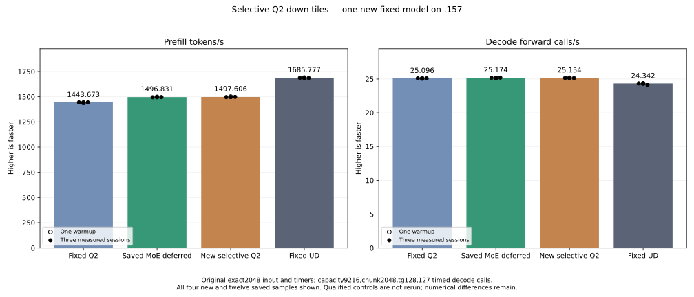

<!-- SPDX-License-Identifier: MIT -->
# Selective Q2 down tile composition

The candidate starts from saved MoE-deferred PP 1496.830907 / TG 25.17435733,
with fixed Q2 1443.672867 / 25.09595499 and UD 1685.777092 / 24.34174251.
The unchanged original exact2048 input, capacity 9216, chunk 2048, one warmup
and three measured sessions, tg128 / 127 timed decode calls and 15-second
waits outside timers define the comparison. The full PP/TG context-curve target
remains; no full sweep precedes fixed-point parity.

The retained scaled-tile component already measured 48/64/128-row Q2 kernels.
Tile64 saved 4.491455% at 64 active experts / 320 rows each, but regressed
3.507319% at 128 active / 160 rows and 0.395792% at 512 active / 40 rows.
Tile128 regressed all three. All 32 operator width replays and six benchmark
outputs were exact; strict independent numerical failures remain. This
experiment reuses those qualified bytes and actual timings without rerunning
the component or changing its original rejection.

The existing model already mixes 128/64 gate/up tiles. Its Q2 down projection
still uses 48-row tiles throughout. The new owned C17 policy chooses 64 for
an expert only when its 16-padded bucket has at least 256 rows and its total
64-row reservation does not exceed its 48-row reservation. Remaining buckets
use 48. Both spans contain complete experts, so their outputs are disjoint;
the original activation packing, inverse scales, per-output K accumulation,
gate/up maps and all numerical kernels remain unchanged.

The map validates bounded expert/token counts, total routes and output
capacity before writing anything. Failure preserves the caller's map and
span metadata. Descriptors encode expert in bits 0..15 and width-relative
tile index in bits 16..30. The C17 fixtures independently enumerate live and
padded row coverage, width ownership, exact buffer capacities, sentinel guards
and preserved outputs on rejection. They exhaust bucket lengths and split
positions through 4096, reproduce all three saved synthetic distributions,
cover a mixed hot/cold distribution and test the maximum 512×4096 bound.
These host fixtures execute no model or GPU numerical forward.

The new down map occupies the existing reservation, followed by the unchanged
gate/up spans. No device allocation, stream, synchronization, weight conversion
or model-state precision change is added. A bounded 256-entry host record stores
histograms and selected/reserved row counts. It emits JSON only at executor
teardown, after the original tester's complete event and outside PP/TG timers.
The map preparation and record copies remain part of actual model execution.
Truncation must be explicit if calls exceed record capacity.

Five files change in a 1027-file provider: executor source/header, provider
CMake and the two owned C17 policy files. Every numerical kernel is exact to
the saved parent. C17 and executor syntax checks pass; local launcher scope
guards pass 81/81. The frozen plan permits one new original-weight model with
its own MMQ build, performance retained independently of numerical acceptance.
It excludes old component/model-control reruns, curve, dependencies, tuning,
deployment and cleanup. A fresh coordinated window is required for GPU work.

The `.157` host capsule passes 25/25 Debug and 25/25 ASan/UBSan, including the
new exact-capacity map fixture. All six command exits are zero; seven artifacts
and 29 frozen fixtures verify. No GPU or model is opened by this gate. Parent
and old component result hashes remain unchanged; no performance or quality
acceptance is inferred from CPU success.

The one new original-weight model completes with all four commands exiting
zero. Its 26 artifacts, 29 frozen fixtures and 1027 provider files verify.
No qualified comparator or old component is rerun.

| Sample | Prefill seconds | Prefill tokens/s | Decode seconds | Decode forward calls/s |
| --- | ---: | ---: | ---: | ---: |
| Warmup | 1.364813316 | 1500.571526 | 5.044581668 | 25.17552661 |
| Measured 1 | 1.368540619 | 1496.484629 | 5.048945594 | 25.15376679 |
| Measured 2 | 1.367515843 | 1497.606050 | 5.048985230 | 25.15356932 |
| Measured 3 | 1.366290923 | 1498.948698 | 5.052048869 | 25.13831582 |

| Fixed comparison | Median prefill tokens/s | Median decode forward calls/s |
| --- | ---: | ---: |
| Saved fixed Q2 | 1443.672867 | 25.09595499 |
| Saved MoE parent | 1496.830907 | 25.17435733 |
| New selective Q2 down | 1497.606050 | 25.15356932 |
| Saved fixed UD | 1685.777092 | 24.34174251 |

Median PP is +0.051786% versus parent, with overlapping measured ranges.
This marginal result is retained without a demonstrated stable increment or
default promotion. TG differs by -0.082576%; the selector changes large-batch
prefill, so no decode optimization or regression is attributed to it. Overall
PP is +3.735831% over fixed Q2 and 11.162273% below fixed UD, needing 12.564789%
more candidate throughput for that fixed point. Full-curve parity remains open.

All 21 input/output/full-logit files are byte-exact to the parent. Nine within-arm
replays are exact; all 128 output tokens match original Q2/UD. The eight large
logit differences versus original Q2 remain identical to the parent's, with
maximum matched-history KL 0.001256655. The new map adds no observed drift at
these inputs. The old independent component failures and task-quality gate
remain; no tolerance or golden is changed. Maxima including compilation are
CPU 84.375 C and GPU 76 C; the 51 runtime library hashes are retained.

All 192 routing records (48 layers × four sessions) appear after the original
complete event. Their histograms and choices replay exactly across sessions.
The first session routes 983040 actual rows, selecting 281062 rows (28.591105%)
in 452 expert buckets, averaging 9.416667 selected experts per layer. Original
down descriptors total 31184; the candidate uses 25039 narrow and 4515 wide,
29554 total (-5.227040%). Reserved rows fall from 1496832 to 1490832 (-0.400847%).
These are map/work-reservation counts, not measured lane occupancy or stage
timing. Extra split launches and preparation remain in actual PP wall time.
The limited change in total reserved work is consistent with the marginal PP
difference; the records do not measure the individual causes of that difference.

The additive recovery update re-verifies all nineteen original report hashes.
All eleven families now have a disposition: five already in fixed Q2, five
with new measured compositions and one measured regression. No selective model
integration remains pending in that inventory. This does not establish nineteen
false failures, additive speedups, numerical acceptance or completed quality.

Admission at 2026-10-05T00:15:11.797836Z uses checkpoint `83cc244` after core's
coordination acknowledgement and fresh lease/KFD/process/model/thermal checks.
Release at 2026-10-05T00:21:01.418692Z verifies 596 retired identities / 467
groups, empty KFD, four original leases free and six model stat tuples unchanged.
Canonical release and main/remote active/ready mirrors share SHA256
`34d41ad1eb66648c9822249b8a76eefc94fb70fa2463057f80fb38a581782399`.
Core acknowledges. No Q2 GPU job, reservation, waiter, restart or cleanup remains;
another GPU run requires fresh coordinated admission.

[Source and original kernel identities](../config/q2-scaled-selective-source.json),
[owned policy](../experiments/q2_scaled_tiles_map.h),
[coverage fixture](../tests/q2_scaled_tiles_map.c),
[composition patch](../experiments/q2-scaled-selective.patch),
[retained component and failures](../config/q2-scaled-tiles-results.json),
[static checks](../config/q2-scaled-selective-static.json),
[host receipt](../config/q2-scaled-selective-host-results.json),
[frozen model plan](../config/q2-scaled-selective-plan.json),
[model samples and complete replay](../config/q2-scaled-selective-model-results.json),
[all model samples CSV](figures/q2-scaled-selective-model.csv),
[all routing records CSV](figures/q2-scaled-selective-model-routing.csv),
[recovery update](../config/q2-rejected-recovery-scaled-update.json),
[window release](../config/q2-scaled-selective-window-release.json).

