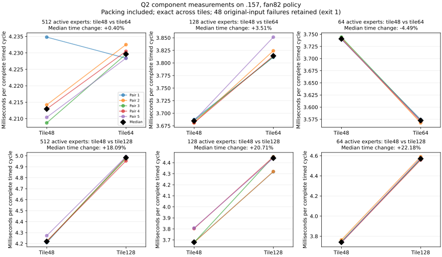

<!-- SPDX-License-Identifier: MIT -->
# Wider tiles for the scaled Q2 down projection

This component experiment is measured on `.157`; no model dispatch is selected.
It adds a 128-token tile to the existing scaled-input component interface and
compares it alongside the existing 64-token option against tile48.
No model dispatch is changed. The three Terminal-Bench variants remain frozen;
their full quality comparison remains incomplete after the recorded thermal stop.

The current measured candidate remains 1378.319 prefill tokens/s versus fresh
UD's 1682.975, an 18.10% deficit. Its operator and historical-reference KL
failures remain open. Tile128 regresses every measured routing; tile64 only
improves the most shared synthetic routing. Neither is selected globally.

## Why revisit the tile

The [scaled-input profile](../config/q2-scaled-input-profile-summary.json)
records 190.310 ms in 48 routed Q2 down calls and 22.098 ms in their packing
producer. The complete prefill has 1511.193 ms GPU busy time in a 1516.549 ms
kernel span (99.65%). Removing gaps alone offers little in this C1 trace;
GPU busy time does not establish ALU or bandwidth saturation.

The compensated route's 48-token tile carries two activation planes and two
F32 accumulator arrays. Its scaled successor uses one plane and one array,
reducing that specialization from 144 to 96 VGPRs, but still selects tile48.
A wider tile could reuse each decoded weight across more routed token rows.
It also increases register/LDS demand and wastes capacity on short expert
buckets. Only a measured complete producer/down cycle can resolve the tradeoff.

| Scaled tile | VGPRs | LDS bytes | Private scratch bytes |
|---|---:|---:|---:|
| 48, existing control | 96 | 18560 | 0 |
| 64, existing component option | 104 | 20608 | 0 |
| 128, new component option | 169 | 28800 | 0 |

These are static compiler resources. The existing power-of-two normalization,
F16 packing, four-value weight palette, ordered F32 WMMA sums, inverse scale,
output representation and original weight bytes are unchanged in source.
The subsequent GPU run confirms exact replay between the three tile widths.

The [retained-trace geometry analysis](../config/q2-scaled-geometry-analysis.json)
and [all 48 dispatch pairs](../config/q2-scaled-geometry-dispatches.csv) show
512–712 tile48 descriptors per down projection, median 669. The 20480 assigned
token/expert slots occupy 59.93–83.33% of those tiles' nominal capacity. This is
not ALU utilization: the kernel skips inactive 16-row WMMA tiles, while compiler
register/LDS reservations still reflect the specialization. The trace does not
contain per-expert histograms or hardware occupancy counters.

The existing paired gate/up selector uses tile64 in 29 layers and tile128 in
19. These are different operators and cannot establish which down tile is
faster. They do establish that the actual workload uses varying geometries;
the lower-register tile64 belongs in the down comparison. No new numerical
kernel or model dispatch is needed to expose that existing option.

Packing plus scaled down is 212.408 ms, or 14.056% of this diagnostic kernel
sum. The separate unprofiled comparison needs 268.976 ms (18.102%) lower
prefill wall time to reach UD. Those timing scopes cannot be subtracted from
each other; the shares indicate that optimizing this component alone is an
incomplete strategy. Gate/up alone costs another 265.461 ms in this trace;
HC and dense projections remain relevant. No zero-cost-component scenario is
reported as measured or predicted throughput.

## Comparison method

The [fixture](../tests/q2_scaled_tiles.cpp) reuses the original encoded-weight,
original-F32-input FP64 oracle and unchanged 0.002 limits. Sixteen operator cases
cover 17/63/64/65/127/128/129/257 tokens, 129 output rows, ordinary/tiny inputs
and noncontiguous expert IDs. All three geometries use the same compact routing data,
with independently constructed tile descriptors. Complete guarded outputs are
saved and compared byte for byte. Every packed half and row scale is checked
against the existing independent scalar conversion.

Existing scaled-input numerical failures are counted and retained; they do
not disappear when the two tiles agree. The original compensated/packed
controls still run. A runtime, unwritten-output or guard error stops the test.
Known numerical-tolerance failures permit the owner's requested timing samples
but leave the command exit nonzero.

The shaped timing uses 2048 tokens, ten selected experts, M2560 and logical/
stored K640/768. Active expert counts 512/128/64 keep 315/78.75/39.375 MiB of
weights active, all above 32 MiB. Five alternating sample pairs time eight
launches each. **Both arms include normalization and packing inside every timed
call.** Allocation, transfers and validation remain outside GPU-event timing.
All 52,428,800 outputs are compared in each of six cohorts (three routings
times two candidate widths), with 1024 independent FP64 sample dots per
cohort. Each candidate has its own freshly timed tile48 control. This remains
a synthetic component test, not model throughput.

The launcher restricts `scaled-tiles` to `scaled-tiles-check`; model, profile
and Terminal-Bench use is rejected before staging or SSH. The completed command
ran in the separately admitted component window after the quality interruption:

```sh
python3 tools/q2-remote.py scaled-tiles-check q2-scaled-tiles-r1 \
  --source-variant scaled-tiles
```

It completes at 2026-10-03 13:12:51 UTC with configuration/build/fixture exits
0/0/1. All original four leases are acquired fresh; CPU98 C inclusive and
exposed hardware thresholds apply under the owner's fan82 cooling policy.
The numerical exit is retained; no model experiment follows automatically.

## Measured result

Times include packing and projection, five alternating pairs of eight launches.
Each row has its own freshly measured tile48 control.

| Active experts | Candidate rows | Tile48 median, us | Candidate median, us | Time change |
| --- | ---: | ---: | ---: | ---: |
| 512 | 64 | 4212.953091 | 4229.627609 | +0.3958% |
| 512 | 128 | 4219.653130 | 4982.975006 | +18.0897% |
| 128 | 64 | 3684.784889 | 3814.022064 | +3.5073% |
| 128 | 128 | 3679.702520 | 4441.607952 | +20.7056% |
| 64 | 64 | 3740.573883 | 3572.567701 | -4.4915% |
| 64 | 128 | 3741.003990 | 4570.594788 | +22.1756% |

All five tile128 pairs regress in every routing. The 128-active/tile128
cohort has baseline drift: its paired median change is +17.3599%, versus
+20.7056% from the two arm medians. Both statistics and every sample are
retained; the rejection does not depend on choosing the larger figure.
Tile64 improves all five pairs only with 64 active experts, where fewer tile
descriptors amortize work over longer expert buckets. This component result
does not establish an adaptive model selector: the real trace lacks per-expert
histograms, and the other two routings show no gain. Global tile64/128 selection
is rejected. Register/LDS growth is a possible cost, not a measured occupancy
or bottleneck counter.

All 32 ordinary/tiny comparisons between widths are byte-exact. Every shaped
cohort compares 52428800 outputs exactly; its 1024 original-input FP64 dots
pass the unchanged .002 bounds. However, all 16 targeted operator inputs fail
those bounds for each of the three widths: **48 failures**, maximum relative
RMS .00562790610541 and error/peak .0029742355404. Width equality preserves
the base's error; it does not resolve it. Fixture exit 1 and supervisor state
FAILED are preserved, with no thermal/runtime failure reported.



The [complete report](../config/q2-scaled-tiles-results.json) and
[all timing samples](../config/q2-scaled-tiles-results.csv) include hashes,
exits, errors and paired statistics. `tools/analyze-q2-component-followups.py`
verifies 90 collected artifacts, the source capsule, all 1020 source files and
frozen fixtures; it also recomputes shaped error metrics from all saved FP64
dot samples. `tools/plot-q2-component-followups.py` produces standalone SVG/PNG.
Observed temperature maxima including compilation are CPU68.625 C/GPU52 C.
Fresh component-window closure at 13:25:01 UTC verifies eight processes/groups
retired, KFD empty and all four leases free. No full-model restart is queued.

## Provenance and checks

The [generator](../tools/prepare-q2-scaled-tiles.py) derives an isolated source
from the measured scaled-input tree at official Gufo pin
`f783fedb9bea2ec7de941f6da4e02f4a4596b29e`. It validates the base, refuses an
existing destination, adds four dispatch lines and preserves upstream notices.
The [patch](../experiments/q2-scaled-tiles.patch) reconstructs all 1020 files
with zero fuzz. No foreign project artifacts or model conversions are used.

Local device-only gfx1151 compilation, new/original fixture syntax and changed
file formatting pass. All 150 existing compiled bodies agree after normalizing
function-label ordinals, matching comment ordinals and comment/end-of-line
padding; exactly one new tile128 body appears. Raw assembly is not byte-identical.
The [static receipt](../config/q2-scaled-tiles-static.json) records commands,
actual exits, resources and the normalization scope. Initial source-anchor and
assembly-reader preparation errors are preserved in local evidence.

On `.157`, `q2-scaled-tiles-host-r1` passes 14/14 Debug and 14/14 ASan/UBSan
CTest cases, including the new source/mode rejection cases. Its six command
exits are zero and all seven artifacts are collected/hash verified. This host
cohort disables GPU visibility and opens no model; it does not execute the
prepared numerical fixture or qualify GPU memory safety.

The subsequent tile64 fixture extension passes local HIP host syntax and
formatting checks and verifies all 1020 kernel-source files unchanged against
the previous source manifest. The [follow-up receipt](../config/q2-scaled-geometry-static.json)
identifies the new fixture hash. The earlier host/static receipts retain their
original fixture identities. The GPU operator replay and six timing cohorts
subsequently complete as recorded above, without changing the frozen models.
