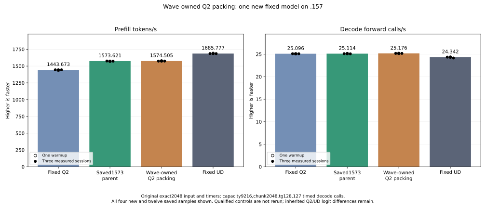
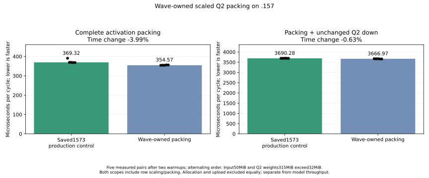

<!-- SPDX-License-Identifier: MIT -->
# Wave-owned scaled Q2 activation packing

The completed .157 experiment measures1574.505432 PP /25.17589001 TG,
nominal+0.056191% /+0.247877% against the retained shared-pair provider at
1573.621201 /25.11363913. Historical prefill ranges overlap: retain both sources
and the marginal result. Scalar decode is unchanged; its measured difference
is not causally assigned to this prefill kernel. The original exact2048/tg128
fixture, saved Q2 1443.672867 and UD 1685.777092 comparisons remain fixed.
Reaching UD requires another7.067086% PP; independent inherited F16 quality
and full-curve parity remain open.

| Sample | Prefill seconds | Prefill tokens/s | Decode seconds | Decode calls/s |
| --- | ---: | ---: | ---: | ---: |
| Warmup | 1.299454876 | 1576.045492 | 5.046100466 | 25.16794916 |
| Measured1 | 1.301179549 | 1573.956493 | 5.043858837 | 25.17913449 |
| Measured2 | 1.299163507 | 1576.398959 | 5.044572170 | 25.17557401 |
| Measured3 | 1.300725903 | 1574.505432 | 5.044508852 | 25.17589001 |

All21 complete parent model files and nine within-arm comparisons are exact.
All52 component output pairs are exact. Packing time falls369.315624 to
354.565889us (-3.993802%); packing plus unchanged down falls3690.278689 to
3666.972796us (-0.631548%). All five candidate samples precede every parent
sample in both component scopes. These are component times, not additive
model gains.

The independent scalar fixture exits1:110080 half-bit comparisons per arm
differ across24 extreme-input cases. Every reported difference is the original
and candidate GPU kernels producing positive zero for an expected negative
zero. Saved complete arrays account for every discrepancy; scales and all
nonzero-value checks have no reported mismatch. The production packing case
passes the independent oracle. The failed exit and strict expected values are
preserved; no rerun or altered golden turns this into a pass. The source-level
signed-zero intent does not establish compiled signed-zero preservation.
[Saved-array diagnosis](../config/q2-scaled-wave-pack-signed-zero.json).

Host/component/model finish and collect before release16:35:19.738986UTC,
SHA256`6abd77bc99a836750801e741cdbc313e047be39d7080b2ab7e5f3493abfefa35`.
Thirteen runtime commands preserve the component numeric1 and twelve zeros;
141 artifacts include104 complete arrays.77 fixtures/four manifests and1027
provider files verify.1035 retired identities/824groups,KFD empty,four original
leases free and seven unchanged model stat tuples close the window. Mirrors
match and core is notified. CPU/GPU peaks:65.375/41C component,84.5/74C model,
including builds; no thermal stop. No job,reservation,restart or cleanup remains.

[Disposition](../config/q2-scaled-wave-pack-disposition.json),
[model result](../config/q2-scaled-wave-pack-model-results.json),
[component result](../config/q2-scaled-wave-pack-component-results.json),
[final audit](../config/q2-scaled-wave-pack-final-audit.json),
[complete model CSV](figures/q2-scaled-wave-pack-model-wrapped.csv).

The following records the implementation and preparation boundaries.

The active IQ2 gate/up kernel already fuses SwiGLU. Its 640-value output row
is produced by ten independent64-column blocks. Moving the existing whole-row
maximum into that epilogue would require cross-block coordination or a changed
scaling/accumulation contract. This preparation preserves that contract and
instead changes ownership inside the subsequent packing pass.

One wave owns each full640-value row, and eight waves prepare eight independent
rows per256-thread block. Each lane retains five float4 values, reduces its
absolute maximum within the wave, broadcasts the original bounded power-of-two
multiplier and writes four rounded halves per group. Entire tail waves return
together. Unaligned input/output bases retain bounded accesses; the final input
row ends at the allocation boundary in the fixture. No additional allocation,
stream, buffer layout, public ABI, state or metric changes are introduced.

At2048 tokens and ten experts/token the packing grid falls from20480 to2560
blocks. The saved1571 diagnostic attributes17.096259ms to the original packing
pass; it does not profile this candidate or predict an additive model gain.
The whole F32 row is still read once and the F16 row written once.

Same-flag gfx1151 compilation replaces one kernel and preserves the other161
production instruction/operand/resource bodies. Packing resources change from
13 to30 VGPRs,36 to0 LDS bytes, and retain zero private bytes. Two block barriers
become zero; the static instruction body grows174 to238 instructions because
each lane owns more values and the bounded alignment paths remain. These are
static counts, not dynamic instruction totals or measured GPU throughput.

The fixture has25 complete packing cases with full independent scalar
double-ldexp/integer RN-even checks, two complete unchanged-down replays and28
alternating timing samples. Ragged row counts, signed zero, subnormals, large
finite values, halfway ties and input/output alignment are covered. Production
input52,428,800bytes and512-expert weights330,301,440bytes independently exceed
32MiB. Packing-only and packing-plus-down have separate scopes; original-model
timing follows even after a safe numerical or timing rejection. A guard fault,
unwritten/nonfinite result or device error prevents further device work.

Local host/device fixture compilation and132 launcher guards pass. Separate
.157 host27/27 Debug and27/27 ASan/UBSan checks finish at16:21:56.353618UTC,
with six zero command exits and seven collected artifacts. The shared formatter
retains its88 findings in seven unchanged provider files. The initial new-file
format check used the editing-root fallback style; its failed result and source
are retained. Regeneration with the provider style passes the changed-file
check and preserves every compiled instruction/resource body. The initial
local staging helper import failure is also retained and corrected; it launches
no remote process.

[Source](../config/q2-scaled-wave-pack-source.json),
[static evidence](../config/q2-scaled-wave-pack-static.json),
[host evidence](../config/q2-scaled-wave-pack-host-results.json),
[plan](../config/q2-scaled-wave-pack-plan.json).
