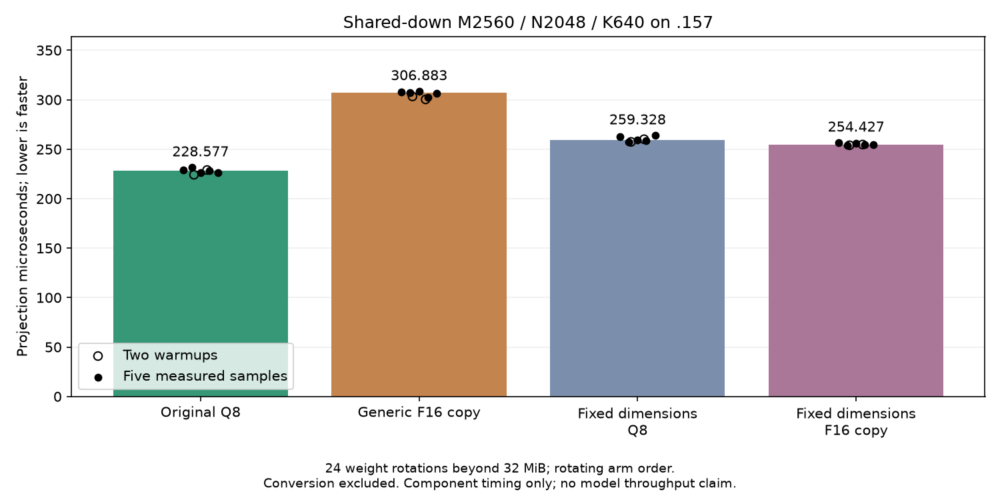

<!-- SPDX-License-Identifier: MIT -->

The subsequent [BN64 component campaign](Q2-SHARED-DOWN-N64.md) is now
complete: numerical checks pass but fixed F16 remains 2.811486% slower than
its original Q8 control. The preparation statements below are historical;
no shared-down alternative has become the retained model path.
# Shared-down weight caching: measured component and narrower-tile follow-up

The four-arm GPU component completes on .157 at 2026-10-05T22:59:42.524472UTC.
Every numerical check passes, but none of the new paths beats the original Q8
projection. Median latency is 228.576839us for original Q8, 306.882997us for
generic F16 (+34.258133%), 259.328286us for fixed Q8 (+13.453440%), and
254.426618us for fixed F16 (+11.309011%). These are projection times; no new
whole-model prefill or decode result is inferred. Keep saved 1585.308983 PP /
25.16079073 TG. Fixed Q2 remains 1443.672867/25.09595499 and fixed UD remains
1685.777092/24.34174251, with no saved model rebuilt or rerun.

All 126 complete output comparisons are exact; all 168 independent sampled FP64
checks and 42 integer-formula mirror checks (68,812,800 values) pass. Guards,
required stores, original inputs, mirrors and post-timing output replays pass.
No independent task-quality qualification follows from these synthetic checks.

## All 28 component timing samples

M2560/N2048/K640 is the only timed shape. Each arm has two warmups and five
measured repetitions in rotating order. Twenty-four weight sets occupy
41,779,200 Q8 bytes or 78,643,200 F16 bytes, each beyond 32MiB. Conversion,
allocation, validation and readback are outside the timers. Other numerical
shapes are 96/97/127/129/1025/2049; they do not supply headline timings.

| Session | Original Q8, us | Generic F16, us | Fixed Q8, us | Fixed F16, us |
| --- | ---: | ---: | ---: | ---: |
| Warmup 1 | 224.141875903 | 303.323050340 | 257.373293241 | 253.993332386 |
| Warmup 2 | 228.960176309 | 300.331334273 | 260.063290596 | 254.681666692 |
| Measured 1 | 228.965163231 | 307.539661725 | 262.383282185 | 256.569961707 |
| Measured 2 | 231.561799844 | 306.882997354 | 257.183293502 | 253.594994545 |
| Measured 3 | 226.538499196 | 308.549622695 | 259.328285853 | 256.051659584 |
| Measured 4 | 228.576838970 | 302.139699459 | 258.473336697 | 254.426618417 |
| Measured 5 | 226.103544235 | 306.242962678 | 263.903299967 | 254.278282324 |
| Median measured | 228.576838970 | 306.882997354 | 259.328285853 | 254.426618417 |

[CSV](figures/q2-shared-down-component.csv),
[SVG](figures/q2-shared-down-component.svg),
[component report](../config/q2-shared-down-component-results.json).

The fixed F16 path is approximately 1.89% faster than fixed Q8, but both remain
slower than original Q8. The tested cache path therefore has no net component
gain. This does not exclude a different cache implementation. Compiler evidence
shows spills in the new paths and none in the original; hardware counters have
not established how much of the regression comes from spills, weight bytes or
load scheduling. Preserve all measured paths and investigate register pressure.

## Follow-up: 64-token blocks, not yet run on the GPU

The narrower provider now has isolated launcher routing and a separate
[92-fixture/nine-manifest campaign](../config/q2-shared-down-n64-component-plan.json).
Seven focused launcher checks,142 existing checks and three analysis checks
pass. Fresh .157 host gates pass27 Debug and27 ASan/UBSan checks, with a new
capsule binding the changed launcher/test bytes. The component analyzer,
plotter and finalizer accept an explicit campaign name; numerical criteria and
old reports are unchanged. GPU admission and results remain separate.

The separately prepared `shared-down-n64` provider changes only the two fixed
paths from 128 to 64 token columns per CTA. Model upload/dispatch remains
unchanged; original Q8 and generic F16 controls remain exact. Complete source
reconstruction and 1028-file inventory checks pass, as do host/device fixture
syntax checks. Static comparison preserves 164 surrounding kernels exactly.

| Static property | Fixed Q8,128 | Fixed F16,128 | Fixed Q8,64 | Fixed F16,64 |
| --- | ---: | ---: | ---: | ---: |
| Instructions | 812 | 690 | 567 | 439 |
| VGPRs | 256 | 256 | 194 | 218 |
| Scratch bytes/thread | 68 | 68 | 0 | 0 |
| LDS bytes | 24576 | 24576 | 20480 | 20480 |
| Compiler occupancy field | 5 | 5 | 7 | 6 |

The narrower paths eliminate compiler spills and reduce static resource use,
while doubling token CTAs and reducing weight reuse. Their speed and numerical
behavior still require the original GPU fixture. Source and launcher preparation
do not reserve a GPU window. Only a measured useful implementation
should progress to separately qualified model integration against saved 1585 and
the unchanged fixed Q2/UD references; these preparation results do not replace
the required original2048/tg128 model test.

[Narrower source](../config/q2-shared-down-n64-source.json),
[assembly comparison and actual local exits](../config/q2-shared-down-n64-static.json).

## Qualification and closure

Six focused launcher checks, 142 existing launcher checks and three analyzer
checks pass. New .157 host gates pass 27 Debug and 27 ASan/UBSan tests. The earlier
host gate is not reused because runtime fixture bytes changed. The initial
local launcher-test exit1 used an invalid label lacking the required `q2-`
prefix; its source/log are retained and the corrected six tests pass. It was
not a numerical or GPU failure. All nine runtime exits are zero, 11 artifacts
verify, and the 92 fixtures/eight manifests/helper/1028 component files bind.
The CSV/SVG/PNG preserve all 28 timings; the PNG is visually reviewed.

Admission 22:58:57.751850UTC from checkpoint 677bba9 follows fresh release fc00b067
and persistent Core non-use verification. Host and component collection precede
release 22:59:58.189609UTC, SHA256
`c4efdddb7bad7a90977ef0d4fe09a70dc18f8916a81562156126a3a945179122`.
Release verifies 1160 retired identities/925 groups, empty KFD, four unchanged
original leases free, and seven unchanged model stat tuples. Canonical/main/
remote release-active-ready mirrors agree and Core receives closure. Component
CPU/GPU peaks are 63.125/39C. No Q2 job, build, client, lease, waiter, reservation,
restart or remote cleanup remains. Future GPU work needs a fresh admission.

[Frozen plan](../config/q2-shared-down-component-plan.json),
[staging](../config/q2-shared-down-component-staging.json),
[final audit](../config/q2-shared-down-component-final-audit.json),
[release](../config/q2-shared-down-component-window-release.json).

## Source audit and original preparation

The expert-cache source review distinguishes resident encoded weights from
persistent dequantized copies. Qwen `DeviceModel::Upload` copies every layer's
`ffn_gate_exps`, `ffn_up_exps` and `ffn_down_exps` through `Uploader::Copy`
into owned HIP allocations, kept until model destruction. The retained Q2
provider has no persistent dequantized routed-expert cache or LRU eviction.
Expert weights therefore do not require another disk read for each token.

In independently fetched official Gufo revision
`f783fedb9bea2ec7de941f6da4e02f4a4596b29e`, DS4 separately maintains resident
model tensor ranges and optional Q8-to-F16 copies. Its
`hip_q8_f16_cache_allowed` explicitly includes shared gate/up/down tensors;
`hip_q8_f16_ptr` reuses copies subject to memory budget and falls back to Q8
when expansion is unavailable. This is not a general cache of all dequantized
routed Q2 experts. The comparison concerns that pinned upstream source, not
the other agent's live DS4 branch. Both mechanisms cache weights, not KV state.

This is a new component experiment for M2560/N2048/K640 shared down, excluded
from the already measured [large Q8 mirror trial](Q2-Q8-MIRROR.md). That earlier
trial lost2.164926% whole-model PP; it is not repeated or relabeled here.
The new providers derive from saved1580.226725 PP /25.10411864 TG. Neither
changes model upload, executor dispatch, resource ownership or measured speed.

Four arms separate weight caching from indexing changes:

| Arm | Weight representation | Addressing/epilogue |
| --- | --- | --- |
| Original Q8 | Original encoded Q8 | Existing generic dense kernel |
| Generic F16 | Persistent GPU-derived F16 copy | Same generic geometry and single K16 accumulation |
| Fixed Q8 | Original encoded Q8 | M2560/K640 constants, proven full-row stores |
| Fixed F16 | Persistent GPU-derived F16 copy | Same fixed-shape addressing as fixed Q8 |

All arms use BM256/BN128/BK1/WM4/WN2. Half-weight arms explicitly retain the
original Q8 single K16 accumulation chain; the ordinary unquantized-F16
two-chain route is not substituted. The fixed arms keep every token-tail
check and twenty K32 blocks. Integer enumeration verifies2560 weight-row
owners and20480 float4 row-coordinate cases over the ten complete row tiles.

The model currently keeps compressed expert weights resident already. This
proposal would additionally keep shared-down weights dequantized. A later
model integration would need48 mirrors totaling150MiB payload plus192KiB
allocation tails, retaining original Q8 for decode. The current component
provider allocates no such model memory and is not selectable by the executor.
Resource admission, publication/failure handling and model qualification remain
future work if a component candidate is useful.

## Local compilation evidence

| Static property | Original Q8 | Generic F16 | Fixed Q8 | Fixed F16 |
| --- | ---: | ---: | ---: | ---: |
| Instructions | 3056 | 3067 | 812 | 690 |
| VGPRs | 224 | 256 | 256 | 256 |
| Scratch bytes/thread | 0 | 64 | 68 | 68 |
| LDS bytes | 24576 | 24576 | 24576 | 24576 |
| Static occupancy field | 6 | 5 | 5 | 5 |
| Static WMMA opcodes | 32 | 32 | 64 | 64 |

The fixed arms eliminate generic scalar-store fallbacks and expose constants,
but register spilling remains. Their compiler output has32 matrix instructions
in the loop and32 in the peeled final stage/epilogue. Static instruction totals
are not executed-instruction counts or throughput; no speedup is established.
The initial analyzer wrongly required32 static WMMA opcodes for every arm. Its
exit1 and source are preserved; the corrected report records the actual counts
without modifying either candidate. This was not a numerical test failure.

All162 retained production kernels are instruction/operand/resource-exact to
saved assembly. The initial generic mirror and converter remain exact in the
fixed provider. Converter assembly also matches the previously qualified large
mirror converter. Both separate1028-file providers and complete patches remain.
Host and gfx1151 device syntax checks pass for the final four-arm fixture;
this is not GPU execution, sanitizer coverage or numerical qualification.

## Prepared GPU scope

The fixture covers96/97/127/129/1025/2048/2049 tokens. It prepares126 complete
candidate/reference output comparisons,168 independent sampled FP64 checks
with24 outputs each, and42 complete integer-formula mirror checks totaling
68,812,800 values. The FP64 RMS/scaled-maximum limits remain0.002. Output
guards, required stores, original inputs and mirror immutability are checked;
failed outputs are retained and timed outputs are checked against numerical
replay. These counts describe the prepared scope; zero GPU checks have run.

Only2048 is timed. Twenty-four distinct weight sets rotate39.84375MiB Q8 or
75MiB F16 weights, each exceeding the32MiB MALL. Four arms rotate their order
over two warmups and five measured repetitions:28 event records,20 measured.
Events include all24 projection launches and exclude conversion, allocation,
input generation and readback. This measures a projection with amortized
conversion, not the complete shared-expert cycle or canonical model throughput.
Safe numerical rejection returns1 after retaining timings; memory/write/runtime
failures return2 and stop dependent work.

The already frozen SSM row-group campaign stays first. Its88 fixtures, five
manifests and window helper remain unchanged. This new component is not yet
wired to CMake or the remote launcher and grants no .157 admission. At
20:48:42UTC on5 October2026, the original Core-19 supervisor and runner remain
alive on .157. No Q2 host/build/client/lease/reservation is started there.
GPU execution requires actual CPU closure and fresh coordinated handover.

[Initial source](../config/q2-shared-down-mirror-source.json),
[four-arm source](../config/q2-shared-down-fixed-source.json),
[assembly, fixture contract and actual command exits](../config/q2-shared-down-static.json),
[fixture](../tests/q2_shared_down_mirror.hip).
The original fixed Q2/UD/1580 model results remain unchanged, and no full
context curve or Q4 run is admitted by this preparation.
