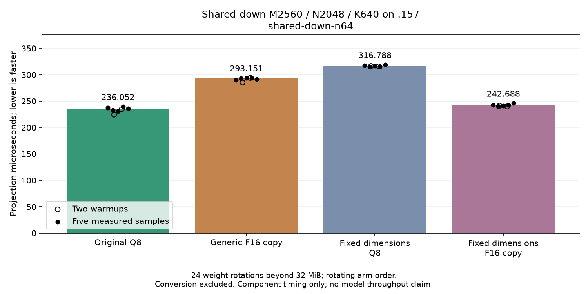

<!-- SPDX-License-Identifier: MIT -->
# Shared-down 64-token tiles: completed component experiment

The spill-free candidate does not beat the original Q8 projection. Original
Q8 measures 236.051699us; fixed F16 is 242.688258us (+2.811486% time), fixed
Q8 316.788336us (+34.202947%), and generic F16 293.150504us (+24.189110%).
These are component times, not prefill throughput. Keep the measured original
model at **1585.308983 PP /25.16079073 TG**; fixed UD remains 1685.777092 PP.
The additional PP needed is 6.337447%; no full-curve or Q4 run follows.

The two fixed paths change only the token tile from 128 to 64. Scratch falls
from 68 bytes/thread to zero; Q8/F16 VGPRs fall from 256 to 194/218 and LDS
from 24576 to 20480 bytes. Static instructions fall from 812/690 to 567/439.
All 164 surrounding kernels remain instruction/operand/resource exact.
Smaller tiles also double the token-grid blocks and reduce reuse per block.
This is a plausible cost, not a measured hardware-counter diagnosis. Removing
spills alone did not deliver a net component gain.

## Complete timings and numerical evidence

M2560/N2048/K640 only is timed. Each sample rotates 24 distinct weight sets,
41779200 Q8 bytes or 78643200 F16 bytes, both beyond 32MiB. Four-arm order
rotates; there are two warmups and five measured repetitions per arm.
Conversion, allocation, readback and validation are outside the timer.
The original and generic controls are literal arms inside this new component;
no saved qualified model executable was rebuilt or rerun. Comparisons below
use this campaign's original Q8, not the earlier BN128 campaign's 228.576839us.

| Session | Original Q8, us | Generic F16, us | Fixed Q8 BN64, us | Fixed F16 BN64, us |
| --- | ---: | ---: | ---: | ---: |
| Warmup 1 | 224.451959133 | 285.365660985 | 316.545009613 | 241.338253021 |
| Warmup 2 | 234.766741594 | 294.105509917 | 315.766712030 | 240.021626155 |
| Measured 1 | 237.440049648 | 289.878924688 | 317.450006803 | 242.688258489 |
| Measured 2 | 232.855081558 | 293.150504430 | 315.128366152 | 240.381578604 |
| Measured 3 | 230.588455995 | 293.625493844 | 316.788335641 | 240.941623847 |
| Measured 4 | 239.738285542 | 294.092158477 | 315.425038338 | 242.886543274 |
| Measured 5 | 236.051698526 | 291.820506255 | 319.143295288 | 246.154785156 |

All 126 complete output pairs are exact; 168 sampled independent FP64 checks
and 42 full integer-format checks (68812800 values) pass. Numerical shapes
are 96/97/127/129/1025/2048/2049. Guards, required stores, original inputs,
F16 copies and post-timing replays pass. This is synthetic operator evidence;
it does not independently qualify original-model task quality.

[CSV](figures/q2-shared-down-n64-component.csv),
[SVG](figures/q2-shared-down-n64-component.svg),
[complete result](../config/q2-shared-down-n64-component-results.json).
The PNG was visually inspected after export.

## Closure and next target

Fresh host checks pass 27 Debug and 27 ASan/UBSan tests; host evidence is not
reused for this campaign because its launch fixtures changed. All nine runtime
commands exit zero and 11 artifacts verify. The frozen 92 fixtures, nine
manifests, helper and 1028 provider files match. No local failed command is
hidden by a retry. No model cache allocation or model dispatch is integrated.

Admission is 2026-10-05T23:12:20.203988UTC at checkpoint 9b7851e. Component
completion is 23:13:05.950401UTC, collection precedes release at
23:13:40.480692UTC. Release verifies 1171 retired identities/934 groups,
empty KFD, four unchanged original leases free and seven unchanged model stat
tuples. Canonical/main/remote release-active-ready mirrors agree; Core has
received closure. CPU/GPU peaks are 67/40C across host and component.
Release SHA256:
`973388223cae971705e3027fd281af760ee38bce247c2468848b89a88055a6e9`.
No Q2 job, build, waiter, reservation, restart or cleanup remains.

Both shared-down experiments remain available. The saved 1571 profile places
all other Q8/F16 projections, including shared-down, within about 14.83ms after
SSM/wide-output/fused-attention attribution. This is an upper bound from an
older executable, not a fresh 1585 measurement. Small shared-down tuning alone
cannot explain the remaining model gap. Next measure the prepared compact-LDS
SSM variant: the same profile attributes 160.22ms to fused SSM projection.
It trades 49152→32768 LDS bytes against 80→160 K-loop barriers. Its numerical
and performance outcome must be measured, including original-model throughput.

[Source](../config/q2-shared-down-n64-source.json),
[static evidence](../config/q2-shared-down-n64-static.json),
[plan](../config/q2-shared-down-n64-component-plan.json),
[final audit](../config/q2-shared-down-n64-component-final-audit.json),
[release](../config/q2-shared-down-n64-component-window-release.json).
Previous [BN128 experiment and expert-cache audit](Q2-SHARED-DOWN-MIRROR.md)
remain separate evidence.
