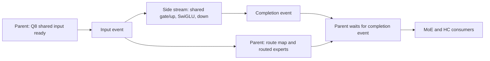
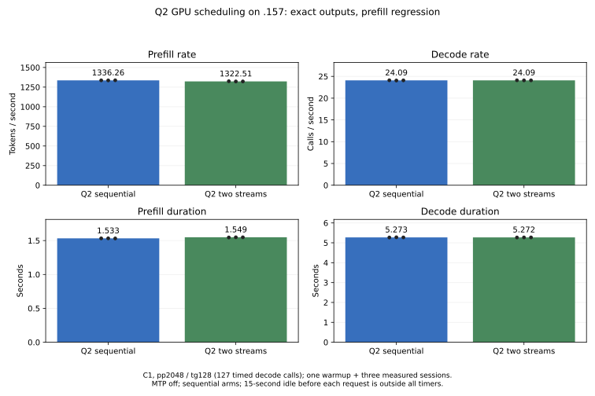
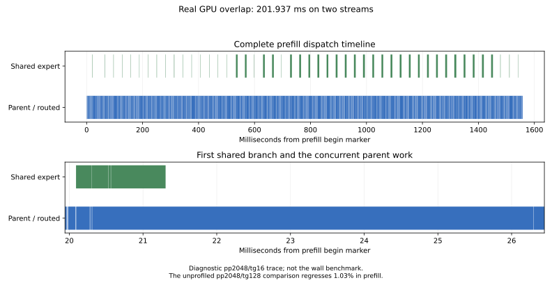

<!-- SPDX-License-Identifier: MIT -->
# C17-controlled shared/routed GPU overlap

This isolated experiment implements the independent branch identified by the
[GPU dataflow audit](Q2-GPU-DATAFLOW.md). The numerical executor remains the
explicit transitional Gufo adapter. LIE owns a bounded C17 lifecycle; HIP owns
the stream/event calls and unchanged numerical launches. This is not yet a
general GPU resource scheduler or an integration into the HTTP server.

## Execution and resource contract

The candidate derives from the retained `hc-up-chains` source and official
Gufo pin `f783fedb9bea2ec7de941f6da4e02f4a4596b29e`. The
[source manifest](../config/q2-shared-overlap-source.json),
[generator](../tools/prepare-q2-shared-overlap.py) and
[patch](../experiments/q2-shared-overlap.patch) retain provenance and reproduce
the exact experiment. All eight HIP/MMQ numerical sources remain byte-identical.
The patch reconstructs all 1022 source files with zero fuzz.

Only original Q2 prefill at the checked model geometry is admitted: 96 or more
tokens within the executor's batch capacity, HC count four, hidden width 2560,
shared/routed FF width 640, ten selected experts, IQ2 gate/up, Q2 down stored
K768, Q8 shared gate/up and the original F16 shared down route. Scalar decode,
other geometries, last-only output and the wide mixer retain their original
path. The prefill guard also excludes graph capture in this executor.



One nonblocking stream and two timing-disabled events are added per eligible
executor, with one branch outstanding at a time. No new tensor allocation is
introduced; HIP driver resource cost is not inferred to be zero. The shared
branch reads `x_q8t` and writes the existing shared gate/up, `shexp_half` and
`shexp_out` buffers. The selected routed branch reads `x_half` and writes its
separate `gate_e`/`down_e` allocations. Joining before the weighted sum/HC
consumer returns the shared output lifetime to the parent stream.

The [C17 lifecycle](../experiments/gpu_fork.h) has `IDLE`, `ACTIVE` and
`POISONED` states. `begin` orders input readiness and submits the branch;
`join` inserts the parent dependency without blocking the host. Successful
join means ordered lifetime transfer, not host-observed device completion.
`abort` drains both streams after partial launch, join failure or cancellation.
A failed drain poisons future admission and prohibits releasing owned buffers.
Callbacks cannot throw across C and remain alive through join/abort.

The [HIP adapter](../experiments/q2_shared_fork.hpp) bridges these callbacks.
Scoped cleanup drains active work on early return. The executor destructor
also attempts to synchronize both streams before freeing allocations. Actual
GPU faults, failed device synchronization and recovery of the entire model
owner remain unqualified; the injected error tests do not establish those
guarantees. No dynamic occupancy policy, cross-request fairness, MTP, prefix
cache or long-context qualification is added by this branch.

The diagnostic `shared_fork` event reports successful starts, successful joins,
drain calls and final state. Counters accumulate per executor on its single
host owner. Model checks require starts greater than zero, equal joins, no
drains and an idle final state. These counters prove submission and lifecycle
completion; only the device trace can demonstrate actual overlap.

## Validation and benchmark protocol

All runtime checks use `.157` with fresh original four-lease/process/thermal
admission, a maximum of 98 C inclusive or any lower exposed hardware limit,
and no foreign process or model mutation. Local checks are syntax, formatting
and source reconstruction only.

CPU Debug and ASan/UBSan each pass 13/13 tests, including lifecycle failure,
cancel, double-admission and poison cases. The GPU fixture passes 32 cases:
rows 96/97/129/2048, regular/tiny deterministic inputs, and normal join,
post-submission failure, join failure and cooperative abort. It compares
315,498,496 bytes across complete intermediate/final outputs and output guards.
Packed inputs are invalidated before every concurrent case. A real parent
consumer runs after the join; error cases additionally require both streams
complete. This is unchanged-kernel scheduling replay, not a new independent
numerical oracle or hardware fault test.

The full-model comparison uses fresh retained and candidate builds, including
MMQ, with C1 pp2048/tg128, MTP and prefix reuse off, capacity 9216, chunk 2048,
one warmup and three measured sessions. Fifteen seconds of idle before each
session are excluded from timing. All 21 saved input/token/logit files and
nine within-arm replay comparisons per arm are checked. A separate short
pp2048/tg16 profile is diagnostic and must not be mixed with unprofiled rates.
Exact replay against `hc-up-chains` does not resolve that development source's
earlier numerical differences from the qualified original Q2 port. Those
differences and the separate independent-quality gate remain open.

## Complete-model result

| Measurement | Retained sequential Q2 | Shared/routed overlap | Median change |
|---|---:|---:|---:|
| Prefill token/s | 1336.259526 | 1322.513714 | -1.02868% |
| Prefill seconds | 1.532636408 | 1.548566172 | +1.03937% |
| Decode steps/s | 24.08694614 | 24.09063990 | +0.01534% |
| Decode seconds, 127 calls | 5.272565450 | 5.271757020 | -0.01533% |

All 21 reference/candidate saved files are exact; eighteen within-arm replay
checks pass. The fresh reference also reproduces all 21 files of the retained
paired-up checkpoint. The candidate records 192 successful starts and joins,
zero drains and idle final state. The prefill ranges do not overlap, while the
decode ranges do. The added streams therefore do not meet the selection gate.
No fresh UD arm follows a regression. The original selected path remains
unchanged and Q2/UD parity remains unmet.

[The complete report](../config/q2-shared-overlap-model-results.json) preserves
warmup and every measured sample, command duration, binary identity, thermal
maxima and full-file replay results. Three measured samples are:

| Arm | Prefill token/s | Decode steps/s |
|---|---|---|
| Sequential | 1336.259526; 1335.845602; 1337.127370 | 24.10692088; 24.05574946; 24.08694614 |
| Overlap | 1324.825005; 1322.253385; 1322.513714 | 24.10543676; 24.09063990; 24.08968171 |

The complete model timing is authoritative for this workload. Submission
counters and summed kernel durations cannot substitute for that result.



The [CSV](figures/q2-shared-overlap-model.csv) contains every measured rate
and duration. The [fixture receipt](../config/q2-shared-overlap-fixture.json)
retains every original-shape lifecycle case.

## Observed GPU concurrency

The [candidate diagnostic](../config/q2-shared-overlap-profile.json) records
1763 parent-stream dispatches and 192 shared-stream dispatches in prefill.
The latter are 96 Q8 gate/up projections, 48 SwiGLU operations and 48 shared
down projections. The measured phase has two streams active for **201.937003
ms**, out of a 1557.448302 ms span. Shared kernels total 202.534320 ms, so
almost all their duration overlaps parent work. Decode retains one stream.

| Prefill diagnostic quantity | Milliseconds |
|---|---:|
| Sum of all dispatch durations | 1754.841082 |
| Union of occupied GPU intervals | 1552.903385 |
| Overlap of distinct streams | 201.937003 |
| Gaps between occupied intervals | 4.544917 |
| First dispatch to last completion | 1557.448302 |

All fifteen saved profile input/token/logit files reproduce the earlier
retained Q2 profile. That earlier trace establishes the sequential source's
behavior but is not a fresh paired timing control. Profiling changes the
execution contract and instrumentation overhead; its span cannot overturn
the separately measured pp2048/tg128 regression. Hardware counters are still
needed to distinguish bandwidth/compute contention, cache effects and event
cost. The observed overlap alone does not identify which causes the loss.



This provides a concrete rule for subsequent GPU management: ready regions
also need a measured resource-compatibility gate. For this exact workload the
measured choice remains sequential. The C lifecycle exposes that decision
boundary, but no automatic occupancy/admission controller is claimed ready.
The next algorithm review should still prioritize HC down, routed down and
activation preparation from the [attribution](Q2-GPU-DATAFLOW.md), alongside
separate transfer/PLE preparation where overlap already has measured value.

## Closure and reproduction

[Validation](../config/q2-shared-overlap-validation.json) verifies five runners,
24 zero command exits, 89 artifacts, all source files and 50 guard/fixture files
per archive. GPU/CPU maxima are 79/94.375 C. Model witnesses remain unchanged.
[Release](../config/q2-shared-overlap-window-release.json) at 09:01:58 UTC and
[observer retirement](../config/q2-shared-overlap-observer-retired.json) at
09:02:30 UTC establish that owned jobs and groups are absent, KFD is empty and
the four original leases are free. Failed outgoing thread notification is
recorded; the agreed ledger/registry fallback preserves handover.

On the exact retained source and with a newly coordinated `.157` window:

```sh
python3 tools/prepare-q2-shared-overlap.py
python3 tools/q2-remote.py cpu q2-shared-overlap-host-r1
python3 tools/q2-remote.py shared-fork-check q2-shared-overlap-check-r1 --source-variant shared-overlap
python3 tools/q2-remote.py q2-bench2k q2-shared-overlap-reference-r1 --source-variant hc-up-chains --rebuild-mmq
python3 tools/q2-remote.py q2-bench2k q2-shared-overlap-candidate-r1 --source-variant shared-overlap --rebuild-mmq
python3 tools/q2-remote.py q2-profile q2-shared-overlap-profile-r1 --source-variant shared-overlap
```

The generator and runner refuse overwriting existing destinations; use new
labels and preserve the original evidence. Collect each completed arm with
`q2-remote.py collect LABEL`. The saved-data readers
`analyze-q2-shared-overlap.py` and `analyze-q2-stream-overlap.py` verify the
model protocol and compute distinct-stream interval unions without GPU work.
