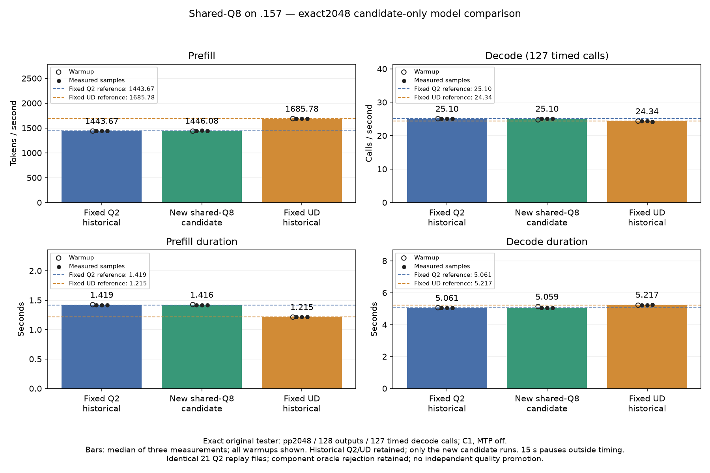

<!-- SPDX-License-Identifier: MIT -->
# Shared-Q8 candidate on the fixed model reference

The owner requests the complete model measurement despite the retained R3
format-oracle rejection, then explicitly limits this campaign to the new
candidate. The historical Q2/UD controls are read and verified locally; none
is relaunched. Source checkpoint `f3c78b4`, original Q2 weights on `.157`.

The unchanged direct executor processes exactly2048 input tokens, emits128
outputs and times127 decode calls. MTP is disabled, capacity9216, chunk2048,
one warmup and three measurements, with15second pauses outside timers.

| Sample | PP token/s | TG calls/s | PP seconds | TG seconds |
|---|---:|---:|---:|---:|
| Warmup | 1436.624960 | 24.74499304 | 1.425563426 | 5.132351413 |
| Measurement 1 | 1445.840323 | 25.11034503 | 1.416477302 | 5.057676421 |
| Measurement 2 | 1447.807929 | 25.09939089 | 1.414552275 | 5.059883747 |
| Measurement 3 | 1446.083285 | 25.10338822 | 1.416239314 | 5.059078038 |
| New candidate median | 1446.083285 | 25.10338822 | 1.416239314 | 5.059078038 |
| Fixed Q2 historical median | 1443.672867 | 25.09595499 | 1.418603928 | 5.060576497 |
| Fixed UD historical median | 1685.777092 | 24.34174251 | 1.214869991 | 5.217375049 |

PP improves0.166964% against fixed Q2,0.084490% against the latest first
Q2 control and0.209744% against its repeat. TG improves0.029619% against
fixed Q2 but decreases0.101392%/0.168298% against those later Q2 controls.
These historical comparisons preserve every sample; no contemporaneous
bookends are run. The small observed PP advantage is retained without a
claim of repeatable end-to-end improvement. PP remains14.218594% below fixed UD.

All21 saved input/output/logit files exactly match every retained Q2 control,
including the warmup and128 output tokens per session. All nine within-arm
frontier/output replay checks pass; matched-history KL is0. This demonstrates
unchanged outputs on this workload despite the component oracle rejection.
It does not provide independent teacher or terminal-task quality qualification.
R1/R2/R3 failures and thresholds remain unchanged. The candidate is retained;
norm is not composed, there is no promotion and the complete curve goal remains open.

All four command exits are0;26 artifacts and1022 provider sources verify.
Compilation lasts153.246603seconds outside PP/TG timing. Debug andASan/UBSan
host CTest each pass23/23. The control-binary replay guard is implemented and
CPU tested but is deliberately not executed in this candidate-only campaign.

Release at2026-10-04T18:52:57.171009Z verifies440 process identities and339
groups retired, empty KFD, four original lease inodes free and six unchanged
model stat tuples. No GPU job, reservation, waiter, restart or remote cleanup remains.

[Audited results](../config/q2-shared-q8-fixed-model-results.json),
[frozen plan](../config/q2-shared-q8-fixed-model-plan.json),
[host checks](../config/q2-shared-q8-fixed-model-host-results.json),
[release receipt](../config/q2-shared-q8-fixed-model-window-release.json).

[SVG](figures/q2-shared-q8-fixed-model/comparison.svg) and
[all twelve warmup/measurement rows](figures/q2-shared-q8-fixed-model/comparison.csv).
