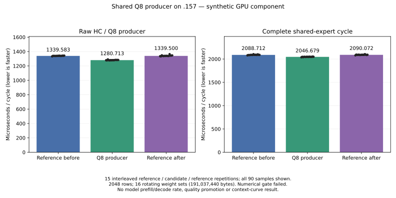

<!-- SPDX-License-Identifier: MIT -->
# Raw-HC producer for shared Q8 prefill

The later [saved-array replay](Q2-ORACLE-REPLAY.md) confirms that R3's independent
GPU format rejection below came from cross-stream fixture initialization.
All40 ordered outputs match exactly, without changing the GPU oracle arithmetic
or original inputs. The historical failed reports and timings below remain
retained; this result adds no new model performance measurement.

This isolated experiment derives from the exact mixed-Q2 source behind the
fixed1443.672867 PP / UD1685.777092 comparison. It enables the already existing
tiled-Q8 output in the raw-HC F16 GEMM epilogue for the FFN mixer only. The
shared gate/up immediately consumes that same tile. No device kernel body or
numerical formula changes; the old raw-HC entry remains intact as a control.
[Source identity](../config/q2-shared-q8-producer-source.json),
[patch](../experiments/q2-shared-q8-producer.patch).
[Frozen component plan](../config/q2-shared-q8-producer-plan.json),
[host qualification](../config/q2-shared-q8-producer-host-results.json).

The executor invalidates the existing half/Q8 cache before rewriting mixed
rows and publishes both identities only after the new launch path succeeds.
It uses the same stream and bounded allocated buffers. Other raw-HC callers,
including attention, narrow/decode and MTP, keep the default existing path.
The retained norm-fixed candidate is not automatically composed here.

## Bounded component protocol

One directly compiled fixture contains the unchanged reference producer plus
separate quantization and the new producer. Controls and candidate share one
binary; they are not rebuilt between samples. At2048, measure reference before,
candidate and reference after in each of15 repetitions, after warming both
paths. Rotate16 complete HC/shared weight sets, exceeding the32MiB MALL.
HIP events cover all queued work, including intervening launch gaps, and
exclude allocation, input generation, warmup, readback and verification.

Record both producer time and the complete cycle: raw-HC mix/inject/F16/Q8,
shared Q8 gate/up, SwiGLU to private F16, and shared down. Producer-only timing
cannot establish a complete-cycle gain. These are synthetic GPU component
measurements, not original-weight model throughput or a changed model baseline.

Whole mixed/F16/Q8/inject/gate/up/SwiGLU/down buffers must match byte for byte,
including padding and output guards, on96/97/127/129/2048 rows. Cases include
all-zero and small unsaturated inputs, disabled half/inject outputs and a
nondefault stream. An independent scalar Q8 format oracle checks every live
scale and code, including inactive padded bytes. Existing independent HC
projection/mix checks retain their2e-5 RMS/scaled-maximum limits. Invalid shape,
null weight/Q8 and missing inject output requests must launch nothing and
preserve output. Original inputs must remain unchanged.

Before a fixed-point model experiment, require exact outputs and passing
independent checks, positive complete-cycle median savings against both
controls and at least12 of15 per-repetition wins against both controls.
Producer medians must also improve against both controls. All samples and
failures remain visible. A marginal result is preserved rather than deleted;
no full context curve is admitted until fixed-point UD parity.

Whole control-binary replay for model tests still needs its qualified source,
binary and shared-library identity contract. This component avoids repeated
control compilation through its shared fixture; it does not claim that the
model replay launcher is implemented. GPU execution still requires a new
coordinated four-lease admission after Debug/ASan host checks on `.157`.

## First execution retained: CPU format oracle failure

R1 on `.157` records configure/build/fixture exits0/0/1 and32 verified
artifacts. The two independent HC cases pass the original2e-5 limits.
At96 rows, all eight whole producer/consumer pairs match, including the tiled
Q8 bytes and final shared down output. The strict CPU scale/code oracle then
fails; execution stops before the remaining cases and before timing.
[Retained failure](../config/q2-shared-q8-producer-r1-results.json).

Read-only analysis finds317 scale differences of one ULP versus correctly
rounded CPU division by127. All GPU scales instead match multiplication by
the rounded F32 reciprocal of127; all codes match the scalar reconstruction.
The padded allocation contains128 rows, although only96 are live.
[Format diagnostic](../config/q2-shared-q8-producer-r1-format-diagnostic.json).
This supports correcting the CPU oracle to the production reciprocal multiply;
it does not waive an exact-byte or independent numerical gate. R2 changes no
GPU source or model input, and retains the same performance admission criteria.
[R2 frozen plan](../config/q2-shared-q8-producer-r2-plan.json),
[R2 host qualification](../config/q2-shared-q8-producer-r2-host-results.json).

R1 release at2026-10-04T17:44:28.780292Z checks406identities/311groups retired,
empty KFD, four original leases free and six model stat tuples unchanged.
No Q2 job/reservation/waiter/restart or remote cleanup remains. Core acknowledges.
[Release](../config/q2-shared-q8-producer-window-release.json).

R2 preserves exits0/0/1 and92 artifacts. All five GPU shapes and44 whole
buffer/padding checks are exact. Four CPU format cases pass; at2048 the
rounded-reciprocal CPU oracle still differs on12 of5,242,880 codes near half
rounding boundaries, with every scale matching. The original and fused GPU
paths remain byte-identical at those positions. No timing samples were reached.
[R2 retained result](../config/q2-shared-q8-producer-r2-results.json).
Release17:55:30.661335Z checks417identities/320groups retired, empty KFD,
four original leases and unchanged model stats.
[R2 release](../config/q2-shared-q8-producer-r2-window-release.json).

R3 adds a separate serial-per-block GPU format oracle with the production
HIP FP32 arithmetic. It shares no upstream helpers, vector lanes or shuffle
reduction. Every scale/code/padded byte must match both production paths;
the correctly rounded CPU behavior remains a recorded diagnostic. All original
HC FP64 thresholds remain. Nonfatal numerical verdicts are aggregated so the
performance samples are collected even when qualification fails; memory guard,
launch, input mutation and producer/consumer replay failures still abort.
[R3 plan](../config/q2-shared-q8-producer-r3-plan.json),
[R3 host receipt](../config/q2-shared-q8-producer-r3-host-results.json).
Host Debug/ASan22/22 cover unchanged executed host/guard sources. The final
GPU-only boolean aggregation is separately bound in the GPU plan; its later
GPU execution below is not CPU inference or ASan GPU coverage.

## R3 timing retained; independent format qualification remains open

R3 completes all90 measured samples and97 verified artifacts. Configure/build/
fixture exits are0/0/1. All50 reference/candidate whole-buffer and padding
comparisons match, including the timed producer and complete-cycle outputs.
Both independent HC FP64 cases pass their original limits. The independent
serial GPU Q8 fixture passes96/97/129 but fails127/2048. Its numerical verdict
stays failed; no fixed-point model run is admitted by the frozen protocol.
[Complete report](../config/q2-shared-q8-producer-r3-results.json).

| Scope | Reference before, us | Candidate, us | Reference after, us | Candidate time change before / after | Wins against both |
| --- | ---: | ---: | ---: | ---: | ---: |
| HC/Q8 producer | 1339.582801 | 1280.712605 | 1339.500308 | -4.3947% / -4.3888% | 15/15 |
| Complete shared-expert cycle | 2088.712215 | 2046.679020 | 2090.072155 | -2.0124% / -2.0762% | 15/15 |

Each entry is the median of15 interleaved measurements. Unchanged-control
drift is-0.0062% for the producer and+0.0651% for the complete cycle.
The timing gate passes, separately from the failed numerical gate. The
candidate is retained, with no whole-model gain or independent quality claim.
The fixed1443.672867 Q2 /1685.777092 UD model reference does not change.

[All samples in CSV](figures/q2-shared-q8-producer.csv),
[exportable PNG](figures/q2-shared-q8-producer.png).

Read-only buffer diagnosis finds no independent-oracle scale or padded-byte
differences, but107/64503 code bytes differ at127/2048. Every differing oracle
byte is0xff, concentrated in the first one/six positions of each32-value
block. These are not all half-integer rounding discrepancies; fixture store
coverage and generated device code need investigation. CPU ideal diagnostics
remain exact at127 and differ by12 codes at2048. A CPU fused-remainder
reconstruction matches the production code at the mismatching positions;
the actual GPU reciprocal was not captured, so this is diagnostic evidence,
not an explanation of all oracle failures or a waived gate.
[Format diagnosis](../config/q2-shared-q8-producer-r3-format-diagnostic.json).

Release at2026-10-04T18:10:39.735343Z verifies428identities/329groups retired,
KFD empty, four original leases free and six original model stat tuples
unchanged. Core acknowledges. Peak observed CPU/GPU temperatures are70.750/
62C. No Q2 job, build, reservation, waiter, restart or remote cleanup remains.
[Verified release](../config/q2-shared-q8-producer-r3-window-release.json).
