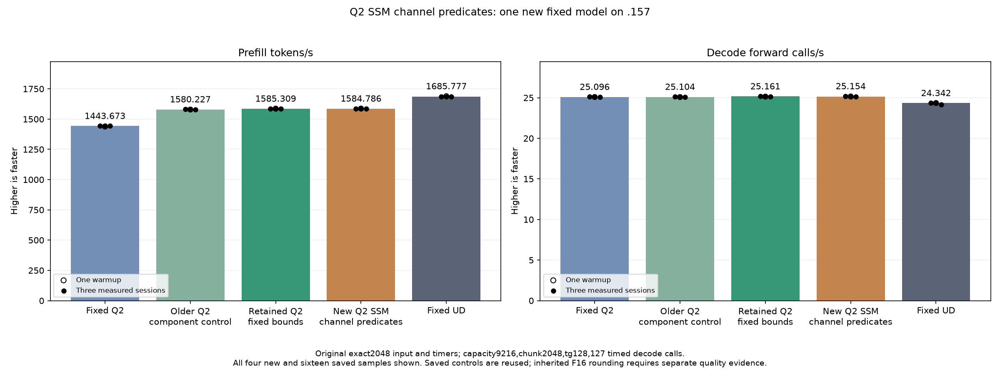
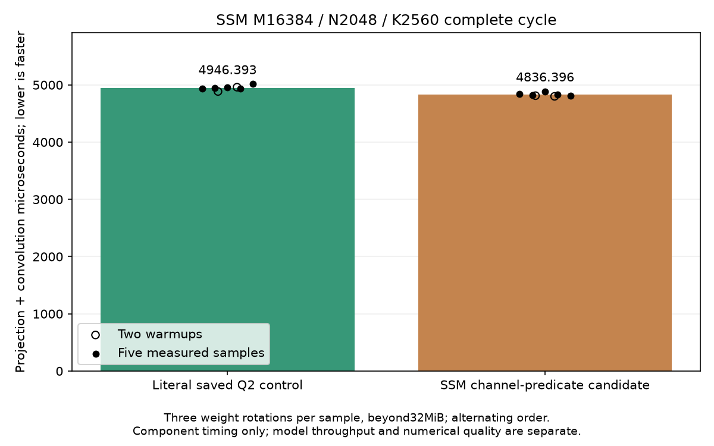

<!-- SPDX-License-Identifier: MIT -->
# Block-uniform channel predicates in the SSM projection

The new candidate completes on .157 at2026-10-06T01:36:01UTC with
**1584.785508 prefill tokens/s /25.15417889 decode calls/s**. Against retained
**1585.308983 /25.16079073**, the nominal changes are-0.033020%/-0.026278%,
with overlapping sample ranges. No incremental model speedup is demonstrated.
Preserve the candidate and keep `ssm-fixed-bounds` as the performance base;
its required prefill increase to fixed UD remains6.337447%. Full context and
concurrency parity are still open.

All30 complete component pairs and60 sampled FP64 checks pass. All21 saved
files match both the retained1585 construction parent and older1580 reference;
all nine within-arm replays are exact. The maximum FP64 relative RMS/scaled
errors are1.067384e-5/1.108063e-5 against0.002. Inherited full-logit differences
from fixed Q2/UD remain, with maximum matched-history KL0.001297699631 and
0.008794906721. Exactness to the parent does not independently qualify task quality.

## Complete new model samples

Original exact2048/tg128,127 timed decode calls,capacity9216/chunk2048,
greedy C1,MTP off,one warmup and three measured sessions remain unchanged.
The15-second pauses are outside the timers. No qualified reference is rebuilt
or rerun. The prefill input SHA256 remains
`75343e606f5b815fe01f69ddc6ce50a997e2de96d8a20304a82a7f24f1180b35`.

| Session | Prefill seconds | Prefill tokens/s | Decode seconds | Decode calls/s |
| --- | ---: | ---: | ---: | ---: |
| Warmup | 1.290333786 | 1587.186217 | 5.048643264 | 25.15527308 |
| Measured 1 | 1.292725574 | 1584.249620 | 5.042520964 | 25.18581497 |
| Measured 2 | 1.291799176 | 1585.385746 | 5.048862878 | 25.15417889 |
| Measured 3 | 1.292288445 | 1584.785508 | 5.052440690 | 25.13636632 |
| Median measured | 1.292288445 | 1584.785508 | 5.048862878 | 25.15417889 |

| Saved reference | Prefill tokens/s | Decode calls/s | New PP change | New TG change |
| --- | ---: | ---: | ---: | ---: |
| Fixed Q2 | 1443.672867 | 25.09595499 | +9.774558% | +0.232005% |
| Retained Q2 construction parent | 1585.308983 | 25.16079073 | -0.033020% | -0.026278% |
| Fixed UD | 1685.777092 | 24.34174251 | -5.990803% | +3.337626% |

New measured prefill spans1584.249620–1585.385746; saved-parent values span
1584.079076–1586.342395. These are historical comparisons, not contemporary
bookends. The experiment changes prefill only; its small observed decode
difference does not establish a causal decode effect.

[All20 new and saved samples, including the older1580 reference](figures/q2-ssm-channel-bounds-model-wrapped.csv),
[model report](../config/q2-ssm-channel-bounds-model-results.json).

## Complete component samples

The existing fixture compares against the literal older1580 kernel, not the
retained1585 construction parent. The complete2048-token projection/convolution
median changes4946.393331→4836.396217us (-2.223784%). That comparison includes
previously retained fixed-shape/bounds changes; it is not an isolated speedup
from the new channel predicates. The full-model comparison above decides
whether the new source improves on1585. No new resource/occupancy measurement
is included. Three weight rotations total133693440bytes, beyond32MiB.

| Session | Literal1580 control, microseconds | New candidate, microseconds |
| --- | ---: | ---: |
| Warmup 1 | 4884.87497965 | 4811.51676178 |
| Warmup 2 | 4959.79309082 | 4800.09047190 |
| Measured 1 | 4940.35339355 | 4837.95611064 |
| Measured 2 | 4946.39333089 | 4819.20973460 |
| Measured 3 | 4960.15294393 | 4887.31479645 |
| Measured 4 | 4936.12702688 | 4836.39621735 |
| Measured 5 | 5014.64462280 | 4806.86346690 |

[All14 timings](figures/q2-ssm-channel-bounds-component.csv),
[component report](../config/q2-ssm-channel-bounds-component-results.json).

Host31 Debug +31 ASan/UBSan, component and model produce13 zero-exit commands
and37 verified artifacts. All105 frozen fixtures,13 manifests and1027 provider
files verify. Both charts are visually reviewed. Model campaign peaks are
83.375C CPU/73C GPU; no thermal stop occurs. Resident model43156012544bytes,
session376777748bytes and deferred scratch7946240bytes remain unchanged.

Release at01:36:46.129727UTC retires1258 recorded identities/1005 groups,
with KFD empty, four original leases unchanged/free and seven model stat
identities unchanged. Canonical/main/remote mirrors agree; Core is notified.
No Q2 job/build/waiter/reservation, restart or .157 cleanup remains. Further
GPU work requires a new admission. Full curve and Q4 are not run.

[Final audit](../config/q2-ssm-channel-bounds-final-audit.json),
[disposition](../config/q2-ssm-channel-bounds-disposition.json),
[release](../config/q2-ssm-channel-bounds-window-release.json).

## Retained preparation record

The following records describe the state before device execution. Pending
steps below are now completed by the results above.

The unchanged SSM wrapper admits M16384, K2560,10240 convolution channels,
four taps and BM256 blocks. The channel boundary is exactly40 blocks from
the start: no block straddles it. Each per-output `row < channels` predicate
therefore equals `r_block < channels`. The candidate states that block-uniform
condition explicitly for the raw projection stores and fused convolution.
All token-tail, history and tile-edge predicates remain. Weight conversion,
ordered K16 WMMA, transpose addresses, convolution expressions, grid, launches
and allocations are unchanged in source.

Integer enumeration covers4096 unique float4 owners and all16384 scalar rows,
including the channel boundary. It checks that every owner has the same channel
classification as its block. This proves the integer partition for the guarded
launch; it does not prove floating-point compiler equivalence or GPU safety.

Matched local gfx1151 compilation reuses saved1585 assembly without recompiling
its provider or benchmark. The source patch reconstructs the candidate exactly,
all1027 provider files verify, and the other161 compiled kernel bodies preserve
instructions, operands and resources. Only the SSM body changes:

| Static property | Saved1585 | Candidate |
| --- | ---: | ---: |
| Instructions, including scheduling |3864 |3825 |
| Next-free VGPR |241 |241 |
| Next-free SGPR |17 |17 |
| LDS bytes |49152 |49152 |
| Private segment bytes |0 |0 |

The static instruction reduction is1.009317%. WMMA, block-barrier, global128-bit
load/store and LDS128-bit load/store counts are unchanged. This is not a1%
throughput prediction. Changes in branch masks also change paired F32
instructions and compiler scheduling; the full mnemonic delta is retained.
Unchanged source arithmetic does not establish unchanged compiled rounding.

Generation, production assembly, existing fixture host/device syntax and the
static audit each exit0. Compiler diagnostics retain the inherited weight-enum
switch and fixture `hipFree` warnings. These local checks do not initialize a
GPU or execute inference. No .157 build, job, lease, waiter, reservation or
cleanup occurs. The latest GPU release remains
[`7a3722f3`](../config/q2-counter-calibration-v2-window-release.json).

The candidate is now bound into the leased runner under its own component
and original counting modes. A separate source registry preserves all four
historical SSM registrations. Fresh .157 host qualification completes at
2026-10-06T01:27:38UTC:31 Debug and31 ASan/UBSan tests pass, six commands exit0
and seven collected artifacts verify. The frozen plan binds105 fixtures,
13 manifests and1027 provider files; no qualified model control is rebuilt.
The existing syntax-checked SSM fixture uses
the literal saved1580 control; that identity must stay explicit if reused.
Fresh GPU admission is still required. Measure the new candidate on .157 with guarded complete outputs and the
unchanged original2048/tg128 model. Compare saved1585 outputs and all fixed
historical rates without rerunning qualified controls. Safe numerical or
component timing rejection still permits the requested model performance run;
unsafe writes/runtime errors stop device work. Independent task quality and
full context/concurrency parity remain open.

[Source inventory](../config/q2-ssm-channel-bounds-source.json),
[static audit](../config/q2-ssm-channel-bounds-static.json),
[patch](../experiments/q2-ssm-channel-bounds.patch),
[generator](../tools/prepare-q2-ssm-channel-bounds.py),
[audit tool](../tools/analyze-q2-ssm-channel-bounds-static.py).
[Runtime plan](../config/q2-ssm-channel-bounds-plan.json).

The separate compressed expert-cache experiment already references original
**antirez/ds4**, independently fetched at0aaea5a238fb41a35106a551e73c8409dfb751ac.
It retains original IQ2/Q2 bytes in bounded slots and does not require a225GiB
FP16 expansion. Its measured1576.007692 /24.32799080 is below the resident
parent, with1.852607GiB lower known allocations after upload buffers. Prefetch
and transfer overlap are not ported. See the complete
[cache results and limits](Q2-COMPRESSED-CACHE.md).
