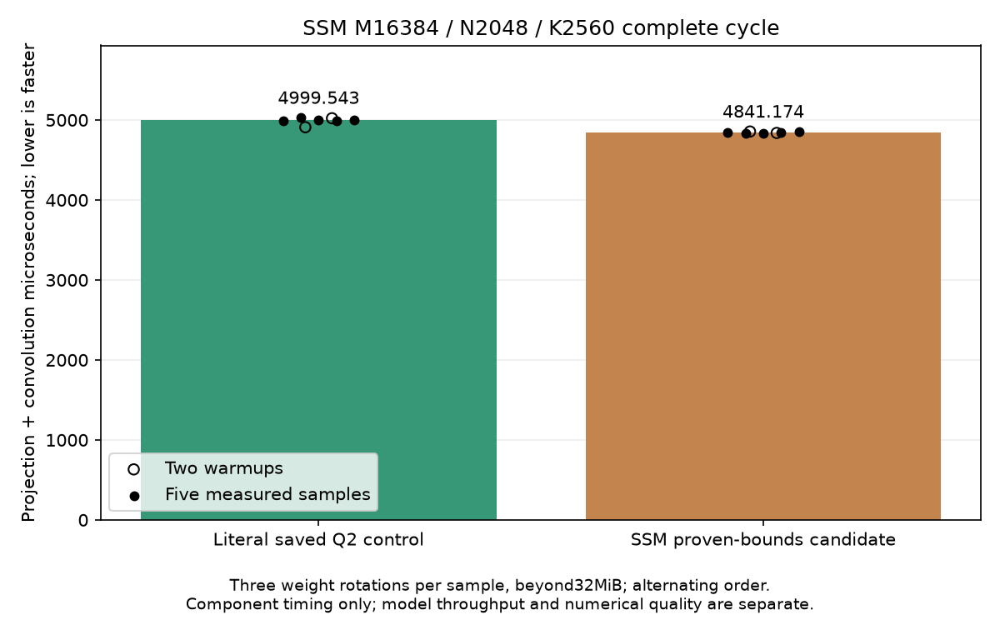
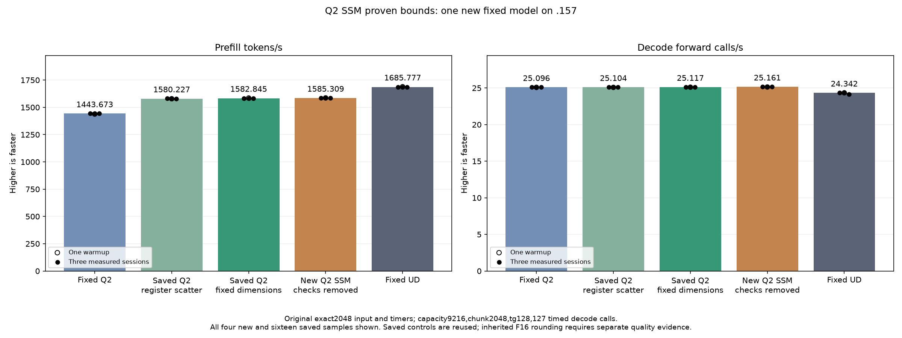

<!-- SPDX-License-Identifier: MIT -->
# Fixed-dimension SSM bounds: completed GPU and model experiment

The new candidate measures **1585.308983 prefill tokens/s and 25.16079073
decode forward calls/s** on the unchanged original exact2048/tg128 benchmark.
Prefill is nominally +0.155659% against saved 1582.845143, +0.321616% against
construction parent 1580.226725 and +9.810818% against fixed Q2 1443.672867.
Retain this marginal improvement and every saved parent. Fixed UD 1685.777092
still requires another 6.337447% PP from this candidate; point parity is unmet.

All three measured PP samples exceed the saved 1582 measured range. Controls
are historical: this is an observed difference without contemporaneous control
reruns or a causal confidence bound. Decode is nominally +0.174505% versus
saved 1582; the changed SSM path targets prefill, so this is not evidence of a
decode mechanism improvement. Independent task quality and full-curve parity
remain unqualified.

## Mechanism and numerical checks

Fixed M16384/K2560 propagation is retained, with only row/K predicates proven
true for the existing grid removed. Every token-tail predicate remains. Static
instructions decrease 3882 to 3864 versus fixed-M/K (4027 in the original),
while 24 extra LDS b128 loads appear. Actual VGPR 220, descriptor 241, SGPR 17,
LDS 49152 bytes, zero scratch and the static occupancy field 4 are not hardware
activity measurements. All 161 other kernels remain instruction/resource exact.

The component passes 30 complete output pairs and 60 sampled FP64 checks over
1024/1025/1057/2048/2049 tokens. Guards, required writes and original inputs
remain exact. Both 21-file model comparisons, against saved1580 and1582, are
exact, as are nine internal replays. Inherited fixed-Q2 and UD logit differences
remain: maximum matched-history KL 0.001297699631 and 0.008794906721 respectively.
These observations do not independently qualify the inherited F16 task quality.

## Complete component samples

Only 2048 is timed, with two warmups and five measured repetitions per arm in
alternating order. Each sample rotates three weight sets totaling 133693440
bytes, beyond 32MiB. Median projection/convolution time changes 4999.54255422
to 4841.17444356us, a 3.167652% reduction against the literal 1580 control.
This is a fresh within-component comparison, not a matched comparison with
the previous fixed-M/K campaign's component timings. The fixture records no
HIP resource-limit events or measured active occupancy.

| Session | Original control, us | Bounds candidate, us |
| --- | ---: | ---: |
| Warmup 1 | 4909.58563487 | 4855.86706797 |
| Warmup 2 | 5021.83532715 | 4837.85470327 |
| Measured 1 | 4992.22342173 | 4844.01448568 |
| Measured 2 | 5027.34247843 | 4837.69480387 |
| Measured 3 | 5002.54313151 | 4836.76115672 |
| Measured 4 | 4985.69011688 | 4841.17444356 |
| Measured 5 | 4999.54255422 | 4855.12065887 |

[CSV](figures/q2-ssm-fixed-bounds-component.csv),
[SVG](figures/q2-ssm-fixed-bounds-component.svg),
[component report](../config/q2-ssm-fixed-bounds-component-results.json).

## Original model: all new and saved samples

One new model arm runs. The other four arms are saved evidence and are neither
rebuilt nor rerun. Input SHA256 is
`75343e606f5b815fe01f69ddc6ce50a997e2de96d8a20304a82a7f24f1180b35`.
Capacity 9216/chunk 2048, greedy C1, MTP off, output 128 with 127 timed decode
forwards, one warmup and three measured sessions remain fixed. The 15s cooldowns
are outside both timers. PP is prefill tokens/s; TG is decode forward calls/s.

| Session: PP / TG | Fixed Q2 | Saved 1580 | Saved 1582 | New bounds | Fixed UD |
| --- | ---: | ---: | ---: | ---: | ---: |
| Warmup | 1438.259006 / 25.08847266 | 1578.810990 / 25.08217355 | 1585.375550 / 25.11014670 | 1586.508538 / 25.13300114 | 1689.043527 / 24.34239962 |
| Measured 1 | 1443.398207 / 25.10565683 | 1580.873846 / 25.11185031 | 1582.793699 / 25.13109946 | 1586.342395 / 25.17262901 | 1686.364042 / 24.34621613 |
| Measured 2 | 1443.672867 / 25.08698337 | 1580.226725 / 25.09349758 | 1583.044462 / 25.09384502 | 1584.079076 / 25.16079073 | 1685.777092 / 24.34174251 |
| Measured 3 | 1443.841794 / 25.09595499 | 1579.621125 / 25.10411864 | 1582.845143 / 25.11696030 | 1585.308983 / 25.15297051 | 1685.400011 / 24.15102104 |
| Median measured | 1443.672867 / 25.09595499 | 1580.226725 / 25.10411864 | 1582.845143 / 25.11696030 | 1585.308983 / 25.16079073 | 1685.777092 / 24.34174251 |

Elapsed prefill/decode seconds for those same 20 samples:

| Session: prefill s / decode s | Fixed Q2 | Saved 1580 | Saved 1582 | New bounds | Fixed UD |
| --- | ---: | ---: | ---: | ---: | ---: |
| Warmup | 1.423943804 / 5.062085753 | 1.297178708 / 5.063357039 | 1.291807484 / 5.057716369 | 1.290884953 / 5.053117186 | 1.212520558 / 5.217234208 |
| Measured 1 | 1.418873870 / 5.058620886 | 1.295486041 / 5.057373249 | 1.293914678 / 5.053499558 | 1.291020152 / 5.045162344 | 1.214447147 / 5.216416355 |
| Measured 2 | 1.418603928 / 5.062386263 | 1.296016557 / 5.061072080 | 1.293709715 / 5.061002006 | 1.292864751 / 5.047536119 | 1.214869991 / 5.217375049 |
| Measured 3 | 1.418437954 / 5.060576497 | 1.296513428 / 5.058930841 | 1.293872625 / 5.056344337 | 1.291861727 / 5.049105431 | 1.215141798 / 5.258576845 |
| Median measured | 1.418603928 / 5.060576497 | 1.296016557 / 5.058930841 | 1.293872625 / 5.056344337 | 1.291861727 / 5.047536119 | 1.214869991 / 5.217375049 |

[CSV](figures/q2-ssm-fixed-bounds-model-wrapped.csv),
[SVG](figures/q2-ssm-fixed-bounds-model-wrapped.svg),
[model report](../config/q2-ssm-fixed-bounds-model-results.json).

Compilation 154.247917s and loading 10.91203465s are outside PP/TG. Resident
memory remains 43156012544 bytes, with 7946240 deferred scratch bytes and
376777748 session bytes. Model CPU/GPU peaks are 80.75/74C. This change adds
no expert cache, stream, reactive scheduling behavior or memory allocation.

## Verified closure and next work

The 90 unchanged runtime fixtures permit explicit reuse of earlier 27 Debug and
27 ASan/UBSan host checks after byte, capsule and raw-artifact verification.
There are **seven new runtime commands, all exit0, and 30 new artifacts**;
the earlier six host commands and seven host artifacts are recorded separately.
All 14 frozen manifests, the helper and 1027 provider files verify. The six
exports retain 14 component and 20 model samples. Both PNGs are visually reviewed.

Admission is 2026-10-05T22:39:22.358626UTC at checkpoint 72b4473, after fresh
previous-release and persistent Core non-use verification. The model finishes
at 22:45:11.434575UTC and collection precedes release at 22:47:04.899994UTC.
Release retires 1149 process identities / 916 groups with empty KFD, four free
unchanged original leases and seven unchanged model stat tuples. Canonical,
main and remote release-active-ready mirrors agree; Core receives the closure.
No Q2 job, build, waiter, reservation, restart or remote cleanup remains.
Release SHA256:
`fc00b067802482077ab97819fc02547a1fdbd055ea5066dbfe58c5c4391c08cd`.

The retained composition candidate is now `ssm-fixed-bounds`; saved 1582 and
1580 remain available. Compact LDS and the small shared-down four-arm
component are still unmeasured. The former changes barriers as well as resource
use; the latter isolates weight caching from fixed-shape addressing. Producer
fusion still needs a design preserving the whole 640-row scale reduction.
No full curve or Q4 rerun follows while the fixed-point prefill gap remains.

[Source and bounds proofs](../config/q2-ssm-fixed-bounds-source.json),
[static comparison](../config/q2-ssm-fixed-bounds-static.json),
[frozen plan](../config/q2-ssm-fixed-bounds-plan.json),
[host reuse](../config/q2-ssm-fixed-bounds-host-results.json),
[final audit](../config/q2-ssm-fixed-bounds-final-audit.json),
[disposition](../config/q2-ssm-fixed-bounds-disposition.json),
[release](../config/q2-ssm-fixed-bounds-window-release.json).
Actual commands and exit codes remain in
`evidence/q2-ssm-fixed-bounds-runtime-preparation/`.
