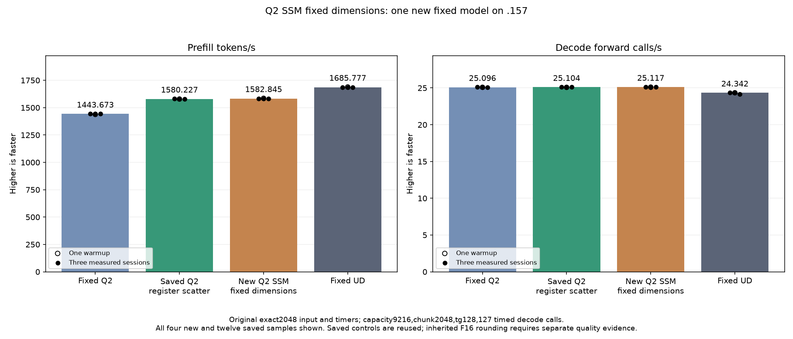

<!-- SPDX-License-Identifier: MIT -->
# Fixed-shape SSM experiments

The fixed-M/K candidate completes on .157 at 22:30:47 UTC on 5 October 2026.
Original-model prefill is **1582.845143 tokens/s**, versus saved 1580.226725:
a nominal **+0.165699%**, or 2.618418 tokens/s. Retain this small improvement
as the next composition candidate, together with the previous source and all
its evidence. Decode is 25.11696030 versus 25.10411864 calls/s (+0.051154%);
those ranges overlap and the scalar decode path is unchanged.

All 30 component output pairs, 60 sampled FP64 checks, 21 parent model files
and nine internal model replays pass. Parent logits remain byte-identical.
Inherited differences from fixed Q2/UD remain, with maximum matched-history
KL 0.001297699631 / 0.008794906721. This does not resolve independent task
quality or full context/concurrency qualification.

The fixed UD target remains 1685.777092 PP. The new candidate still requires
**6.502970%** additional prefill performance at the fixed diagnostic. No Q4
run or full-curve expansion is admitted by this marginal improvement.

## Complete original-model samples

The original exact2048 input, capacity9216, chunk2048, tg128, 127 timed decode
calls, greedy C1, MTP off, one warmup/three measured sessions and 15-second
cooldowns outside timers remain unchanged. Only the new candidate is built
and run. Fixed Q2, saved1580 and fixed UD are saved results, without recompiling
or rerunning their model binaries. PP means prefill tokens/s; TG means decode
forward calls/s.

| Session | Fixed Q2 PP / TG | Saved1580 PP / TG | Fixed-M/K PP / TG | Fixed UD PP / TG |
| --- | ---: | ---: | ---: | ---: |
| Warmup | 1438.259006 / 25.08847266 | 1578.810990 / 25.08217355 | 1585.375550 / 25.11014670 | 1689.043527 / 24.34239962 |
| Measured 1 | 1443.398207 / 25.10565683 | 1580.873846 / 25.11185031 | 1582.793699 / 25.13109946 | 1686.364042 / 24.34621613 |
| Measured 2 | 1443.672867 / 25.08698337 | 1580.226725 / 25.09349758 | 1583.044462 / 25.09384502 | 1685.777092 / 24.34174251 |
| Measured 3 | 1443.841794 / 25.09595499 | 1579.621125 / 25.10411864 | 1582.845143 / 25.11696030 | 1685.400011 / 24.15102104 |
| Median | 1443.672867 / 25.09595499 | 1580.226725 / 25.10411864 | 1582.845143 / 25.11696030 | 1685.777092 / 24.34174251 |

| New session | Prefill seconds | Decode seconds |
| --- | ---: | ---: |
| Warmup | 1.291807484 | 5.057716369 |
| Measured 1 | 1.293914678 | 5.053499558 |
| Measured 2 | 1.293709715 | 5.061002006 |
| Measured 3 | 1.293872625 | 5.056344337 |

All three new measured prefill values exceed all three saved-parent values.
The warmup is reported separately and is not part of the median. Historical
samples are not contemporaneous bookends, so the small difference remains a
nominal comparison rather than an isolated causal estimate. The candidate is
retained as requested; no extra control repetitions are started.

[Complete model CSV](figures/q2-ssm-fixed-shape-model-wrapped.csv),
[SVG](figures/q2-ssm-fixed-shape-model-wrapped.svg),
[model report](../config/q2-ssm-fixed-shape-model-results.json).

## Component and instruction evidence

The component completes at 22:25:57 UTC. All 30 complete output pairs are
exact and all 60 sampled FP64 checks pass across the same five aligned/ragged
shapes. Maximum relative RMS/scaled errors are 1.067383973e-5 / 1.108062891e-5
against the unchanged 0.002 limit. Guards, required stores and input
immutability pass. All three command exits are zero.

Complete projection/convolution time changes from 4936.565081 to 4884.353638
microseconds: 1.057647% less time. Every measured candidate sample is below
every control sample. Three rotating weight sets exceed 32 MiB; all 14 timing
records, including two warmups per arm, are retained. Only the original 2048
shape is timed, with allocation/copy/validation excluded.

Static instructions decrease from 4027 to 3882. For example, the compiler
removes 22 vector integer multiplies and 148 vector moves, while redistributing
other operations, including dual-issued arithmetic. Static count reduction is
not an executed-instruction or hardware-counter measurement. The original
49152-byte LDS layout, launch grid and ordered K16 arithmetic remain; 161 other
kernel bodies/resources are unchanged in the saved assembly comparison. This
experiment adds no cache, stream or reactive scheduling change.

[All component samples](figures/q2-ssm-fixed-shape-component.csv),
[component chart](figures/q2-ssm-fixed-shape-component.svg),
[complete numerical report](../config/q2-ssm-fixed-shape-component-results.json).

## Reused host gates and verified closure

The frozen plan binds 90 unchanged fixtures, 12 manifests and 1027 provider
files. Qualified host27/27 Debug and27/27 ASan/UBSan are explicitly reused:
their raw artifacts, source capsule and byte-identical fixtures are revalidated,
and the remote helper checks the original result hash. No host tests are rerun.
There are **seven new runtime command exits, all zero, and 30 new artifacts**;
the six earlier host commands/seven host artifacts are accounted separately.
All six new CSV/SVG/PNG exports retain complete model and component samples.

Candidate compilation 154.752054s and loading 10.73189422s are outside PP/TG.
Resident memory is unchanged at 43,156,012,544 bytes, with 7,946,240 deferred
scratch bytes and 376,777,748 session bytes. Model CPU/GPU peaks are 80.5/73.0
Celsius; no thermal stop occurs.

Admission at 22:25:10 UTC from checkpoint94331f2 follows fresh release22289680
verification and Core's persistent non-use. Release at 22:31:03.357917 UTC
verifies 1140 retired process identities/909 groups, empty KFD, four free
original lease inodes and seven unchanged model stat tuples. Canonical/main/
remote release-active-ready mirrors agree and Core receives the release.
No Q2 workload, reservation, waiter, restart or .157 cleanup remains.

The subsequent [fixed-bounds campaign](Q2-SSM-FIXED-BOUNDS.md) completes at
1585.308983 PP, nominal +0.155659% against this saved1582 result. All21 files
match exactly. Both sources and the original fixed1443/UD references remain;
no saved model is rerun. Compact LDS and small shared-down remain unmeasured.

[Frozen plan](../config/q2-ssm-fixed-shape-plan.json),
[reused host report](../config/q2-ssm-fixed-shape-host-results.json),
[final audit](../config/q2-ssm-fixed-shape-final-audit.json),
[disposition](../config/q2-ssm-fixed-shape-disposition.json),
[release](../config/q2-ssm-fixed-shape-window-release.json).

## Original preparation and the separate bounds candidate

Both candidates derive from retained original exact2048/tg128 Q2
1580.226725 PP /25.10411864 TG. At preparation time both had only local compilation evidence. The fixed-M/K
GPU results above now supersede that status; fixed bounds remains unmeasured. The fixed UD comparator
remains1685.777092 PP, with another6.679444% required from the retained Q2.

The existing SSM launch already requires M16384/K2560, channels10240 and
four convolution taps. `ssm-fixed-shape` exposes M/K as constants inside only
that template specialization. Batch remains dynamic and all other dense
specializations retain their runtime dimensions. The launcher is unchanged.
The candidate keeps row-group1; it does not compose the separate group4 trial.

`ssm-fixed-bounds` additionally removes row/K predicates that are universally
true for this unchanged geometry. Integer enumeration checks32768 weight-fetch
owners,10240 K-fetch owners and65536 float4-store owners. All token-tail checks
remain. These proofs establish the index assumptions, not GPU execution safety
or numerical equivalence after compiler optimization.

| Static property | Saved1580 | Fixed M/K | Fixed M/K and bounds |
| --- | ---: | ---: | ---: |
| SSM instructions | 4027 | 3882 | 3864 |
| Change | — | -3.600695% | -4.047678% |
| Compiler-reported VGPRs | 222 | 220 | 220 |
| Descriptor VGPR reservation | 241 | 241 | 241 |
| Descriptor SGPR reservation | 23 | 19 | 17 |
| LDS bytes | 49152 | 49152 | 49152 |
| Scratch bytes | 0 | 0 | 0 |
| Static occupancy field | 4 | 4 | 4 |
| WMMA instructions | 64 | 64 | 64 |
| Block barriers | 2 | 2 | 2 |
| Global128-bit loads | 144 | 144 | 144 |
| Global128-bit stores | 64 | 64 | 64 |
| LDS128-bit loads | 208 | 208 | 232 |

The bounds variant has fewer total instructions but24 additional static LDS
loads. Two of its four global16-bit loads use `global_load_d16_b16` instead of
`global_load_u16`. Neither smaller instruction count nor unchanged static
occupancy establishes speed. Floating scheduling/packing also changes, so
source formulas and equal WMMA counts do not establish numerical equivalence.

Both durable providers contain1027 files, with only `kernels.hip.cpp` changed.
Saved-parent assembly is reused;161 other kernels match instructions, operands
and resources. The existing guarded SSM fixture and literal parent control
compile for host and gfx1151 device against both candidates. No saved comparator
is recompiled or rerun. The row-group campaign's88 fixtures, five manifests and
window helper remain byte-identical; these additional variants have no remote
launcher admission yet.

The initial bounds analyzer exited1 because it wrongly required identical
load mnemonics. Its code and actual command/logs are preserved. The corrected
analyzer records the extra LDS work and opcode substitution, and fixes a loop
variable that shadowed the variant name. The candidate source and assembly
were unchanged. This was an analysis-tool failure, not a numerical result.

The original plan was to finish row-group before qualifying these variants with
the existing complete-output, sampled FP64, guard and full-cycle timing scope;
then run only the new candidate on the original model point. Safe numerical
rejection retains timing; memory/write failures stop dependent device work.
No Q4 or context-curve expansion is included.

[Fixed-shape source](../config/q2-ssm-fixed-shape-source.json),
[assembly comparison](../config/q2-ssm-fixed-shape-static.json),
[bounds source](../config/q2-ssm-fixed-bounds-source.json),
[bounds assembly comparison](../config/q2-ssm-fixed-bounds-static.json).
Actual commands are retained in local
`evidence/q2-ssm-fixed-{shape,bounds}-preparation/`.

## Producer/consumer fusion boundary

A separate [source audit](../config/q2-producer-fusion-boundary.json) finds ten
independent64-column gate/up producer blocks per complete640-value activation
row. The current half packing needs the maximum across that whole row.
Down has20 output tiles, each consuming the640-value input. Simply moving
F32-to-half conversion into every down tile therefore changes unpadded logical
payload from625 to1050MiB per layer at2048/top10, before routing padding and
cache effects. These are source-derived demand counts, not measured DRAM bytes.

True producer fusion could remove the50MiB F32 write and50MiB pack read per
layer, but needs whole-row ownership or another qualified representation.
A last-producer counter removes a launch while retaining those two passes.
Per64-column scales change the rounding contract and require qualification.
The full-row staging sketches remain unimplemented; the audit preserves fusion
as an open optimization and does not claim any measured gain or rejection.
