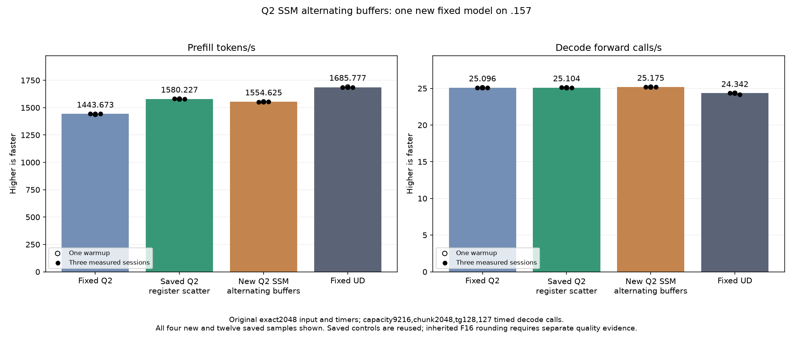

<!-- SPDX-License-Identifier: MIT -->
# Alternating SSM activation buffers

The new candidate completes on .157 at22:17:27UTC on5 October2026.
Original-model prefill is1554.624652 tokens/s versus saved1580.226725:
-1.620152%. Decode is25.17458636 versus25.10411864 forward calls/s, a nominal
+0.280702%. Retain this measured experiment and keep the1580 register-scatter
provider as the base. No throughput improvement is promoted.

All30 component output pairs,60 sampled FP64 checks,21 parent model files and
nine internal model replays pass. All parent logits are byte-identical. The
inherited fixed-Q2/UD differences remain: maximum matched-history KL is
0.001297699631/0.008794906721. Independent task-quality qualification and
complete context/concurrency parity remain open. This is a kernel storage
experiment; no reactive scheduler, callback or additional stream is introduced.

## Complete original-model samples

The original exact2048 input, capacity9216,chunk2048,tg128,127 timed decode
calls, greedy C1,MTP off, one warmup/three measured sessions and15-second
cooldowns outside timers are unchanged. Only the new candidate is compiled
and run. Fixed Q2, saved1580 and fixed UD are historical results, reused
without recompilation or another inference run. PP means prefill tokens/s;
TG means decode forward calls/s.

| Session | Fixed Q2 PP / TG | Saved1580 PP / TG | New SSM PP / TG | Fixed UD PP / TG |
| --- | ---: | ---: | ---: | ---: |
| Warmup | 1438.259006 / 25.08847266 | 1578.810990 / 25.08217355 | 1553.172335 / 25.17390388 | 1689.043527 / 24.34239962 |
| Measured 1 | 1443.398207 / 25.10565683 | 1580.873846 / 25.11185031 | 1552.627218 / 25.16940507 | 1686.364042 / 24.34621613 |
| Measured 2 | 1443.672867 / 25.08698337 | 1580.226725 / 25.09349758 | 1554.624652 / 25.17458636 | 1685.777092 / 24.34174251 |
| Measured 3 | 1443.841794 / 25.09595499 | 1579.621125 / 25.10411864 | 1555.033690 / 25.19062897 | 1685.400011 / 24.15102104 |
| Median | 1443.672867 / 25.09595499 | 1580.226725 / 25.10411864 | 1554.624652 / 25.17458636 | 1685.777092 / 24.34174251 |

| New session | Prefill seconds | Decode seconds |
| --- | ---: | ---: |
| Warmup | 1.318591604 | 5.044906845 |
| Measured 1 | 1.319054552 | 5.045808577 |
| Measured 2 | 1.317359787 | 5.044770079 |
| Measured 3 | 1.317013267 | 5.041557324 |

Every new measured prefill sample is below every saved-parent sample.
Decode samples are nominally higher, but the scalar decode path is unchanged
and these historical comparisons do not isolate a causal decode improvement.
The fixed target stays UD1685.777092 PP; retained1580 still needs6.6794445%
additional prefill performance. This candidate does not close that gap.

[Complete model CSV](figures/q2-ssm-pingpong-model-wrapped.csv),
[SVG](figures/q2-ssm-pingpong-model-wrapped.svg),
[model report](../config/q2-ssm-pingpong-model-results.json).

## Complete component and resource measurements

The GPU component finishes at22:12:44UTC on5 October2026. All30 complete
output pairs are exact and all60 sampled FP64 checks pass. Maximum relative
RMS/scaled errors are1.067383973e-5/1.108062891e-5 against the unchanged0.002
limit. All guards, required stores and original input immutability checks pass;
the three actual command exits are0 and four collected artifacts verify.

The complete2048 projection/convolution median is4932.395617 microseconds for
the literal parent control and5545.700073 for alternating buffers:12.434211%
more time. All five measured candidate samples are slower than every control
sample. Each sample rotates three weight sets beyond32MiB. Two warmups and
five alternating measured samples per arm are retained; setup, copies and
validation are outside the projection timer.

HIP reports49152→32768 shared bytes,222→212 registers, zero scratch and a
theoretical block limit1→2 per multiprocessor with65536 shared bytes available.
This is an API resource limit, not measured active occupancy. The higher limit
does not produce a faster component. Addressing, staging and loop geometry
also change: static code has4027→4131 instructions and the inner K loop covers
half as much work per iteration. Hardware counters were not collected; the
individual causes of the regression are not isolated.

[All14 timing samples](figures/q2-ssm-pingpong-component.csv),
[component chart](figures/q2-ssm-pingpong-component.svg),
[complete component report](../config/q2-ssm-pingpong-component-results.json).

## Campaign closure and next experiment

The applied launcher passes six integrated checks and142 existing guards;
the result analyzer passes11 checks. Host27/27 Debug and27/27 ASan/UBSan
pass on .157. All13 runtime command exits are0,37 collected artifacts verify,
and90 fixtures/ten manifests/1027 provider files remain bound to the plan.
All six model/component CSV/SVG/PNG exports retain complete samples.

Candidate compilation154.752473s and model loading10.92958722s are excluded
from PP/TG. Resident memory remains43,156,012,544 bytes, deferred scratch
7,946,240 bytes and session memory376,777,748 bytes. Model CPU/GPU peaks are
81.375/74.0 degrees C; no thermal stop occurs.

Fresh admission from checkpointc75e03e occurs22:11:58UTC after Core closure
and explicit continued non-use. Verified release22:17:43.200520UTC retires
1131 recorded process identities/902 groups with empty KFD, four free original
leases and seven unchanged model stat tuples. Canonical/main/remote release,
active and ready receipts agree; Core receives the release. No Q2 workload,
reservation, waiter, restart or .157 cleanup remains.

The next priority is the separately prepared fixed-M/K SSM specialization:
4027 to3882 static instructions, with original staging geometry and LDS size.
It is unmeasured and requires its own plan/admission. Compact LDS, fixed bounds
and small shared-down mirrors remain retained, unmeasured alternatives.
No saved candidate is rerun; Q4 and full-curve work remain deferred until the
fixed diagnostic reaches parity.

[Frozen plan](../config/q2-ssm-pingpong-plan.json),
[host report](../config/q2-ssm-pingpong-host-results.json),
[final audit](../config/q2-ssm-pingpong-final-audit.json),
[disposition](../config/q2-ssm-pingpong-disposition.json),
[release](../config/q2-ssm-pingpong-window-release.json).

## Mechanism and original local preparation

The source derives from the separately retained compact-LDS candidate and
ultimately saved1580. It is not composed with row-group4 or fixed-shape variants.
The following source/assembly and ownership checks preceded GPU execution.

With BK1/WM8/WN1, each wave produces and consumes exactly its own32 weight
rows. The weight stage therefore needs16384 bytes and a wave-local retirement
barrier. Activations are different: the first four waves populate128 rows,
and all eight waves consume them. Two8192-byte activation slots fit alongside
the weights, using the same32768 bytes already needed by the convolution
transpose.

Each K stage writes its weight rows and the alternating activation slot, then
publishes them through a block barrier. After matrix reads, a wave barrier
protects reuse of that wave's weights. The next activation write uses the
other slot. Reusing slot k for stage k+2 requires passing publication barrier
k+1; every wave must have finished reading k before committing k+1. One final
block barrier remains mandatory before the transpose reuses other waves'
weight/activation bytes. Removing it would permit an early wave to overwrite
data still read by another wave.

| Local property | Original SSM | Compact LDS | Alternating slots |
| --- | ---: | ---: | ---: |
| Shared bytes/block | 49152 | 32768 | 32768 |
| Compiler-reported VGPRs | 222 | 207 | 212 |
| Scratch bytes/thread | 0 | 0 | 0 |
| Compiler occupancy field | 4 | 7 | 7 |
| Static instructions | 4027 | 4120 | 4131 |
| Source block barriers in matrix path | 80 | 160 | 81 |
| Added source wave barriers | 0 | 0 | 80 |

The81 count includes80 stage-publication barriers and the final retirement
barrier. Wave barriers, slot addressing and compiler scheduling still have
costs; these source/static counts do not establish a speedup or measured
active-wave occupancy. Launch count, block grid, arithmetic helpers, K16
order, convolution windows, history boundary kernel and scalar decode remain
unchanged. No model allocation, host scheduling callback or stream is added.

## Ownership checks and remaining qualification

The integer version model runs129 schedules over80 stages/eight waves,
checking82560 complete stage reads and165120 events. Every read observes its
expected A/B version. A deliberately unsafe one-slot control detects an
incorrect activation version at stage0. A separate negative layout case exposes2048 bytes where an
early transpose can overwrite another wave's live weights if the final block
barrier is removed. These checks validate the modeled dependencies; they do
not prove compiler/device memory ordering or GPU correctness.

Local source reconstruction and full1027-file inventories verify. All161
other kernels match saved instructions, operands and resources; the saved
parent is not rebuilt. Host/device syntax passes against the unchanged compact
SSM fixture, preparing30 complete output pairs,60 sampled FP64 checks,14
timing records and two HIP resource-limit records. Only2048 is timed; the
five numerical shapes, independent formula and limits remain unchanged.
Safe numeric rejection retains timing, while guards/write/runtime faults stop.
The fixture's event names identify the compact-LDS family; the source manifest
and private run identity must distinguish this variant from its predecessor.

The initial source manifest accidentally retained its predecessor's stage-byte
and barrier counts. The initial JSON and correction receipt are preserved;
current versus inherited layout proofs are now separate. No provider code
or assembly changed during that metadata correction.

The follow-up launcher patch was applied after row-group completion. Both
actual-runtime archives bind90 fixtures and1027 provider files. Historical
unapplied preparation receipts remain unchanged; the current runtime identity
is in the separate applied receipt. GPU results above supersede preparation-only
status, while integer dependency models remain narrower than hardware proofs.

[Source and synchronization model](../config/q2-ssm-pingpong-source.json),
[assembly audit](../config/q2-ssm-pingpong-static.json),
[applied runtime](../config/q2-ssm-followup-runtime-applied.json),
[archive staging](../config/q2-ssm-pingpong-staging.json).
Local preparation and actual command logs remain under
`evidence/q2-ssm-pingpong-preparation/` and
`evidence/q2-ssm-pingpong-runtime-preparation/`.
