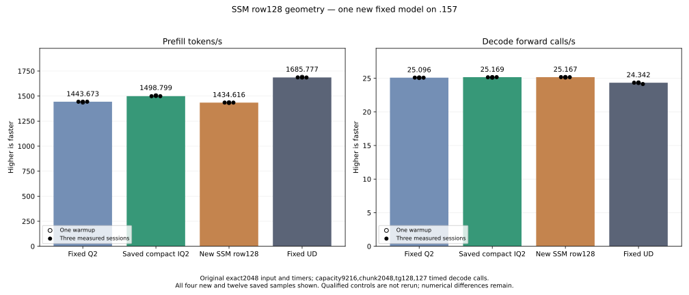

<!-- SPDX-License-Identifier: MIT -->
# SSM projection with 128 output rows per block

This candidate starts from the retained compact IQ2 composition, measured at
1498.799455 PP / 25.16866636 TG on the original exact2048/tg128 tester. It does
not include the rejected Q8 lookup or selectively add the earlier routed tiles.
The fixed comparison stays Q2 1443.672867 and UD 1685.777092 PP. Only the new
component and model run; qualified controls and old cohorts remain saved
references. The new model measures1434.616272 PP /25.16688019 TG,4.282306%
less PP than its retained parent, with all21 parent replay files exact.
This geometry is retained as a measured rejection; the compact parent stays
the composition base.

## Mechanism and cost

The fused Q8 SSM projection changes from BM256/BN128/BK2/WM8/WN1 to
BM128/BN128/BK2/WM4/WN2. Each thread owns 64 rather than 128 F32 accumulator
values. The smaller stage needs 32 KiB, while the unchanged eight 32-token
convolution transpose planes require 36 KiB; the allocation explicitly takes
that maximum. The old block needs 48 KiB. The grid has twice as many row blocks,
with repeated activation reads and block overhead. Lower register/LDS pressure
does not prove a runtime gain.

Signed Q8 half construction, rounded scale/FMA and sequential K16 WMMA remain
unchanged. Each wave retains the same two row tiles and contiguous float4 stores;
its token groups still align to the existing 32-token fused/boundary convolution.
The dispatch dimensions, minimum1024 tokens, live raw-output mask, convolution
arithmetic and history remain unchanged. Generic dense, attention, F16-weight,
routed IQ2/Q2, W8A8 and decode dispatches are untouched. No persistent state,
public ABI/metrics contract, extra allocation, stream or table is introduced.

Local matched gfx1151 assembly preserves all 156 other kernel bodies. The new
SSM body has 2102 instructions per block versus 4027 in the saved parent,
next-free-VGPR directives 217 versus 241, LDS36864 versus49152 and zero private
scratch. These are compiler/static quantities; the row-block grid doubles and
they are not dynamic instruction counts, allocated VGPR counts or throughput.
The parent assembly is reused without recompiling its qualified source/binary.

## Required output coverage and measurements

The new fixture contains the literal retained parent dense kernel as its
numerical control. Four SSM shapes,1024/1025/1057/2048 tokens, cover the dispatch
threshold and partial token tiles. Three immutable weight rotations per shape
produce24 full raw-projection/convolution buffer comparisons. Each device
allocation has64-byte guards on both sides, and initialization, uploads,
launches and readback use one owned nonblocking stream.

Outputs begin with0xFFFFFFFF poison. Full buffers must remain byte-exact.
All required raw values and every convolution value must be written and finite;
intentionally unused raw values must stay poisoned. The raw live mask is the
existing production contract: all channels10240..16383 plus first/last three
tokens of each32-token tile and the final three prompt tokens. This implements
the saved-array diagnosis from the previous experiment without modifying its
fixture, exit1 or historical report. Missing required stores cannot pass through
matching poison values.

Only the2048-token case is timed: two warmup and five measured pairs alternate
order, each rotating three weight buffers totaling133693440 bytes above32MiB
MALL. All14 timing samples are retained. Uploads, allocations, hashing and
validation are outside GPU event timers. Numeric rejection saves full arrays
and continues timing; guard/runtime faults prevent further GPU work.

The one new original-weight model follows any safe component verdict, retaining
the original input SHA, capacity9216, chunk2048, one warmup plus three measured
sessions,128 output tokens/127 timed decode calls and15-second waits outside
timers. The saved Q2/compact-parent/UD model controls are not rebuilt or rerun.
The full context curve still waits for fixed-point parity; independent task
quality is not inferred from differential output equality.

## Completed component

The new `.157` component completes with all three commands exit0 and four
verified artifacts. All24 full raw-projection/convolution buffer pairs are
byte-exact. Every required value is finite/written, unused raw cells stay
poisoned, all guards remain intact and all original inputs are immutable.
The corrected live mask passes without hiding a missing required store.

| Session,2048-token component | Parent microseconds | New row128 microseconds |
| --- | ---: | ---: |
| Warmup1 | 4834.550222 | 9251.285553 |
| Warmup2 | 4880.122821 | 9135.967890 |
| Measured1 | 4985.333125 | 8944.586436 |
| Measured2 | 4877.509435 | 9099.969228 |
| Measured3 | 4966.413816 | 9163.340886 |
| Measured4 | 4894.895554 | 9226.205826 |
| Measured5 | 4917.015076 | 9438.266754 |
| Measured median | 4917.015076 | 9163.340886 |

Median component time increases86.359829%. All14 samples, including warmups,
order and rotation metadata, are retained. Halving per-block WMMA/half
operations still doubles the row-block grid; static barrier instructions stay
two per loop body and activation traffic is repeated. These source/static
tradeoffs are plausible contributors, not measured hardware counters or an
isolated cause. The model performance test also completes after this regression.
No qualified control or old component is relaunched.

[Every output and timing](../config/q2-ssm-row128-component-results.json),
[all14 component samples](figures/q2-ssm-row128-component.csv).

## Original fixed model result

Only this new model is built and run on `.157`. Its four configure/build/link/
model commands exit0, and all26 artifacts verify. Compilation takes153.747153
seconds outside PP/TG timers. The original exact2048 input and timer contract
remain unchanged; saved Q2, compact parent and UD are not rebuilt or rerun.

| Session | Prefill seconds | Prefill tokens/s | Decode seconds | Decode calls/s |
| --- | ---: | ---: | ---: | ---: |
| Warmup | 1.427406562 | 1434.769921 | 5.048829269 | 25.15434633 |
| Measured1 | 1.427336009 | 1434.840841 | 5.044082601 | 25.17801750 |
| Measured2 | 1.429956722 | 1432.211177 | 5.049526071 | 25.15087519 |
| Measured3 | 1.427559439 | 1434.616272 | 5.046314802 | 25.16688019 |
| Original measured median | 1.427559439 | 1434.616272 | 5.046314802 | 25.16688019 |

| Same saved fixed comparison | Prefill tokens/s | Decode calls/s |
| --- | ---: | ---: |
| Original Q2 | 1443.672867 | 25.09595499 |
| Retained compact IQ2 parent | 1498.799455 | 25.16866636 |
| New SSM row128 | 1434.616272 | 25.16688019 |
| Original UD | 1685.777092 | 24.34174251 |

PP regresses4.282306% versus the retained parent and is14.898816% below UD.
Decode differs−0.007097% versus parent, with overlapping ranges and no stable
change established. All21 parent input/output/full-logit files and nine
within-arm replays are byte-exact. The128 generated tokens match Q2 and UD.
Eight large-logit differences to fixed Q2 remain inherited from the measured
MoE parent; matched-history KL is0 to compact parent,0.001256655237 to Q2 and
0.008626378682 to UD. This is differential evidence, not independent task
quality qualification or full-curve parity.

Model resident_bytes43156012544, session_bytes376777748 and deferred scratch
7946240 remain unchanged; no extra table or persistent allocation is introduced.
Recorded CPU/GPU maxima, including compilation, are84.125/74 C. The lower
per-block ISA/register/LDS counts do not compensate for the grid/work changes
in either the new component or original model. Their exact causal shares were
not isolated by hardware counters. The candidate is retained without default
promotion; the best composition remains1498.799455 PP, requiring12.475160%
more PP throughput to reach original UD.

Release at03:24:18.993858 UTC checks660 retired identities/519 groups, empty
KFD, four original leases free and six unchanged model stat tuples. Main/remote
canonical/active/ready mirrors match SHA256
`58d6fd7e72b9ff0ba36c05968e062863e2c1e38a3fd74bfd14de2c870195ac4b`.
Core receives the release. No Q2 GPU job, reservation, waiter, restart or
cleanup remains. All37 host/component/model artifacts and34 frozen fixtures
verify; the failed original admission is preserved separately.

[Full model result](../config/q2-ssm-row128-model-results.json),
[all16 model samples](figures/q2-ssm-row128-model.csv),
[retained decision](../config/q2-ssm-row128-retained-update.json),
[release](../config/q2-ssm-row128-window-release.json).

## Preparation and provenance

Production device assembly, fixture device compilation and host syntax pass.
All85 launch-scope guards and explicit-style new-file formatting pass. The shared
provider formatter preserves exit1 for nine byte-identical inherited files.
A local wrapper initially uses a relative path from the provider directory and
exits2 before formatting; its correction and actual exits are retained.
The new `.157` CPU capsule passes25/25 Debug and25/25 ASan/UBSan CTest, all six
commands exit0,34 frozen fixtures and seven artifacts verify. Those CPU fixtures
access no model/GPU and establish no inference performance.

The initial admission helper mistakenly points PREVIOUS to this new window's
release. It exits1 before acquiring leases, writing a receipt/registry event or
starting GPU work. The corrected helper changes only that path to the saved
Q8-pair release. A separate corrected plan preserves all four manifests and34
fixture hashes; it rebinds the same qualified host capsule without a CPU rerun.
The original plan/helper/host result and failed command remain retained.

The independent provider has1025 files, with only the kernel file changed from
the retained compact source. It derives from this workstream's independently
fetched official Gufo pin `f783fedb9bea2ec7de941f6da4e02f4a4596b29e`.
Original upstream notices remain; first-party changes and fixtures are MIT.
Source/runs remain in persistent project directories. No sibling DS4 source,
model, build, cache, profile or qualified artifact is imported or mutated;
there is no cleanup, dependency installation, tuning, deployment or publication.

[Source identity](../config/q2-ssm-row128-source.json),
[static evidence](../config/q2-ssm-row128-static.json),
[corrected frozen plan](../config/q2-ssm-row128-plan-fixed.json),
[new HIP fixture](../tests/q2_ssm_row128.hip),
[provenance](../third_party/gufo/LIE-Q2-SSM-ROW128.md).
