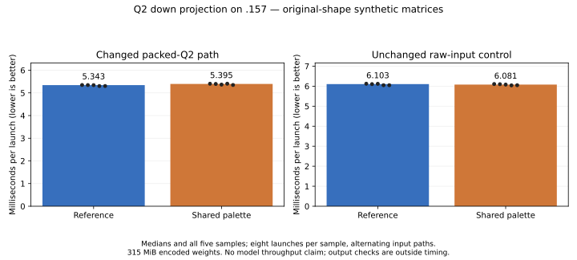

<!-- SPDX-License-Identifier: MIT -->
# Sharing the Q2 palette does not improve component time

The candidate preserves all checked output bits but is not selected. On `.157`,
packed-Q2 down median time changes from **5342.604 to 5395.196 us (+0.98%)**;
the unchanged raw-input control changes -0.37%. No complete-model benchmark is
admitted. The retained paired-HC-up source and its prior 1335.84 PP / 24.09 TG
measurement remain selected; Q2/UD parity is still unmet.

This directly investigates redundant floating-point conversion after the
owner's [bit-representation proposal](Q2-BIT-CONVERSION.md). It is not a syntax
replacement with union/bitfield declarations: it computes the four existing
rounded Q2 weights once and shares their exact half bits. The result limits
this placement/reuse strategy, not the usefulness of bit manipulation generally.

## Mechanism and static evidence

In the retained affine-palette kernel, both half-waves reconstruct the four
possible F16 values for a sixteen-weight group from its F32 scale and bias.
The candidate moves that work into the cooperative LDS producer. Four half
values occupy the same eight-byte slot as the previous two float coefficients;
consumers read the bits and retain their register byte selections. This avoids
the larger full-weight LDS buffer of the earlier rejected
[staged-weight experiment](Q2-STAGED-WEIGHTS.md).

Original encoded weights, coefficient rounding, affine FMAs, activation
high/residual planes, WMMA order and final residual correction remain intact.
A register barrier preserves the former F32 coefficient boundary before the
producer computes the palette. There is no persistent decoded cache, changed
model file, extra LDS allocation or new launch. The raw F32-input control, IQ2,
HC and scalar decode keep their original branches.

| Token tile | Reference / candidate VGPRs | LDS bytes, both | Private bytes, both | Mixed-half FMA instructions, reference / candidate |
| --- | ---: | ---: | ---: | ---: |
| 16 | 113 / 117 | 16,640 | 0 | 12 / 6 |
| 48 | 144 / 144 | 24,832 | 0 | 12 / 6 |
| 64 | 169 / 169 | 28,928 | 0 | 12 / 6 |

The static WMMA counts remain 8/24/32. All three raw-input instruction bodies
match the retained assembly after normalizing function-local label prefixes.
These are compiled counts, not runtime latency or occupancy measurements.

The [generator](../tools/prepare-q2-staged-palette.py) derives the candidate
from this workstream's retained source at independent official Gufo pin
`f783fedb9bea2ec7de941f6da4e02f4a4596b29e`. The
[single-file patch](../experiments/q2-staged-palette.patch),
[source identities](../config/q2-staged-palette-source.json) and
[static record](../config/q2-staged-palette-static.json) preserve provenance.
Device compilation, both host fixture syntax checks, changed-source formatting
and exact 1019-file reconstruction pass. The first host syntax attempt lacks
the existing generated grid include path; its exit 1 and correction are retained.
The full format check reproduces the known violations in two unchanged upstream
tests, with actual exit 1. No unrelated upstream file is repaired.

## GPU timing and numerical result

The existing shaped benchmark uses 512 experts, ten selected per token,
2048 tokens, M2560, logical/stored K640/768 and token tile48. Original encoded
synthetic weights occupy **315 MiB**. Both input paths receive three warmup
launches and five samples of eight launches, alternating path order. GPU events
exclude transfers, routing construction, validation and output hashing.

| Input path | Reference min / median / max, us | Shared palette min / median / max, us | Median time change |
| --- | ---: | ---: | ---: |
| Packed Q2 | 5302.915 / 5342.604 / 5348.419 | 5348.930 / 5395.196 / 5404.869 | +0.98% |
| Raw-input control | 6048.061 / 6103.314 / 6122.976 | 6041.324 / 6080.828 / 6107.162 | -0.37% |

The changed-path ranges do not overlap, with only 0.511 us between reference
maximum and candidate minimum. This short sequential component screen supplies
no useful gain and does not establish a general hardware bottleneck or an
unprofiled model speed. Moving conversion out of the consumer changes instruction
scheduling around stage barriers; its effect is a possible explanation, not a
measured cause. Halving one static instruction family at equal tile48 resource
counts has not reduced elapsed kernel time.

All **52,428,800** complete shaped output values match raw/packed and the saved
reference hashes. The 1024 independently recomputed FP64 dots give relative RMS
`0.000192816` and error/peak `0.000224105`, below unchanged `0.002` limits.
The operator suite also passes thirty independent cases and thirty-two exact
packing/down/chain checks. All 62 saved operator buffers reproduce the retained
affine-palette outputs exactly. The [report](../config/q2-staged-palette-results.json)
and [CSV](figures/q2-staged-palette.csv) retain every sample and numerical check.

## Qualification and closure

The `.157` host cohort passes 12/12 Debug and 12/12 ASan/UBSan, qualifying all
43 staged guard/fixture files. [Validation](../config/q2-staged-palette-validation.json)
verifies four runners, fifteen command exits 0 and 83 collected artifacts.
Maximum observed GPU/CPU temperatures are 48 / 80.625 C. No original model is
opened. The [conditional model protocol](../config/q2-staged-palette-protocol.json)
is retained without launching its benchmark arms.

The window is released at **2026-10-03 05:26:44.312600 UTC**, with all owned
runners and command identities/groups/sessions absent, empty KFD and all four
original leases EX|NB/free. The persistent `.157` receipt is
`run/q2-staged-palette-window-release.json`; the shared registry records release.
Independent observation at **05:27:14.653613 UTC** verifies the closure observer
retired. Direct inter-thread transport again fails; notification delivery is not
claimed and the agreed registry/ledger fallback records the handover. No GPU
job, waiter, automatic retry or runtime promotion remains.
