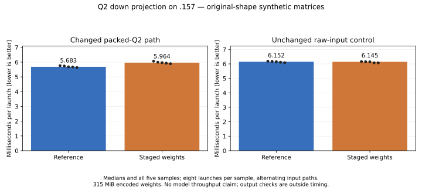

# Q2 weight staging: exact but slower

<!-- SPDX-License-Identifier: MIT -->

The `.157` GPU comparison rejects this candidate: packed-Q2 down time rises
from **5682.759 to 5963.628 microseconds (+4.94%)**. The unchanged raw-input
control differs by -0.12%. All recorded numerical checks pass. No full-model
run follows this component regression, and neither the measured MoE/HC
checkpoint nor the qualified runtime is changed.

## GPU result — 2026-10-02

| Input path | Reference median | Staged-weight median | Time change |
| --- | ---: | ---: | ---: |
| Packed Q2, changed | 5682.759 us | 5963.628 us | +4.94% |
| Raw F32, unchanged control | 6151.904 us | 6144.739 us | -0.12% |



The existing suite passes 30 independent operator cases and 32 exact packing,
down and chain checks. All 62 saved F32/U32 buffers match the retained packed
checkpoint. The shaped benchmark compares all **52,428,800** output values
byte-for-byte; both arms produce the same complete raw/packed SHA256. Its
1024 independent sampled FP64 dot products have relative RMS 0.000192816 and
error/peak 0.000224105, below the unchanged 0.002 bounds. Guards, finite values
and complete output writes pass. Timing precedes the numerical verdict.

All three runners and nine commands exit 0, all 76 collected artifacts verify,
and no model is opened. Observed temperature maxima are GPU 51 C/CPU 82.5 C.
The window is released at 19:42:40.462182 UTC, with independent observer
retirement at 19:43:19.827958 UTC; KFD is empty and four original leases are free.
The full [samples and checks](../config/q2-staged-weights-results.json),
[CSV](figures/q2-staged-weights.csv),
[validation](../config/q2-staged-weights-validation.json) and
[release](../config/q2-staged-weights-window-release.json) are retained.

The source removes duplicate affine decoding but increases registers, LDS
allocation and decoded-weight traffic through LDS. The measured regression
shows that this tradeoff does not pay on the tested shape; it does not isolate
one of those resource costs as the proven bottleneck. A separate
[paired half-wave candidate](Q2-HALF-WAVE.md) keeps the original LDS plan and
shares the rounded weight bits between lanes instead. That candidate has
static preparation only.

## Mechanism and static evidence

The retained MoE/HC profile spends 288.934 ms in 48 routed Q2 down calls,
17.94% of prefill kernel time. The packed-Q2 path decodes each K32 weight row
in both half-waves before WMMA. This candidate moves that decode into the
cooperative LDS producer so consumers load the same decoded F16 values.
Original Q2_K storage, both activation planes, WMMA order and final residual
correction remain unchanged. It adds no persistent dequantized weight cache.

Only `kQ2 && kPacked` selects the change. The ordinary F32-input Q2 entry and
other quantizations keep the previous source branches. Affine coefficients
remain F32, with register barriers preserving the former LDS rounding boundary.
The compiler still emits mixed FMA-to-half operations. Numerical equivalence
must be verified on the GPU; source expressions alone are not sufficient.

Static gfx1151 compilation succeeds:

| Token tile | Reference / candidate VGPRs | Reference / candidate LDS bytes | Private bytes | Reference / candidate static mixed-half FMA instructions |
|---|---:|---:|---:|---:|
| 16 | 112 / 158 | 16,640 / 20,736 | 0 / 0 | 64 / 32 |
| 48 | 144 / 169 | 24,832 / 28,928 | 0 / 0 | 64 / 32 |
| 64 | 169 / 217 | 28,928 / 33,024 | 0 / 0 | 64 / 32 |

WMMA instruction counts are unchanged (8/24/32). The increased register and
LDS requirements may offset the reduction in decoding. These are static
instruction/resource counts, not measured occupancy, speed or numerical results.

The new `q2_packed_bench` uses synthetic original-shape matrices: 512 experts,
10 selected experts per token, 2,048 tokens, M=2,560, logical K=640 and stored
K=768. Encoded weights occupy 315 MiB. Both input paths run in alternating
order for five samples of eight launches, after warmup. Transfers, compact
routing, hashing and output checks are outside HIP-event timings. Complete
outputs and guards are compared; 1,024 independent sampled FP64 dot products
retain the existing 0.002 relative/peak tolerance. Timing is preserved before
any numerical verdict; a numerical failure still returns exit 1.

Source reconstruction matches all 1,019 files. Changed-source formatting,
device compilation and benchmark host syntax pass on the editing host.
`config/q2-staged-weights-{source,static}.json` records the source, commands,
actual exits, assembly hash and resources. The above runtime checks establish
synthetic operator correctness and a component regression, not full-model
performance or quality.

The completed modes used independent fresh lease admission inside the coordinated
window. The same fixed remote entry points accept unique evidence labels:

```sh
python3 tools/q2-remote.py packed-operators q2-stage-operators-NEW --source-variant staged-weights
python3 tools/q2-remote.py packed-bench q2-stage-micro-ref-NEW --source-variant hc-moe-fused
python3 tools/q2-remote.py packed-bench q2-stage-micro-NEW --source-variant staged-weights
```

No remote job, reservation or automatic retry remains after verified release.
Reactive PLE prompt lookahead is a separate I/O-overlap experiment and must
not be combined with this numerical-kernel change in a causal A/B.
