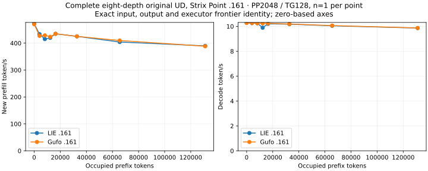
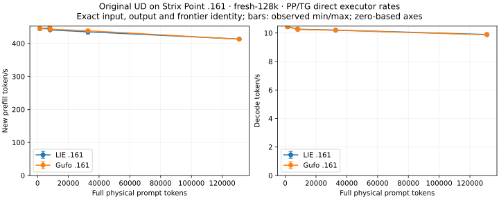
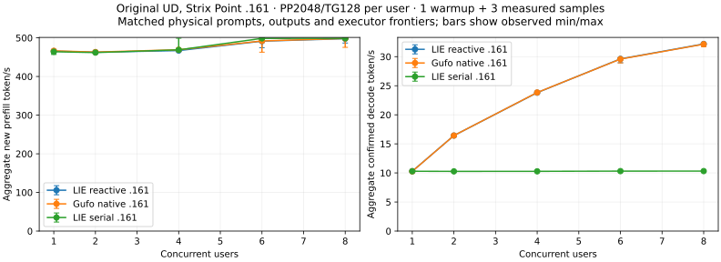
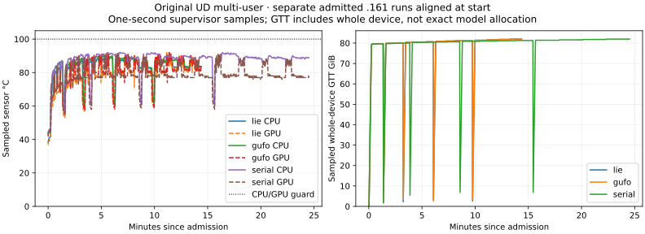
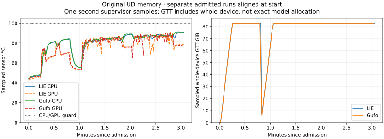

<!-- SPDX-License-Identifier: MIT -->
# Strix Point UD — full eight-depth and concurrent direct benchmarks

Date: **2026-10-02**. Target: **pop@192.168.5.161**, Radeon 890M / gfx1150.
Original Unsloth Qwen3.8 Flash Next UD-Q4_K_XL, revision
`38bb39ee97821de2c9009abb7e93950eec396e66`, four SHA-256-verified shards.
Both binaries use the independently fetched Gufo numerical pin
`f783fedb9bea2ec7de941f6da4e02f4a4596b29e`. Model execution is original-weight
GPU inference. LIE uses its C17 reactive dispatch; the comparison binary uses
the direct Gufo adapter. No HTTP, MTP, vision or CPU model forward is involved.
Matching frontiers establish consistency between these two paths using the
same numerical implementation, not an independent model-quality oracle.

The new `synapse-lie-bench --suite single` and direct Gufo campaigns **both
finished all eight depths through 131072** under the operator-approved 100 C
ceiling. They each completed one warmup and one measured PP2048/TG128 sample
per depth. Exact physical prompts, generated tokens and both executor frontier
hashes match on all eight points. The earlier 85 C attempt remains preserved
below as a separate failed campaign. A short matched two-point test is also
retained as historical evidence with different warmup settings.
The C1/2/4/6/8 reactive, native Gufo and serial control arms also pass with
three measured samples per point. Paired full-prompt fresh runs pass through
131072 physical tokens. Both `--suite loading` arms complete at
context capacity 262144. These are the
actual direct-benchmark tests, separate from the earlier 9-token shared-core
smoke in [the port report](STRIX-POINT-RESULT.md).

## Method and exact workload

The test follows the simplified [Gufo-style LIE protocol](CONTEXT-COMPARISON.md):
AR greedy, thinking off, **about 2048 new prefill tokens plus 128 actual output
tokens**, prefill chunk 2048. A live physical prefix is computed in the same
sequence before the measured suffix. The capacity is 133760 for `single`.
Prefill and decode rates use separate completed executor intervals. Prefix
preparation, calibration, loading and plots are outside those intervals.
The complete eight-point runs each take **one warmup and one measured sample per
depth** in a continuous ordered sweep. The paired two-point runs each take
**one measured sample and no warmup**, on separate admitted windows after the
machine cooled. Both are low-sample observations, not confidence intervals.
The failed 85 C run used the complete profile too, but is retained separately;
its partial values are never substituted into either passing comparison.

The direct suite is the same executable family as the earlier .157
[eight-depth result](BENCHMARK-RESULTS.md). The complete requested profile is
depth 0/4096/8192/12288/16384/32768/65536/131072, `pp2048/tg128`. The
[official Gufo table](https://github.com/gufo-org/gufo/blob/main/docs/models/qwen3.8-flash-next/BENCHMARKS.md)
uses these depth and work-size conventions. Its published Halo numbers are a
separate hardware/provenance reference, not an additional measured .161 arm.

## Complete .161 LIE versus direct Gufo, occupied context through 128K

Both campaigns report state PASSED, supervisor/child exit 0, 16 complete
samples, full 128-token output at every point, unchanged model stat identities,
no cleanup error, and fresh collection with the owned processes absent,
private lease free and `llama-router.service` active. The report validator
confirms the same physical token IDs, generated token IDs, full prefill logits
hash and final decode logits hash at **all eight** depths. The same pinned Gufo
numerical engine is used in both paths, so this is executor-path parity rather
than an independent quality oracle.

| Occupied prefix | Physical prompt | New PP | LIE PP tok/s | Gufo PP tok/s | LIE TG tok/s | Gufo TG tok/s |
|---:|---:|---:|---:|---:|---:|---:|
| 0 | 2048 | 2048 | 472.581 | 470.233 | 10.2924 | 10.2767 |
| 4096 | 6143 | 2047 | 433.310 | 426.986 | 10.2613 | 10.2642 |
| 8192 | 10240 | 2048 | 415.064 | 428.741 | 10.2510 | 10.2483 |
| 12288 | 14336 | 2048 | 419.773 | 423.425 | 9.8912 | 10.2430 |
| 16384 | 18432 | 2048 | 434.701 | 434.712 | 10.2031 | 10.2398 |
| 32768 | 34816 | 2048 | 425.131 | 424.975 | 10.1734 | 10.1883 |
| 65536 | 67584 | 2048 | 404.108 | 409.685 | 10.0455 | 10.0617 |
| 131072 | 133120 | 2048 | 389.786 | 388.395 | 9.8622 | 9.8694 |

LIE's observed PP rate at 128K is 17.52% below its own zero-prefix point;
its TG rate is 4.18% below. Gufo's corresponding changes are 17.40% and
3.96%. This measures 2048 **new** prefill tokens after a live prepared prefix,
not a 128K fresh-prefill rate. LIE and Gufo each have only one measured sample
per point. The isolated 12K decode difference and small PP differences cannot
establish a ranking. Gufo began at CPU/GPU 42.25/41 C versus LIE 35.125/34 C,
so the initial thermal conditions were not identical.

Sampled maxima are LIE CPU/GPU/NVMe **91.5/90/65.85 C** and Gufo
**92/92/67.85 C**. Both show sampled whole-device GTT use up to
89154617344 bytes. This is not an exact provider-allocation peak. The 100 C
CPU/GPU guard was authorized after the first failure; both NVMe composite
sensors retained their published 89.85 C max. No clock, fan or power setting
was changed. [AMD lists 100 C Tjmax for the HX 370](https://www.amd.com/en/products/processors/laptop/ryzen/ai-300-series/amd-ryzen-ai-9-hx-370.html).

The [complete eight-depth bundle](benchmarks/2026-10-02/strix-point/full-single/README.md)
holds both raw JSONL streams, supervisor/collection receipts, complete
comparison JSON/CSV, source/output hashes, resource peaks, standard and
zero-axis SVG/PNG graphics, plus a byte-reproducible offline generator.

## Fresh full-prompt prefill through 128K

The paired `--suite fresh` campaigns each passed **two measured samples** at
1500, 8000, 8192, 32768 and 131072 physical prompt tokens, followed by 128
generated tokens. There is no warmup in this profile; context capacity is
262144 in both arms. At every point both measured outputs fill the 128-token
budget, and LIE/Gufo physical IDs, generated IDs and full prefill/decode
frontier hashes agree. Here the PP clock covers the **entire new prompt**,
unlike the occupied-prefix `single` suite above. Values are medians of two;
observed min/max remain in the CSV, with no outlier removal.

| Fresh prompt | LIE PP tok/s | Gufo PP tok/s | LIE TG tok/s | Gufo TG tok/s |
|---:|---:|---:|---:|---:|
| 1500 | 444.514 | 445.049 | 10.4444 | 10.4274 |
| 8000 | 444.475 | 446.996 | 10.2738 | 10.2623 |
| 8192 | 440.846 | 442.947 | 10.2653 | 10.2496 |
| 32768 | 434.917 | 438.392 | 10.2037 | 10.1902 |
| 131072 | 413.264 | 412.584 | 9.8940 | 9.8750 |

LIE's fresh PP median at 128K is 7.03% below its own 1500-token point;
Gufo's is 7.29% below. This ratio reflects averaging all prefill work from
position zero and differs from the 2048-token tail rate after an occupied
128K prefix. Both arms use the same 82384141824-byte model resident and
6786984980-byte per-session **estimates** at capacity262144. Sampled peak
whole-device GTT is 92224847872 bytes in each; CPU/GPU peaks are
91.625/91 C for LIE and 91.75/91 C for Gufo. Each campaign has supervisor
and child exit0, unchanged model stats, restored service and verified free lease.
These are direct GPU executor intervals, without HTTP or prefix-cache hits.

The [fresh 128K bundle](benchmarks/2026-10-02/strix-point/fresh-128k/README.md)
preserves all 20 samples, exact source/collection hashes, full summary and
sampled temperature/GTT timelines with offline reproduction.

## Concurrent .161 LIE reactive, direct Gufo and LIE serial

The three `--suite multi` campaigns all passed with child/supervisor exit 0,
unchanged model file identities, restored service and free private GPU lease.
For each of C1/2/4/6/8, the test uses identical physical 2048-token prompts
per user, one warmup plus three measured runs, and full 128-token output from
each user. Sequences finish prefill before the common decode interval. All
physical inputs, generated token IDs and full prefill/decode frontier hashes
match across **all three paths** at all five points. Rates below are medians
with no outlier removal; complete measured min/max values are in the bundle.

| Users | LIE reactive PP tok/s | Gufo PP tok/s | Serial PP tok/s | LIE reactive TG tok/s | Gufo TG tok/s | Serial TG tok/s |
|---:|---:|---:|---:|---:|---:|---:|
| 1 | 465.708 | 466.416 | 464.126 | 10.2955 | 10.2735 | 10.2917 |
| 2 | 462.806 | 463.194 | 461.892 | 16.4296 | 16.4303 | 10.2701 |
| 4 | 467.093 | 469.222 | 469.039 | 23.8083 | 23.8365 | 10.2781 |
| 6 | 491.446 | 491.966 | 498.651 | 29.6203 | 29.5842 | 10.3133 |
| 8 | 497.795 | 498.405 | 498.853 | 32.1842 | 32.1458 | 10.3165 |

At C8, reactive aggregate decode is **3.12× the serial control** and
**3.13× its own C1**, while it is within 0.12% of direct Gufo. For every
measured C2/4/6/8 sample, the C dispatcher records zero single-row decode
calls, 128 batch calls and exactly 128 × users batch rows. The batch therefore
reaches the inference executor; this is not merely HTTP event scheduling.
The serial control stays near 10.3 token/s as users increase. Prefill changes
little with concurrency because this suite prepares peer sequences before the
common decode window; the reactive gain is a batch-decode result, not a claim
of faster C1 kernels or end-to-end HTTP throughput. Three samples bound the
observed variation but do not supply a hardware-wide confidence interval.

Sampled CPU/GPU peaks are 90.125/92 C for LIE reactive, 90.875/92 C for Gufo
and 92/92 C for serial. NVMe composite peaks are 71.85 C in each campaign,
under its published 89.85 C maximum. The
[three-arm raw bundle](benchmarks/2026-10-02/strix-point/multi/README.md)
contains all 60 samples, per-sample batch counters, exact receipt hashes,
resource telemetry and byte-reproducible plots/CSV/JSON.

## Earlier matched .161 LIE versus direct Gufo, short protocol

Both campaigns completed with child/supervisor exit 0. Every request generated
the full 128 tokens. The exact physical token IDs, output IDs, full prefill
logit hash and final decode logit hash match at both points. The report
validator accepts the pair without relaxing its input/output checks.

| Occupied prefix | Physical prompt | New PP | LIE PP tok/s | Gufo PP tok/s | LIE TG tok/s | Gufo TG tok/s |
|---:|---:|---:|---:|---:|---:|---:|
| 0 | 2048 | 2048 | 466.491 | 463.717 | 10.2675 | 10.2715 |
| 4096 | 6143 | 2047 | 447.833 | 434.068 | 10.2398 | 10.2714 |

The approximately 0.3% decode gap at 4K is one observation per arm; it does
not establish a performance ranking. Unlike the first failed sweep, these rows
have exactly the same warmup/repetition settings and are the paired comparison.
LIE's observed CPU/GPU peaks are 82.625/77 C; Gufo's are 81.625/76 C. The
whole-device sampled GTT maximum is 88802295808 bytes in each run. Memory
counters overlap with system RAM and are not allocator-exact peaks.

The [paired bundle](benchmarks/2026-10-02/strix-point/paired-short/README.md)
contains both exact raw JSONL files, immutable launch/result/telemetry receipts,
the normal benchmark comparison CSV/JSON/plots and offline reproduction. The
input identities and frontier hashes can be inspected there directly.

The archived .157 Halo `single` rows happen to use the same physical prompt
hashes at depths 0 and 4096, but the generated token IDs and frontier hashes
differ from these .161 rows. The matched .161 LIE/Gufo pair therefore isolates
**no LIE-versus-Gufo divergence at those two points**. The cross-platform
difference remains unexplained by this test; it needs a controlled build,
precision and model-provenance audit before a numerical equivalence claim.
No Halo-to-Point speedup ratio is assigned to that mismatch.

## Eight-depth attempt stopped by temperature

The full-profile `strix-point-bench-single-r1` began with a target
sensor snapshot around CPU 34.6/GPU34 C. Depths 0 and 4096 each completed a
warmup and a measured sample, all with 128 output tokens. At the start of the
8192 warmup, the campaign observed **CPU 85.0 C**, exactly the configured
guard, and stopped its own GPU container. This is a **failed/incomplete**
campaign, not a passing eight-point benchmark.

| Completed point | Physical prompt | Measured PP tok/s | Measured TG tok/s |
|---:|---:|---:|---:|
| 0 | 2048 | 467.567 | 10.2729 |
| 4096 | 6143 | 442.044 | 10.2632 |

These two values are diagnostics inside the earlier failed campaign; they are
not substituted into the new passing eight-depth result. No completed 8K, 12K,
16K, 32K, 64K or 128K values exist **in that failed campaign**. Its maximum
sampled GPU/NVMe readings are 83/60.85 C, and the highest sampled whole-device GTT use is
88877793280 bytes. The 114 retained temperature observations show the rise to
the CPU guard. No thermal setting, fan, clock or power limit was altered.

The [thermal attempt bundle](benchmarks/2026-10-02/strix-point/thermal-attempt/README.md)
preserves the partial JSONL, including the `sample_begin` for depth 8192 and
final `failed` event, actual supervisor exit 1, telemetry, command/stderr,
collection hashes and offline diagnostic. The supervisor recorded its partial
file hash **before** the owned benchmark wrote the final failed event during
cleanup. The collected final file is 88886 bytes with its own verified SHA-256;
the two different hashes are correctly labelled as different snapshots.

The owned container exited 1 after the guard stop, with `OOMKilled=false`.
Model file stat identities stayed unchanged, the container and supervisor
retired, the private lease was free, and the authorized `llama-router.service`
was restored active. Fresh read-only collection confirmed both owned processes
absent and the restored service as the observed KFD client. This is a thermal
stop, not an observed OOM or model-fit failure.

## Memory-estimate workload at capacity 133121

The separate LIE and direct Gufo `--suite memory` arms each passed d0/PP2048
and d16384/PP4096 with TG128, one warmup plus one measured sample per point.
All outputs fill 128 tokens, and physical inputs, generated tokens and complete
prefill/decode frontier hashes match at both points.

| Occupied prefix | Physical prompt | LIE PP tok/s | Gufo PP tok/s | LIE TG tok/s | Gufo TG tok/s |
|---:|---:|---:|---:|---:|---:|
| 0 | 2048 | 466.430 | 466.165 | 10.2891 | 10.2883 |
| 16384 | 20480 | 404.620 | 407.782 | 10.2301 | 10.2361 |

Both bindings report **82384141824 model-resident estimated bytes** and
**3517025300 per-session estimated bytes** at this capacity. These are
provider estimates, not allocation-exact GPU peaks. The highest sampled
whole-device GTT use is 88802295808 bytes in each arm. CPU/GPU maxima are
90.625/91 C for LIE and 91.125/90 C for Gufo; NVMe reaches 71.85 C. Both
arms retire cleanly, preserve model identities and restore the service.
The [paired memory bundle](benchmarks/2026-10-02/strix-point/memory/README.md)
holds exact raw data, collection hashes, estimates, telemetry and reproducible
CSV/JSON/plots.

## Loading at capacity 256K

Separate LIE and direct Gufo `--suite loading` runs completed with **context
capacity 262144**, one observation each:

| Arm | Model load | Sampled peak GTT | CPU/GPU/NVMe peaks |
|---|---:|---:|---:|
| LIE .161 | 13.750589557 s | 81658789888 bytes | 46/45/67.85 C |
| Gufo .161 | 13.695302901 s | 79662301184 bytes | 40.25/39/63.85 C |

Both report the same upstream model resident estimate 82384141824 bytes and
session estimate 6786984980 bytes; these are not sampled allocations. Both
child/supervisor pairs exit 0 with unchanged model identities, restored service,
free lease and no cleanup failure. The sampled GTT difference is whole-device
accounting across separate runs, not a proven provider allocation difference.

These runs open the model with a 256K capacity. They **do not process a 256K
prompt** or establish full-context numerical correctness or throughput. Both
durations are under uncontrolled existing OS file-cache conditions, not
cold-file or HTTP-ready measurements. The
[loading bundle](benchmarks/2026-10-02/strix-point/loading-256k/README.md)
retains both campaigns and a reproducible plot/CSV.

## Coverage and next gate

| Requested test | .161 outcome |
|---|---|
| Original-weight `lie-bench` PP2048/TG128 at occupied 0 through 128K | Complete matched LIE/Gufo eight-depth pair, exact prompts/outputs/frontiers |
| Earlier 85 C ordered sweep | Stopped at start of 8K; preserved as failed evidence, superseded by fresh 100 C passing campaigns |
| Full fresh prefill 1.5K/8K/32K/128K | Paired LIE/Gufo pass, two measured repetitions and exact frontiers per point |
| Full fresh prefill near 256K | Separate workload not yet qualified on .161 |
| Concurrent C1/2/4/6/8 and serial/reactive comparison | Three matched arms pass, with confirmed executor batches and complete 128-token outputs |
| Memory estimates at capacity 133121 | Paired d0/PP2048 and d16384/PP4096 pass; estimated versus sampled bytes distinguished |
| Model loading at capacity 256K | Paired LIE/Gufo pass, one OS-cache-uncontrolled observation each |
| Actual 256K prompt / 1M context | Not qualified; 1M exceeds current native provider/ABI support |
| Served HTTP :8000 and Pi agent on Point | Not exercised in these direct benchmarks |

The original 85 C cutoff interrupted the first ordered sweep after about
128 s. The separately admitted 100 C campaigns each completed all eight
depths without changing benchmark timing semantics. Those `single` values do
not represent fresh full-prompt prefill. The separate `multi` suite above
measures direct multi-user executor throughput; served HTTP has its own gate.

All tests use LIE-owned persistent paths under the feature worktree and .161;
no model data was moved back from .161, no DS4 source/evidence was changed,
and no publication/deployment occurred. Each recorded campaign left the named
service active and private LIE lease free. Its result is a timestamped
observation, not a standing GPU
window or claim that the machine remains idle later.
