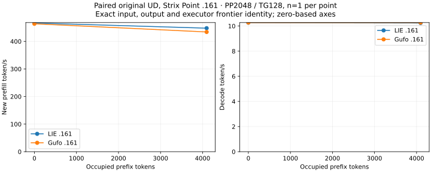
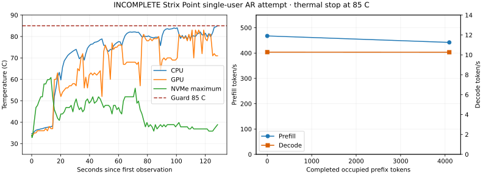

<!-- SPDX-License-Identifier: MIT -->
# Strix Point UD — direct benchmark attempt and paired reference

Date: **2026-10-02**. Target: **pop@192.168.5.161**, Radeon 890M / gfx1150.
Original Unsloth Qwen3.8 Flash Next UD-Q4_K_XL, revision
`38bb39ee97821de2c9009abb7e93950eec396e66`, four SHA-256-verified shards.
Both binaries use the independently fetched Gufo numerical pin
`f783fedb9bea2ec7de941f6da4e02f4a4596b29e`. Model execution is original-weight
GPU inference. LIE uses its C17 reactive dispatch; the comparison binary uses
the direct Gufo adapter. No HTTP, MTP, vision or CPU model forward is involved.
Matching frontiers establish consistency between these two paths using the
same numerical implementation, not an independent model-quality oracle.

The eight-depth `synapse-lie-bench --suite single` campaign was **attempted but
did not finish**. Its 85 C guard stopped it at the start of the 8192-token
prefix point. All samples at depths 0 and 4096 completed before that stop.
A separate, fully completed **matched LIE/Gufo two-point test** confirms exact
physical prompts, generated tokens and both executor frontier hashes on .161.
Both `--suite loading` arms also complete at context capacity 262144. These are the
actual direct-benchmark tests, separate from the earlier 9-token shared-core
smoke in [the port report](STRIX-POINT-RESULT.md).

## Method and exact workload

The test follows the simplified [Gufo-style LIE protocol](CONTEXT-COMPARISON.md):
AR greedy, thinking off, **about 2048 new prefill tokens plus 128 actual output
tokens**, prefill chunk 2048. A live physical prefix is computed in the same
sequence before the measured suffix. The capacity is 133760 for `single`.
Prefill and decode rates use separate completed executor intervals. Prefix
preparation, calibration, loading and plots are outside those intervals.
The paired two-point runs each take **one measured sample and no warmup**, on
separate admitted windows after the machine cooled. They are low-sample
diagnostics with observed values, not confidence intervals. The longer failed
run used **one warmup plus one measured sample per depth** and is retained
separately; its partial values are never substituted into the matched pair.

The direct suite is the same executable family as the earlier .157
[eight-depth result](BENCHMARK-RESULTS.md). The complete requested profile is
depth 0/4096/8192/12288/16384/32768/65536/131072, `pp2048/tg128`. The
[official Gufo table](https://github.com/gufo-org/gufo/blob/main/docs/models/qwen3.8-flash-next/BENCHMARKS.md)
uses these depth and work-size conventions. Its published Halo numbers are a
separate hardware/provenance reference, not an additional measured .161 arm.

## Matched .161 LIE versus direct Gufo

Both campaigns completed with child/supervisor exit 0. Every request generated
the full 128 tokens. The exact physical token IDs, output IDs, full prefill
logit hash and final decode logit hash match at both points. The report
validator accepts the pair without relaxing its input/output checks.

| Occupied prefix | Physical prompt | New PP | LIE PP tok/s | Gufo PP tok/s | LIE TG tok/s | Gufo TG tok/s |
|---:|---:|---:|---:|---:|---:|---:|
| 0 | 2048 | 2048 | 466.491 | 463.717 | 10.2675 | 10.2715 |
| 4096 | 6143 | 2047 | 447.833 | 434.068 | 10.2398 | 10.2714 |

The approximately 0.3% decode gap at 4K is one observation per arm; it does
not establish a performance ranking. Unlike the first failed sweep, these rows
have exactly the same warmup/repetition settings and are the paired comparison.
LIE's observed CPU/GPU peaks are 82.625/77 C; Gufo's are 81.625/76 C. The
whole-device sampled GTT maximum is 88802295808 bytes in each run. Memory
counters overlap with system RAM and are not allocator-exact peaks.

The [paired bundle](benchmarks/2026-10-02/strix-point/paired-short/README.md)
contains both exact raw JSONL files, immutable launch/result/telemetry receipts,
the normal benchmark comparison CSV/JSON/plots and offline reproduction. The
input identities and frontier hashes can be inspected there directly.

The archived .157 Halo `single` rows happen to use the same physical prompt
hashes at depths 0 and 4096, but the generated token IDs and frontier hashes
differ from these .161 rows. The matched .161 LIE/Gufo pair therefore isolates
**no LIE-versus-Gufo divergence at those two points**. The cross-platform
difference remains unexplained by this test; it needs a controlled build,
precision and model-provenance audit before a numerical equivalence claim.
No Halo-to-Point speedup ratio is assigned to that mismatch.

## Eight-depth attempt stopped by temperature

The full-profile `strix-point-bench-single-r1` began with a target
sensor snapshot around CPU 34.6/GPU34 C. Depths 0 and 4096 each completed a
warmup and a measured sample, all with 128 output tokens. At the start of the
8192 warmup, the campaign observed **CPU 85.0 C**, exactly the configured
guard, and stopped its own GPU container. This is a **failed/incomplete**
campaign, not a passing eight-point benchmark.

| Completed point | Physical prompt | Measured PP tok/s | Measured TG tok/s |
|---:|---:|---:|---:|
| 0 | 2048 | 467.567 | 10.2729 |
| 4096 | 6143 | 442.044 | 10.2632 |

These two values are diagnostics inside a failed campaign; the complete paired
table above is the available valid comparison. No values exist for completed
8K, 12K, 16K, 32K, 64K or 128K points. The maximum sampled GPU/NVMe readings
are 83/60.85 C, and the highest sampled whole-device GTT use is
88877793280 bytes. The 114 retained temperature observations show the rise to
the CPU guard. No thermal setting, fan, clock or power limit was altered.

The [thermal attempt bundle](benchmarks/2026-10-02/strix-point/thermal-attempt/README.md)
preserves the partial JSONL, including the `sample_begin` for depth 8192 and
final `failed` event, actual supervisor exit 1, telemetry, command/stderr,
collection hashes and offline diagnostic. The supervisor recorded its partial
file hash **before** the owned benchmark wrote the final failed event during
cleanup. The collected final file is 88886 bytes with its own verified SHA-256;
the two different hashes are correctly labelled as different snapshots.

The owned container exited 1 after the guard stop, with `OOMKilled=false`.
Model file stat identities stayed unchanged, the container and supervisor
retired, the private lease was free, and the authorized `llama-router.service`
was restored active. Fresh read-only collection confirmed both owned processes
absent and the restored service as the observed KFD client. This is a thermal
stop, not an observed OOM or model-fit failure.

## Loading at capacity 256K

Separate LIE and direct Gufo `--suite loading` runs completed with **context
capacity 262144**, one observation each:

| Arm | Model load | Sampled peak GTT | CPU/GPU/NVMe peaks |
|---|---:|---:|---:|
| LIE .161 | 13.750589557 s | 81658789888 bytes | 46/45/67.85 C |
| Gufo .161 | 13.695302901 s | 79662301184 bytes | 40.25/39/63.85 C |

Both report the same upstream model resident estimate 82384141824 bytes and
session estimate 6786984980 bytes; these are not sampled allocations. Both
child/supervisor pairs exit 0 with unchanged model identities, restored service,
free lease and no cleanup failure. The sampled GTT difference is whole-device
accounting across separate runs, not a proven provider allocation difference.

These runs open the model with a 256K capacity. They **do not process a 256K
prompt** or establish full-context numerical correctness or throughput. Both
durations are under uncontrolled existing OS file-cache conditions, not
cold-file or HTTP-ready measurements. The
[loading bundle](benchmarks/2026-10-02/strix-point/loading-256k/README.md)
retains both campaigns and a reproducible plot/CSV.

## Coverage and next gate

| Requested test | .161 outcome |
|---|---|
| Original-weight `lie-bench` PP2048/TG128 at occupied 0 and 4K | Complete matched LIE/Gufo pair, exact prompts/outputs/frontiers |
| Occupied 8K–128K in one ordered sweep | Stopped by CPU 85 C at start of 8K; no passing data |
| Full fresh prefill 8K/32K/128K/256K | Not run after the thermal stop |
| Concurrent C1/2/4/6/8 and serial/reactive comparison | Not run after the thermal stop |
| Model loading at capacity 256K | Paired LIE/Gufo pass, one OS-cache-uncontrolled observation each |
| Actual 256K prompt / 1M context | Not qualified; 1M exceeds current native provider/ABI support |
| Served HTTP :8000 and Pi agent on Point | Not exercised in these direct benchmarks |

The current cooling reaches the 85 C cutoff after about 128 s of this
continuous benchmark. Repeating the same long workload now would predictably
hit the guard again. Completing the long-context and concurrency matrix needs
a sustainable cooling condition within the existing 85 C limit, followed by
fresh one-shot admission and fully completed samples. Short, cooled runs cannot
be silently merged into the ordered eight-depth protocol or used as full-prompt
prefill throughput. Any alternative paced method would have different timing
semantics and require its own paired protocol and label.

All tests use LIE-owned persistent paths under the feature worktree and .161;
no model data was moved back from .161, no DS4 source/evidence was changed,
and no publication/deployment occurred. The latest loading run left the named
service active with PID 10582 and the private LIE lease free at its recorded
collection time. Each result is a timestamped observation, not a standing GPU
window or claim that the machine remains idle later.
