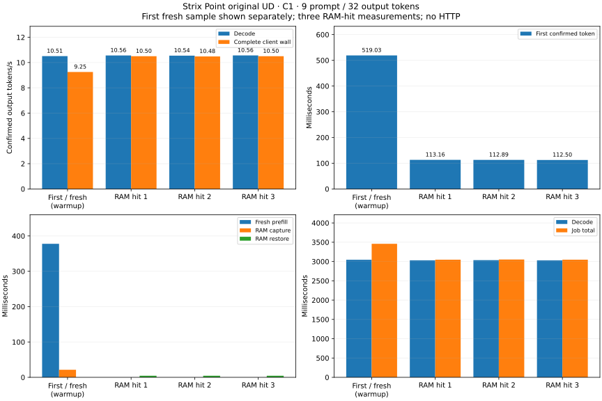
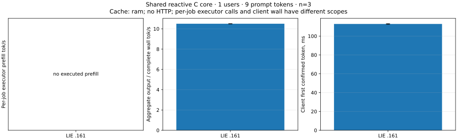
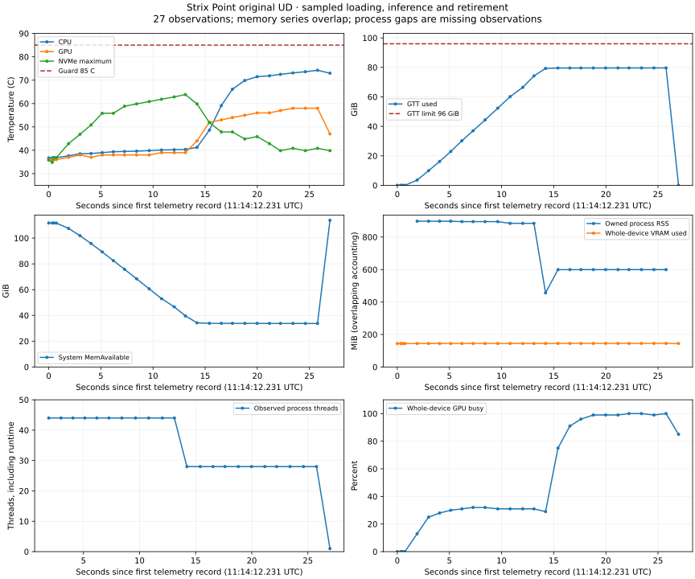

<!-- SPDX-License-Identifier: MIT -->
# Strix Point UD — full report of completed qualification

Report date: **2026-10-02**. Target: **pop@192.168.5.161**.
Recorded inference run: `strix-point-core-ud-r1`, 11:14 UTC.
Implementation/evidence checkpoint: `9ffe25f`, branch `feature/strix-point-ud`.

The original Qwen3.8 Flash Next UD runs on the Radeon 890M through LIE's shared
C17 reactive core and the transitional gfx1150 Gufo adapter. The four copied
model shards are verified; their originals on .157 remain unchanged. The bounded
C1 test completes with **10.556 output tokens/s mean executor decode** and
**112.853 ms mean client TTFT with a full RAM prefix hit**. CPU/GPU peaks are
74.25/58.00 C, below the 85 C campaign guard.

This report covers all completed port/build/runtime/copy/smoke evidence. The
inference workload contains **9 actual prompt tokens and 32 generated tokens**,
with one fresh warmup and three cached repetitions. **4096 is capacity, not a
tested 4K prompt.** Long-context throughput, matched platform comparisons,
independent numerical parity and HTTP performance remain unmeasured on .161.

**Direct-benchmark follow-up:** the requested `synapse-lie-bench` result is
recorded separately in [the Strix Point benchmark report](STRIX-POINT-BENCHMARK-RESULT.md).
Its later LIE/Gufo PP2048/TG128 campaigns complete all eight occupied depths
through 128K under the authorized 100 C ceiling, with exact input/output and
frontier parity. The same report keeps the earlier 85 C failed campaign and
paired 256K-capacity model loads. This original shared-core smoke report remains
the record of the earlier nine-token test; its historical coverage statements
above refer to that earlier test, not the later direct benchmark.

## Hardware, build and model

| Item | Recorded configuration |
|---|---|
| CPU / GPU | AMD Ryzen AI 9 HX 370 / Radeon 890M |
| HIP target | gfx1150, wave32; no architecture override |
| OS / kernel | Pop!_OS 24.04 / `6.16.3-76061603-generic` |
| System MemTotal | 132546039808 bytes / 123.44 GiB after reboot |
| HIP/GTT limit | 103079215104 bytes / 96 GiB after authorized TTM tuning |
| Reported VRAM total | 2147483648 bytes / 2 GiB; shares physical RAM |
| Runtime | Existing private ROCm 7.2.0; probe driver/runtime value `70226015` |
| Container | Existing image `sha256:29e3b2b4b984ddb2614068271b2967bdc941664690468390c907508b5da8c2ac` |
| Execution path | Direct shared reactive C core; no HTTP transport |
| Numerical provider | `gufo-embedded-f783fedb`, ownership `delegated` |
| Independently fetched Gufo pin | `f783fedb9bea2ec7de941f6da4e02f4a4596b29e` |
| Candidate | Build ID `strix-point-ud-r3`; build checkpoint `3ea2f3c` |
| Campaign source checkpoint | `7125a9e`; immutable runner and manifest retained |
| Bench executable SHA-256 | `92744f130045a5d9e8588d6dc15ba642b17f0e5060cb72a115b8e2366c9c9aed` |
| Model | `unsloth/Qwen3.8-Flash-Next-GGUF`, UD-Q4_K_XL |
| Model revision | `38bb39ee97821de2c9009abb7e93950eec396e66` |
| Total trunk files | 111334654784 bytes / 111.33 GB / 103.69 GiB |

The persistent model directory is
`/home/pop/workspace/synapse-lie/models/qwen38-flash-next-ud-38bb39ee`.
No model conversion, re-quantization or CPU model forward was used. The metadata
shard and all three data shards are retained; the optional MTP sidecar is outside
this test. File bytes and GTT usage describe different quantities and must not
be treated as equivalent memory requirements.

| Shard suffix | Bytes | Verified SHA-256 |
|---|---:|---|
| `00001-of-00004.gguf` | 10946624 | `4448186216b3af4cc558bbce2c3213f01608f8f8b2e5267a9767971dd3ec8082` |
| `00002-of-00004.gguf` | 49859583136 | `3f342f1c1580473f1ee94ddd5b28206e8c07a70fa1a366f59d1d6c922919a6c9` |
| `00003-of-00004.gguf` | 49376141504 | `56758f40269cad5cd9b0d3d6fbae0f40f6d5be6de49e4ab392dbe83157d9cbd3` |
| `00004-of-00004.gguf` | 12087983520 | `753bda48b98ba4f1636134a90a967de1b2d3908a236c026e464777342e53510a` |

Full filenames, artifact hashes and launch configuration are in the portable
[campaign manifest](benchmarks/2026-10-02/strix-point/report/input/manifest.json).
Build provenance and architecture checks are in the
[port report](STRIX-POINT.md#implemented-platform-boundary) and
[build receipt](benchmarks/2026-10-02/strix-point/receipt.json).

## Workload and timing definitions

| Parameter | Value |
|---|---|
| Prompt | `The sum of 2 and 2 is` |
| Input | Raw text, no chat template; 9 physical token IDs |
| Input ID SHA-256 | `d9ffbbe13f1f89407ac959615971c4829f1a018f60ada747062256dfd8157464` |
| Context capacity / prefill chunk | 4096 / 2048 tokens |
| Concurrent users | 1 |
| Output | AR, 32 tokens and 61 bytes in each sample; finish `length` |
| Samples | 1 warmup + 3 measured repetitions in the same loaded process |
| RAM prefix retention | Enabled, 4294967296-byte budget / 4 GiB |
| SSD persistence | Disabled; no disk-cache reads or writes |
| MTP / vision | Not exercised |
| Bench deadline / supervisor bound | 600000 ms / 900 s |

The recorded command inside the admitted container was equivalent to:

```sh
/bundle/runtime/bin/synapse-lie-bench --suite core \
  --model /model/Qwen3.8-Flash-Next-UD-Q4_K_XL-00001-of-00004.gguf \
  --prompt-file /work/prompt.txt --output /work/measurements.jsonl \
  --timeout-ms 600000 --context 4096 --chunk 2048 --users 1 \
  --tg 32 --warmups 1 --repetitions 3
```

The command records the workload; it does not replace campaign admission,
temperature supervision or service restoration. The complete container command
and exit records are retained in the [core receipt](benchmarks/2026-10-02/strix-point/core-receipt.json).

Prefill and decode durations are sums of executor-call wall durations measured
by the core. Decode throughput is confirmed output tokens divided by that
sample's decode duration. Client TTFT runs from submission to the first observed
confirmed token; job total runs to the observed terminal event. Complete-wall
throughput divides output tokens by the benchmark sample window. These are
different scopes: TTFT overlaps execution, and the duration columns should not
all be added. Model loading is outside every per-sample timing.

## All samples, including prefill

Durations below are milliseconds, rounded to six decimals; CSV and JSON retain
integer nanoseconds. Every sample produces exactly 32 output tokens.

| Sample | New / cached prompt tokens | Prefill ms | TTFT ms | Decode ms | Job total ms | Complete wall ms |
|---|---:|---:|---:|---:|---:|---:|
| 0 — fresh warmup | 9 / 0 | 377.705472 | 519.029494 | 3045.064078 | 3458.391445 | 3458.391675 |
| 1 — RAM hit | 0 / 9 | 0 | 113.159497 | 3030.210336 | 3047.771942 | 3047.772082 |
| 2 — RAM hit | 0 / 9 | 0 | 112.893369 | 3034.868986 | 3052.352993 | 3052.353194 |
| 3 — RAM hit | 0 / 9 | 0 | 112.504772 | 3029.557632 | 3046.961235 | 3046.961335 |

| Sample | Fresh PP token/s | Decode token/s | Output / complete wall token/s | RAM capture ms | RAM restore path ms |
|---|---:|---:|---:|---:|---:|
| 0 — fresh warmup | 23.828090 | 10.508810 | 9.252856 | 21.444582 | 0.000361 |
| 1 — RAM hit | N/A | 10.560323 | 10.499473 | 0 | 4.482426 |
| 2 — RAM hit | N/A | 10.544112 | 10.483715 | 0 | 4.449926 |
| 3 — RAM hit | N/A | 10.562598 | 10.502267 | 0 | 4.451860 |

The 23.828090 token/s value is only the arithmetic rate of the **single first
9-token prefill**, including first-use effects; it is not steady-state prefill
throughput. The three measured samples restore all nine tokens and execute
**zero prefill calls**. Their prefill rate is undefined, not zero or infinite.
The first sample's 361 ns restore-path timer has zero restored tokens and is
not a successful restore latency.

All input/output IDs and per-sample counters are in
[measurements.jsonl](benchmarks/2026-10-02/strix-point/report/input/measurements.jsonl).
[samples.csv](benchmarks/2026-10-02/strix-point/report/generated/samples.csv) includes
all job fields, all sample counters, exact nanoseconds and calculated rates.
All four output ID sequences match, including warmup. This is repeatability
evidence; no independent logits oracle or model-quality suite was run on .161.



## Measured distribution and loading

Only repetitions 1–3 contribute to this table. There are three observations
from one process, not independent repeated model loads; min/max is the observed
range, not a confidence interval. No p95/p99 estimate is justified.

| Metric | Mean | Median | Minimum | Maximum |
|---|---:|---:|---:|---:|
| Executor decode token/s | 10.555678 | 10.560323 | 10.544112 | 10.562598 |
| Output / complete wall token/s | 10.495151 | 10.499473 | 10.483715 | 10.502267 |
| Client TTFT ms | 112.852546 | 112.893369 | 112.504772 | 113.159497 |
| RAM restore ms | 4.461404 | 4.451860 | 4.449926 | 4.482426 |
| Decode ms | 3031.545651 | 3030.210336 | 3029.557632 | 3034.868986 |
| Job total ms | 3049.028723 | 3047.771942 | 3046.961235 | 3052.352993 |
| Complete wall ms | 3049.028870 | 3047.772082 | 3046.961335 | 3052.353194 |

**Load to core ready: 13.439568845 s**, observed once. The files had recently
been copied and hashed, and the OS file cache was not controlled. This cannot
be labelled cold-file loading, compared to a cold disk read, or generalized
to startup under memory pressure. The container lifetime was approximately
26.412 s (11:14:12.854584–11:14:39.266415 UTC), including startup and retirement.

The normal shared-core benchmark view is also exported, with its complete-wall
throughput definition and explicit absence of measured fresh prefill:



## RAM cache, batching and reactive execution

| Counter / state | Fresh warmup | Each measured repetition |
|---|---:|---:|
| RAM hits / misses | 0 / 1 | 1 / 0 |
| RAM captures / evictions | 1 / 0 | 0 / 0 |
| Retained state bytes | 119324800 | 119324800 |
| Prefill calls | 1 | 0 |
| Decode single calls | 32 | 32 |
| Decode batches / batch rows | 0 / 0 | 0 / 0 |
| SSD cached tokens / reads / writes | 0 / 0 / 0 | 0 / 0 / 0 |

The retained prefix state is about 113.797 MiB within a 4 GiB lazy budget. It
contains the model state required by the adapter for continuation; the budget
is not the total device KV/state allocation. This case validates repeated
full-prefix RAM reuse, with matching generated IDs. It does not establish
partial-prefix, eviction, SSD persistence or independent restored-logit parity
on this target.

Reactive execution is exercised **inside the shared core**: the benchmark
submits jobs, consumes bounded flow events, releases tickets and requests more
token credit. The same core owns scheduling and retirement for HTTP clients.
The numerical forward remains delegated and synchronous at the executor-call
boundary. See [the core boundary](ARCHITECTURE.md#shared-core-and-client-boundary)
and [inference scheduling analysis](INFERENCE-REACTIVE.md).

This C1 test has no peer ready rows, so it issues 32 single decode calls per
sample and no native GPU batches. It measures neither multi-client scaling nor
a reactive-versus-serial speedup. Reduced warm TTFT accompanies prefix reuse and
first-use differences; it cannot be attributed to reactive scheduling from this
experiment. Native batching, scheduler benefit and responsiveness require their
own matched controls on .161.

The core has one device-owner thread in this implementation. Telemetry observes
**44 process threads during loading, 28 later, and 1 at retirement**. Those are
whole-process observations including runtime/helper threads, not a configured
44-worker inference engine. Per-thread CPU roles and thread-affinity settings
were not captured, and no thread-count sweep was performed.

## Memory, utilization and temperatures

There are 27 telemetry records from 11:14:12.231308 to 11:14:39.201123 UTC.
The median interval is 1.149 s; the maximum interval is 1.214 s, with several
shorter admission samples. Reported peaks are sampled observations, not exact
allocator high-water marks. Process rows match the recorded PID, start ticks
and owned container cgroup. Missing process status remains missing, not zero.

| Observation | Value |
|---|---:|
| Peak CPU / GPU / NVMe temperature | 74.25 / 58.00 / 63.85 C |
| Temperature guard | 85 C; no sampled violation |
| Peak whole-device GTT used | 85505114112 bytes / 79.633 GiB |
| GTT limit minus sampled maximum | 16.367 GiB; not guaranteed usable context space |
| Peak whole-device VRAM used | 151977984 bytes / 144.938 MiB |
| Minimum system MemAvailable | 36227399680 bytes / 33.739 GiB |
| Maximum observed process RSS / VmHWM | 941244416 bytes / 897.641 MiB |
| Observed process VmSwap | 0 bytes in available status rows |
| Maximum system swap use | 4096 bytes; system-wide, not attributed to LIE |
| Whole-device GPU busy | 0–100%; includes loading and retirement |
| Power, clocks, energy, per-thread utilization | Not recorded |

GTT, VRAM, file mappings, RSS and system RAM are overlapping views on this shared
memory machine. **Do not sum them.** RSS alone does not describe device-resident
weights. Neither the remaining GTT limit nor MemAvailable proves long-context
fit. Sustained thermal behavior and throttling were not qualified by this
roughly 26-second run; no claim of stable clocks or energy efficiency follows.
Some process file-descriptor reads were permission-denied; cooperative leases
and observable KFD/DRI admission are not universal process-visibility proof.



Every sensor sample, including individual NVMe sensors, is retained in
[temperatures.csv](benchmarks/2026-10-02/strix-point/report/generated/temperatures.csv).
The process/memory/GPU series is in
[telemetry.csv](benchmarks/2026-10-02/strix-point/report/generated/telemetry.csv),
with the unchanged [raw telemetry](benchmarks/2026-10-02/strix-point/report/input/telemetry.jsonl).

## Tuning, copy and completed validation

The authorized TTM change raises `pages_limit` from 16179861 to 25165824 pages
at 4096 bytes/page: reported HIP memory increases from 61.72 to 96 GiB. This is
an allocation ceiling, not a 96 GiB reservation. The owned modprobe file and
current-kernel initramfs were updated and a new boot verified. No CPU/GPU
power, clock, fan or BIOS tuning was applied. The
[TTM receipt](benchmarks/2026-10-02/strix-point/ttm96-receipt.json) preserves the
backup, rollback, actual exits, changed boot ID and post-boot HIP probe.

The direct SSH copy from .157 delivered the missing 79739222784 bytes on top
of retained destination data. All four complete destination files were then
SHA-256 verified. Source file identities were unchanged; originals were never
renamed, removed or moved. The completed R2 recheck copied zero payload bytes.
Model data did not pass through the editing host. The
[copy receipt](benchmarks/2026-10-02/strix-point/copy-receipt.json) records both
attempts, source preservation and final release of both hosts' leases.

| Completed check | Result and evidence scope |
|---|---|
| Local port ASan/UBSan suite | 34/34 passed at its recorded checkpoint; CPU fixtures |
| Target headless core ASan/UBSan | 6/6 passed; no GPU/model inference |
| Numerical build | 38 steps complete; ten inspected device ELF headers identify gfx1150 |
| No-device startup | Server help and both benchmark identities pass with target runtime |
| HIP probe fault fixtures | 20 cases pass locally and on .161; synthetic failures |
| Real HIP/rocBLAS probe | Pass before and after TTM change; 48-byte explicit allocation and 2x2 SGEMM |
| Original model copy | Four sizes/digests verified; source unchanged |
| Copy regression | Seven small fixtures, including real-pipe EOF-before-ACK |
| Latest focused CTest | 4/4; campaign/download/copy controls and ASan/UBSan core contract |
| Original-weight core smoke | Four complete samples; matching IDs; child/supervisor exit 0 |

These counts describe different checkpointed suites and are not added into a
single current test total. CPU fixtures, compilation and diagnostic SGEMM do
not substitute for original-weight numerical or performance qualification.

## Preserved failures and operational closure

Earlier failures remain in the receipts: thermal pre-launch refusals on the
editing host, initial container/sysfs exposure failure, a missing runtime
library startup exit 127, and a HIP campaign pre-launch refusal while the
authorized service's KFD entry was still retiring. Subsequent bounded fixes
and successful checks are recorded separately in the [port history](STRIX-POINT.md).

WAN attempts and the slower relay were intentionally interrupted. Direct-copy
R1 delivered and verified the model bytes but exposed an EOF/ACK deadlock;
source/controller exit 1 remains a failed control result. The descriptor fix
and subprocess regression precede R2, which completed with sender, receiver
and controller exit 0. A later collection attempt also retained its exit 1
for an optional absent progress file in a zero-payload recheck. None of these
failures is relabelled as a successful inference run.

Post-reboot system health was `degraded`: the COSMIC greeter reported no display
output, gpu-manager hit its restart limit, and an NPU firmware protocol mismatch
was logged. HIP subsequently passed. Causality with the TTM change was not
established; no display/NPU repair was included. The model run retained the
stderr message `/usr/share/libdrm/amdgpu.ids: No such file or directory` while
exiting 0. This report therefore does not declare the entire OS healthy.

For the model run, cleanup completed at **11:14:40.601764 UTC** with no cleanup
failures, no recorded container OOM and unchanged model file identities. The
owned container was removed, the private lease released and the named
`llama-router.service` restored active. A fresh postflight at **11:18:38 UTC**
verified supervisor and GPU child absent, lease free, and service PID 5668
active; the observed KFD entry belonged to that restored service. These are
timestamped closure observations, not a claim about the machine's later state.

## Coverage still required for a full performance campaign

| Workload / question | .161 status | Missing evidence |
|---|---|---|
| Original UD, C1, 9 prompt / 32 output | PASS, bounded smoke | Broader output/correctness cases |
| Direct `single` PP2048/TG128 at occupied 0/4K | PAIRED PASS | Matched LIE/Gufo values in the direct-benchmark follow-up |
| Fresh PP at 2K, 4K, 8K, 32K, 64K, 128K | NOT RUN | Physical prompts, independent fresh repetitions, PP/TG/TTFT |
| Occupied-prefix depth through 128K | NOT RUN | Fixed fresh tail, explicit reused tokens and cache timing |
| 256K and 1M contexts | 256K-capacity load only | Position/model/runtime support, numerical checks, full-prompt fit; 1M unavailable |
| Native C2/C4/C8 | NOT RUN | Matched prompts, confirmed batch rows, total and per-user throughput |
| Reactive versus serial | NOT RUN | Same executor/settings/cache/workload with scheduling control |
| Gufo / Halo / external benchmark comparison | NO MATCHED ARM | Same model, physical IDs, output budget, cache and timing scope |
| Fresh versus restored independent logits | NOT RUN | Exact numerical oracle, partial hits, repeatable checkpoints |
| RAM eviction and SSD persistence | NOT RUN on .161 | Bounded pressure, read/write/restore correctness and costs |
| HTTP :8000 / SSE / Pi agent | NOT RUN on .161 | Actual model-serving protocol and client/lifecycle checks |
| MTP / vision | NOT QUALIFIED | Implementation/device support and dedicated numerical/performance suites |
| Sustained load / power / throttling | NOT RUN | Longer guarded runs and additional counters |

The next measurable step is a matched original-weight numerical baseline,
followed by fresh-prefill and prefix-reuse matrices through 128K, then native
concurrency and served checks. Larger contexts require their own admission and
support gates; the present data cannot decide 1M feasibility. Historical .157
results remain available in [the core GPU report](CORE-GPU-RESULT.md), but a
ratio against this 9-token RAM-hit smoke would mix workloads and is not reported.

## Reproduce and inspect

The [portable report bundle](benchmarks/2026-10-02/strix-point/report/README.md)
contains the unchanged measurements/telemetry/manifest, every sample as CSV,
statistics JSON/CSV, SVG/PNG charts, a source/artifact SHA-256 manifest and the
offline generator. It reuses the existing benchmark validator, checks receipt
hashes, output identity, campaign exits, model preservation and closure before
reporting values. Generation uses local CPU only; it does not access models,
remote hosts or GPUs.

```sh
python3 -B docs/benchmarks/2026-10-02/strix-point/report/make-report.py \
  run/strix-point-report-reproduced
```

Use a new output directory. Existing Matplotlib is required; no dependency
installation or new GPU campaign was performed to produce this report.
