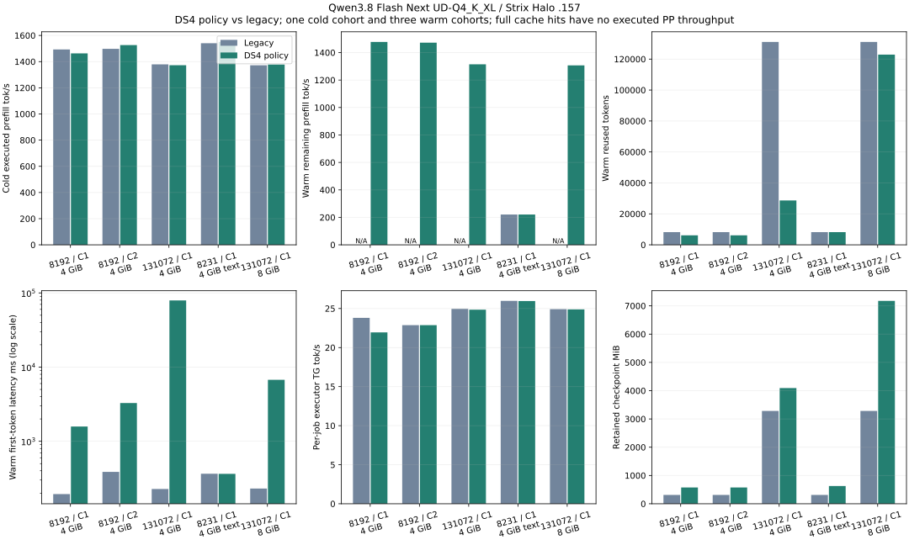

<!-- SPDX-License-Identifier: MIT -->
# DS4-style cache policy: GPU qualification and retention cost

> Historical technical record. See [current usage](../guides/USAGE.md) and
> [benchmark tables and graphs](../benchmarks/README.md). Results below retain
> their original build, protocol and limitations.

The shared C17 policy restores exact same-provider state, including a completed
generated frontier and a checkpoint created with a smaller context capacity.
It does **not** improve repeated identical prompts automatically. Under the
default 4 GiB RAM budget, progressive and final captures at 128K evict the latest
reusable waypoint: warm requests recover 28672 tokens and execute 102400 again.
This is a measured regression relative to the legacy full-prompt checkpoint.
The policy remains default-ON and independently optional, as requested;
`--cache-policy legacy` selects the earlier schedule in the same executable.

The final frozen build completes 15 GPU arms across R9/R10/R11, with five
matched core comparisons and six exact state pairs. Initial failures remain
explicitly recorded below. Local qualification includes the full 33-test
ASan/UBSan/LeakSanitizer suite with features ON and OFF, plus focused repair
checks. [CPU receipt](../benchmarks/2026-10-02/ds4-policy-repair-cpu/receipt.json).

This qualifies cache policy, not the DS4 KVC binary format, cross-quantization
reuse, a high-ratio Qwen codec or an autonomous numerical executor. See the
[implementation and remaining parity](../reference/CACHE-DS4-POLICY.md).

## Protocol and source

R9 and its missing-arm continuations use frozen source `f11ab7f`, build
`ds4-policy-linked-r2`, on the designated `.157` Strix Halo/gfx1151 host.
Qwen3.8 Flash Next UD-Q4_K_XL and the pinned Gufo numerical provider
`f783fedb9bea2ec7de941f6da4e02f4a4596b29e` remain unchanged. The later `fffaabb`
shortcut when both cache tiers are disabled has separate CPU evidence; it is
not part of this GPU binary.

Core comparisons use context 262144, chunk 2048, TG 128, one cold cohort and three
warm cohorts. Legacy and DS4 select different checkpoint schedules in the same
executable. Utility and lossless packing admission remain enabled in both;
the tested checkpoints stay raw. These are shared-core clients, without HTTP.
All physical-prompt witnesses and 128 output IDs must match the paired control.
Warm per-job timings are medians; C2 executor durations overlap and must not be
summed into cohort throughput. One cold cohort is not a confidence interval.

## Completed state checks

- Capture after 8192 prefilled tokens plus 128 greedily generated tokens:
  three independent replay/restore pairs match every checked logit frontier
  and 16 subsequent output IDs. Capture takes 24.958 ms; restore 5.506–5.672 ms;
  retained allocation 329.944 MB. Replay generation time is separately reported.
- SSD producer context 131072 and restarted reader context 262144, checkpoint 8192:
  three pairs pass (greedy, seeded sampling and independent greedy clone).
  Read/validation takes 183.127 ms; device restore 5.640–7.021 ms. Stable model/state
  identity matches across processes. Model load and the approximately 61-second
  full identity hash are startup costs, reported separately from checkpoint read.

These are exact same-provider state checks. Sampler/RNG state is fresh on restore.
They do not qualify import/export of a checkpoint produced by DS4.

## Performance interpretation

At 128K and 4 GiB, median warm TTFT rises from **227.310 ms to 79195.415 ms**:
102400 tokens are recomputed, and repeated captures cost another 1253.801 ms
per job. Final conversation state competes with reusable prompt waypoints.
This is a large default-budget regression for repeated identical prompts.

With an explicit **8 GiB** budget, the same policy keeps the 122880-token waypoint.
Warm TTFT falls to **6737.794 ms**, including 8192 tokens of remaining prefill,
versus **230.606 ms** for the matched legacy full hit. Retention rises to
7524.343 MB versus 3441.461 MB. More memory alleviates eviction pressure; it does
not eliminate the policy's intentionally uncached tail or make it a compression
improvement. The one cold DS4 capture total is 1971.341 ms at 8 GiB.

At 8K, default trimming leaves 2048 tokens of PP in C1 and C2, reducing cohort
output/wall throughput by about 25.0% and 32.0% respectively. On the 8231-token
text input, both schedules retain the same 8192-token prefix and have similar
warm latency. Executor TG is broadly similar in C2 and 128K; the C1/8K sample
also decreases from 23.803 to 21.942 tok/s. Fixed ordering, temperatures and only
three warm cohorts prevent assigning that variation causally to the policy.
No reactive speedup is established by these comparisons.

Progressive/final checkpoints serve conversation continuation, whereas this
campaign deliberately repeats identical prompts. Their benefit on growing,
diverging conversations needs its own workload. The current result supports
keeping the previous schedule selectable; it does not establish a universally
better cache policy. Original-weight HTTP/C2 disk-wait responsiveness with this
new schedule remains unmeasured; the earlier R5 HTTP results bind their own build.

## Retained failures

R8 source `80b6273` passes SSD context growth and the legacy 8K control, then fails
normal completion capture because the adapter still rejects a source that has
started sampling. The fix in `f11ab7f` permits completed source capture while
keeping restore destinations empty and unstarted. It also publishes capture
errors before waking clients. The failed run and actual exit 1 remain archived.

All nine R9 GPU children complete with exit 0. Its controller remains **FAILED**:
the harness expected 122880 warm reused tokens at 128K, but all three repeats
observed 28672 under the 4 GiB limit. Offline validation independently confirms
matching output IDs. This correction does not turn the retention regression
into a performance pass. Four remaining arms were not launched in R9.

R10's raw-text legacy child also completes with exit 0. Its controller expected
8231 reused tokens instead of the legacy aligned boundary 8192; 39 tokens are
correctly prefilled on every repeat. R11 corrects that harness assumption and
references the retained control by exact file SHA256, without repeating it.

## Complete timing tables

Times below are milliseconds; MB means decimal bytes / 1,000,000. Cold values come from one cohort; warm values are medians of three cohorts except the single SSD reader. A dash in warm PP throughput means no prefill was executed.

| Prompt / users / RAM GiB | Policy | Cold PP tok/s | Cold capture ms | Warm reused | Warm executed PP | Warm PP tok/s |
|---|---|---:|---:|---:|---:|---:|
| 8192 / C1 / 4 | legacy | 1493.160 | 14.566 | 8192 | 0 | — |
| 8192 / C1 / 4 | ds4 | 1463.034 | 27.279 | 6144 | 2048 | 1477.469 |
| 8192 / C2 / 4 | legacy | 1497.597 | 7.398 | 8192 | 0 | — |
| 8192 / C2 / 4 | ds4 | 1526.571 | 13.895 | 6144 | 2048 | 1471.986 |
| 131072 / C1 / 4 | legacy | 1378.947 | 117.874 | 131072 | 0 | — |
| 131072 / C1 / 4 | ds4 | 1372.576 | 1265.889 | 28672 | 102400 | 1314.608 |
| 8231 / C1 / 4 text | legacy | 1540.587 | 15.140 | 8192 | 39 | 220.588 |
| 8231 / C1 / 4 text | ds4 | 1550.398 | 30.363 | 8192 | 39 | 220.449 |
| 131072 / C1 / 8 | legacy | 1372.167 | 123.871 | 131072 | 0 | — |
| 131072 / C1 / 8 | ds4 | 1377.772 | 1971.341 | 122880 | 8192 | 1306.633 |

| Prompt / users / RAM GiB | Policy | Warm restore ms | Warm capture ms | Warm TTFT ms | Executor TG tok/s | Cohort output/wall tok/s | Retained MB |
|---|---|---:|---:|---:|---:|---:|---:|
| 8192 / C1 / 4 | legacy | 5.567 | 0.000 | 194.177 | 23.803 | 23.159 | 326.699 |
| 8192 / C1 / 4 | ds4 | 4.999 | 0.005 | 1579.328 | 21.942 | 17.374 | 604.730 |
| 8192 / C2 / 4 | legacy | 5.662 | 0.000 | 386.932 | 22.867 | 42.464 | 326.699 |
| 8192 / C2 / 4 | ds4 | 4.991 | 0.004 | 3274.529 | 22.868 | 28.869 | 604.730 |
| 131072 / C1 / 4 | legacy | 42.207 | 0.000 | 227.310 | 24.953 | 24.076 | 3441.461 |
| 131072 / C1 / 4 | ds4 | 11.486 | 1253.801 | 79195.415 | 24.852 | 1.516 | 4290.532 |
| 8231 / C1 / 4 text | legacy | 5.625 | 0.000 | 365.033 | 25.977 | 24.364 | 326.699 |
| 8231 / C1 / 4 text | ds4 | 5.606 | 0.006 | 363.516 | 25.955 | 24.347 | 657.681 |
| 131072 / C1 / 8 | legacy | 42.284 | 0.000 | 230.606 | 24.913 | 24.043 | 3441.461 |
| 131072 / C1 / 8 | ds4 | 49.990 | 0.020 | 6737.794 | 24.884 | 10.810 | 7524.343 |

The checkpoint memory figures cover retained host allocation, not total process RSS or active GPU KV. Every tested retained checkpoint remains raw: retained and expanded bytes are equal. No high compression ratio is obtained. Capture timing is cumulative within each job; source snapshots and all individual jobs remain in the archive.

Completion-time job/sample metrics can precede the final asynchronous SSD write.
They are not a shutdown-drained disk inventory. The core drains that write before
STOPPED; the restarted reader and supervised postflight inventory establish the
committed files. Likewise, finish-capture cost must not be inferred solely from
TTFT; capture totals and request/retirement timing are distinct observations.

## Automatic SSD policy across restart

RAM is disabled; SSD quota is 8 GiB, staging and index limits are 4 GiB each. Producer capacity is 131072; reader capacity is 262144. Each process issues one 8192-token request and generates 128 tokens. The reader, producer and fresh RAM control produce the same 128 output IDs. These two samples qualify this path; they are not a latency distribution.

| Process | Reused tokens | Executed PP | PP tok/s | Read/validate ms | Restore ms | Capture ms | TTFT ms | Executor TG tok/s |
|---|---:|---:|---:|---:|---:|---:|---:|---:|
| producer | 0 | 8192 | 1494.302 | 0.000 | 0.000 | 27.819 | 5693.975 | 25.534 |
| reader | 6144 | 2048 | 1378.007 | 131.711 | 16.171 | 15.359 | 1990.421 | 24.764 |

## Thread and thermal observations

The shared core retains one device owner; SSD adds one I/O worker. Whole-process thread observations include HIP/provider/loading workers. They do not count only LIE scheduler threads. No thread-count experiment or reactive speedup is claimed.

| Arm | Process thread range | Thread range at GPU busy ≥50% | CPU peak C | GPU peak C |
|---|---:|---:|---:|---:|
| core-p8192-c1-legacy | 1–52 | 36–36 | 92.375 | 93.000 |
| core-p8192-c1-ds4 | 1–52 | 36–36 | 94.000 | 94.000 |
| core-p8192-c2-legacy | 1–52 | 36–36 | 97.875 | 98.000 |
| core-p8192-c2-ds4 | 1–52 | 36–36 | 98.000 | 99.000 |
| core-p131072-c1-legacy | 1–52 | 36–36 | 98.250 | 99.000 |
| core-p131072-c1-ds4 | 1–52 | 36–36 | 98.125 | 100.000 |
| core-ptext-c1-legacy | 1–52 | 36–36 | 93.375 | 90.000 |
| core-ptext-c1-ds4 | 1–52 | 36–36 | 92.375 | 90.000 |
| core-ssd-p8192-write | 1–52 | 37–37 | 90.125 | 91.000 |
| core-ssd-p8192-read | 1–52 | 37–37 | 90.000 | 89.000 |
| core-p131072-c1-8g-legacy | 1–52 | 36–36 | 97.750 | 98.000 |
| core-p131072-c1-8g-ds4 | 1–52 | 36–36 | 98.250 | 100.000 |

The per-arm peaks above come from the supervisor. The independent 1 Hz observer also records gaps, reported clocks and threshold episode durations; its peaks may differ because sampling times differ.

| Campaign | Samples | CPU peak C | GPU peak C | NVMe composite C | Hottest NVMe sensor C |
|---|---:|---:|---:|---:|---:|
| ssd-gpu-r8 | 269 | 94.875 | 98.000 | 58.850 | 76.850 |
| ssd-gpu-r9 | 1057 | 98.125 | 100.000 | 65.850 | 81.850 |
| ssd-gpu-r10 | 47 | 93.375 | 94.000 | 58.850 | 76.850 |
| ssd-gpu-r11 | 492 | 98.125 | 99.000 | 62.850 | 79.850 |

R9 observes GPU 100 C in five isolated samples, each bracketed by below 100 C readings within at most 2.018 seconds. That observer records CPU 98.125 C; the supervisor reaches 98.250 C and also samples GPU 100 C in R11. All readings are from `.157`. There is no observed reboot, crash or device error. These are sampled observations, not a safe-temperature limit or proof that throttling never occurred. CPU/GPU hardware bounds and NVMe guards remain enabled; no fan, clock or power setting was changed.

## Evidence and closure

- ssd-gpu-r8: closure **2026-10-02T14:06:00.539460+00:00**, 8 owned identities absent, KFD empty, four unchanged/free leases; 49 collected files SHA-verified. Observer exits 0 at 2026-10-02T14:06:16.094468+00:00. Controller retirement is separately observed.
- ssd-gpu-r9: closure **2026-10-02T14:42:10.456303+00:00**, 18 owned identities absent, KFD empty, four unchanged/free leases; 95 collected files SHA-verified. Observer exits 0 at 2026-10-02T14:42:26.574409+00:00. Controller retirement is separately observed.
- ssd-gpu-r10: closure **2026-10-02T14:44:49.080054+00:00**, 2 owned identities absent, KFD empty, four unchanged/free leases; 22 collected files SHA-verified. Observer exits 0 at 2026-10-02T14:45:05.154928+00:00. Controller retirement is separately observed.
- ssd-gpu-r11: closure **2026-10-02T14:56:30.025088+00:00**, 10 owned identities absent, KFD empty, four unchanged/free leases; 58 collected files SHA-verified. Observer exits 0 at 2026-10-02T14:56:45.219419+00:00. Controller retirement is separately observed.

[Full CSV](../benchmarks/2026-10-02/ds4-policy-gpu/summary.csv), [JSON](../benchmarks/2026-10-02/ds4-policy-gpu/summary.json), [receipt and archive](../benchmarks/2026-10-02/ds4-policy-gpu/receipt.json), [R9 thermal timeline](../benchmarks/2026-10-02/ds4-policy-gpu/ssd-gpu-r9-thermal.svg), [R11 thermal timeline](../benchmarks/2026-10-02/ds4-policy-gpu/ssd-gpu-r11-thermal.svg). The archive preserves failed controllers, successful child results, full commands and frozen source. Analysis runs offline without a GPU or model.
