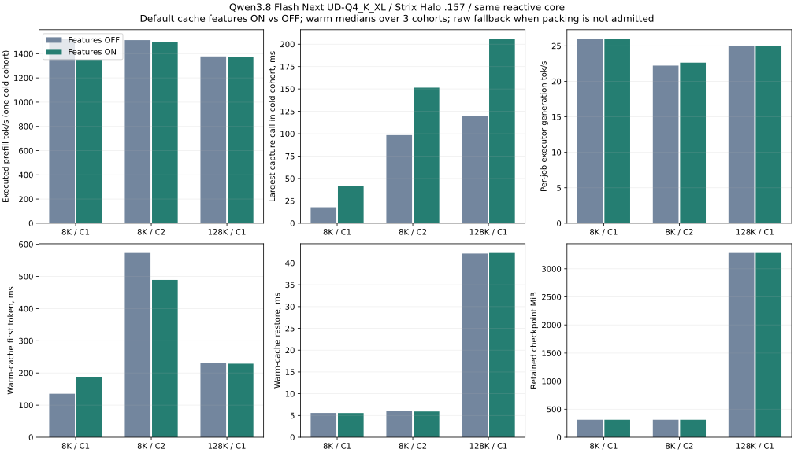

<!-- SPDX-License-Identifier: MIT -->
# Cache build features and original-weight HTTP SSD — R5

> Historical technical record. See [current usage](../guides/USAGE.md) and
> [benchmark tables and graphs](../benchmarks/README.md). Results below retain
> their original build, protocol and limitations.

R5 passes 9/9 arms on `.157`, source `3b20903`, pinned Gufo `f783fedb`,
Qwen3.8 Flash Next UD-Q4_K_XL, HIP/gfx1151. This tests the initial LZ4 codec.
It does not qualify the subsequent byte-plane/Zstandard revision.

Core compares both features OFF (LRU/raw) against both ON (utility/LZ4), same
context 262144/chunk 2048, 4 GiB RAM budget, TG128, one retained cold warmup and
three measured warm cohorts. All output IDs match. No compression is accepted
on these states: the codec falls back to raw. Three 8K state pairs also match
all logits and tokens; because those states stay raw, this is not compressed
original-weight state qualification.

| Prompt/users | Build | Cold PP tok/s | Cold capture ms | Warm restore ms | Warm TTFT ms | Executor TG tok/s | Aggregate output/wall tok/s | Retained MiB |
|---|---|---:|---:|---:|---:|---:|---:|---:|
| 131072/1 | OFF | 1377.684 | 119.638 | 42.176 | 230.327 | 24.933 | 24.039 | 3282.033 |
| 131072/1 | ON | 1372.952 | 205.906 | 42.313 | 228.840 | 24.940 | 24.054 | 3282.033 |
| 8192/1 | OFF | 1522.407 | 17.839 | 5.584 | 135.335 | 25.975 | 25.475 | 311.565 |
| 8192/1 | ON | 1351.470 | 41.389 | 5.567 | 186.491 | 25.970 | 25.215 | 311.565 |
| 8192/2 | OFF | 1512.451 | 98.411 | 5.982 | 573.110 | 22.216 | 41.481 | 311.565 |
| 8192/2 | ON | 1498.270 | 151.510 | 5.922 | 489.219 | 22.624 | 42.107 | 311.565 |

Warm values are medians. Cold PP/capture use the one cold cohort; C2 PP is the
median of its two jobs and capture is the largest actual capture call (the other
job deduplicates). Full warm hits execute no PP. C2 executor times overlap across
rows; aggregate output/wall is separate. The 8K C1 cold PP difference is a single
observation, not a codec causal estimate: packing occurs after prefill. Do not
infer a speedup/regression confidence interval from these few sequential samples.
At 128K warm aggregate changes 24.039→24.054 tok/s, capture 119.638→205.906 ms.
Retained memory is unchanged. This negative compression result motivates the
separate numeric-byte codec revision, not an invented memory-saving claim.

## HTTP SSD restart and reactive behavior

Port 8000, management 19880, RAM off, SSD quota 8 GiB/staging 4 GiB/C2. Raw-text prompts
contain **131123 and 8243 physical tokens**, checkpoints 131072 and 8192, with
51 real tail-prefill tokens after restart. Output budgets 128 and 512 are reached.
The producer saves both states; the restarted reader passes 30 samples across
Chat/Responses JSON/SSE and 3 two-user cohorts, with exact producer text/counts.
Natural SSD-pending peer progress/cancellation and unread-client isolation both
pass. Final counters: 33 completed, 2 cancelled, 0 failed; no queued/active/blocked
work or pending/staging state. Both SSD files are raw v1, not compressed v2.
SSE event-gap percentiles measure text events, not individual model tokens.
Startup full model hashing is outside request PP and file-cache conditions are
uncontrolled. The HTTP evidence proves behavior, not an isolated reactive
throughput gain over Gufo.

## Temperatures, threads and closure

The independent 1 Hz observer saves 1277 samples on `.155`, one unchanged boot ID.
CPU peak 98 C is one sample, bracketed within 2.015 s. GPU peak 99 C appears in 8
samples; episodes at/above 98 C have at most 3 consecutive samples and a longest
below-threshold bracket 4.036 s. No crash, reboot or device failure was observed.
These sampled bounds are not an exact continuous peak or a thermal causal test.
The core still owns one device worker; SSD adds its existing one I/O worker.
Library/driver process thread counts in telemetry are distinct from scheduler
workers; no additional codec worker was introduced. No fan/clock/power change.

At **11:57:08.113025 UTC**, 18 owned helper/child identities are absent, KFD is
empty and four unchanged leases are free. The controller is also absent; the
observer exits 0 at 11:57:23.792732 UTC. All 98 collected files verify. Root retains
the coordinated window for the separately admitted codec follow-up; this
closure is not permanent GPU authorization.

[Full JSON](../benchmarks/2026-10-02/cache-features-r5/summary.json),
[CSV](../benchmarks/2026-10-02/cache-features-r5/summary.csv),
[receipt/archive](../benchmarks/2026-10-02/cache-features-r5/receipt.json) preserve
source, command exits, complete HTTP distributions and all samples.

[Sampled thermal timeline](../benchmarks/2026-10-02/cache-features-r5-thermal-addendum/thermal.svg)
is an additive export of the archived R5 observer data. See the subsequent
[numeric codec and admission result](CACHE-COMPRESSION-GPU.md) for R6/R7.
