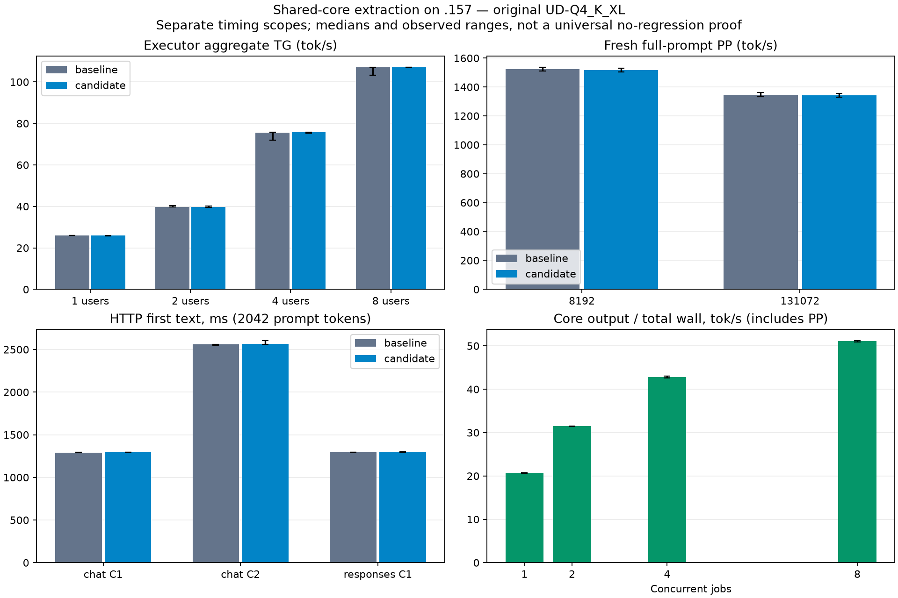

# First shared-core GPU regression result

> Historical technical record. See [current usage](../guides/USAGE.md) and
> [benchmark tables and graphs](../benchmarks/README.md). Results below retain
> their original build, protocol and limitations.

**PASS within the predeclared sampled 5% regression gates.** All 13 campaign arms
completed with exit 0 on **192.168.5.157 / AMD Strix Halo**, original
**Qwen3.8 Flash Next UD-Q4_K_XL**. Matching executor inputs, output tokens and
PP/TG frontier hashes are identical before/after; the direct core reproduces the
matching executor tokens. HTTP requests, output, usage and finish also match.
No measured median executor throughput change exceeds 1% in magnitude; the
largest HTTP first-text median increase is 0.35% (about 4.52 ms).

This closes the first lifecycle-extraction GPU gate. It establishes preservation
of the tested behavior and performance while sharing the C17 engine between HTTP
and the direct benchmark. Numerical execution remains delegated to the same Gufo;
there is no new C numerical backend or speedup attributable to the extraction.

## Method and identities

Predeclared [protocol](../development/protocols/CORE-GPU-PROTOCOL.md), baseline `2ba01ed`, candidate
engine `81c2f60`; supervisor/input-identity fixes at `04a0642`. Both fresh Release
builds use identical compiler settings and exactly the same official Gufo
`f783fedb9bea2ec7de941f6da4e02f4a4596b29e` static archives. Compile/link only ran
on the editing host; all CPU tests and model execution ran on `.157`.
There is no Q2 patch, weight conversion, upstream edit or device tuning.

All rates below are **median [observed minimum–maximum]**, in token/s unless
specified. Short runs use one warmup and three measured repetitions. Long runs
use two measured repetitions, without a discarded warmup. Every executor/core
job emits the full 128-token budget. Greedy AR, thinking/cache reuse/MTP/vision
off, prefill chunk 2048. Fresh means recomputing the whole prompt in a new
sequence; model loading and cold filesystem state are separate from PP/TG.
These small, sequential samples are descriptive; they cannot prove a universal
no-regression bound or isolate a few milliseconds of input-copy overhead.

## Executor before/after control

These diagnostics bypass the job lifecycle. PP and TG each divide confirmed
aggregate work by the corresponding completed executor-call wall interval.
C1/2/4/8 are concurrent sequences, with context capacity 4096 and 2048 physical
prompt tokens per sequence. Fresh C1 points use context capacity 262144.

| Workload | Baseline PP | Candidate PP | PP change | Baseline TG | Candidate TG | TG change |
|---|---:|---:|---:|---:|---:|---:|
| 2048 / C1 | 1624.77 [1622.27–1625.66] | 1624.01 [1623.01–1628.17] | -0.05% | 26.05 [26.02–26.05] | 26.03 [25.87–26.03] | -0.09% |
| 2048 / C2 | 1615.30 [1614.92–1617.67] | 1611.69 [1609.34–1617.13] | -0.22% | 39.73 [39.65–40.40] | 39.77 [39.60–40.07] | +0.09% |
| 2048 / C4 | 1601.71 [1597.25–1605.15] | 1601.99 [1601.24–1609.17] | +0.02% | 75.65 [72.01–75.83] | 75.82 [75.27–75.84] | +0.23% |
| 2048 / C8 | 1577.80 [1576.94–1585.13] | 1588.60 [1585.47–1590.40] | +0.68% | 106.98 [103.32–107.06] | 107.09 [107.03–107.17] | +0.10% |
| 8192 / C1 | 1524.20 [1510.69–1537.70] | 1515.85 [1502.75–1528.94] | -0.55% | 25.84 [25.82–25.86] | 25.79 [25.57–26.00] | -0.22% |
| 131072 / C1 | 1347.00 [1331.40–1362.59] | 1342.70 [1329.71–1355.69] | -0.32% | 24.67 [24.64–24.70] | 24.90 [24.90–24.91] | +0.95% |

At 128K, fresh PP remains below 8K (candidate 1342.70 versus 1515.85 token/s).
This extraction does not flatten prefill at long context. Every long-context
repetition processes all 131072 prompt tokens; cached incremental prefill is not
being reported as full-prompt throughput. The 128K numerical/token checks pass;
this campaign does not requalify 256K or extend execution to 1M.

## Direct shared core

`--suite core` submits copied physical-token requests to the actual `lie_core`
owner and consumes bounded output loans/credits, without HTTP. PP and TG here
are **per-job completed call rates**. A batch's duration appears in every
participating job, so those overlapping durations must not be added. Aggregate
output/total-wall includes prefill, queueing, credit/consumer work and decode;
it has a different denominator from the executor's pure TG column above.
Client first-token and total latency include submission/input copying.

| Prompt / clients | Job PP tok/s | Job TG tok/s | Aggregate output / total wall tok/s | First token ms | Job total ms |
|---|---:|---:|---:|---:|---:|
| 2048 / C1 | 1622.81 [1621.58–1626.25] | 26.05 [25.86–26.06] | 20.70 [20.57–20.72] | 1308.52 [1305.81–1309.55] | 6183.23 [6179.05–6221.83] |
| 2048 / C2 | 1619.56 [1616.50–1625.45] | 22.93 [22.82–22.94] | 31.48 [31.38–31.50] | 2586.85 [2582.97–2591.11] | 8129.80 [8121.48–8157.18] |
| 2048 / C4 | 1603.96 [1436.08–1622.67] | 18.97 [18.97–18.98] | 42.78 [42.62–43.02] | 5262.57 [5193.24–5304.31] | 11960.22 [11888.60–12013.35] |
| 2048 / C8 | 1588.17 [1449.41–1606.73] | 13.38 [13.38–13.40] | 51.09 [50.86–51.27] | 10521.81 [10461.05–10612.53] | 20027.56 [19940.14–20132.14] |
| 8192 / C1 | 1515.44 [1503.22–1527.67] | 25.89 [25.82–25.96] | 12.20 [12.16–12.23] | 5590.64 [5544.34–5636.93] | 10493.28 [10462.49–10524.08] |
| 131072 / C1 | 1352.46 [1332.57–1372.35] | 24.89 [24.87–24.90] | 1.25 [1.24–1.27] | 97121.59 [95699.03–98544.14] | 102220.91 [100798.39–103643.43] |

All core repetitions, including warmups, match the executor physical prompt
hash and generated IDs at the corresponding context, chunk and output settings.
Core does not expose frontier/logit snapshots yet: this is a token-path check,
not independent numerical equivalence. Each C1 repetition records 128 scalar
decode calls. C2/C4/C8 each record 128 native batches, respectively 256/512/1024
rows, and zero scalar calls. C8 does not spawn eight model-owner threads.

Eight initial credits, bounded token loans, ready-row selection and one device
owner remain in the core. The unchanged forward calls are synchronous. GPU
cancellation/slow-client/peer recovery runs through HTTP into that same core;
paused-loan lifetime edges also have separate synthetic ASan/UBSan coverage.
No tensor dependency graph, GPU kernel preemption or asynchronous numerical ABI
was introduced. C8's 51.09 token/s over total wall is not directly comparable to
107.09 pure executor TG; neither is a new gain over native-batch Gufo.

## HTTP regression and lifecycle

Loopback HTTP port 8000, management port 19880; private servers are now retired.
2042 prompt tokens, 64 output tokens, context 9216, chunk 2048, max-active 2.
Each configuration has one warmup and three measured cohorts (two requests per
C2 cohort). Nonstream responses have no first-text timing; blank means unavailable.

| API / clients | Baseline total ms | Candidate total ms | Total change | Baseline first text ms | Candidate first text ms | First-text change |
|---|---:|---:|---:|---:|---:|---:|
| chat JSON / C1 | 3717.42 [3712.11–3717.76] | 3718.99 [3716.46–3719.47] | +0.04% | — | — | — |
| chat JSON / C2 | 5293.59 [5284.95–5303.49] | 5300.21 [5291.13–5307.13] | +0.13% | — | — | — |
| chat SSE / C1 | 3716.34 [3713.83–3717.24] | 3718.49 [3718.43–3720.69] | +0.06% | 1291.59 [1290.44–1292.60] | 1295.81 [1294.86–1296.52] | +0.33% |
| chat SSE / C2 | 5317.15 [5298.22–5331.96] | 5304.47 [5298.76–5348.94] | -0.24% | 2558.09 [2551.37–2561.59] | 2564.89 [2561.70–2606.68] | +0.27% |
| responses JSON / C1 | 3716.47 [3716.08–3718.50] | 3719.91 [3717.43–3722.26] | +0.09% | — | — | — |
| responses SSE / C1 | 3716.21 [3715.39–3717.24] | 3721.03 [3720.68–3721.59] | +0.13% | 1293.32 [1292.22–1294.32] | 1297.84 [1296.75–1299.09] | +0.35% |

| API / clients | Baseline job PP | Candidate job PP | Baseline job TG | Candidate job TG | Baseline cohort output/total wall | Candidate cohort output/total wall |
|---|---:|---:|---:|---:|---:|---:|
| chat JSON / C1 | 1644.09 [1641.20–1652.04] | 1642.55 [1639.98–1647.13] | 26.01 [26.00–26.02] | 26.02 [26.02–26.02] | 17.22 [17.21–17.24] | 17.21 [17.21–17.22] |
| chat JSON / C2 | 1642.97 [1632.29–1649.71] | 1640.82 [1631.27–1647.13] | 23.04 [23.04–23.04] | 23.04 [23.03–23.04] | 24.17 [24.14–24.20] | 24.14 [24.12–24.17] |
| chat SSE / C1 | 1643.87 [1642.47–1646.66] | 1641.22 [1640.93–1641.54] | 25.99 [25.99–26.01] | 26.01 [26.00–26.01] | 17.22 [17.22–17.23] | 17.21 [17.20–17.21] |
| chat SSE / C2 | 1642.68 [1633.24–1646.49] | 1639.02 [1579.20–1642.47] | 22.81 [22.77–23.03] | 23.03 [23.03–23.04] | 24.06 [24.01–24.14] | 24.13 [23.93–24.13] |
| responses JSON / C1 | — | — | — | — | 17.22 [17.21–17.22] | 17.20 [17.19–17.22] |
| responses SSE / C1 | — | — | — | — | 17.22 [17.22–17.23] | 17.20 [17.20–17.20] |

The separate candidate lifecycle arm passes native function call/result,
Responses JSON/SSE, seeded sampling, heterogeneous concurrent prompts, slow
consumer/peer progress and cancellation during prefill and decode. Its reactive
pair records 32 native batches and matches the separate reference responses.
The lifecycle subcheck finishes at 9 completed / 3 cancelled / 0 failed, with
no queued, active or output-blocked jobs. The later final API snapshot, after
additional tool/reactive checks, still catches one active job during asynchronous
retirement (18 completed / 3 cancelled / 0 failed); it is not a quiescence proof.
Server exit 0 and PID/start/KFD postflight establish process retirement separately.

Pi/node were unavailable in the private CPU runner, so Pi itself was not rerun
against this candidate. Historical direct-HTTP Pi/256K results remain separately
labelled. This is the tested text/function subset, not all OpenAI platform APIs.

## Actual thread observations

Process `Threads` was sampled at 1 Hz, including load and teardown. Recurrent
inference observations are 35 threads for the direct executor and 36 for
core/HTTP. Initial loading also observes 51/52 respectively, plus short 1/3-thread
transitions. These are process totals, including provider/runtime workers;
per-TID roles and CPU utilization were not sampled. There is no new CPU pool.
The core path has one consumer/main thread and one device owner; HTTP has one
network main thread and one device owner; the executor has one application caller.

| Arm | Observed thread totals: number of samples |
|---|---|
| baseline-http | 1: 1, 36: 108, 52: 20 |
| candidate-http | 1: 1, 36: 108, 52: 20 |
| candidate-lifecycle | 1: 1, 36: 16, 52: 20 |
| baseline-multi | 1: 1, 35: 192, 51: 92 |
| candidate-multi | 1: 1, 35: 189, 51: 89 |
| core-c1 | 1: 1, 36: 25, 52: 20 |
| core-c2 | 1: 1, 36: 33, 52: 16 |
| core-c4 | 1: 2, 36: 47, 52: 20 |
| core-c8 | 1: 1, 36: 80, 52: 17 |
| baseline-fresh | 1: 1, 35: 225, 51: 14 |
| candidate-fresh | 1: 1, 3: 1, 35: 225, 51: 12 |
| core-p8192 | 1: 1, 36: 21, 52: 12 |
| core-p131072 | 1: 1, 36: 203, 52: 13 |

## CPU verification, retained failure and closure

The tested source inventory contains 85 unchanged source/configuration files.
On `.157`, `reactive-cpu-r9` passes headless 1/1, full Debug 23/23 and ASan/UBSan
23/23 (0.05 / 30.46 / 31.74 seconds); all nine configure/build/test exits are 0.
The eight core-benchmark checks include immutable input binding and the port
regression below. These synthetic checks are not original-weight inference.

`core-gpu-r1` remains **FAILED**: baseline HTTP passed, then candidate preflight
refused port 8000 with EADDRINUSE before opening the model. The preflight bind
lacked SO_REUSEADDR after the previous server's TCP close. A private-port CPU
fixture now checks TIME_WAIT reuse and refusal of an active listener. The helper
fix does not use SO_REUSEPORT or alter engine code. R2 explicitly retains only
the successful baseline arm, with its result hash and original timestamps; it
does not replace or average the failed arm.

Retained baseline HTTP ran 2026-10-02 01:36:40–01:38:52 UTC. R2 ran
01:43:59–02:13:52 UTC. Each GPU arm acquired all four existing EX|NB leases with
fresh identity/device/process/memory preflight and run registration. Models'
size/device/inode/mtime/ctime identities stayed unchanged; their historical SHA
receipts were referenced, without a new heavyweight full-file hash. Corresponding
baseline/candidate DSO sets and all common DSO hashes match. HTTP additionally
links protocol/network libraries absent from the direct bench.

Postflight at **02:13:52.976657 UTC** finds all 26 recorded supervisor/child
PID/start identities absent, KFD empty and all four lease files free with unchanged
device/inode. A later status check also confirms the controller absent and port
8000 empty. The coordinated window was returned to the Q2 thread. This is a dated
closure receipt, not a claim the machine stays idle afterward. Desktop/denied-FD
observations limit exclusivity claims. No deployment, foreign termination,
remote GPU build, dependency install, tuning, push or merge occurred.

## Artifacts and remaining work

[JSON summary](../benchmarks/2026-10-02/core-extraction/summary.json) retains every
reported rate and observed range; [executor CSV](../benchmarks/2026-10-02/core-extraction/executor.csv)
and [core CSV](../benchmarks/2026-10-02/core-extraction/core.csv) provide compact values.
The [SVG comparison](../benchmarks/2026-10-02/core-extraction/comparison.svg) is scalable;
each core arm also contains JSON/CSV and separate SVG/PNG exports.
[Artifact index and reproduction](../benchmarks/2026-10-02/core-extraction/README.md)
records hashes, commands, manifests and exit receipts. Full raw JSONL, logs and
121 hash-verified collected files remain in local `evidence/core-gpu-r2/` and
persistent `.157` project `run/core-gpu-r2/`; failed R1 is retained separately.

Next: complete neutral model semantic events and capability/state contracts,
then C-owned RAM prefix reuse with full hybrid state capture/restore and optional
SSD persistence. MTP, vision, model/numerical C replacement and 1M context retain
their separate implementation and quality/performance gates. Passing this
extraction does not implement those features or establish a benefit from extra
host threads.
