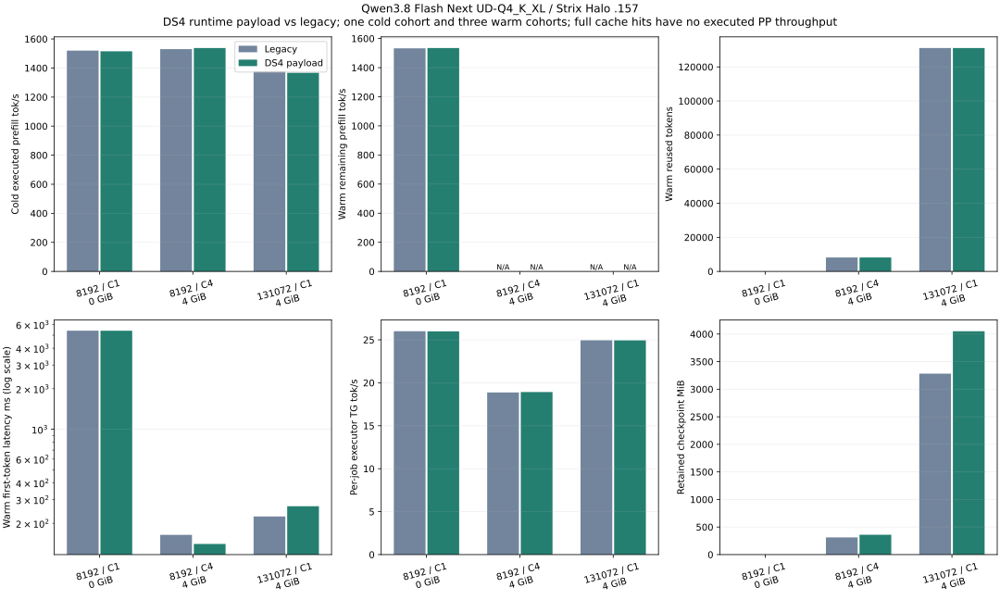
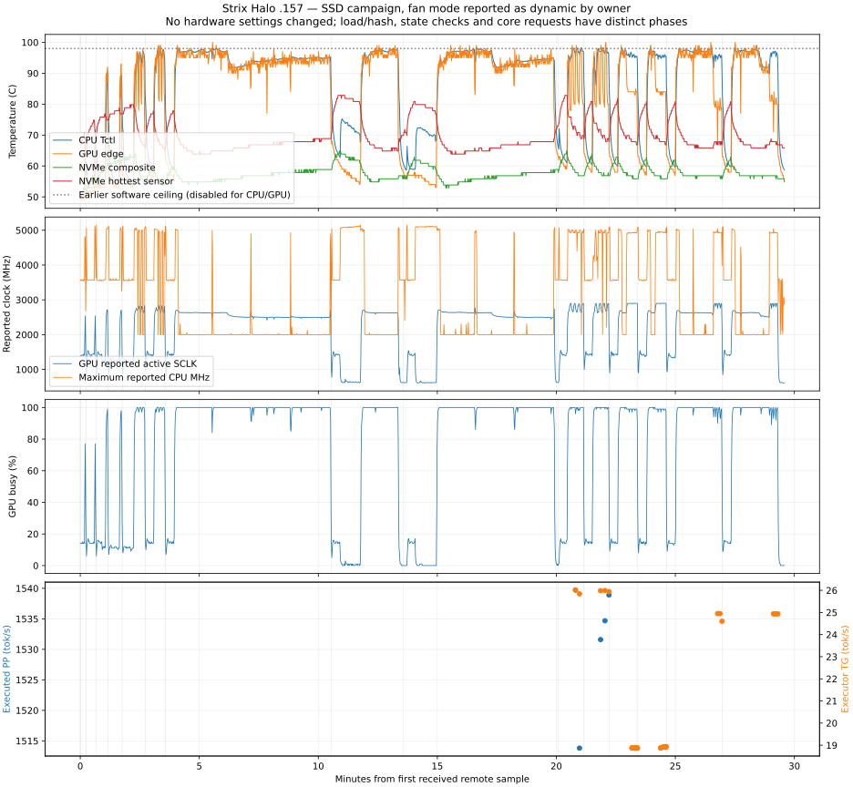

<!-- SPDX-License-Identifier: MIT -->
# DS4 runtime payload on Strix Halo — 2026-10-02

> Historical technical record. See [current usage](../guides/USAGE.md) and
> [benchmark tables and graphs](../benchmarks/README.md). Results below retain
> their original build, protocol and limitations.

The DS4 payload now replaces the Qwen runtime checkpoint representation by
default (`LIE_DS4_RUNTIME_CACHE=ON`) in RAM and optional SSD. All **15/15 GPU
arms** pass, with **24 exact replay/restore pairs** and **12 exact pairs across
legacy/KVC provider variants**, through 131072 physical tokens. Restart from a
KVC file and growth from context 139264 to 262144 pass. The shared core, rather
than HTTP, owns the representation, cache policy and reactive lifecycle.

There is a measured cost: at 128K the checkpoint grows **3.205→3.957 GiB
(+23.46%)**. Median RAM-hit TTFT grows **224.815→267.929 ms (+19.18%)** and
restore **42.195→52.149 ms (+23.59%)**. These exceed the declared 5% latency
regression threshold. The default follows the owner's requested format; the
explicit compile-time OFF control remains available. This is numerical
qualification with a reported latency tradeoff, not an unconditional performance
promotion. No extra high-ratio compression or cross-engine DS4 restore is claimed.

[Protocol](../development/protocols/KVC-GPU-PROTOCOL.md) · [Full JSON](../benchmarks/2026-10-02/kvc-runtime/summary.json)
· [Summary CSV](../benchmarks/2026-10-02/kvc-runtime/summary.csv)
· [Every core job](../benchmarks/2026-10-02/kvc-runtime/core-jobs.csv)
· [Every state pair and transfer](../benchmarks/2026-10-02/kvc-runtime/state-pairs.csv)
· [Source/commands/receipts](../benchmarks/2026-10-02/kvc-runtime/README.md)

## Matched core measurements

Frozen LIE source `a4008b9`, original Qwen3.8 Flash Next UD-Q4_K_XL on `.157`,
HIP gfx1151. Both variants use chunk 2048, TG128, one warmup and three measured
cohorts. Context 16384 for 8K; 262144 for 128K. Both deliberately use the same
`--cache-policy legacy` capture schedule to isolate representation/provider cost.
The previously measured [default DS4-policy retention regression](CACHE-DS4-GPU.md)
is separate and is not fixed or requalified by this experiment.

| Prompt / users / RAM | Format | First-cohort PP tok/s | Measured PP tok/s | Per-job TG tok/s | Cohort output/wall tok/s | Measured TTFT ms | Retained MiB |
|---|---|---:|---:|---:|---:|---:|---:|
|8192 / C1 / off|Legacy|1519.68|1532.59|26.004|12.446|5400.644|0|
|8192 / C1 / off|DS4|1515.20|1534.69|25.985|12.444|5399.550|0|
|8192 / C4 /4 GiB|Legacy|1529.92|—|18.871|74.126|164.100|311.565|
|8192 / C4 /4 GiB|DS4|1537.60|—|18.927|74.557|140.545|359.690|
|131072 / C1 /4 GiB|Legacy|1376.67|—|24.947|23.759|224.815|3282.033|
|131072 / C1 /4 GiB|DS4|1367.12|—|24.935|23.879|267.929|4052.033|

A dash means a full cache hit: zero executed PP tokens and no PP throughput.
First-cohort PP is a single cold cohort, not three fresh repetitions. Measured
rows are medians; C4 per-job decode intervals overlap and cannot be summed into
cohort throughput. All output IDs and reused/executed token counts match.
At 8K without retention, PP changes +0.14%, TG −0.07% and total-window throughput
−0.02%; these small sampled differences do not establish a speedup.

At 128K, the three legacy TTFT samples are 334.783/222.818/224.815 ms; DS4 samples
are 267.929/266.505/268.701 ms. The distributions overlap: the declared median
regression is retained, without statistical significance or thermal causality
claims from this small, sequential experiment. First cold TTFT is 95.524 s legacy
and 96.388 s DS4; it includes fresh prefill and initial capture. First capture costs
125.650/152.004 ms respectively. Sampling, OS page-cache conditions and load order
are recorded rather than controlled by global cache eviction or tuning.

## Complete-state and SSD checks

| Captured frontier | Legacy retained bytes | DS4 retained bytes | Legacy restore median ms | DS4 restore median ms |
|---|---:|---:|---:|---:|
|3 physical tokens|119140480|119140608|2.850|2.864|
|2049 physical tokens|170991736|183607512|3.626|3.853|
|8192 prompt +16 generated|327104688|377666052|5.561|6.301|
|131072 physical tokens|3441461360|4248864964|42.893|53.690|

Each non-writer state arm compares complete logits at every step and emitted
IDs against independent replay, with three independent recipient sequences.
Ordinary cases cover greedy, seeded and independent greedy clone; the generated
frontier uses three greedy replay pairs. Twelve pairs additionally compare
complete frontier hashes and tokens between legacy and KVC provider variants.
The long KVC case reads once in a new process, then tests three independent
restores. This is not three separate SSD restarts.

The KVC producer uses context 139264 and the reader262144. Both establish the
same stable identity. The file is4,249,499,246 bytes, allocated4,249,501,696 bytes;
retained host state is4,248,864,964 bytes. It fits just within 4 GiB staging/RAM,
with no expansion buffer and no additional Zstandard packing. At this size the
headroom is small; this does not establish larger-context retention in 4 GiB.

| SSD phase | Measured time |
|---|---:|
|Writer model load|20.590 s|
|Writer full model/build identity|52.143 s|
|Completed capture|294.958 ms|
|Text rendering and write admission|1.531 ms|
|Durable write|2.752 s|
|Reader model load|20.667 s|
|Reader full model/build identity|51.816 s|
|Disk read and integrity check|2.178 s|
|Device restore, median of three|53.690 ms|

Load and identity are startup costs, excluded from read/upload numbers. The
state harness reports a different capture interval from automatic core capture;
its 294.958 ms is not interchangeable with the 152.004 ms core measurement. SSD
remains explicit opt-in. The DS4 envelope and model payload are exact layouts;
LIE adds an opaque trailing identity/integrity binding outside the model payload.
An ordinary foreign DS4 checkpoint without that authenticated binding remains
refused by the live store. These tests never invoke DS4 and do not qualify
bilateral import/export, cross-quant reuse, MTP or vision.

## Reactive ownership, threads and resource cost

The existing C17 device-owner thread and bounded optional SSD worker are
preserved. The HTTP layer only exposes diagnostics; core bench invokes the same
engine APIs directly. No thread is added for the KVC format. All six core arms
sample 36 process threads while GPU busy≥50%, and 1–52 over startup/lifetime;
these include provider/driver threads and are not the number of C17 workers.
C4 uses existing native batching. Neither its throughput nor the sampled C4
latency improvement isolates a reactive advantage over Gufo.

The provider now retains all raw indices and materializes complete pooled keys
before the sparse threshold. `SessionBytes` includes the larger active allocation;
checkpoint host bytes in the tables do not describe total device memory or RSS.
State framing and validation are C17, model-specific geometry stays outside the
shared store, and capture does not allocate a second complete converted tensor
payload. The generic second-family CPU fixture establishes an API boundary,
not inference support for a second actual model.

## Temperatures and closure

The independent observer saves 1747 samples at approximately 1 Hz on `.155`.
On `.157`: CPU peak 98.25 C, GPU edge peak 100 C, NVMe composite 64.85 C and hottest
secondary NVMe sensor 82.85 C. CPU≥98 C appears in 25 samples, with at most 3
consecutive samples (2.02 s observed span). GPU 100 C appears in 4 isolated samples,
each bracketed by below 100 C readings within at most 2.02 s. GPU≥98 C lasts at most
5 consecutive samples (4.03 s observed span). No crash, disconnect or numerical
failure occurred; this does not independently exclude hardware throttling.
No fan/power/clock setting was changed. [Full thermal data](../benchmarks/2026-10-02/kvc-runtime/thermal-summary.json).

Campaign closes 19:16:14.347739 UTC, all 15 helper/child exits 0. Observer exits 0
at 19:16:30.127576 UTC. All 152 collected files SHA-verify. Fresh closure at
19:18:19.131870 UTC verifies 30 owned identities, controller and observer absent,
empty KFD and four original leases free. Persistent release is
`run/kvc-runtime-window-release.json` on .157 and in the shared register;
Q2 and Point were notified. No root GPU job, waiter, model mutation, remote
build, deployment or implicit publication remains.

CPU evidence stays separate:37/37 full ASan/UBSan/LeakSanitizer fixtures,8/8
headless features-OFF checks and the final report/supervisor contract. The
initial compiler/report failures are retained in the CPU receipt and local
`evidence/`, rather than being presented as successful checks.
