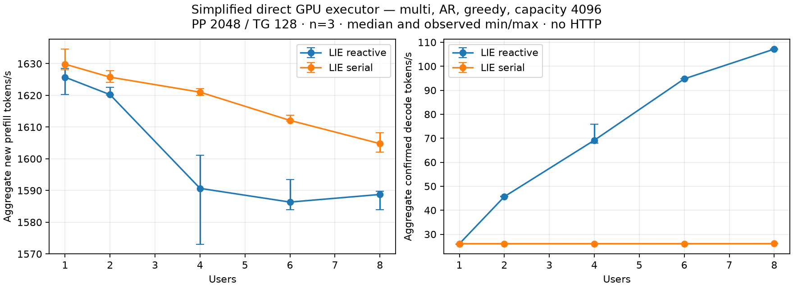
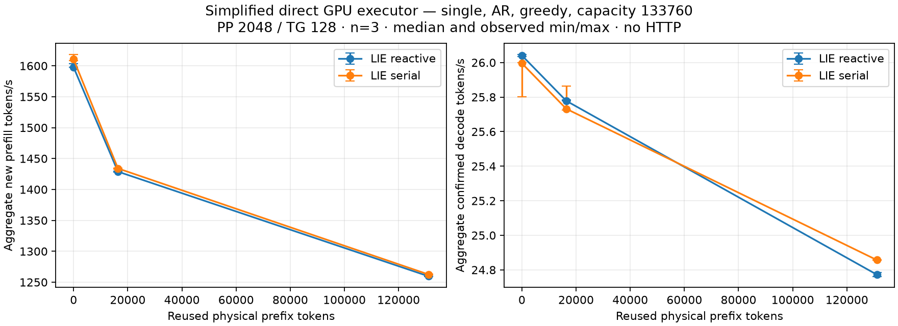

# Reactive inference — measured GPU batching and scalar fallback

> Historical technical record. See [current usage](../guides/USAGE.md) and
> [benchmark tables and graphs](../benchmarks/README.md). Results below retain
> their original build, protocol and limitations.

The shared C17 readiness/credit dispatcher now drives real native GPU decode
batches from both the production worker and `synapse-lie-bench`. On `.157`,
concurrency eight reaches **107.15 token/s**, versus **26.08** on the retained
serial path: **4.11× aggregate decode throughput**. The completed single-user
comparisons, including occupied context 131072, remain within the predeclared
5% regression bound. This qualifies concurrent inference scheduling; the
numerical kernels and their internal synchronization are unchanged.

The later `.161` Strix Point original UD confirmation is in the
[three-arm direct benchmark](../STRIX-POINT-BENCHMARK-RESULT.md#concurrent-161-lie-reactive-direct-gufo-and-lie-serial).
At C8 the reactive C dispatcher reaches **32.184 aggregate decode token/s**,
Gufo native batch **32.146**, and LIE serial interleaving **10.316**; all
measured inputs, outputs and full PP/TG frontiers match. Every C2–C8 reactive
sample records 128 native GPU batch calls, 128 × users rows and zero scalar
decode calls. This confirms the concurrency benefit on a second architecture;
its C1 and PP rows do not establish an inference-kernel speedup. It is a
separate direct-executor experiment, not a remeasurement of the historical
`.157` values below or an HTTP throughput test.

## Matched protocol

Campaign `reactive-suite-r2` ran **2026-10-01 19:24:01–19:59:02 UTC** using source checkpoint
`0e2bd45`, HIP build `reactive-inference-r3`, original Unsloth UD-Q4_K_XL weights
and the independently fetched Gufo pin `f783fedb9bea2ec7de941f6da4e02f4a4596b29e`.
Both arms use the same production adapter and numerical archives; they are
not independently implemented numerical engines. The historical direct-Gufo
comparison is preserved in [BENCHMARK-RESULTS.md](BENCHMARK-RESULTS.md).

AR, greedy, thinking off, PP2048/TG128, one warm-up plus **three measured
repetitions per point**, with all observations retained. Order was HTTP checks,
serial multi, reactive multi, serial single, reactive single; the order was
fixed before launch and not randomized or interleaved. Exact arguments and source
bindings are retained in the [campaign manifest](../benchmarks/2026-10-01/reactive/suite-manifest.json).
Observed min/max are
variability ranges, not confidence intervals. Existing OS cache and power
settings were retained. Timing excludes loading, input calibration, HTTP,
text rendering and evidence writes; decode includes completed work, sampling
and C readiness/credit bookkeeping. Prefill still executes sequentially.

Across both suites, all 64 samples (48 measured, 16 warm-ups) complete the full
128-token output per sequence. Physical input IDs, generated output IDs and
full vocabulary frontier hashes after PP and final TG agree exactly across
serial/reactive arms, and each arm is repeatable. This is scheduling equivalence
on these workloads, not a full quality or independent numerical qualification.

## Concurrent inference

Capacity 4096, physical prompt 2048, all rows prefilled before the common decode
interval. Rates are aggregate confirmed tokens divided by completed wall time.
Every multi-row reactive sample records 128 native batch calls and
128 × users selected rows, with no scalar decode calls. At C1, 128 scalar calls
and zero batches confirm immediate fallback. No batching timer waits for peers.

All rates below are median token/s.

| Users | Serial PP | Reactive PP | Serial TG | Reactive TG | TG ratio |
|---:|---:|---:|---:|---:|---:|---:|
| 1 | 1629.83 | 1625.73 | 26.05 | 26.02 | 0.999× |
| 2 | 1625.74 | 1620.22 | 26.06 | 45.67 | 1.753× |
| 4 | 1621.01 | 1590.68 | 26.07 | 69.17 | 2.654× |
| 6 | 1612.10 | 1586.34 | 26.06 | 94.76 | 3.636× |
| 8 | 1604.78 | 1588.75 | 26.08 | 107.15 | 4.108× |

The old flat throughput was caused by one scalar `DecodeStep` per row. The
new C dispatcher reserves output credit for ready rows and calls the adapter's
`DecodeBatch`; independent sequence states share the upstream batch operation.
The gain is in concurrent decode. C1 at this capacity changes by −0.11%.
Multi-user PP medians are 0.34–1.87% lower in this ordered run; no PP gain is
claimed. The C4 TG range is 67.98–75.93 token/s and is retained without filtering.
The experiment does not isolate a cause for that variation or small PP drift.

[Median/min/max CSV](../benchmarks/2026-10-01/reactive/multi/summary.csv) ·
[Every repetition and timing](../benchmarks/2026-10-01/reactive/multi/samples.csv) ·
[Machine-readable comparison](../benchmarks/2026-10-01/reactive/multi/summary.json) ·
[SVG](../benchmarks/2026-10-01/reactive/multi/benchmark.svg).

## Single sequence and occupied context through 128K

Capacity 133760. Every fresh session really processes the occupied prefix
outside the PP timer; only the subsequent 2048 new tokens count in PP. At the
largest point the physical prompt is **133120 tokens**. This follow-up repeats
0/16K/128K with three measurements; the earlier eight-depth survey is retained
in [BENCHMARK-RESULTS.md](BENCHMARK-RESULTS.md).

| Occupied prefix | Serial PP | Reactive PP | Serial TG | Reactive TG | TG ratio |
|---:|---:|---:|---:|---:|---:|---:|
| 0 | 1610.50 | 1597.63 | 26.00 | 26.04 | 1.002× |
| 16384 | 1434.04 | 1428.86 | 25.73 | 25.78 | 1.002× |
| 131072 | 1262.50 | 1259.59 | 24.86 | 24.77 | 0.997× |

Each C1 TG median passes the predeclared reactive/serial ratio ≥0.95. This
supports preserving scalar behavior while enabling concurrent batching; it
provides no evidence of a faster single-sequence model forward. HTTP still has
its 32K capacity limit, so these long-context measurements are direct-executor
results, not HTTP 128K qualification or snapshot/cache restoration.

[Median/min/max CSV](../benchmarks/2026-10-01/reactive/single/summary.csv) ·
[Every repetition and timing](../benchmarks/2026-10-01/reactive/single/samples.csv) ·
[Machine-readable comparison](../benchmarks/2026-10-01/reactive/single/summary.json) ·
[SVG](../benchmarks/2026-10-01/reactive/single/benchmark.svg).

## Production HTTP and lifetime checks

The original-weight server passes JSON/SSE smoke, Unicode, cancellation during
prefill/decode, slow-client backpressure, peer progress, Responses JSON/SSE,
seeded sampling and a native function call/result round trip. Two distinct
prompts with per-sequence seeds, temperature/top-p and frequency/presence
penalties produce identical content/usage/finish serially and concurrently.
The concurrent pair observes **32 batch dispatches / 64 selected rows** on the
production worker. This is serving correctness and batching evidence, not a
new HTTP throughput or latency matrix. The pair's physical prompts each have
32 tokens; unequal-position batch behavior is covered by CPU fixtures, not
claimed as a distinct original-weight HTTP case.

CPU capsule `reactive-cpu-r3` passed **19/19 debug and 19/19 ASan/UBSan** on
`.157`, all six configure/build/test exits 0. Fixtures exercise zero-credit
suspension, immediate scalar fallback, different positions, cancellation during
a batch, malformed-peer suppression, eight active worker slots and benchmark
accounting. They have GPU visibility disabled and perform no model forward.
The final HIP-linked build also passed compilation; that separate receipt alone
was not GPU qualification. Terminal error metadata is published before releasing
reservations, and invalid shared-batch outcomes poison the worker before output.
Per-request batch durations overlap and must not be summed as GPU wall time.

## Admission, retirement and retained evidence

The earlier `reactive-suite-r1` failed at 18:51:29 UTC on the first occupied
EX|NB pipeline lease, helper/controller exit 1, `model_attempted=false`. No model
or GPU child was launched. That failure remains in `evidence/reactive-suite-r1`
and the versioned [candidate receipts](../benchmarks/2026-10-01/reactive-candidate).

The operator renewed the window with “la gpu è libera”. Every r2 arm acquired
all four existing leases afresh, performed in-lease DSO/model-stat/client
checks, and recorded start/end and actual exits. All five helpers and their GPU
children exited 0. Admitted files and model stat identities stayed unchanged;
no foreign GPU client was observed. Desktop clients and denied process-FD reads
limit observation; cooperative leases are not universal exclusivity proof.
Final postflight found all owned helper/child PIDs absent, empty KFD and all four
unchanged lease files free. The separate controller-retirement receipt records
its disappearance after archive completion.

Raw evidence is under `evidence/reactive-suite-r2`; all 43 archived
files match the remote SHA-256 collection map. Compact receipts, plots, every
sample's timings and summaries are versioned under
[`benchmarks/2026-10-01/reactive`](../benchmarks/2026-10-01/reactive).
The campaign binds 67 source files to `0e2bd45` and the successful CPU capsule.
The persistent worktree is
`/home/paperboy/workspace/projects/synapse-linux/synapse-lie/worktrees/openai-reactive-api`;
the former `/tmp` source was removed only after all 1608 transferred files
matched and Git registration was repaired.

The server accepts `--max-active 1..8`, default 1; benchmark default execution
is reactive, with `--execution serial` retained for A/B. The bounded C dispatcher
is shared by worker and benchmark; numerical calls still return completed
synchronously. Internal HIP event graphs, kernel changes, MTP, cold-file loads,
allocation-exact peaks and full OpenAI coverage remain outside this result.
No DS4 modification, dependency installation, tuning, deployment, merge or push.
