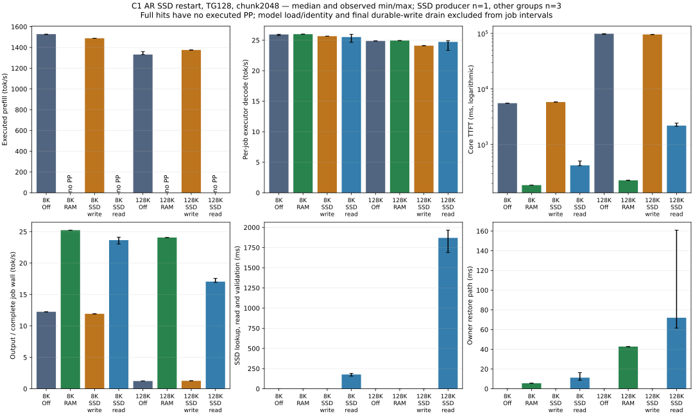
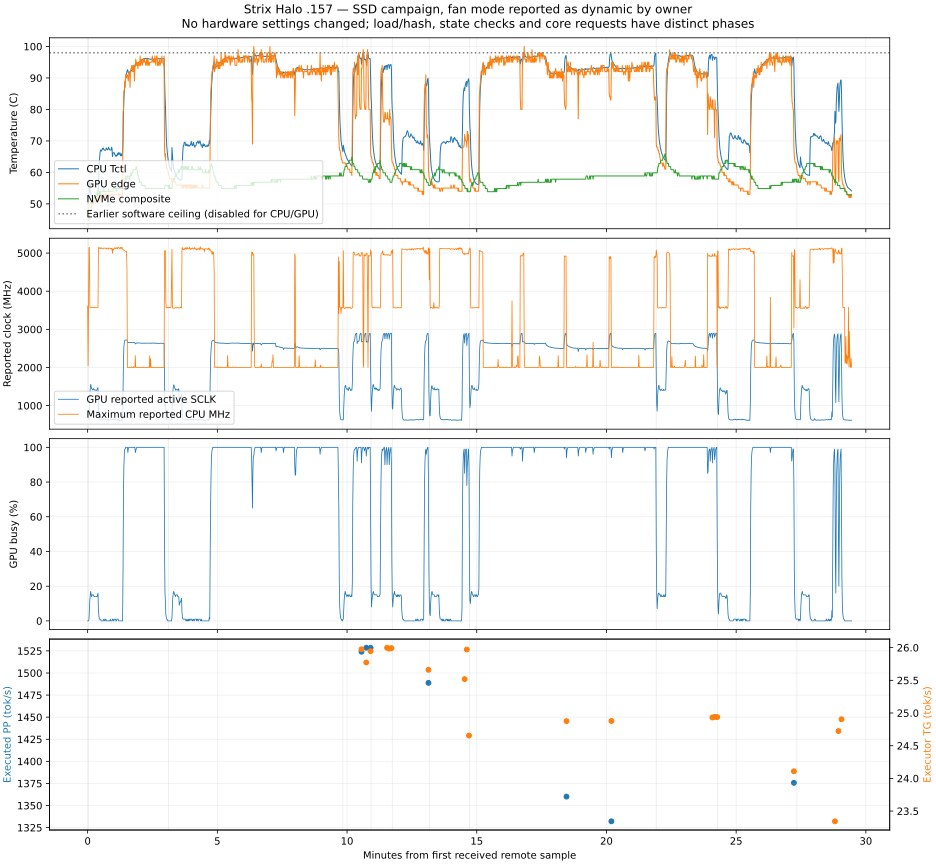

<!-- SPDX-License-Identifier: MIT -->
# SSD restart through 128K: GPU completion and thermal observations

> Historical technical record. See [current usage](../guides/USAGE.md) and
> [benchmark tables and graphs](../benchmarks/README.md). Results below retain
> their original build, protocol and limitations.

On 2026-10-02, **SSD R4 passes all ten arms** on the designated Strix Halo
`.157`, using the original UD-Q4_K_XL weights. A restarted process restores a
131072-token hybrid checkpoint with exact same-provider logits and tokens in
three 16-step pairs. The shared reactive C core passes matched cache-off, RAM,
SSD producer and restarted SSD reader comparisons at 8192 and 131072 tokens.
All 24 core jobs, including four warmups, emit the full 128-token budget with
identical physical inputs and outputs across policies at each prompt length.

This completes the pending bounded restart/C1 campaign. Earlier R1/R2/R3
software thermal stops remain failed records. GPU HTTP with SSD enabled,
concurrent SSD peer progress and GPU fault injection are still separate gates;
their synthetic tests do not become GPU evidence. MTP, vision, exact sampler
session resume, 256K checkpoint fit and 1M remain outside this result.

## Configuration and timing scope

- Source checkpoint `c31314e32e2812aa3b5a3075f4d71c32f818a749`; unchanged
  `ssd-linked-r1` numerical executable from `0e1387d`, independently fetched
  Gufo `f783fedb9bea2ec7de941f6da4e02f4a4596b29e` state-access archives.
- HIP `gfx1151`, context capacity 262144, prefill chunk 2048, native text AR,
  C1/TG128, identical physical input files. Full model/build/device identities,
  commands, budgets and per-arm admission are in the retained manifest/archive.
- RAM budget 4 GiB independently enabled for RAM arms; off and SSD arms use
  RAM retention disabled. Each SSD store has 8 GiB quota and 4 GiB staging.
- Off/RAM: one warmup and three measured repetitions. SSD producer: one request
  against an empty store. SSD reader: three requests in a new process, including
  its first read; no discarded warmup or RAM promotion in those arms.
- PP/TG are completed executor-call durations. Core TTFT starts at submission
  and ends when the bench consumes the first confirmed token; it is not HTTP
  latency. Job wall includes request work, excludes startup and final write
  drain. Async write work can overlap a request; request completion is not a
  durability acknowledgment. Full hits execute zero PP and have no PP tok/s.
  Core restore timers cover the owner restore path, including lookup/validation;
  they do not isolate DMA bandwidth.
- Full-content identity and supervisor inventory hashing warm OS file caches.
  These are process-restart measurements, not cold-device or reboot timings.
  No forced cache drop, deliberate pacing or fan/clock/power setting change.

## Core performance, including prefill

Values are median **[observed min–max]**, with producer n=1 shown alone. Ranges
describe these samples, not confidence intervals. Every measured row emits 128
tokens. All off/producer requests execute the complete prompt; RAM/SSD read
requests reuse the complete prompt. Warmups remain in the CSV and raw archive.

| Prompt | Policy | n | Executed PP tok/s | Executor TG tok/s | Core TTFT ms | Complete job ms |
|---|---|---:|---:|---:|---:|---:|
| 8192 | off | 3 | 1528.514 [1524.069–1528.547] | 25.946 [25.773–25.975] | 5547.557 [5538.755–5555.830] | 10445.355 [10433.726–10475.665] |
| 8192 | ram | 3 | — | 25.992 [25.985–25.998] | 185.519 [185.089–186.035] | 5071.240 [5070.478–5073.535] |
| 8192 | ssd-write | 1 | 1488.808 | 25.661 | 5819.876 | 10728.867 |
| 8192 | ssd-read | 3 | — | 25.519 [24.655–25.971] | 421.913 [415.908–503.945] | 5411.580 [5305.388–5556.134] |
| 131072 | off | 3 | 1332.098 [1331.793–1360.076] | 24.878 [24.876–24.889] | 98582.621 [96555.295–98599.378] | 103686.992 [101660.333–103701.994] |
| 131072 | ram | 3 | — | 24.938 [24.931–24.940] | 226.187 [226.062–226.360] | 5318.318 [5318.160–5320.248] |
| 131072 | ssd-write | 1 | 1375.661 | 24.109 | 95749.968 | 100962.189 |
| 131072 | ssd-read | 3 | — | 24.724 [23.343–24.904] | 2186.091 [2128.241–2425.080] | 7505.907 [7282.991–7557.985] |

At 128K, median core TTFT falls from **98.583 s without retention to 2.186 s
after SSD restart**, or **0.226 s for an in-process RAM hit**. These are about
45.1x and 435.8x reductions for repeated exact prefixes. Fresh prefill does not
become faster: its work is avoided. Decode remains about 25 tok/s at C1.

Median phase timings below complement the full distributions. Tiny SSD lookup
miss costs in producer rows round to 0.001 ms. Columns are independently
measured intervals, not an additive decomposition of TTFT or total latency.

| Prompt | Policy | PP ms | Decode ms | Capture ms | SSD read/validate ms | Owner restore ms |
|---|---|---:|---:|---:|---:|---:|
| 8192 | off | 5359.455 | 4933.290 | 0.000 | 0.000 | 0.000 |
| 8192 | ram | 0.000 | 4924.655 | 0.000 | 0.000 | 5.579 |
| 8192 | ssd-write | 5502.387 | 4988.135 | 14.906 | 0.001 | 0.000 |
| 8192 | ssd-read | 0.000 | 5015.948 | 0.000 | 177.222 | 11.286 |
| 131072 | off | 98395.194 | 5145.044 | 0.000 | 0.000 | 0.000 |
| 131072 | ram | 0.000 | 5132.689 | 0.000 | 0.000 | 42.791 |
| 131072 | ssd-write | 95279.321 | 5309.232 | 150.812 | 0.001 | 0.000 |
| 131072 | ssd-read | 0.000 | 5177.167 | 0.000 | 1870.336 | 72.069 |

Core SSD producers commit exactly one file each: 326,689,960 bytes at 8K and
3,441,452,200 bytes at 128K. Final durable-write durations are 229.661 ms and
2460.715 ms, respectively; every final drain has zero pending operations and
zero errors. Readers perform no new writes. File bytes differ from host-state
allocation bytes because the codec has its own framing.

Startup load-to-READY, measured once per process and excluded above:

| Prompt | Off | RAM | SSD writer | SSD reader |
|---|---:|---:|---:|---:|
| 8192 | 20.603 s | 20.659 s | 72.267 s | 73.829 s |
| 131072 | 20.609 s | 20.749 s | 73.733 s | 72.514 s |

SSD startup includes full-content hashing and index admission. About 52 seconds
of additional readiness cost is material for short-lived processes; steady
request TTFT must not hide it. The direct state diagnostic below separates model
loading from identity hashing explicitly.

## Exact state qualification across restart

R2 already passed 8K-to-8K and 4K-to-8K extension: each restarted reader passes
greedy, seed-123 sampling and independent greedy pairs, with 16 confirmed tokens
and 16 decode calls per pair. R4 completes the 128K case using the original
chunk2048 profile. Every available full-logit frontier, output ID and position
matches fresh recomputation. This is same-provider state equivalence; it is not
an independent model-quality oracle or preservation of the sampler RNG session.

| Prompt / checkpoint | Campaign | Read/validate once | Median owner restore | Median fresh PP | Median tail PP |
|---|---|---:|---:|---:|---:|
| 8192 / 8192 | R2 | 177.849 ms | 5.750 ms | 5338.326 ms | No executed tail |
| 8192 / 4096 | R2 | 121.549 ms | 4.472 ms | 5408.144 ms | 2783.266 ms / 4096 tokens |
| 131072 / 131072 | R4 | 2179.216 ms | 45.085 ms | 96748.270 ms | No executed tail |

R4 retains 3,441,461,336 host-state bytes in 112 typed components, producing
3,441,452,200 file bytes (3,441,455,104 allocated disk bytes). Capture takes
412.278 ms; durable write takes 2310.500 ms. Model load is 20.781 s for the
producer and 22.616 s for the reader; identity hashing is 57.077 s and 63.144 s.
The reader reserves its full 4 GiB staging cap; that is an admission reservation,
not proof that a 4 GiB allocation occurred. Its one read is followed by three
independent uploads into new sequences:

| Pair | Generation | Fresh PP ms | Owner restore ms | Output tokens / decode calls |
|---|---|---:|---:|---:|
| 0 | greedy | 96315.304 | 174.389 | 16 / 16 |
| 1 | seeded-sampling | 96748.270 | 44.978 | 16 / 16 |
| 2 | greedy | 98568.921 | 45.085 | 16 / 16 |

The [R1 report](SSD-GPU-RESULT.md) retains the 512-token checkpoint result with
early EOS: two decode calls and one emitted token, not a 16-token continuation.

## Temperature peaks, durations and performance behavior

The owner requested observation with the machine's reported dynamic-fan setup.
R4 removes only its selected CPU/GPU software operating ceiling, preserving
exposed hardware bounds, NVMe limits and all resource/admission checks. CPU/GPU
max/critical sysfs values are absent on this host, so those software limits are
null in explicit observation mode. Default supervisor policy remains unchanged.
No hardware settings or protections were modified. See the
[declared thermal policy](../development/protocols/SSD-GPU-PROTOCOL.md#owner-requested-thermal-observation--r4-2026-10-02).

The separate observer saves **1,743 samples over 29 min 26.896 s** on the editing
host, flushing and fsyncing each received record. Maximum sample gap is 1.202 s.
The GPU `edge` peak is **100 C**, first at **09:16:21.491 UTC / 11:16:21 Rome**;
CPU `Tctl` peaks at **98.125 C**, at **09:32:25.457 UTC / 11:32:25 Rome**.
The observer and supervisor sample at different instants; the supervisor's GPU
maximum is 99 C. Neither value is substituted for the other.

| Sensor | Peak | Threshold | Samples at/above | Longest observed span | Below-threshold bracket |
|---|---:|---:|---:|---:|---:|
| CPU Tctl | 98.125 C | 95 C | 500 | 71.577 s (72 samples) | 73.595 s |
| CPU Tctl | 98.125 C | 98 C | 3 | 0.000 s (1 samples) | 2.016 s |
| GPU edge | 100.000 C | 95 C | 432 | 53.436 s (54 samples) | 55.453 s |
| GPU edge | 100.000 C | 98 C | 43 | 1.012 s (2 samples) | 3.036 s |
| GPU edge | 100.000 C | 99 C | 9 | 0.000 s (1 samples) | 2.020 s |
| GPU edge | 100.000 C | 100 C | 3 | 0.000 s (1 samples) | 2.017 s |

An isolated sample has zero first-to-last *observed span*, not zero physical
duration. The bracket uses the preceding and following below-threshold readings;
it bounds the episode containing the detected samples, subject to sensor/sample
resolution. All observed episodes here have both boundaries. GPU readings at or
above 98 C occur in 43/1743 samples (2.47%), with at most two consecutive samples;
their longest bracket is 3.036 s. All three 100 C readings are isolated, bracketed
within 2.017 s. CPU readings at or above 98 C are three isolated samples.
Readings around 95 C persist longer: the longest observed runs span 71.577 s
for CPU and 53.436 s for GPU. Thus the near-maximum peaks are brief, while the
machine can remain hot during long prefill work.

No crash, reboot, device error or output mismatch was observed. The boot ID is
unchanged, every child/helper exits 0, and the observer closes normally with SSH
exit 0 after campaign completion. There is consequently no measured shutdown
temperature. A later connection loss alone would not establish a hardware crash.
Fan RPM is not exposed; the reported fan mode is not independently verified.
NVMe composite peaks at 65.85 C; the hottest individual NVMe sensor reaches
83.85 C in supervisor telemetry and remains below its applicable 85 C guard.

At matched 128K cache-off inputs, measured PP progresses **1360.076 → 1332.098
→ 1331.793 tok/s** (about 2.08% below the first measurement), while TG is
**24.876 → 24.878 → 24.889 tok/s**. The timeline also records a GPU SCLK decline
during prolonged work. This is an observed small PP slowdown and clock change;
there is no controlled thermal A/B, power measurement or throttle-reason signal
to attribute it solely to temperature. Work phase, boost and shared-package
limits can also matter. SSD decode variability is retained in the ranges above,
including the first restarted 128K read at 23.343 tok/s. Three repetitions do
not establish long-term stability or absence of throttling.

The last panel associates rates with observed completion times, not continuous
per-token throughput. One of the 24 core job events fell between observed arm
transitions; all 24 remain in the authoritative benchmark files and core tables.

## Reactive scope, threads and remaining work

SSD uses the shared C17 engine in these tests, with one device-owner scheduler
and one optional bounded disk worker. The owner waits on completion events;
its inference state remains pinned until transfer finishes. The HTTP layer
is absent from this direct-core experiment. CPU fixtures already demonstrate
that an active peer can progress while an SSD read is blocked; this C1 GPU
campaign verifies the real consumer but does not measure that concurrency gain.

Sampled process totals are 36 threads for core off/RAM, 36/37 with SSD, and up
to 52 during loading. Direct state arms sample 35/36, up to 51 during loading.
These include runtime/library/loader threads, not 36 or 52 inference owners.
The SSD option adds one I/O worker; it does not create an inference thread pool.
Per-TID attribution was not collected, and unchanged thread count alone cannot
prove or refute reactive behavior. The earlier
[serial/batched comparison](REACTIVE-INFERENCE-RESULT.md) remains the measured
concurrency result; this campaign does not isolate a reactive advantage over Gufo.

Next device gates are HTTP SSD restart/usage and concurrent progress/cancellation
with SSD active; corruption/quota/write faults retain their existing synthetic
scope. Checkpoint fit at 256K, active KV paging, weight streaming, resumable
sampling/tool sessions, MTP, vision and 1M need their own implementations or
qualifications. SSD remains opt-in and RAM remains enabled independently.

## Retained failures, closure and reproduction

| Campaign | Outcome | Temperature stop | Meaning |
|---|---|---|---|
| R1 | 2 pass, 1 failed, 13 not run | GPU86 C under 85 C ceiling | Earlier [512-token report](SSD-GPU-RESULT.md) unchanged |
| R2 | 5 pass, 1 failed, 8 not run | GPU99 / CPU96.375 C at 08:51:48.819 UTC | 128K reader stopped by software; no completed pair in that arm |
| R3 | 0 pass, 1 failed, 9 not run | GPU98 / CPU95.375 C at 08:57:26.596 UTC | First 8K core arm stopped; planned chunk512 profile never ran |
| R4 | 10 pass | Explicit CPU/GPU observation | Original chunk2048 profile completed, no hardware crash observed |

R2 and R3 retain child/helper exit 1/1 and their original measurements/telemetry;
software SIGTERM of the owned child is not a hardware shutdown. R2/R3/R4
collections verify 67/23/106 files. At **09:39:08.072 UTC**, R4 postflight records
twenty owned helper/child identities absent, KFD empty and four unchanged/free
leases. Independent status confirms controller retirement. The observer retires
at 09:39:24.129 UTC; collection finishes before returning the window to Q2 and
notifying Strix Point. These are dated observations, not permanent admission.
Denied-FD/desktop visibility limits and absence of formal DS4 ACK remain.

All sources and evidence stay under persistent LIE directories. No source in
`/tmp`, foreign termination, DS4 mutation, deployment, remote build, conversion,
installation, tuning or publication occurred. Numerical binaries did not change.
The supervisor observation mode passed its focused CTest checks against existing
ASan/UBSan binaries; [the source-bound receipt](../benchmarks/2026-10-02/ssd-qualification/thermal-observation.json)
retains those tests separately from GPU evidence.

- [All core job values, including warmups (CSV)](../benchmarks/2026-10-02/ssd-gpu-r4/jobs.csv),
  [state timings (CSV)](../benchmarks/2026-10-02/ssd-gpu-r4/state.csv),
  [summary with exact state pairs](../benchmarks/2026-10-02/ssd-gpu-r4/summary.json).
- [Thermal samples (CSV)](../benchmarks/2026-10-02/ssd-gpu-r4/thermal-samples.csv),
  [threshold statistics](../benchmarks/2026-10-02/ssd-gpu-r4/thermal-summary.json),
  [core graph (PNG)](../benchmarks/2026-10-02/ssd-gpu-r4/ssd-restart.png),
  [thermal graph (PNG)](../benchmarks/2026-10-02/ssd-gpu-r4/thermal-timeline.png).
- [Offline verification](../benchmarks/2026-10-02/ssd-gpu-r4/verification.json),
  [manifest](../benchmarks/2026-10-02/ssd-gpu-r4/suite-manifest.json),
  [closure](../benchmarks/2026-10-02/ssd-gpu-r4/postflight.json),
  [raw archive and reproduction](../benchmarks/2026-10-02/ssd-gpu-r4/README.md).
- [R2 values/failure](../benchmarks/2026-10-02/ssd-gpu-r2/summary.json) and
  [R3 failure](../benchmarks/2026-10-02/ssd-gpu-r3/summary.json) preserve incomplete
  arms without averaging them into successful results.
