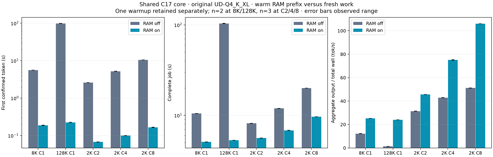
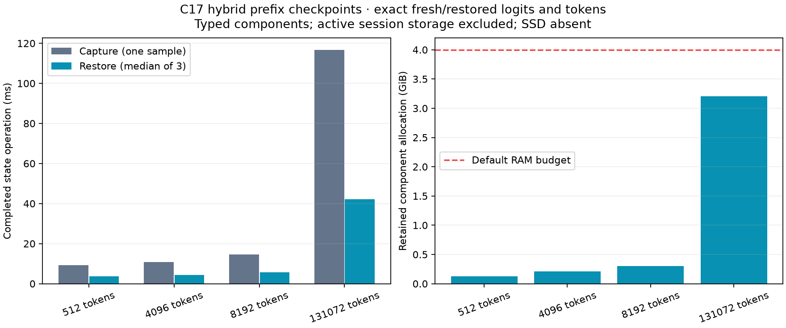

# C17 RAM prefix state — GPU result, 2026-10-02

> Historical technical record. See [current usage](../guides/USAGE.md) and
> [benchmark tables and graphs](../benchmarks/README.md). Results below retain
> their original build, protocol and limitations.

**PASS: 16/16 arms, all child/supervisor exits 0**, original UD-Q4_K_XL on `.157`.
RAM retention now defaults on at 4 GiB; SSD remains off and unimplemented.
The shared C17 core owns state components, allocation, prefix lookup, budgets,
LRU and lifetime. HTTP and the direct core benchmark use this implementation;
separate processes have separate stores. Numerical forward and active device
storage remain in the transitional HIP provider.

Runtime checkpoint: `4fe6231`, `feature/openai-reactive-api`. The qualified CPU/GPU
capsule matches all 99 non-prose source/helper files in that commit; only the
third-party provenance README was expanded after the capsule. The explicit
state-access variant adds three friend declarations in two pinned Gufo headers;
all selected archives were rebuilt separately, with no numerical-source edit or
Gufo snapshot serializer on this path. See [state](../reference/STATE.md), [ABI](../reference/ABI.md),
[provenance](../../third_party/README.md) and the [predeclared protocol](../development/protocols/STATE-GPU-PROTOCOL.md).

## Numerical and lifecycle gates

`--suite state` passed all three fresh/restored pairs at each frontier:
512 tokens, 8192 tokens, 4096 restored plus 4096 new tokens, and 131072 tokens.
Each pair checks every float logit after PP and after each of 16 AR steps,
output IDs, stop and position. Greedy, seed-123 sampling with penalties, and a
fresh independent greedy clone all matched exactly. This tests restore against
the same provider, not an independent model oracle or a statistical sampling
quality evaluation.

The cache-off executor control also matches the sealed pristine provider from
`core-gpu-r2/candidate-fresh`: exact input/output IDs and full PP/TG frontier
hashes at 8192/131072 tokens. Its TG ratios versus that historical control are
1.0035/0.9936. These timings are descriptive; the control is not a contemporaneous
paired performance experiment.

All direct-core cache-off/on outputs match their fresh-executor witnesses,
including C2/C4/C8. Native batch dispatch remains in the same core. GPU error
injection and cancellation during a real transfer were not exercised; synthetic
fault/cancellation tests do not establish hardware-fault recovery.

`.157` CPU receipts: `reactive-cpu-r12` headless **3/3**, Debug **26/26**, ASan/UBSan
**26/26**; all nine configure/build/CTest commands exit 0. R11 also passed. R10
retains two failed HTTP assertions (cold/hot usage equality and selecting usage
from the timing frame); the expectations were corrected. Local compile failures
R1/R3/R4 and corrected builds remain under `evidence/`; tests/models never ran
on the editing host. No new Pi end-to-end qualification is claimed.

## Full values including executed prefill

Original model, chunk 2048, TG128, greedy AR, identical physical prompt across
peers/repetitions. Context capacity is 262144 for C1 long prompts and 4096 for
C2/C4/C8. One warmup is retained separately; measured repetitions are two for
8K/128K and three for C2/C4/C8. RAM-on rows below are **warm full-prefix hits**.
They are a favorable reuse workload, not unrelated users' unique prompts.

PP and TG are per-job completed-call rates. Shared batch durations overlap, so
per-job TG is not aggregate TG. Aggregate throughput divides all output by the
whole cohort wall time, including PP, copies, allocation and core lifecycle;
it excludes model loading. TTFT is client observation of the first confirmed
core token, not an HTTP/network measurement. All rows are medians.

| Prompt / users | RAM | New PP / reused tokens per job | PP tok/s | TG tok/s per job | Aggregate output / total wall tok/s | TTFT ms | Total job ms |
|---|---|---:|---:|---:|---:|---:|---:|
| 8192 / C1 | off | 8192 / 0 | 1515.40 | 25.99 | 12.22 | 5586.45 | 10473.96 |
| 8192 / C1 | on | 0 / 8192 | — | 25.99 | 25.22 | 188.17 | 5074.42 |
| 131072 / C1 | off | 131072 / 0 | 1334.75 | 24.75 | 1.24 | 98384.31 | 103515.84 |
| 131072 / C1 | on | 0 / 131072 | — | 24.95 | 24.08 | 224.93 | 5315.66 |
| 2048 / C2 | off | 2048 / 0 | 1617.40 | 22.85 | 31.40 | 2593.01 | 8150.49 |
| 2048 / C2 | on | 0 / 2048 | — | 22.96 | 45.68 | 67.84 | 5601.06 |
| 2048 / C4 | off | 2048 / 0 | 1605.55 | 18.94 | 42.92 | 5210.99 | 11922.99 |
| 2048 / C4 | on | 0 / 2048 | — | 18.96 | 75.20 | 99.73 | 6805.68 |
| 2048 / C8 | off | 2048 / 0 | 1587.31 | 13.40 | 51.14 | 10517.21 | 20006.50 |
| 2048 / C8 | on | 0 / 2048 | — | 13.42 | 106.02 | 164.82 | 9645.57 |

A full hit performs **zero PP calls and zero PP tokens**; PP tok/s is not
applicable. Dividing the cached prompt by restore time would invent a GPU PP
rate. Actual generation throughput barely changes. The aggregate wall gain is
2.06× at 8K, 19.47× at 128K, and 1.45×/1.75×/2.07× at C2/C4/C8 because work is
avoided. It is not a faster forward kernel or a new reactive scheduling speedup.

[All samples, min/max and counters](../benchmarks/2026-10-02/ram-prefix/summary.json),
[CSV values](../benchmarks/2026-10-02/ram-prefix/values.csv),
[vector plot](../benchmarks/2026-10-02/ram-prefix/ram-prefix.svg).

## Capture, restore and memory

The numerical probe measures complete state operations, excluding sequence
creation and decode. Each capture is one sample; restore is the median of three
pairs. These intervals are not TTFT, isolated DMA bandwidth or SSD performance.

| Saved prefix → total prompt | Retained MiB | Capture ms | Restore ms | Fresh PP ms, median | Remaining PP ms after restore, median |
|---|---:|---:|---:|---:|---:|
| 512 → 512 | 128.54 | 9.26 | 3.72 | 517.79 | 0.00 |
| 4096 → 8192 | 212.55 | 10.75 | 4.28 | 5398.18 | 2764.94 |
| 8192 → 8192 | 311.56 | 14.63 | 5.63 | 5352.46 | 0.00 |
| 131072 → 131072 | 3282.03 | 116.75 | 42.18 | 98538.88 | 0.00 |

The 128K checkpoint has 112 sections and occupies **3.205 GiB**. The core's
128K warm restore path is 42.24 ms, while full request TTFT is 224.93 ms because
it also includes independent session creation, scheduling and the first decode.
The default 4 GiB budget bounds payload/descriptor storage, including admitted
capture after eviction; it is not total model/session RAM or exact allocation
peak. Larger checkpoints may skip retention unless the budget is increased;
256K cache retention and multi-session 128K memory fit were not qualified here.

The first C1 cache-on requests still execute full PP. Their observed complete
wall times were 10.541 s at 8K and 101.553 s at 128K, with capture paths of
14.42/128.28 ms. Corresponding initial cache-off samples were 10.563/100.569 s.
These single cold samples are retained, not a significance/no-regression claim.
At C2/C4/C8 the first cohort has one miss followed by hits for identical peers;
it must not be called all-fresh PP. Every measured warm cohort has all hits.

The same device owner performs capture/restore at completed boundaries. No
engine thread pool was added. Sampled OS thread counts during inference were
35 in the direct state/executor probes and 36 in core/HTTP; model loading reached
51/52 respectively. Startup/retirement samples also include smaller counts.
These are total process threads, not busy CPU cores. Synchronous copies can
delay peer dispatch until completion; this experiment does not establish GPU
kernel overlap, preemption or mixed-arrival latency percentiles.

## HTTP, closure and retained evidence

The default RAM-on server passed all six Chat JSON/SSE requests on loopback
port 8000 (READY, arithmetic, Unicode). Outputs, finish and total usage match;
SSE repeats report cached-token usage with zero executed PP for these exact
short prompts. Management records 3 misses, 3 captures, 3 hits, 80 reused tokens,
359602744 retained bytes and `ssd_enabled:false`. Chat/Responses sharing and
tool-output cache accounting have separate CPU fixtures. HTTP was a private
qualification listener and is now stopped.

The campaign ran 03:36:25.717–04:06:08.841 UTC on 2026-10-02, sequentially under
four freshly acquired EX|NB leases per arm. Postflight at 04:06:08.842 records
all 32 supervisor/child identities absent, KFD empty and all four unchanged
leases free. Subsequent observation confirms the controller absent and only
TIME_WAIT connections on port 8000. All **153 collected files verify by SHA-256**.
The verified release was sent to Q2 before offline analysis; its later work may
own the GPU. No continuing idle-machine claim or permanent lease is implied.

No DS4 mutation, foreign termination, package installation, model conversion,
remote GPU build, power tuning or source under `/tmp` was introduced. Existing
desktop/denied-FD observation limits and absence of a formal DS4 ACK remain.
Original model stat identities and staged files were preserved. Optional SSD,
exact generation resume, MTP, vision, 1M context and unrelated-prefix workloads
remain separate roadmap/qualification work.

Raw evidence is persistent at local `evidence/state-gpu-r1` and remote
`run/state-gpu-r1`. The [artifact bundle](../benchmarks/2026-10-02/ram-prefix)
contains results, collection hashes, source/build receipts, CPU receipts,
plots and the offline analysis script. Run the script from the feature worktree
root with the collected raw evidence; it never invokes a model or server.
