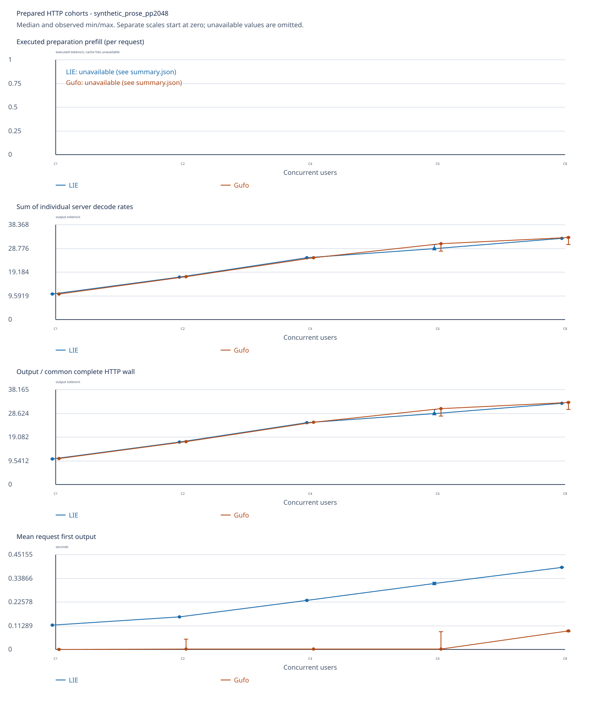

<!-- SPDX-License-Identifier: MIT -->
# Strix Point: served HTTP AR and MTP, LIE versus Gufo

Original Unsloth Qwen3.8 Flash Next UD-Q4_K_XL weights were served on
`pop@192.168.5.161` (Radeon 890M, `gfx1150`), using the same Fedora 43 / ROCm
10 Distrobox stack for LIE and the independently built official Gufo control.
The LIE server and native `synapse-lie-bench` client were built from
`128f490cfff9713f84f658ad17118272a1cd4ad7`; official Gufo is pinned to
`f783fedb9bea2ec7de941f6da4e02f4a4596b29e`. This is **real HTTP model
serving**, with one client event loop and independent concurrent requests, not
the earlier direct-executor multi-session benchmark. All reported LIE/Gufo
pairs have identical physical prompts and complete 128-token outputs.

Two server-capacity policies are reported separately. **Fresh** starts a new
server at each C1/2/4/6/8 level with `sessions=C`, matching the lifecycle of
Gufo's historical `run_multi` method. **Fixed8** keeps one eight-session server
for all levels, showing the behavior of a normally provisioned HTTP service.
Both engines use the same policy within each comparison. The values below are
the median of three measured cohorts after one excluded preparation warmup;
units are the **sum of individual server decode token/s** for the simultaneous
requests. This is distinct from common-wall throughput and client latency,
which are in the [complete 32-row CSV](generated/summary.csv). C1 AR repetition
is included as a matched control; repetition C2–C8 has no AR counterpart here.

| Fresh, sessions=C | C1 LIE / Gufo | C2 | C4 | C6 | C8 |
| --- | ---: | ---: | ---: | ---: | ---: |
| AR prose | 10.442 / 10.501 | 17.273 / 17.360 | 25.027 / 25.178 | 28.810 / 30.720 | 32.984 / 33.316 |
| MTP prose | 11.863 / 11.845 | 17.516 / 18.022 | 25.704 / 25.229 | 28.714 / 28.512 | 31.362 / 31.955 |
| MTP repetition | 21.037 / 21.496 | 28.060 / 29.330 | 33.527 / 34.830 | 38.551 / 35.727 | 38.735 / 38.770 |
| AR repetition | 10.423 / 10.504 | — | — | — | — |

| Fixed8, sessions=8 | C1 LIE / Gufo | C2 | C4 | C6 | C8 |
| --- | ---: | ---: | ---: | ---: | ---: |
| AR prose | 10.437 / 10.481 | 17.277 / 17.396 | 24.988 / 25.174 | 30.400 / 30.748 | 32.995 / 33.335 |
| MTP prose | 11.611 / 11.544 | 17.107 / 19.126 | 24.282 / 24.625 | 28.743 / 28.498 | 31.405 / 31.083 |
| MTP repetition | 18.321 / 18.432 | 29.526 / 30.006 | 33.143 / 34.303 | 35.999 / 37.677 | 38.994 / 38.728 |
| AR repetition | 10.423 / 10.499 | — | — | — | — |



[Fresh MTP prose graph](generated/fresh-mtp-prose/benchmark.svg) ·
[Fresh MTP repetition graph](generated/fresh-mtp-repetition/benchmark.svg) ·
[Fixed8 AR prose graph](generated/fixed8-ar-prose/benchmark.svg) ·
[Fixed8 MTP prose graph](generated/fixed8-mtp-prose/benchmark.svg) ·
[Fixed8 MTP repetition graph](generated/fixed8-mtp-repetition/benchmark.svg).
Each graph also has a PNG, CSV and JSON in its directory. The
[combined JSON](generated/summary.json) contains all 16 native comparisons,
including within-engine MTP/AR graphs and pairwise output checks.

## What MTP changed

At C1 on the fresh-server repetition prompt, MTP raises LIE decode from
10.423 to 21.037 token/s (**2.018×**) and Gufo from 10.504 to 21.496
(**2.046×**); all twelve measured C1 outputs have the same hash across AR,
MTP, LIE and Gufo. On the prose prompt, LIE MTP/AR is 1.136× at C1 and
0.951× at C8; Gufo is 1.128× and 0.959×. The predictor is active at C8, but
the fresh LIE prose run proposes/accepts only 456/264 draft tokens over 3,072
measured output tokens, compared with 192/114 over 384 at C1. The accepted
draft density falls as concurrency rises in this workload. The repetition
case has much higher draft acceptance and its C8 MTP rates reach 38.735/38.770
token/s. These are workload-specific throughput observations, not a general
MTP quality or speed guarantee. The C6 repetition medians favor LIE here, but
their three-run ranges overlap (LIE 35.261–38.841, Gufo 35.488–39.042).

The fresh C6 AR prose LIE median is 28.810 against Gufo's 30.720, while its
three LIE cohorts span 28.344–30.410 token/s. Its one cold warmup PP rate was
479.654 token/s and sampled CPU peak 87.5 °C; this evidence does not isolate
the cause of the variation. At C8 both engines' prose MTP medians are below
their own AR medians, so an enabled predictor alone does not establish a gain.

## Prefill, latency and resource accounting

Each server uses context 4,096, prefill chunk 2,048, prefix caching and 128
requested output tokens. The prose physical prompt has 2,040 tokens; repetition
has 2,034. The warmup prepares each participant, and **all measured
preparations are cache hits with zero executed prefill tokens**. Consequently
the measured PP rate is null, not zero, in every CSV row. One cold warmup PP
observation per server window is recorded separately in the CSV; it is not a
three-sample median. In fresh AR prose, LIE's cold PP rate at C1/2/4/6/8 is
509.224/511.674/509.572/479.654/510.897 token/s; Gufo's is
490.888/494.562/493.160/496.046/491.562. At C>1 the engines report
different numbers of executed warmup tokens because their prefix reuse during
concurrent preparation differs, so those PP rates are not a controlled
same-work comparison. Fixed8 C2–C8 has no fresh cold prefill after C1.

The C1 fresh AR prose median HTTP first-output time is 0.1165 s for LIE and
0.00186 s for Gufo, despite similar full decode rates. The official Gufo
[scheduler](https://github.com/gufo-org/gufo/blob/f783fedb9bea2ec7de941f6da4e02f4a4596b29e/src/cli/serve/text_generation_scheduler.cpp)
can publish a preview first token before `DecodeStep`; the current LIE
[adapter](../../../../../adapters/gufo.cpp) proceeds through `DecodeStep`.
That code-path difference is a plausible explanation for first-token timing,
but this campaign does not isolate causality. TTFT is client-visible and should
be assessed separately from decode rate.

Across the fresh windows, sampled maxima were CPU 87.5 °C, GPU 82 °C and
NVMe 75.85 °C; the supervisor guarded CPU at 98 °C and NVMe at 85 °C while
observing GPU temperature. No hardware setting was tuned. The largest sampled
GTT usage was 92,166,135,808 bytes. All 32 fresh and eight fixed performance
windows completed with client and supervisor exit 0, unchanged original model
file identities, router restored and private lease released. The first LIE
AR C1 supervisor-closure failure and the first Gufo PIE link failure remain
archived with their actual exit codes, excluded from the table. The corrected
Gufo non-PIE build also has its own archived successful receipt.

## Evidence and offline reproduction

The [verification record](generated/verification.json) binds 725 archived
files, including 682 separately SHA-256-checked remote files and 43 collection
records; 41 windows succeeded (40 model runs and one control build) and two
historical failures are retained. The three [archives](data/archives.sha256)
contain raw JSONL, logs, telemetry, supervisor/client/server exits, source and
binary identities, model-file stat witnesses and collection manifests:

- [Fixed-capacity windows](data/fixed8.tar.gz),
  SHA-256 `bd02b592a4b0f0c2cf09c7f3ec6a53565cdac4318b3a44e00800188d637c02bb`.
- [Fresh-server windows](data/fresh.tar.gz),
  SHA-256 `ece9f03118e84cf24d522cd68db3a7218a62f51c68286a72779c0388b0a3f8ea`.
- [Build and failure history](data/history.tar.gz),
  SHA-256 `ffc0b374f7faf59d919bc26d60c9bfeda84f825c2e8bbc5193bb46b1c55a4712`.

The [archive inventory](data/inventory.json) lists every run and collection
hash. To verify all members and regenerate the tables/graphs without model,
GPU or network access, build `synapse-lie-bench` from the recorded source and
run from the repository root with a **new** output directory:

```sh
cd docs/benchmarks/2026-10-04/strix-point/http-multi/data
sha256sum -c archives.sha256
cd ../../../../../..
cmake -S . -B build/point-report -G Ninja -DBUILD_TESTING=OFF
cmake --build build/point-report --target synapse-lie-bench -j2
python3 -B docs/benchmarks/2026-10-04/strix-point/http-multi/make-report.py \
  run/point-http-report-copy --bench-binary build/point-report/synapse-lie-bench
```

`make-report.py` checks every archive and collected-file hash, success/failure
status, postflight ownership and the native reporter's complete output and
identity gates before export. It also uses the
[fresh-cohort merger](../../../../../tools/strix-point-http-merge-fresh.py)
to reconstruct Gufo-style five-level reports from the 32 isolated server
windows. The final graphs use a label-only C reporter update so all C1–C8
ticks remain visible; rerendering left every numeric value and the combined
JSON/verification files byte-identical. The combined CSV was then normalized
to LF line endings (SHA-256 values in the
[release receipt](../../../../development/validation/point-http-multi-release-2026-10-04.json)).
The [source seal](seal-data.py) is retained for audit; reproducing an
existing report requires only the three committed archives. The verified
[source provenance](../../../../development/validation/point-gufo-port-source-2026-10-04.json)
records the independently fetched Gufo and rocWMMA pins and the limited
`gfx1150` build port. This report's performance scope is 4K context,
greedy text output and eight clients at most; the separate
[Point long-context report](../../../models/qwen3.8-flash-next/strix-point/README.md)
covers direct-executor prefill through 128K and near 256K. This HTTP campaign
does not by itself qualify served 256K, 1M context, vision or statistical MTP
quality. The focused native HTTP benchmark contract also passes 1/1 under
ASan, UBSan and LeakSanitizer on a private local loopback port; this fixture
validates reporting behavior, while the archived `.161` windows establish
the GPU results above.
