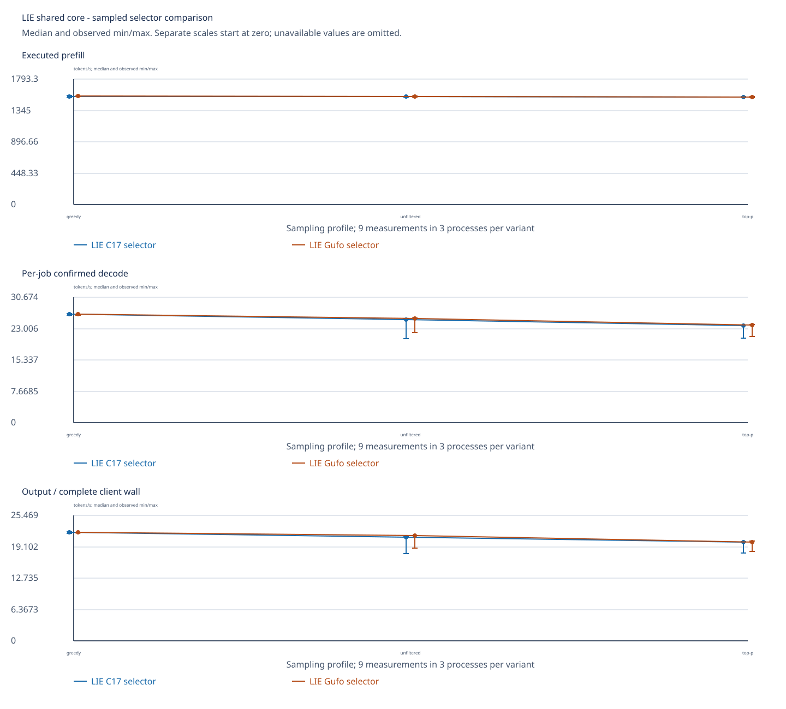
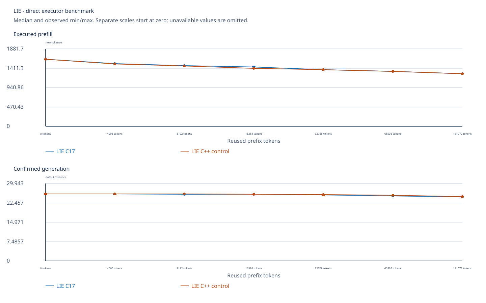
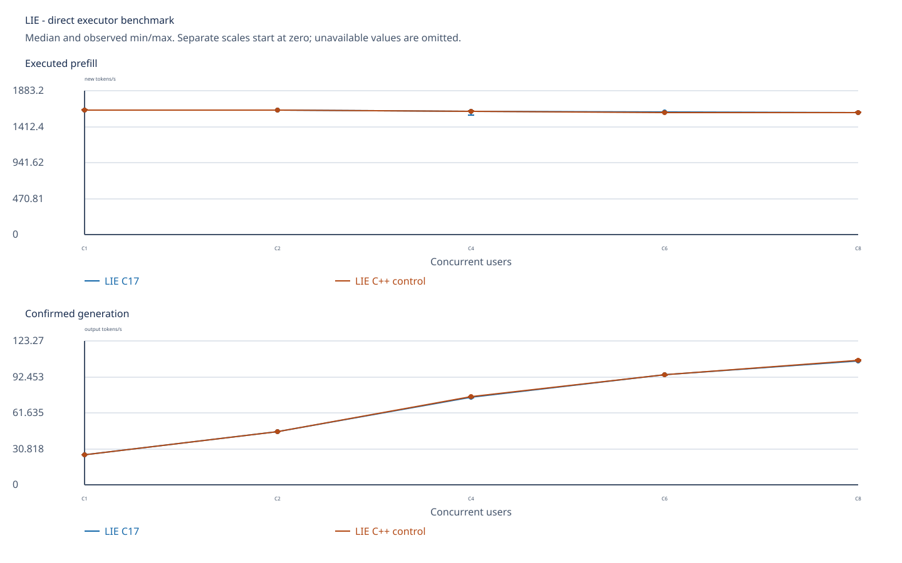
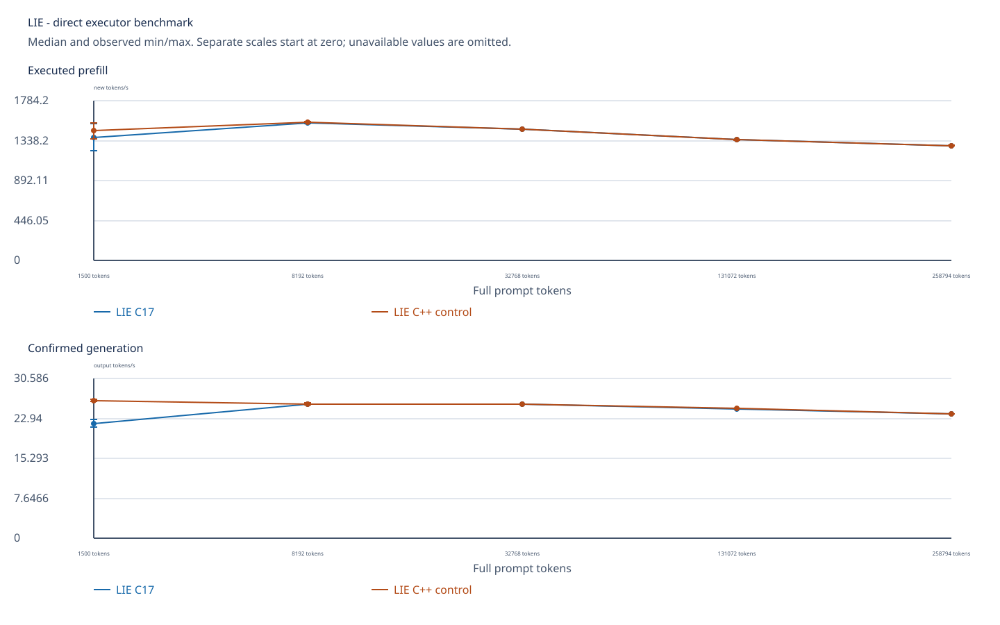
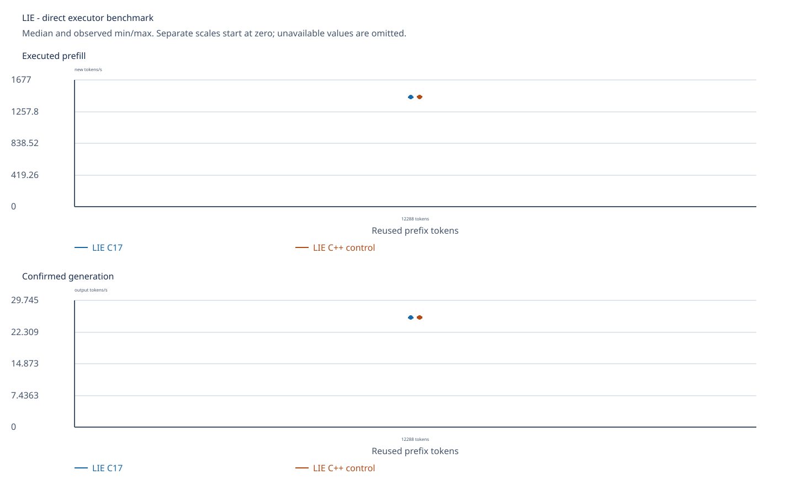
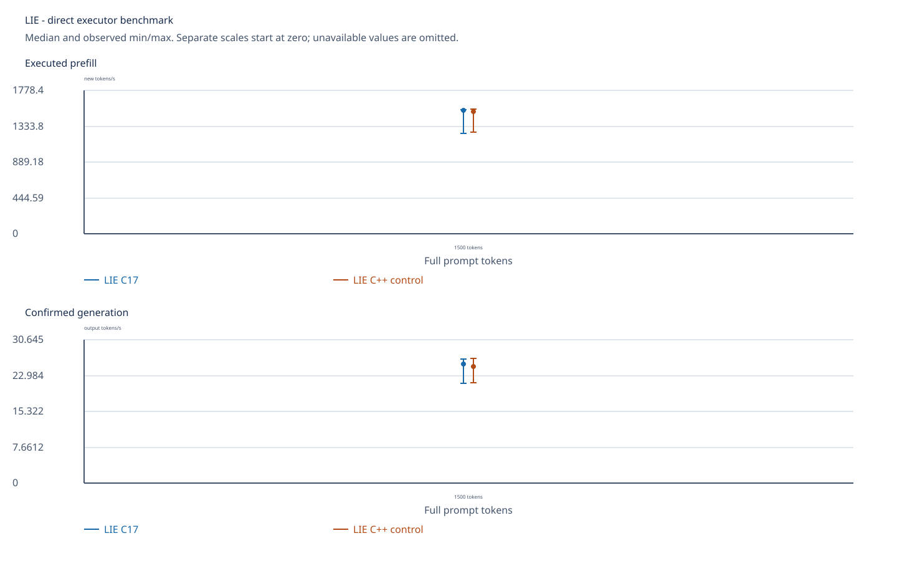
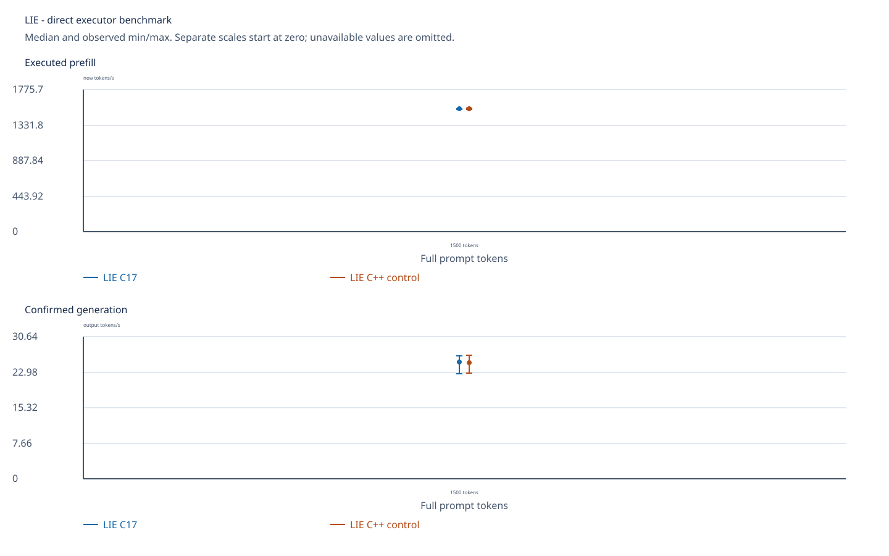
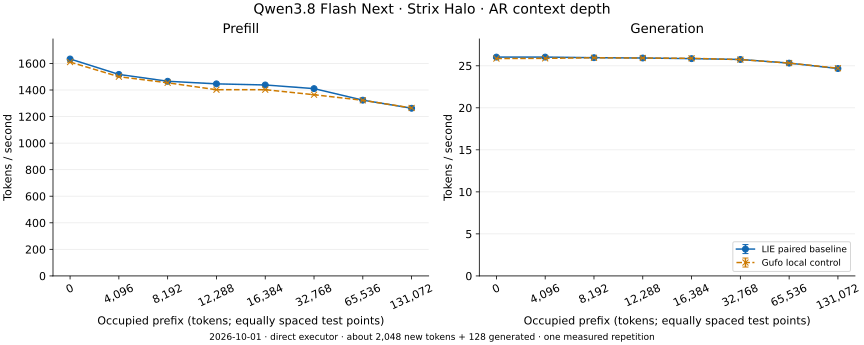
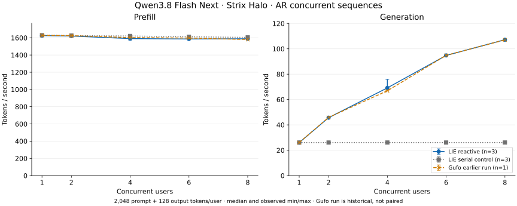
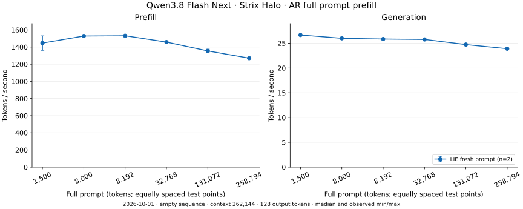

<!-- SPDX-License-Identifier: MIT -->
# Qwen3.8 Flash Next — AMD Strix Halo

[All benchmarks](../../../README.md) · [Run these workloads](../../../../guides/BENCHMARKS.md)

**Latest performance measurements: October 4, 2026.** The seeded shared-core comparison
below is the latest run; the existing context/concurrency tables retain their
recorded builds. PP means prefill throughput; TG means
confirmed generation throughput, both in tokens per second. Tables include PP
wait time. Charts use separate PP/TG scales beginning at zero; bars show observed
minimum/maximum around the median. Duration columns in downloaded CSVs are
seconds; throughput columns are tokens per second.

## Current r70 functional qualification — October 8

The current C17 core with the transitional Gufo provider passes seven native
commands on `.157`, `gfx1151`, native ROCm 7.2.4. Original UD-Q4 weights,
2,048 identical physical prompt tokens, TG32, native context4096, chunk256,
greedy AR and cache off are fixed. LIE and its matched Gufo C1 reference have
identical prefill/decode logits hashes and all 32 output IDs. The production
core C1 and both C2 jobs produce those same IDs.

| Client | Completed decode calls | Batch rows | Exact output parity |
| --- | ---: | ---: | --- |
| Direct LIE C1 | 32 single | 0 | 32/32 |
| Matched Gufo C1 reference | 32 single | 0 | 32/32 |
| Shared core C1 | 32 single | 0 | 32/32 |
| Shared core C2 | 32 batches | 64 | Both jobs, 32/32 |

The direct-core reactive probe holds one borrowed output buffer while the other
job completes 32 tokens, then cancels the blocked job. Thirteen generated sparse
WMMA cases also pass full byte comparisons through 1M geometry; these are GPU
component checks. The short model workload does not qualify model inference
through 1M, wider feature/task quality or reactive speedup.

CPU/GPU/NVMe peaks are 82.5/84/71.85 C. All commands, collection, independent
review and process/group closure pass; all five original leases are released.
The [receipt and complete raw data](../../../../development/validation/halo-r70-functional-2026-10-08.json)
retain 88 collected native files and 137 portable members. Observed direct
PP/TG rates are LIE723.782/20.302 and reference731.566/20.751 tok/s, with
one sample, zero warmup and sequential order. These are functional-run timings,
not a qualified performance comparison. Q2 uses a separate numerical provider;
this UD-Q4 parity does not resolve its C1/batch divergence.

## Seeded shared-core sampler comparison — October 4

Frozen `5a377aa` compares the C17 dense selector with the Gufo selector inside
LIE's same reactive core on `.157`. Original UD weights, **1500 physical input
tokens, context 4096, chunk 2048, TG128, C1, seed 123**, RAM/SSD retention off,
AR without MTP or vision. Each profile uses three fresh processes per variant,
one warmup and three measurements per process: **nine measured samples per
variant/profile**. Orders are ON/OFF, OFF/ON, ON/OFF; sample counts match, but
first-position order is not perfectly balanced.

| Profile | C17 PP tok/s | Control PP tok/s | C17 PP s | Control PP s | C17 decode tok/s | Control decode tok/s | C17 full-wall tok/s | Control full-wall tok/s |
| --- | ---: | ---: | ---: | ---: | ---: | ---: | ---: | ---: |
| Greedy: T=0, P=1, no penalties | 1551.25 | 1553.13 | 0.9670 | 0.9658 | 26.650 | 26.643 | 22.122 | 22.122 |
| Unfiltered: T=0.8, P=1, no penalties | 1544.80 | 1550.02 | 0.9710 | 0.9677 | 25.220 | 25.593 | 21.111 | 21.396 |
| Top-p: T=0.8, P=0.9, frequency=0.2, presence=0.1 | 1538.61 | 1536.80 | 0.9749 | 0.9761 | 23.837 | 23.877 | 20.126 | 20.141 |

All values are medians. Decode measures per-job executor time; full-wall rate
includes preparation, queueing, prefill and consumption after core readiness.
The C17/control decode differences are **+0.026%, -1.457% and -0.166%**.
Slower measurements remain: unfiltered ranges are C17 **20.663–25.370** and
control **22.089–25.609 tok/s**. Process/clock variation still prevents a stable
parity claim. Across-profile outputs differ, so those rates do not isolate host
sampler cost. This is not the separate Gufo HTTP server comparison.

All **18 arms**, children, supervisors and SSH controller exit 0. The **36 paired
outputs** match exactly, including warmups; all 72 streams reach 128 tokens.
CPU/GPU/NVMe peaks are **86/89/71.85 C**, without CPU/SSD stops or observed crashes.
GPU temperature has no software stop. The model child has 1–52 sampled OS threads
including HIP/runtime/load/retirement; the core retains one device dispatcher.



The chart pools all nine measurements per variant/profile, with observed min/max
bars and separate zero-based scales. `top-p` includes the penalties listed above.
Both series' markers remain visible when their values coincide.

[All 72 samples with controls, PP/decode durations and TTFT (CSV)](charts/sampled-core-5a377aa/all-samples.csv) ·
[Complete distributions (JSON)](charts/sampled-core-5a377aa/summary.json) ·
[Raw 18-arm evidence (tar.gz)](data/sampled-core-5a377aa.tar.gz) ·
[Source/exit/closure receipt](../../../../development/validation/sampled-core-gpu-2026-10-04.json).

Closure at 02:43:25 UTC verifies 37 retired identities, 36 empty groups, empty KFD,
four original unchanged/free leases, model stats and capsules. All 233 collected
files verify by SHA256. Model files and numerical sources are unchanged; OS file
cache is uncontrolled, so loading is not a cold-load measurement. Independent
quality, allocation-exact GPU accounting and the broader benchmark gates remain open.

## Original AR context campaign — October 3

| Measurement setup | Value |
| --- | --- |
| Model | Original Unsloth UD-Q4_K_XL, four shards, revision `38bb39ee97821de2c9009abb7e93950eec396e66`. |
| Platform | Bosgame AXB35-02, Ryzen AI Max+ 395, 128 GB, HIP `gfx1151`, host `.157`. |
| Builds | Checkpoint `b72f4e8`; C17 sampler enabled versus disabled, embedded Gufo pin `f783fedb`. |
| Timing | Direct reactive executor, AR greedy, chunk 2048, TG128; no HTTP, MTP, image or retained-cache timing. |
| Repetitions | Depth/concurrency: one warmup plus three samples. Full prompt: two samples, no warmup. |

The **C++ control is LIE with its C17 selector disabled**, using the same reactive
scheduler and GPU model graph. It is not the separate Gufo HTTP server. All
**46 measured pairs and 12 warmup pairs** have identical physical inputs, output
IDs, stopping/batch counters and full prefill/decode-logit hashes. Greedy selection
retains GPU argmax in both builds; these data do not measure dense host-sampler cost.

TG differs by less than 1% across the depth/concurrency tests and full prompts
from 8192 tokens. **The un-warmed 1500-token point is slower by 16.64% in C17**;
its cause remains unresolved and the performance gate stays open. The clocked
follow-up below observes a slow and fast band in both builds. The original
campaign captured no clock/power trace; its values remain unchanged.

## Single user: occupied context through 128K

Prefill processes approximately 2048 new tokens after the listed prefix. Prefix
construction is excluded from PP time. Both builds reserve capacity 133760.
This original campaign has seven depths. The clocked follow-up below supplies
the missing **12288** pair, completing the eight-depth shape across two source-bound
windows. The original graph and historical eight-point results remain unchanged.

| Prefix tokens | New PP tokens | C17 PP | C++ PP | C17 PP seconds | C++ PP seconds | C17 TG | C++ TG |
| ---: | ---: | ---: | ---: | ---: | ---: | ---: | ---: |
| 0 | 2,048 | 1,635.95 | 1,630.86 | 1.252 | 1.256 | 25.95 | 26.02 |
| 4,096 | 2,047 | 1,521.93 | 1,517.88 | 1.345 | 1.349 | 25.93 | 26.02 |
| 8,192 | 2,048 | 1,475.04 | 1,468.25 | 1.388 | 1.395 | 25.85 | 25.93 |
| 16,384 | 2,048 | 1,447.93 | 1,410.12 | 1.414 | 1.452 | 25.79 | 25.86 |
| 32,768 | 2,048 | 1,380.68 | 1,380.40 | 1.483 | 1.484 | 25.64 | 25.73 |
| 65,536 | 2,048 | 1,336.33 | 1,337.76 | 1.533 | 1.531 | 25.21 | 25.45 |
| 131,072 | 2,048 | 1,278.98 | 1,279.45 | 1.601 | 1.601 | 24.79 | 24.87 |



## Concurrent users: one through eight

Each sequence has 2048 prompt tokens and capacity 4096. All sequences finish
prefill before timed decode. PP is the total prompt count divided by prefill time;
TG is the total confirmed output divided by the cohort's decode time.

| Users | PP tokens per user | C17 PP | C++ PP | C17 PP seconds | C++ PP seconds | C17 TG | C++ TG |
| ---: | ---: | ---: | ---: | ---: | ---: | ---: | ---: |
| 1 | 2,048 | 1,633.32 | 1,635.95 | 1.254 | 1.252 | 26.02 | 26.02 |
| 2 | 2,048 | 1,631.20 | 1,631.76 | 2.511 | 2.510 | 45.75 | 45.92 |
| 4 | 2,048 | 1,619.29 | 1,620.96 | 5.059 | 5.054 | 75.46 | 75.90 |
| 6 | 2,048 | 1,608.74 | 1,601.86 | 7.638 | 7.671 | 94.39 | 94.67 |
| 8 | 2,048 | 1,603.38 | 1,601.76 | 10.218 | 10.229 | 106.36 | 107.17 |



C17 reaches **106.36 tok/s** at eight users; its matched C++ control reaches
**107.17 tok/s**. Both batch native GPU decode. This comparison does not isolate
a reactive advantage. Eight users are sequences, not inference threads: one
caller owns device dispatch. The sampled process thread count ranges from
**1 to 51** in every arm, including runtime helpers and load/retirement phases;
a per-phase thread allocation is not available. Gufo's published HTTP test instead
sums individual request rates, so that exact comparison is still pending.

## Full prompt prefill: through 258794 tokens

This starts from an empty sequence and includes the entire prompt prefill.
It measures the wait for a new long input, separate from suffix PP and cache
reuse. Both builds reserve capacity 262144. Rate and time medians are summarized
independently; with two samples, the median rate need not equal tokens divided
by median time.

| Full prompt tokens | PP tokens | C17 PP | C++ PP | C17 PP seconds | C++ PP seconds | C17 TG | C++ TG |
| ---: | ---: | ---: | ---: | ---: | ---: | ---: | ---: |
| 1,500 | 1,500 | 1,380.20 | 1,451.37 | 1.100 | 1.037 | 22.02 | 26.41 |
| 8,192 | 8,192 | 1,540.62 | 1,550.52 | 5.317 | 5.283 | 25.75 | 25.79 |
| 32,768 | 32,768 | 1,469.29 | 1,471.31 | 22.302 | 22.271 | 25.70 | 25.74 |
| 131,072 | 131,072 | 1,352.50 | 1,351.98 | 96.912 | 96.949 | 24.82 | 24.88 |
| 258,794 | 258,794 | 1,286.84 | 1,287.68 | 201.109 | 200.977 | 23.83 | 23.87 |



The 258794-token prompt takes **201.109 s** in C17 versus **200.977 s** in the
C++ control. TG is **23.83** versus **23.87 tok/s**. Across all six arms,
sampled peaks are CPU94.625/GPU97/NVMe75.85 C; no 98 C operating guard stop
occurs. Fans are not exposed on this host. Desktop activity and denied FD
visibility limit isolation claims; the cooperative leases are not universal
exclusivity. File-cache state is uncontrolled and model construction is excluded.

## Clocked follow-up: 12K depth and first 1500 tokens

Checkpoint `15c6082` adds native phase clocks to the same numerical/runtime
composition used above. Ten processes run sequentially on `.157`: the missing
12K pair, then C17/C++/C++/C17 with no model warmup and C++/C17/C17/C++ with two
warmups per process. Each process has three measured samples, a private cache
and the same unchanged model. CPU is at or below 60 C before model loading;
the operating guard is CPU 98 C, with independent SSD limits. GPU temperature
is recorded without a software temperature stop. File-cache state is uncontrolled.

All **15 measured pairs and five warmup pairs** match physical inputs, output
IDs, complete logit hashes and dispatch counts. Native reporting also validates
all monotonic phase bounds and exact PP/TG duration differences. These greedy
runs retain GPU argmax and do not measure dense host-sampler cost.

| Prefix tokens | New PP tokens | C17 PP | C++ PP | C17 PP seconds | C++ PP seconds | C17 TG | C++ TG |
| ---: | ---: | ---: | ---: | ---: | ---: | ---: | ---: |
| 12,288 | 2,048 | 1,451.67 | 1,454.54 | 1.411 | 1.408 | 25.81 | 25.83 |



The following rows expose each 1500-token process. PP and TG rates/durations are
medians of three samples; TG is 128 confirmed tokens. Clock values are medians
of per-sample GPU-clock snapshots strictly within the measured decode interval.

| Process | Build | Warmups | PP tok/s | PP seconds | TG tok/s | TG seconds | TG clock MHz |
| --- | --- | ---: | ---: | ---: | ---: | ---: | ---: |
| first 0 | C17 | 0 | 1532.34 | 0.979 | 22.96 | 5.575 | 2686.0 |
| first 1 | C++ control | 0 | 1500.97 | 0.999 | 26.64 | 4.805 | 2885.0 |
| first 2 | C++ control | 0 | 1531.82 | 0.979 | 22.88 | 5.594 | 2687.0 |
| first 3 | C17 | 0 | 1544.03 | 0.971 | 26.38 | 4.852 | 2872.0 |
| warm 0 | C++ control | 2 | 1533.45 | 0.978 | 23.13 | 5.533 | 2707.5 |
| warm 1 | C17 | 2 | 1537.42 | 0.976 | 22.90 | 5.589 | 2688.0 |
| warm 2 | C17 | 2 | 1540.29 | 0.974 | 26.61 | 4.810 | 2882.5 |
| warm 3 | C++ control | 2 | 1541.56 | 0.973 | 26.64 | 4.805 | 2881.0 |

Both builds enter the **22.9–23.1 tok/s** band and the **26.4–26.6 tok/s** band.
Lower decode clocks (approximately 2686–2708 MHz versus 2872–2885 MHz) accompany
the slow band. This is an observed correlation, not a causal diagnosis. Two
warmups do not consistently remove it. First samples and ranges remain visible
in the full CSV; the original 16.64% result is retained above.

Balanced six-sample aggregates give C17/control PP 1534.04/1516.22 and
TG 25.55/25.03 without warmup; after two warmups per process, PP 1537.58/1537.99
and TG 25.19/25.17. These pools combine two processes per build. Derived sample
indices are reindexed for reporting; original duration, clock, token and hash
values are unchanged and the source map records every original process/rep.
The wide process variation keeps the stable performance gate open.





R3 records 1027 telemetry samples with CPU 95.75/GPU 98/NVMe 74.85 C peaks and
no thermal stop or observed hardware crash. The earlier R2 C++ attempt stopped
under its old GPU 98 policy at a sampled GPU 101/CPU 96.125 C; it remains archived.
All 26 process identities from both attempts retire, KFD is empty and the original
leases, model stats and capsules remain unchanged at release 23:30:28 UTC.
The [source-bound receipt](../../../../development/validation/clocked-gpu-followup-2026-10-03.json)
records commands, failures, exact comparisons and interpretation limits.

Downloads: [all process medians](charts/clocked-processes.csv),
[every measured and warmup sample](charts/clocked-samples.csv),
[phase clocks and temperature observations](charts/clocked-telemetry.json),
[aggregate source map](charts/clocked-source-map.json), and
[original attempts including the failed R2](data/clocked-original-attempts.tar.gz).
Each graph has native CSV/JSON and SVG/PNG siblings in [charts/](charts/).

To regenerate the balanced first-prompt figure with the native C exporter:

```sh
mkdir -p results
gzip -dc docs/benchmarks/models/qwen3.8-flash-next/strix-halo/data/clocked-first-c17.jsonl.gz > results/clocked-c17.jsonl
gzip -dc docs/benchmarks/models/qwen3.8-flash-next/strix-halo/data/clocked-first-cpp.jsonl.gz > results/clocked-cpp.jsonl
build/release/synapse-lie-bench-report --suite report results/clocked-c17.jsonl \
  --output results/clocked-charts --label 'LIE C17' \
  --compare results/clocked-cpp.jsonl --reference-label 'LIE C++ control'
```

## Integrated runtime functional checks — October 4

The merged C17 sampler/vision runtime at `032d847` passes all twelve planned
functional arms on `.157`: AR with both selectors, MTP/image HTTP, RAM continuation,
SSD write/fresh-process read and direct-core backpressure/cancellation. Fifteen
AR JSON generation pairs match requests, outputs, usage and logprobs after
transport-ID normalization. The state probes verify 312 fresh/restored dispatch
pairs and 168 complete greedy AR frontiers of 248,320 logits; the MTP C17/C++
control streams also match exactly. These checks do not measure throughput or
establish an independent quality oracle.

Sampled peaks across all attempts are CPU84.75/GPU86/NVMe70.85 C, with no CPU/SSD
guard stop or observed crash. GPU temperature is observation-only. The initial
combined HTTP attempt failed in an old private verifier; its server exited 0,
and that failure remains in the [complete raw archive](data/integrated-032d-functional.tar.gz).
A new capsule uses the separately qualified consumers and completes the remaining
arms. The [source-bound receipt](../../../../development/validation/integrated-gpu-functional-2026-10-04.json)
records actual exits, all 129 artifact hashes and the verified release of 28
owned identities. MTP/vision performance, live RNG-session resume and quality
remain separate gates.

## Reproduce and download

[Full-precision values and timing ranges](charts/current-values.csv) combine all
three workloads. Native summary JSON/CSV and SVG/PNG live in [charts/](charts/).
Raw measured inputs/outputs are in [data/](data/), named `current-depth`,
`current-multi` and `current-fresh`, with `c17` and `cpp` arms. The
[source-bound validation receipt](../../../../development/validation/c17-gpu-performance-2026-10-03.json)
records every comparison and artifact hash. Existing files are never overwritten
by the native exporter.

To regenerate a figure from its downloaded raw pair, without a GPU or Python:

```sh
mkdir -p results
gzip -dc docs/benchmarks/models/qwen3.8-flash-next/strix-halo/data/current-depth-c17.jsonl.gz > results/c17-depth.jsonl
gzip -dc docs/benchmarks/models/qwen3.8-flash-next/strix-halo/data/current-depth-cpp.jsonl.gz > results/cpp-depth.jsonl
build/release/synapse-lie-bench-report --suite report results/c17-depth.jsonl \
  --output results/depth-charts --label 'LIE C17' \
  --compare results/cpp-depth.jsonl --reference-label 'LIE C++ control'
```

See the [benchmark guide](../../../../guides/BENCHMARKS.md) for new GPU runs and
Gufo's pinned [benchmarks](https://github.com/gufo-org/gufo/blob/f783fedb9bea2ec7de941f6da4e02f4a4596b29e/docs/models/qwen3.8-flash-next/BENCHMARKS.md)
and [method](https://github.com/gufo-org/gufo/blob/f783fedb9bea2ec7de941f6da4e02f4a4596b29e/docs/models/qwen3.8-flash-next/QUALITY.md#benchmark-method)
for the reference protocol.

## Remaining Gufo / Halogen coverage

| Workload | Remaining work |
| --- | --- |
| Eight AR prefix depths. | Covered by the original seven depths plus the clocked 12288 pair; a single-window eight-point rerun is separate. |
| Multi-user AR over HTTP. | Implement and run Gufo's per-request-rate protocol. |
| Sampled AR. | Native core controls are CPU-qualified; matched original-weight sampling performance remains pending. |
| MTP single/multiple users. | MTP is integrated; mixed/repetitive performance campaigns remain pending. |
| Cold model loading. | Measure cold target files to HTTP readiness; current model load leaves OS cache uncontrolled. |
| Peak HIP memory. | Allocation-exact peak accounting; provider estimates are insufficient. |
| 512K–1M context. | Implement and qualify context expansion beyond native 262144. |
| First full prompt at 1500 tokens. | Crossover and phase-clock follow-up complete; slow/fast bands occur in both builds. Root cause and a stable performance gate remain open. |

## Historical measurements — October 1

<details>
<summary>Earlier Gufo reference, reactive versus serial and full-prompt results</summary>

### Single user: context depth through 128K

This test measures approximately 2,048 new prompt tokens **after** the occupied
prefix, then generates 128 tokens. The time to construct the prefix is excluded.
Use it to compare suffix prefill and decoding as the context grows.

| Prefix tokens | New PP tokens | LIE PP | Gufo PP | LIE TG | Gufo TG |
| ---: | ---: | ---: | ---: | ---: | ---: |
| 0 | 2,048 | 1,633.37 | 1,610.13 | 26.03 | 25.86 |
| 4,096 | 2,047 | 1,517.17 | 1,500.01 | 26.03 | 25.88 |
| 8,192 | 2,048 | 1,465.62 | 1,454.18 | 25.96 | 25.95 |
| 12,288 | 2,048 | 1,446.02 | 1,401.94 | 25.92 | 25.92 |
| 16,384 | 2,048 | 1,437.71 | 1,402.14 | 25.85 | 25.89 |
| 32,768 | 2,048 | 1,410.20 | 1,364.33 | 25.75 | 25.74 |
| 65,536 | 2,048 | 1,323.24 | 1,322.22 | 25.31 | 25.32 |
| 131,072 | 2,048 | 1,262.38 | 1,264.80 | 24.67 | 24.71 |



Paired local baseline: LIE `openai-reactive-api-r3` and the direct Gufo reference,
one measured repetition after one warmup, capacity 133,760. This predates LIE's
reactive batching change. All eight pairs have matching physical inputs and
output tokens. A later reactive C1 check at depths 0, 16K and 128K stayed within
0.35% of serial median TG; the complete eight-depth reactive rerun is still pending.

### Multiple users: prefill and generation

Each sequence has 2,048 prompt tokens, 128 output tokens and capacity 4,096.
All sequences finish prefill before timed decode. TG is the combined output
count divided by the cohort's decode time. PP is aggregate prefill throughput.

| Users | LIE reactive PP | Gufo earlier PP | LIE reactive TG | Gufo earlier TG | LIE serial TG |
| ---: | ---: | ---: | ---: | ---: | ---: |
| 1 | 1,625.73 | 1,628.64 | 26.02 | 26.05 | 26.05 |
| 2 | 1,620.22 | 1,624.90 | 45.67 | 45.87 | 26.06 |
| 4 | 1,590.68 | 1,602.50 | 69.17 | 66.89 | 26.07 |
| 6 | 1,586.34 | 1,596.89 | 94.76 | 94.82 | 26.06 |
| 8 | 1,588.75 | 1,580.05 | 107.15 | 107.03 | 26.08 |



LIE `reactive-inference-r3` uses three measured repetitions after one warmup.
The Gufo column comes from the earlier direct-reference run, with one measured
repetition. It supplies context, not a paired speedup claim. Gufo's published
HTTP benchmark sums individual request rates, so its metric is also different.

At eight users, LIE native batching reaches **107.15 tok/s**, versus **26.08 tok/s**
for the matched LIE serial control: **4.11×**. The earlier native Gufo run reached
**107.03 tok/s**. These data do not establish a reactive speed advantage over
Gufo's native batching. “Eight users” means eight sequences, not eight inference
workers; the dispatcher has one device-owner caller. A total OS-thread count
was not recorded for this particular campaign.

### Full prompt prefill: through 258,794 tokens

This test starts from an empty sequence and measures the whole prompt. It shows
the actual wait for a new long input. It is a different workload from the
incremental prefill above or a cached conversation follow-up.

| Full prompt tokens | LIE PP (tok/s) | Prefill time (s) | LIE TG (tok/s) |
| ---: | ---: | ---: | ---: |
| 1,500 | 1,446.20 | 1.041 | 26.66 |
| 8,000 | 1,528.70 | 5.233 | 26.00 |
| 8,192 | 1,531.83 | 5.348 | 25.85 |
| 32,768 | 1,457.88 | 22.477 | 25.77 |
| 131,072 | 1,354.82 | 96.767 | 24.73 |
| 258,794 | 1,270.51 | 203.693 | 23.89 |



Build `bench-comparable-r1`: two measured repetitions, no warmup, capacity
262,144, chunk 2,048, output 128. Values are medians; error bars show the observed
minimum and maximum. Time and rate are independently summarized across samples.
No matched Gufo or Halogen full-prefill run is available for this dataset.

</details>

Internal correctness/cache checks remain in the
[development documentation](../../../../development/README.md), separate from
these performance tables.
