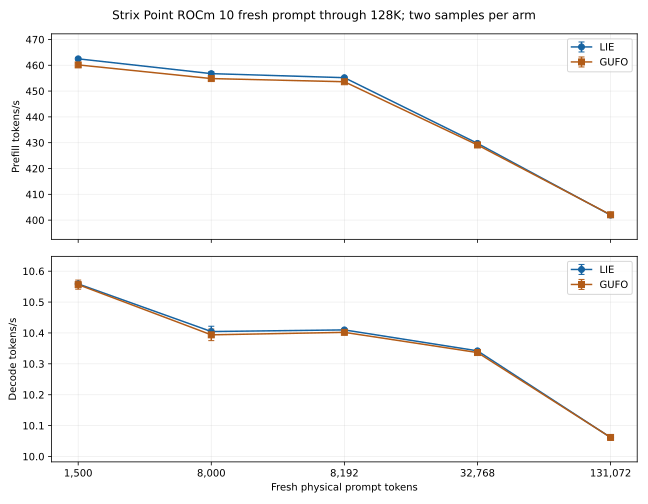

<!-- SPDX-License-Identifier: MIT -->
# Qwen3.8 Flash Next on AMD Strix Point

[Model platforms](../README.md) · [Benchmark index](../../../README.md)

Original Unsloth UD-Q4_K_XL weights, four verified shards, run on
`pop@192.168.5.161` with Radeon 890M (`gfx1150`). The current ROCm 10
campaign uses Pop!_OS kernel `7.1.5-76070105-generic`, a pinned Fedora 43
image through Docker-managed Distrobox and the older Point runtime. It is
**pre-integration evidence**: the newer C17 MTP/vision/phase-clock branch has
not yet been qualified on this GPU. Each completed campaign used a fresh
private lease, retained the exact raw files and restored the authorized
`llama-router.service` afterwards.

| Direct benchmark | LIE prefill | LIE decode | Same-stack Gufo decode | Scope |
| --- | ---: | ---: | ---: | --- |
| Occupied prefix 0, C1 | 479.936 tok/s | 10.433 tok/s | — | PP2048/TG128, one measured sample |
| Occupied prefix 128K, C1 | 357.117 tok/s | 9.227 tok/s | — | PP2048/TG128, one measured sample |
| Parallel C1 | 479.881 tok/s | 10.440 tok/s | 10.417 tok/s | PP2048/TG128, median of three |
| Parallel C8 | 474.092 tok/s | 32.837 aggregate tok/s | 32.872 aggregate tok/s | PP2048/TG128, median of three |

The [eight-depth single-session report](../../../2026-10-02/strix-point/rocm10-distrobox-single/README.md)
contains every 0–128K value, prefill/decode graphs, telemetry, raw JSONL and
reproduction commands. The [three-arm multi-session report](../../../2026-10-02/strix-point/rocm10-distrobox-multi/README.md)
contains LIE reactive, direct Gufo and LIE serial results at C1/2/4/6/8,
including every prefill/decode median, min/max, GPU batch counter and graph.
LIE and Gufo within ROCm 10 produce identical physical prompts, output IDs
and full prefill/decode frontiers in the three-arm campaign. Earlier ROCm 7.2
frontiers differ at every point, so the cross-stack rates are observations
across changed kernel/runtime/container configurations, not a controlled
quality-equivalent comparison.

## Fresh full-prompt prefill through 128K

The paired `fresh-128k` runs each begin with an empty sequence, reserve 262,144
tokens, process the entire listed physical prompt and generate 128 tokens.
There are two measured samples per size and no warmup. All **10 LIE/Gufo pairs**
have identical physical input IDs, output IDs and full prefill/decode-logit
hashes. Rates below are independent medians; prefill wait includes the full
new prompt and does not use a retained KV prefix.

| Physical prompt | LIE PP | Gufo PP | LIE PP seconds | Gufo PP seconds | LIE TG | Gufo TG |
| ---: | ---: | ---: | ---: | ---: | ---: | ---: |
| 1,500 | 462.491 | 460.139 | 3.243 | 3.260 | 10.559 | 10.556 |
| 8,000 | 456.756 | 454.846 | 17.515 | 17.588 | 10.405 | 10.394 |
| 8,192 | 455.188 | 453.611 | 17.997 | 18.060 | 10.410 | 10.402 |
| 32,768 | 429.730 | 429.114 | 76.252 | 76.362 | 10.342 | 10.337 |
| 131,072 | 401.949 | 402.066 | 326.091 | 325.996 | 10.061 | 10.062 |



The [complete median/min/max and duration CSV](charts/rocm10-fresh128.csv),
[verification and thermal receipt](charts/rocm10-fresh128.json),
[zero-axis SVG](charts/rocm10-fresh128.svg),
[detail PNG](charts/rocm10-fresh128-detail.png) and original
[LIE](data/rocm10-fresh128-lie.tar.gz) and
[Gufo](data/rocm10-fresh128-gufo.tar.gz) campaign bundles are included.
The bundles retain every measurement row, supervisor/child exit, model-stat
and service/lease record, telemetry and source runner. Fresh collection
verified 21/21 remote files by SHA-256 in each arm; the portable bundles omit
transient container home/cache files. Sampled maxima were CPU/GPU/NVMe
82.375/85/65.85 C for LIE and 83/86/71.85 C for Gufo, below the authorized
100 C ceiling and lower sensor limits. Reproduce the table and plots offline:

```sh
python3 -B docs/benchmarks/models/qwen3.8-flash-next/strix-point/render-rocm10-fresh.py fresh128
```

The pre-integration binary at source checkpoint `1877b03` has no newly added
prefill/decode phase clocks. The two samples per point show observed variation,
not a broad confidence interval or a new-runtime speed claim.

The [full Strix Point report](../../../../STRIX-POINT-RESULT.md) and
[direct benchmark report](../../../../STRIX-POINT-BENCHMARK-RESULT.md)
cover the earlier ROCm 7.2 fresh physical prompts through 258,794 tokens,
capacity, cache reuse, resources and failures. ROCm 10 near-256K fresh-prompt
and served HTTP multi-client measurements are pending.
Neither the direct C8 result nor the synthetic HTTP fixtures establish Pi
agent throughput. The old runtime has no newly added benchmark phase clocks;
new-runtime performance must be measured separately.
