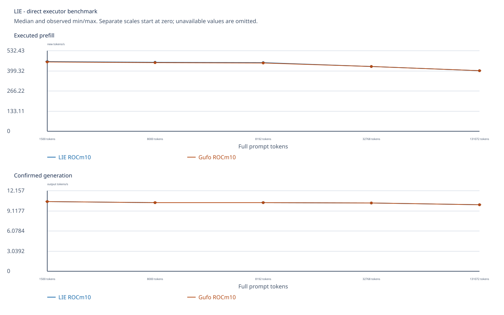
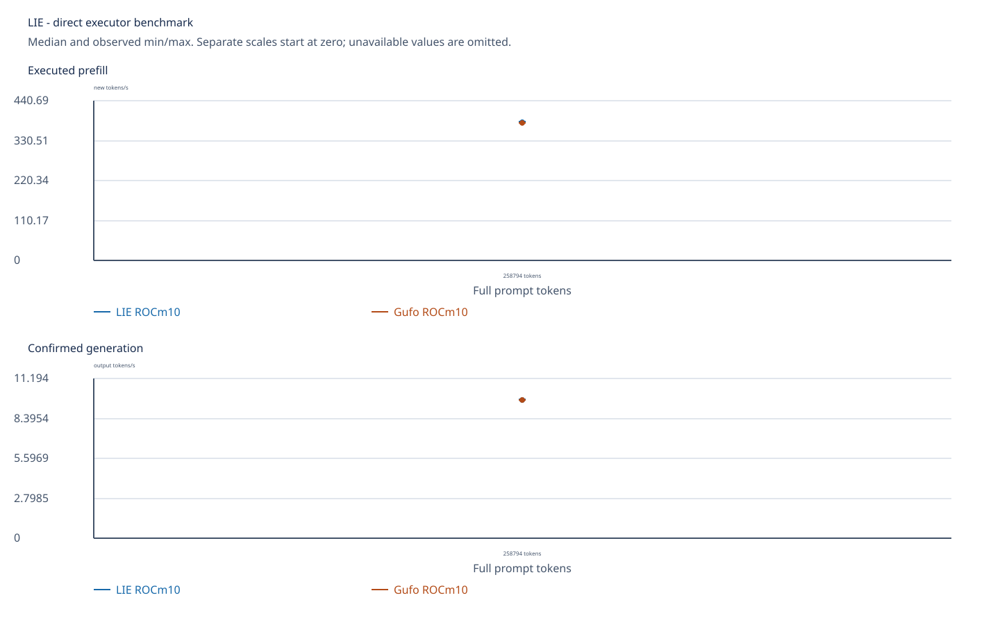
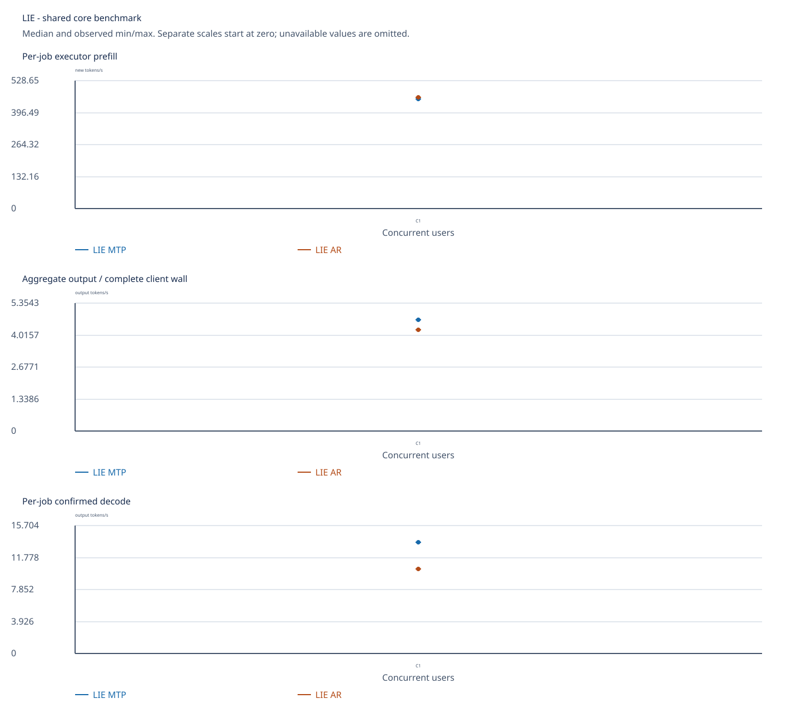

<!-- SPDX-License-Identifier: MIT -->
# Qwen3.8 Flash Next on AMD Strix Point

[Model platforms](../README.md) · [Benchmark index](../../../README.md)

Original Unsloth UD-Q4_K_XL weights, four verified shards, run on
`pop@192.168.5.161` with Radeon 890M (`gfx1150`). The current ROCm 10
campaign uses Pop!_OS kernel `7.1.5-76070105-generic`, a pinned Fedora 43
image through Docker-managed Distrobox. The initial AR baselines below use the
older Point runtime. The later [modern MTP section](#modern-c17-core-mtp-vs-ar-on-the-gpu)
uses the newly built C17 core on the same GPU. Each completed campaign used a fresh
private lease, retained the exact raw files and restored the authorized
`llama-router.service` afterwards.

The shared branch includes this target. Its
[integration receipt](../../../../development/validation/point-integration-2026-10-04.json)
records host checks and offline report reproduction; the GPU measurements below
remain bound to each campaign's recorded source and binaries.
The later [HTTP/SSD integration receipt](../../../../development/validation/point-functional-integration-2026-10-04.json)
verifies both raw archives and the optional direct-core reactive consumer. Its
host fixtures do not qualify a newer runtime on the Point GPU.

The original Q8 vision projector is now present on `.161` after a direct
read-only copy from `.157`. Its 616,703,104 bytes match the pinned SHA-256;
the source file is unchanged and both machines' leases were released. The
[copy receipt](../../../../development/validation/point-projector-copy-2026-10-04.json)
records the handover. The [direct core vision gates](#direct-reactive-core-and-q8-vision-gates)
now exercise that projector on this GPU; served vision and independent image
quality remain separate qualifications.

The later [original-weight served HTTP report](../../../2026-10-04/strix-point/http-multi/README.md)
compares the current LIE C17 reactive server with an independently built
official Gufo server using AR and MTP at C1/2/4/6/8, both with fresh
sessions=C and fixed eight-session lifecycles. It includes complete raw
archives, prefill, decode, first-output timing, telemetry and graphs at 4K
context. The direct results below answer different measurement questions.
The separate [cold HTTP depth report](../../../2026-10-04/strix-point/http-depth/README.md)
measures C1 AR/MTP through near 256K with two full-prefill repetitions per
engine, exact request comparison, TTFT and sealed raw evidence. Its prefill
curve declines with context in both LIE and official Gufo; it does not cover
concurrent long-context clients or 1M context.

| Direct benchmark | LIE prefill | LIE decode | Same-stack Gufo decode | Scope |
| --- | ---: | ---: | ---: | --- |
| Occupied prefix 0, C1 | 479.936 tok/s | 10.433 tok/s | — | PP2048/TG128, one measured sample |
| Occupied prefix 128K, C1 | 357.117 tok/s | 9.227 tok/s | — | PP2048/TG128, one measured sample |
| Parallel C1 | 479.881 tok/s | 10.440 tok/s | 10.417 tok/s | PP2048/TG128, median of three |
| Parallel C8 | 474.092 tok/s | 32.837 aggregate tok/s | 32.872 aggregate tok/s | PP2048/TG128, median of three |

The [eight-depth single-session report](../../../2026-10-02/strix-point/rocm10-distrobox-single/README.md)
contains every 0–128K value, prefill/decode graphs, telemetry, raw JSONL and
reproduction commands. The [three-arm multi-session report](../../../2026-10-02/strix-point/rocm10-distrobox-multi/README.md)
contains LIE reactive, direct Gufo and LIE serial results at C1/2/4/6/8,
including every prefill/decode median, min/max, GPU batch counter and graph.
LIE and Gufo within ROCm 10 produce identical physical prompts, output IDs
and full prefill/decode frontiers in the three-arm campaign. Earlier ROCm 7.2
frontiers differ at every point, so the cross-stack rates are observations
across changed kernel/runtime/container configurations, not a controlled
quality-equivalent comparison.

## Terminal Bench Core-19

The unchanged `git-leak-recovery` smoke passes **1/1 at the first attempt**
(configured pass@2). Harbor 0.20 / Terminus-2 2.0 executes the terminal commands
on CPU host `.157`; original-weight GPU inference uses `.161` HTTP port 8000.
The upstream benchmark is independently fetched at `07034484346d`, with 232
source files verified. Tasks, prompts and verifiers stay unchanged.

| Run | Final score | Attempts executed | Input tokens | Output tokens | Task duration |
| --- | ---: | ---: | ---: | ---: | ---: |
| Core-19 smoke, `git-leak-recovery` | 1/1, zero errors | 1 | 26,497 | 1,907 | 401.330 s |
| Core-19 full, 19 tasks | Stopped by owner; deferred | — | — | — | — |

The [smoke receipt](../../../../development/validation/terminal-smoke-point-gpu-2026-10-05.json)
and [portable score, transcript and closure evidence](data/rocm10-terminal-smoke-r16.tar.gz)
bind 65 files. The client, task containers and model processes actually retire;
both original leases are free, the router is restored and the own temporary
HTTP permit is removed with identical firewall status before/after. GPU host
CPU/GPU/NVMe maxima are 76.75/77/66.85 C; client CPU maximum is 65.5 C. The
server observes 44 whole-process threads, including runtime helpers; this does
not count reactive workers or establish a speedup. This single task does not
establish the full 19-task score or native OpenAI function-call quality.

The full run started separately at **20:08:35 UTC, 2026-10-05**, using the same
`2359488` runtime/code `5bdd405`, UD-Q4_K_XL, ROCm 10 and AR profile.
The [startup receipt](../../../../development/validation/terminal-full-point-start-2026-10-05.json)
and [startup evidence](data/rocm10-terminal-full-start-r16.tar.gz) verify doctor,
actual Harbor and a real model endpoint; startup is not a score or release.
The owner stopped it at **21:42 UTC**, before any task completed, and deferred
Terminal Bench until the functional modifications are finished. The
[stop receipt](../../../../development/validation/terminal-full-stopped-point-2026-10-05.json)
and [retained logs and closure](data/rocm10-terminal-full-stopped-r16.tar.gz)
record actual client/model/container/lease/HTTP retirement and router restoration.
The unfinished run has no full score. A later run needs the finished runtime,
a new job name and fresh machine coordination.
Both runs preserve the original C1, two conditional attempts and three hours
per attempt, with context 262,144 discovered from `/v1/models`. The full run can
take many hours. The command used for the stopped run is retained below; it is
not an instruction to resume the cancelled job. From the independently fetched
external benchmark root:

```sh
./terminal_bench.py run --tier full \
  --endpoint http://192.168.5.161:8000/v1 \
  --model qwen3.8-flash-next --platform strix-point \
  --model-name Qwen3.8-Flash-Next --engine synapse-lie \
  --engine-version 23594881f406adcaf47e156d4f8e880aa735b081 \
  --backend rocm --backend-version 10.0 \
  --quant UD-Q4_K_XL --inference-profile ar \
  --job-name lie-point-r16-core19-full-r1
```

Harbor/Terminal Bench are optional external evaluation tools that use Python.
Synapse LIE and `synapse-lie-bench`, including their default tests and native
CSV/JSON/SVG/PNG reports, remain Python-free.

## Fresh full-prompt prefill through 128K

The paired `fresh-128k` runs each begin with an empty sequence, reserve 262,144
tokens, process the entire listed physical prompt and generate 128 tokens.
There are two measured samples per size and no warmup. All **10 LIE/Gufo pairs**
have identical physical input IDs, output IDs and full prefill/decode-logit
hashes. Rates below are independent medians; prefill wait includes the full
new prompt and does not use a retained KV prefix.

| Physical prompt | LIE PP | Gufo PP | LIE PP seconds | Gufo PP seconds | LIE TG | Gufo TG |
| ---: | ---: | ---: | ---: | ---: | ---: | ---: |
| 1,500 | 462.491 | 460.139 | 3.243 | 3.260 | 10.559 | 10.556 |
| 8,000 | 456.756 | 454.846 | 17.515 | 17.588 | 10.405 | 10.394 |
| 8,192 | 455.188 | 453.611 | 17.997 | 18.060 | 10.410 | 10.402 |
| 32,768 | 429.730 | 429.114 | 76.252 | 76.362 | 10.342 | 10.337 |
| 131,072 | 401.949 | 402.066 | 326.091 | 325.996 | 10.061 | 10.062 |



The native C17 reporter produced the
[complete median/min/max and duration CSV](charts/rocm10-fresh128.csv),
[comparison JSON](charts/rocm10-fresh128-summary.json),
[zero-axis PNG](charts/rocm10-fresh128.png) and SVG above. Exact LIE/Gufo
differences are in the table and CSV; the zero-axis graph shows their shared
context trend. The [collection and thermal receipt](charts/rocm10-fresh128-collection.json)
and original
[LIE](data/rocm10-fresh128-lie.tar.gz) and
[Gufo](data/rocm10-fresh128-gufo.tar.gz) campaign bundles are included.
The bundles retain every measurement row, supervisor/child exit, model-stat
and service/lease record, telemetry and source runner. Fresh collection
verified 21/21 remote files by SHA-256 in each arm; the portable bundles omit
transient container home/cache files. Sampled maxima were CPU/GPU/NVMe
82.375/85/65.85 C for LIE and 83/86/71.85 C for Gufo, below the authorized
100 C ceiling and lower sensor limits. Reproduce the verified comparison and
plots offline with the C17 benchmark, from a repository root with a new run
directory:

```sh
cmake -S . -B build/point-report -G Ninja -DBUILD_TESTING=OFF
cmake --build build/point-report --target synapse-lie-bench -j2
(cd docs/benchmarks/models/qwen3.8-flash-next/strix-point/data &&
 sed 's@  docs/benchmarks/models/qwen3.8-flash-next/strix-point/data/@  @' archives.sha256 | sha256sum -c -)
mkdir -p run/point-rocm10-fresh128/lie run/point-rocm10-fresh128/gufo
tar -xzf docs/benchmarks/models/qwen3.8-flash-next/strix-point/data/rocm10-fresh128-lie.tar.gz \
  -C run/point-rocm10-fresh128/lie measurements.jsonl
tar -xzf docs/benchmarks/models/qwen3.8-flash-next/strix-point/data/rocm10-fresh128-gufo.tar.gz \
  -C run/point-rocm10-fresh128/gufo measurements.jsonl
build/point-report/synapse-lie-bench --suite report \
  run/point-rocm10-fresh128/lie/measurements.jsonl \
  --compare run/point-rocm10-fresh128/gufo/measurements.jsonl \
  --label 'LIE ROCm10' --reference-label 'Gufo ROCm10' \
  --output run/point-rocm10-fresh128/report
```

The native reporter validates complete physical IDs, sample counts, output
budgets, rates and pairwise numerical frontiers before writing CSV/JSON/SVG/PNG.
The frozen collection receipt additionally records service/lease closure and
the 21/21 remote-file hash checks made before publication; portable archives
omit transient container cache files.

## Fresh full-prompt prefill near 256K

The separate paired run starts with an empty sequence, processes **258,794**
physical input tokens with context capacity 262,144, then generates the full
128-token output. Each path has two measured samples and no warmup. Both
LIE/Gufo pairs have identical physical input IDs, output IDs and full
prefill/decode-logit hashes. These direct-executor results use the same older
ROCm 10 runtime as the 128K table above; MTP is not enabled.

| Engine | Prefill median (min–max) tok/s | Prefill median (min–max) s | Decode median (min–max) tok/s | Decode median (min–max) s |
| --- | ---: | ---: | ---: | ---: |
| LIE | 382.855 (382.503–383.206) | 675.960 (675.340–676.580) | 9.733 (9.732–9.734) | 13.151 (13.150–13.152) |
| Gufo | 380.717 (380.582–380.851) | 679.755 (679.515–679.995) | 9.715 (9.709–9.721) | 13.175 (13.167–13.183) |



The [complete native CSV](charts/rocm10-fresh256.csv),
[comparison JSON](charts/rocm10-fresh256-summary.json),
[PNG](charts/rocm10-fresh256.png),
[collection and thermal receipt](charts/rocm10-fresh256-collection.json), and
original [LIE](data/rocm10-fresh256-lie.tar.gz) and
[Gufo](data/rocm10-fresh256-gufo.tar.gz) bundles retain the exact measurements
and commands. All 21 remote files in each arm match the collected SHA-256
inventory. Both child/supervisor exits are zero, the four target shard stat
identities stay unchanged, and the named service and private lease are
restored/released. Sampled CPU/GPU/NVMe maxima were 83.125/86/70.85 C for
LIE and 82.375/86/70.85 C for Gufo. Reproduce the report offline with the
native C17 reporter:

```sh
(cd docs/benchmarks/models/qwen3.8-flash-next/strix-point/data &&
 sed 's@  docs/benchmarks/models/qwen3.8-flash-next/strix-point/data/@  @' archives.sha256 | sha256sum -c -)
mkdir -p run/point-rocm10-fresh256/lie run/point-rocm10-fresh256/gufo
tar -xzf docs/benchmarks/models/qwen3.8-flash-next/strix-point/data/rocm10-fresh256-lie.tar.gz \
  -C run/point-rocm10-fresh256/lie measurements.jsonl
tar -xzf docs/benchmarks/models/qwen3.8-flash-next/strix-point/data/rocm10-fresh256-gufo.tar.gz \
  -C run/point-rocm10-fresh256/gufo measurements.jsonl
build/point-report/synapse-lie-bench --suite report \
  run/point-rocm10-fresh256/lie/measurements.jsonl \
  --compare run/point-rocm10-fresh256/gufo/measurements.jsonl \
  --label 'LIE ROCm10' --reference-label 'Gufo ROCm10' \
  --output run/point-rocm10-fresh256/report
```

The pre-integration binary at source checkpoint `1877b03` has no newly added
prefill/decode phase clocks. The two samples per point show observed variation,
not a broad confidence interval or a new-runtime speed claim.

## Physical 1M context and fixed generation

The `1bff953` runtime completes a fresh **1,048,448-token physical prompt plus
128 output tokens** at capacity 1,048,576, using YaRN4, AR, chunk256, C1,
zero warmups and one measured repetition. RAM/SSD prefix caching is off.
`--ignore-eos` explicitly continues generation to the fixed budget. The earlier
natural-EOS run ended after 43 tokens and remains a failed TG128 gate.

| Physical prompt | Output | Prefill tok/s | Prefill seconds | Decode tok/s | Decode seconds | First output seconds | Complete wall seconds |
| ---: | ---: | ---: | ---: | ---: | ---: | ---: | ---: |
| 1,048,448 | 128 | 140.642 | 7,454.744 | 7.741 | 16.535 | 7,462.251 | 7,478.560 |

GPU GTT peaks at **109.183 GiB**; minimum sampled available RAM is **5.379 GiB**.
CPU/GPU/NVMe maxima are **78 / 79 / 66.85 C**. All child/controller exits are
zero, the owned GPU processes retire, original weights stay unchanged and the
router and original lease are restored/released. Process thread counts were
not recorded for this window; C1 identifies one client. This is a capacity and
functional result. Recall quality, repetitions and matched Gufo/Halogen results
at 1M remain pending. Its chunk size, YaRN profile and runtime differ from the
earlier 128K/256K tables, so they do not form a controlled speed comparison.

The [complete CSV](charts/physical1m-fixed-r15.csv),
[validation receipt](../../../../development/validation/physical1m-fixed-point-gpu-2026-10-05.json)
and [portable raw archive](data/rocm10-physical1m-fixed-r15.tar.gz) contain the
physical input/output IDs, timings, all progress snapshots, telemetry and
closure evidence. After checking `data/archives.sha256`, extract its `tokens.json`
to reproduce the physical workload with a matching GPU build and fresh admission:

```sh
synapse-lie-bench --suite core --model /path/to/model-00001-of-00004.gguf \
  --tokens-file /path/to/extracted/tokens.json --output run/physical1m.jsonl \
  --context 1048576 --rope-scaling yarn4 --chunk 256 --users 1 --tg 128 \
  --ignore-eos --kv-cache-ram-mb 0 --kv-cache-policy ds4 \
  --warmups 0 --repetitions 1 --timeout-ms 86400000 --progress-ms 10000
```

## Modern C17 core MTP vs AR on the GPU

The `rocm10-point-modern-r3` build uses LIE source `9b109998`, Gufo pin
`f783fedb` inside the explicit adapter, `gfx1150`, the same pinned Fedora 43
ROCm 10 image and original UD model as above, plus the copied Q8 MTP predictor.
The source/build and predictor identities are in the
[collection receipt](charts/rocm10-modern-mtp-collection.json). LZ4 has been
removed from the active checkpoint codec and build dependencies. The new ELF
requires `libzstd.so.1`, with no `liblz4` dependency; matching Zstandard 1.5.7
headers and their BSD license were sealed into the build capsule because the
runtime image contains the library but no development headers. Compression is
enabled in this build, though each measurement below disables retained RAM and
SSD KV caching and therefore does not measure checkpoint compression.

All four **matched original-weight GPU pairs** have the same physical prompt
IDs, complete output budgets and exact output token IDs across MTP and AR.
Greedy sampling, 2,048-token prefill chunks, one measured repetition and zero
warmups are identical within each pair. These are direct C-core measurements,
not HTTP or Pi-agent timings. Prefill and decode rates below use the executor
phase clocks; the final column uses all generated tokens divided by the
complete shared client wall, including prefill. For C2 the phase rates are
medians of two jobs, while wall throughput is the aggregate for both clients.

| Prompt / clients / output | Prefill AR → MTP, tok/s (s) | Decode AR → MTP, tok/s (s) | Complete wall AR → MTP, tok/s (s) | MTP accepted / drafted |
| --- | ---: | ---: | ---: | ---: |
| 1,500 / C1 / 32 | 461.752 (3.248) → 453.148 (3.310) | 10.517 (3.043) → 10.959 (2.920) | 5.072 (6.309) → 5.119 (6.252) | 12 / 31 |
| 8,192 / C1 / 128 | 459.693 (17.821) → 453.229 (18.075) | 10.388 (12.321) → 13.656 (9.373) | 4.241 (30.179) → 4.656 (27.492) | 70 / 115 |
| 131,072 / C1 / 128 | 401.798 (326.214) → 396.749 (330.365) | 10.042 (12.747) → 12.574 (10.180) | 0.377 (339.406) → 0.375 (341.095) | 56 / 85 |
| 8,192 / C2 / 128 each | 457.746 (17.896) → 451.039 (18.162) | 8.553 (14.965) → 9.714 (13.177) | 5.037 (50.827) → 5.164 (49.578) | 106 / 178 |



At 128K, MTP improves decode by 25.2% in the measured sample, but the much
longer prefill dominates total time: complete-wall throughput is 0.5% lower.
At 8K/C1, decode improves by 31.4% and complete-wall throughput by 9.8%; at
8K/C2, aggregate complete-wall throughput improves by 2.5%. Both C2 paths use
GPU decode batching: MTP records 75 batches/150 rows, AR 128 batches/256 rows.
One repetition per arm does not establish a stable speedup or a confidence
interval. The new AR output also matches the older direct-runtime baseline at
8K and 128K for all 128 output IDs, and at 1,500 for the first 32 IDs; that is
functional parity across runtimes, not a controlled timing comparison.

The native C17 reporter exports [1,500-token](charts/rocm10-modern-mtp1500/summary.csv),
[8K/C1](charts/rocm10-modern-mtp8192/summary.csv),
[128K/C1](charts/rocm10-modern-mtp131072/summary.csv) and
[8K/C2](charts/rocm10-modern-mtp8192-c2/summary.csv) complete CSVs, alongside
JSON summaries and SVG/PNG plots in each corresponding chart directory. The
[1,500-token](charts/rocm10-modern-mtp1500/benchmark.svg),
[128K/C1](charts/rocm10-modern-mtp131072/benchmark.svg) and
[8K/C2](charts/rocm10-modern-mtp8192-c2/benchmark.svg) plots use the same
zero-axis scales per metric. Each
summary validates input identity, full output budget and token parity before
computing the comparison. The
[raw campaign and build bundle](data/rocm10-modern-mtp-r3.tar.gz) preserves
all eight successful run receipts, the first failed AR supervisor attempt,
telemetry, model-stat checks, compile logs and the remote SHA-256 inventories;
transient Distrobox home/cache files are omitted from the portable archive.
Fresh local collection verified every remote file before packaging. The first
AR attempt had a completed inference child (exit 0) but supervisor exit 1
because KFD briefly retained its already-exited owned PID; the bounded
retirement correction passes dedicated CPU fixtures and the fresh AR rerun.
All eight qualified runs have child/supervisor exit 0, unchanged model and
predictor stat identities, restored service and released private lease. Final
postflight found only `llama-router.service` PID 96285 in KFD, no LIE container
and the private lease free. The highest observed CPU/GPU/NVMe readings across
these runs are 81.375/86/75.85 C, with CPU guarded at 98 C, NVMe at 85 C or
its lower hardware bound, and GPU observation only.

Reproduce an 8K comparison and its prefill/decode CSV and graphs offline from
the repository root, without model weights or GPU access:

```sh
(cd docs/benchmarks/models/qwen3.8-flash-next/strix-point/data &&
 sed 's@  docs/benchmarks/models/qwen3.8-flash-next/strix-point/data/@  @' archives.sha256 | sha256sum -c -)
mkdir -p run/point-modern-mtp-replay-r3
tar -xzf docs/benchmarks/models/qwen3.8-flash-next/strix-point/data/rocm10-modern-mtp-r3.tar.gz \
  -C run/point-modern-mtp-replay-r3
cmake -S . -B build/point-report -G Ninja -DBUILD_TESTING=OFF
cmake --build build/point-report --target synapse-lie-bench -j2
build/point-report/synapse-lie-bench --suite report \
  run/point-modern-mtp-replay-r3/evidence/point-modern-r3-mtp-p8192-c1-r1/measurements.jsonl \
  --compare run/point-modern-mtp-replay-r3/evidence/point-modern-r3-ar-p8192-c1-r1/measurements.jsonl \
  --label 'LIE MTP' --reference-label 'LIE AR' \
  --output run/point-modern-mtp-replay-r3/report-8192
```

### RAM and opt-in SSD KV reuse with MTP

Four additional original-weight `gfx1150` runs compare MTP and AR at an
8,192-token physical prompt and 32 generated tokens, separately with a 4 GiB
RAM cache and an explicitly enabled SSD cache (4 GiB quota, 512 MiB staging,
zero retained RAM budget). Each run has one cold warmup followed by one hot
measured request. The hot request restores all 8,192 tokens and performs zero
prefill calls. RAM records one RAM hit; SSD records one SSD hit, 8,192
SSD-cached tokens and zero SSD errors. All eight cold/hot requests have the
same physical input and 32 output token IDs. The predictor drafts 33 and
accepts 18 tokens per MTP request. Default SSD caching remains disabled.

| Hot cache / path | Reused tokens | Prefill | Decode tok/s | Complete-wall tok/s |
| --- | ---: | ---: | ---: | ---: |
| RAM / AR | 8,192 | 0 | 10.407 | 10.254 |
| RAM / MTP | 8,192 | 0 | 13.272 | 12.983 |
| SSD / AR | 8,192 | 0 | 10.380 | 8.306 |
| SSD / MTP | 8,192 | 0 | 13.222 | 9.939 |

These are functional cache gates with one measured request per arm, not a
statistical performance claim. The SSD read and checkpoint write remain in
complete-wall time; the archived SSD KV metadata reports 1,068,054,635 bytes
for AR and 1,128,102,871 bytes for MTP. The payload files remain on `.161` and
are excluded from the portable [raw evidence archive](data/rocm10-modern-mtp-cache-r3.tar.gz).
The [collection receipt](charts/rocm10-modern-mtp-cache-collection.json)
binds source, binary, remote SHA-256 checks (62/62 files), exact identities,
cache counters, temperatures and lease/service closure. The [RAM CSV](charts/rocm10-modern-mtp-ram8192/summary.csv)
and [SSD CSV](charts/rocm10-modern-mtp-ssd8192/summary.csv) contain full
prefill, decode, cache and wall values; the [RAM graph](charts/rocm10-modern-mtp-ram8192/benchmark.svg)
and [SSD graph](charts/rocm10-modern-mtp-ssd8192/benchmark.svg) have PNG and
JSON counterparts. Across these four runs, sampled CPU/GPU/NVMe peaks were
71.25/72/71.85 C. Every child and supervisor exited 0, model and predictor
stat identities remained unchanged, and the named service and private lease
were restored and released. Final postflight found only the restored router
PID 101236 in KFD, no LIE container and the private lease free.

Replay the two comparisons with the native C17 reporter:

```sh
(cd docs/benchmarks/models/qwen3.8-flash-next/strix-point/data &&
 sed 's@  docs/benchmarks/models/qwen3.8-flash-next/strix-point/data/@  @' archives.sha256 | sha256sum -c -)
mkdir -p run/point-modern-cache-replay-r3
tar -xzf docs/benchmarks/models/qwen3.8-flash-next/strix-point/data/rocm10-modern-mtp-cache-r3.tar.gz \
  -C run/point-modern-cache-replay-r3
for cache in ram ssd; do
  build/point-report/synapse-lie-bench --suite report \
    "run/point-modern-cache-replay-r3/evidence/point-modern-r3-mtp-${cache}-p8192-r1/measurements.jsonl" \
    --compare "run/point-modern-cache-replay-r3/evidence/point-modern-r3-ar-${cache}-p8192-r1/measurements.jsonl" \
    --label "LIE MTP ${cache^^}" --reference-label "LIE AR ${cache^^}" \
    --output "run/point-modern-cache-replay-r3/report-${cache}"
done
```

### Original-weight HTTP AR and MTP gates

The matching `117cbae6` build, including C17 request grammar snapshots and
independent speculative copies, passes the same 37 original-weight controls in
both AR and MTP. The
[source-bound receipt](../../../../development/validation/c17-request-state-point-gpu-2026-10-06.json)
and [portable raw archive](data/rocm10-request-state-openai-r27.tar.gz)
record both coherent 93-file ON/OFF providers, actual compiler/linker selections,
all exits, model/predictor stats and complete process/lease retirement. Two C1
direct controls also match full physical inputs, 128 outputs per point and
prefill/final-decode frontier hashes with Gufo at prefix depths 0/4,096;
warmup0/rep1 provides a correctness control. These are selected functional
controls; individual numeric/format branches, SSD BPE, independent probabilities,
faults, quality, resources and matched performance remain open. No new benchmark
curve is added by this functional gate.


The earlier frozen r11 runtime (`abb69d5`) passes **34/34 checks in both AR and
MTP**, including incremental function arguments/results/replay, allowed tools,
2/8 choices, seeded replay, probabilities/bias, stops, constrained JSON and
retained/background Responses lifecycle. These are functional wire/lifetime
checks, separate from the served throughput comparisons above.
The [AR receipt and retained failures](../../../../development/validation/openai-controls-point-gpu-2026-10-04.json)
and [new MTP receipt](../../../../development/validation/openai-controls-mtp-point-gpu-2026-10-04.json)
bind the original weights, predictor, source/binaries, exact checks and closure.
The MTP window verifies fifteen artifacts and releases at 22:22:10.325729 UTC;
server/client/controller/supervisor exits are 0, CPU/GPU/NVMe maxima are
61.5/66/66.85 C, models are unchanged and the named router/lease are restored.
Terminal Bench full evaluation and qualification of later sampling-filter,
fixed-EOS and steering changes remain separate gates. The earlier short gates below
retain their original methods and results.

The newer r12 runtime (`a3066a7`) passes **37/37 AR checks**, adding advertised
context/output limits and automatic omitted/null budgets. Both APIs generate
327 tokens in JSON and SSE, beyond the earlier implicit 128-token default,
with identical complete constrained output. This verifies budget behavior,
not task quality or throughput. The new MTP37 window is interrupted by an
external GPU client and remains unqualified; its actual failure and successful
process/service/lease closure are retained in the
[r12 receipt](../../../../development/validation/automatic-output-point-gpu-2026-10-04.json).

The integrated r15 runtime (`1bff953`) now passes **37/37 in both AR and MTP**,
including automatic output budgets. Its newer C17 grammar/history/distribution
components remain tied to that source and binary inventory.
The [GPU receipt](../../../../development/validation/c17-sampling-point-gpu-2026-10-05.json)
also records two seeded PP1500/TG128 sessions for each profile below. Each pair
reproduces identical output token IDs. These short functional samples use an
empty prompt cache and explicit ignore-EOS; they are not a paired Gufo cost or
long-context/quality comparison. Rates are the two complete samples, in tok/s.

| Profile | Prefill samples | Decode samples |
| --- | ---: | ---: |
| Greedy AR, temperature 0 | 460.451 / 461.022 | 10.587 / 10.573 |
| DS4 AR, temperature 1, min-p 0.05 | 461.621 / 462.139 | 10.314 / 10.434 |
| DS4 MTP, temperature 1, min-p 0.05 | 449.433 / 456.537 | 12.634 / 12.660 |

All profiles use seed 123, top-p 1, top-k 0 and no frequency/presence penalty;
greedy min-p is 0. MTP drafts 228 and accepts 124 tokens across its two sessions.
The five completed r15 windows have CPU/GPU/NVMe maxima 71.125/71/67.85 C,
verified model/process/service/lease closure and 67 SHA-verified artifacts.
The separate [physical1M fixed-TG128 gate](#physical-1m-context-and-fixed-generation)
also passes; recall and matched long-context comparisons remain open.

The newer `2359488` runtime includes default-ON C17 finite values/container
construction and compiled-schema caching. Its matching build and **37 AR plus
37 MTP OpenAI controls** pass with 40 SHA-verified artifacts and complete
process/model/service/lease closure. The
[receipt and raw bindings](../../../../development/validation/c17-finite-cache-point-gpu-2026-10-05.json)
and [portable archive](data/rocm10-finite-cache-openai-r16.tar.gz) identify that
source. These are functional checks; the earlier rate tables retain their
original runtimes. Broader numerical/fault/resource/matched-cost gates remain
open. The later unchanged [Terminal smoke](#terminal-bench-core-19) passes 1/1;
the full 19-task evaluation is stopped and deferred until functional changes
and their qualification finish.

The matching r18 runtime (`6a48da3`) adds C17 schema memo/dispatch/Visit/body
control and passes **37/37 AR and 37/37 MTP controls**. The
[receipt](../../../../development/validation/c17-schema-body-point-gpu-2026-10-05.json)
and [portable evidence](data/rocm10-schema-body-openai-r18.tar.gz) bind the
57-file provider, successful build and actual closure. CPU/GPU/NVMe maxima in
the inference windows are 66.25/69/65.85 C. Both modes observe 44 whole-process
threads, including runtime helpers; no inference worker is added and this is
no measured reactive speedup. Earlier performance tables retain their source
identities. New SSD BPE cases are host-qualified; original-weight cache/branch/
fault/resource/cost acceptance remains separate.

Two additional `.161` windows start `synapse-lie-server` in the same supervised
ROCm 10 Distrobox, once with AR and once with the copied Q8 predictor explicitly
enabled. Both use the original UD shards, 16,384-token configured context,
fresh short requests, one private server on loopback and no retained RAM/SSD
KV cache. The server reports `synthetic=false`, `READY` and the pinned Gufo
provider in both runs; its MTP flag is false for AR and true for the predictor
run. This exercises the C HTTP/worker/flow path with real GPU inference.

| Check | AR | MTP |
| --- | --- | --- |
| `/v1/models` lists the configured model | pass | pass |
| Chat Completions JSON and SSE, same output | `4` | `4` |
| Responses JSON and SSE, same output | `4` | `4` |
| Server / Distrobox child / supervisor exit | 0 / 0 / 0 | 0 / 0 / 0 |

The [collection receipt](charts/rocm10-modern-http-collection.json) records
the binary and helper identities, API checks, backend mode, thermal peaks,
34/34 collected remote-file SHA-256 checks and lease/service closure. The
[portable raw archive](data/rocm10-modern-http-r3.tar.gz) contains every
request/response, server and supervisor log, telemetry and original manifest;
transient container home/cache files are omitted. Sampled CPU/GPU/NVMe peaks
were 63.375/54/66.85 C across the two windows. Final postflight found only
the restored router PID 103651 in KFD, no LIE container and the private lease
free. Recheck the archive from the repository root:

```sh
(cd docs/benchmarks/models/qwen3.8-flash-next/strix-point/data &&
 sed 's@  docs/benchmarks/models/qwen3.8-flash-next/strix-point/data/@  @' archives.sha256 | sha256sum -c -)
mkdir -p run/point-modern-http-replay-r3
tar -xzf docs/benchmarks/models/qwen3.8-flash-next/strix-point/data/rocm10-modern-http-r3.tar.gz \
  -C run/point-modern-http-replay-r3
for mode in ar mtp; do
  (cd "run/point-modern-http-replay-r3/point-modern-r3-${mode}-http-r1" && \
   sha256sum -c remote.sha256)
done
```

These short loopback requests establish functional serving for the tested
paths. External Pi-agent connectivity, tool-call generation, 128K/256K HTTP
requests and served performance still need separate Point qualification.

### SSD KV reuse across inference processes

Two more original-weight GPU windows test **process restart**, separately for
AR and MTP. In each window a cold `synapse-lie-bench --suite core` process
prefills the same 8,192 physical tokens, writes the opt-in SSD KV state and
exits. A distinct process then opens the same private SSD directory and
generates 32 tokens. RAM KV retention is zero; SSD quota and staging are 4 GiB
and 512 MiB. The hot process restores all 8,192 tokens from SSD, records one
SSD hit and zero SSD errors, and performs no prefill. Cold/hot physical input
and output IDs match within each arm; AR and MTP output IDs also match each
other. MTP accepts 18 drafted tokens in both processes.

| Path | Cold prefill tokens | Hot SSD-cached tokens | Hot prefill tokens | Hot decode tok/s | Hot complete-wall tok/s |
| --- | ---: | ---: | ---: | ---: | ---: |
| AR | 8,192 | 8,192 | 0 | 10.262 | 8.226 |
| MTP | 8,192 | 8,192 | 0 | 12.550 | 9.696 |

Each row is one hot request after one cold request; these rates do not
establish a stable performance difference. The [collection receipt](charts/rocm10-modern-ssd-restart-collection.json)
links all four process exit codes, exact identity comparisons, KV file stats,
temperature and 42/42 remote-file SHA-256 checks. The
[portable raw archive](data/rocm10-modern-ssd-restart-r3.tar.gz) contains both
processes' JSONL, logs and telemetry. It excludes the SSD payloads, whose
retained sizes are 1,068,054,635 bytes for AR and 1,128,102,871 bytes for
MTP. Sampled CPU/GPU/NVMe peaks are 70.75/71/72.85 C. Both windows restore
the authorized router and release the private lease; final postflight sees
only router PID 106168 in KFD and no LIE container.

```sh
(cd docs/benchmarks/models/qwen3.8-flash-next/strix-point/data &&
 sed 's@  docs/benchmarks/models/qwen3.8-flash-next/strix-point/data/@  @' archives.sha256 | sha256sum -c -)
mkdir -p run/point-modern-ssd-restart-r3
tar -xzf docs/benchmarks/models/qwen3.8-flash-next/strix-point/data/rocm10-modern-ssd-restart-r3.tar.gz \
  -C run/point-modern-ssd-restart-r3
for mode in ar mtp; do
  (cd "run/point-modern-ssd-restart-r3/point-modern-r3-${mode}-ssd-restart-r1" && \
   sha256sum -c remote.sha256)
done
```

This qualifies normal cross-process persistence on `.161`. Abrupt process
failure, host reboot and SSD eviction remain separate tests.

### SSD text reconstruction across processes

This functional check uses the unchanged qualified `20777005` runtime. Four
independent core processes calibrate a token, measure fresh BPE, persist a
longer physical history, then restore it from identical visible text. RAM
retention is zero; SSD quota/staging are 4 GiB/512 MiB. Context is 4,096, chunk
256, C1, greedy sampling, EOS ignored, one repetition and no warmup.

| Mode | Fresh BPE tokens | Saved physical tokens | Hot SSD tokens | Hot prefill tokens | Matching output IDs | MTP drafted/accepted, cold and hot |
| --- | ---: | ---: | ---: | ---: | ---: | --- |
| AR | 256 | 2,048 | 2,048 | 0 | 32 | 0 / 0 |
| MTP | 272 | 2,064 | 2,064 | 0 | 32 | 28 / 21 |

MTP adds a separately tokenized 16-token question after the repeated-character
prefix. The core captures the full prompt before decode as well as the early
2,048-token checkpoint; finish capture is disabled. All four native processes
exit 0 in each selected case. AR's wrapper exits 0. MTP's original wrapper exits
1 because its expectation omitted the full-prompt checkpoint; corrected strict
offline validation passes without replay. The
[receipt](../../../../development/validation/ssd-text-restart-point-gpu-2026-10-06.json)
preserves that exit and the earlier mount/zero-accepted-draft refusals.
This qualifies exact reconstruction, not matched performance, scheduled steering
or general output quality.

The [raw archive](data/rocm10-ssd-text-restart-r21.tar.gz) contains JSONL, telemetry,
actual exits and both original/corrected QA sources, with no model or KV payload.
To inspect the records without starting inference:

```sh
(cd docs/benchmarks/models/qwen3.8-flash-next/strix-point/data &&
 sed 's@  docs/benchmarks/models/qwen3.8-flash-next/strix-point/data/@  @' archives.sha256 | sha256sum -c -)
mkdir -p run/point-ssd-text-r21
tar -xzf docs/benchmarks/models/qwen3.8-flash-next/strix-point/data/rocm10-ssd-text-restart-r21.tar.gz \
  -C run/point-ssd-text-r21
cat run/point-ssd-text-r21/context-r21-mtp-r3-offline-validation-r1.json
```

### Scheduled steering with SSD

Separate AR/MTP windows use six independent native core processes each. A bounded
metadata reader sizes an owned sparse 48-by-2560 nonzero direction fixture;
this is not a learned DS4 bank. Initial scales are zero. FFN/attention change
at physical indices 128, 273 and 279, covering prefill and generation.
Context is 4,096, chunk 256, C1, greedy sampling, EOS ignored, one repetition,
no warmup and RAM retention zero. SSD quota/staging are 4 GiB/512 MiB.

| Scheduled case, both AR and MTP | Physical prompt | SSD-cached tokens | Physically prefilled tokens | Matching output IDs |
| --- | ---: | ---: | ---: | ---: |
| Cold reference, SSD off | 272 | 0 | 272 | 32 |
| SSD with divergent 2,064-token saved spelling | 272 | 0 | 272 | 32 |
| SSD with compatible prefix before first step | 272 | 128 | 144 | 32 |

All actual step positions and final policies match within and across modes.
MTP drafts 14 and accepts 3 in each scheduled case. All twelve native processes
and both supervisors exit 0; model/predictor stats remain unchanged.
CPU peaks are 64/65.5 C, NVMe 71.85/75.85 C and whole-process thread maxima 44/44,
including runtime helpers. Fresh 04:04:00 UTC closure retires both windows,
releases the original lease and verifies restored router 101740 as the only
KFD owner. No new inference thread or performance gain is claimed.

The [receipt](../../../../development/validation/steering-physical-index-point-gpu-2026-10-06.json)
and [raw archive](data/rocm10-steering-physical-index-r22.tar.gz) retain source,
exact input/output/policy witnesses, all exits and telemetry. They contain no
model or KV payload. This qualifies the selected physical-index/cache regression;
learned-direction quality, independent graph/correction/fault, vision, later
mixed-history lookup and matched cost remain open.

```sh
(cd docs/benchmarks/models/qwen3.8-flash-next/strix-point/data &&
 sed 's@  docs/benchmarks/models/qwen3.8-flash-next/strix-point/data/@  @' archives.sha256 | sha256sum -c -)
mkdir -p run/point-steering-r22
tar -xzf docs/benchmarks/models/qwen3.8-flash-next/strix-point/data/rocm10-steering-physical-index-r22.tar.gz \
  -C run/point-steering-r22
cat run/point-steering-r22/context-r22-cross-mode-r1.json
```

### Steering bank admission and zero-scale controls

The `modern-core-steering-admission` profile checks model admission and confirmed
output equality. It uses context 4,096, chunk 256, C1, greedy sampling, EOS
ignored, no warmup, one repetition and no RAM/SSD retention. The owned sparse
48-by-2560 direction bank has 48 nonzero values; both active scales are zero.

| Both AR and MTP | Native exits | Physical prompt tokens | Matching output IDs |
| --- | --- | ---: | ---: |
| Bank absent | 0 | 272 | 32 |
| Nonzero bank admitted, scales zero | 0 | 272 | 32 |
| Fresh core after twelve bank refusals | 0 | 272 | 32 |

Each mode refuses empty/truncated/oversized banks, quiet/signaling NaN and
infinities, directories, symlinks, FIFOs and missing files. All twelve refusals
retain actual exit 1, the exact diagnostic and no readiness/numerical job.
Successful inputs/outputs match within and across modes. MTP drafts six and
accepts zero per positive request; this qualifies drafting and confirmed-output
parity, without an accepted-burst claim. The first MTP QA attempt incorrectly
required positive acceptance; its native exit 0 and wrapper exit 1 are preserved.

CPU peaks AR/MTP are 56.625/57.875 C, NVMe 69.85/70.85 C; whole-process thread
maxima are 44/44, including runtime helpers. All windows are collected/retired
and the original lease released. These are functional checks; learned-direction
quality, independent graph/correction/GPU faults, vision and matched cost remain
open. The [receipt](../../../../development/validation/steering-admission-point-gpu-2026-10-06.json)
and [176-member raw archive](data/rocm10-steering-admission-r23.tar.gz) bind the
unchanged runtime, exact token witnesses, actual failures and telemetry, without
model or KV payloads. Archive inspection needs no model execution:

```sh
(cd docs/benchmarks/models/qwen3.8-flash-next/strix-point/data &&
 sed 's@  docs/benchmarks/models/qwen3.8-flash-next/strix-point/data/@  @' archives.sha256 | sha256sum -c -)
mkdir -p run/point-steering-r23
tar -xzf docs/benchmarks/models/qwen3.8-flash-next/strix-point/data/rocm10-steering-admission-r23.tar.gz \
  -C run/point-steering-r23
cat run/point-steering-r23/evidence/context-r23-steering-mtp-r2/steering-admission-result.json
```

### Direct reactive core and Q8 vision gates

The sealed `gfx1150` r4 and r5 builds use the same pinned ROCm 10 image,
original UD shards and optional Q8 sidecars as the modern results above. r4
is source `080177b`; r5 is source `c07bb95`. The r5 benchmark ELF links
Zstandard and has no direct LZ4 dependency. The r5 direct C-core
`--reactive-probe` holds a borrowed text event and its credits, lets a peer
complete, then cancels the held job. It compares **every byte** of the loan
after cancellation and checks retirement counters. This is a functional
credit/ownership test inside inference, without HTTP or a throughput claim.

| Build / mode | Physical input / peer budget | Outcome | Peer / held tokens | Held blocked; completed / cancelled | MTP drafted / accepted; native batches |
| --- | ---: | --- | ---: | ---: | ---: |
| r4 AR | 1,500 / 32 | pass | 32 / 8 | 1; 1 / 1 | 0 / 0; 8 |
| r4 MTP | 1,500 / 32 | fail, exit 1 | — | generic retirement error | — |
| r5 AR | 1,500 / 32 | pass | 32 / 8 | 1; 1 / 1 | 0 / 0; 8 |
| r5 MTP | 1,500 / 32 | fail, exit 1 | — | retired: active 0, blocked 0, completed 1, cancelled 1 | accepted 0; — |
| r5 MTP | 8,192 / 128 | pass | 128 / 8 | 1; 1 / 1 | 100 / 64; 5 |

The r4 MTP error combined an early cross-object counter read with an MTP
acceptance condition. In r5 the consumer waits, with a two-second bound, for
the core notice after both peer completion and cancellation. Twenty repeated
focused CTests then pass; the previous version failed 3/20. The r5 short MTP
run still rejects its zero accepted drafts, while the known accepting 8K/C2
frontier passes the complete loan, backpressure and cancellation gate. The
short failure remains in the raw evidence; neither outcome changes the
earlier matched MTP performance measurements.

The same r5 binary processes an owned 224×224 PNG (white field, red square)
through the copied Q8 projector, once in AR and once with Q8 MTP enabled.
The image SHA-256 is
`93fb5acb49b2a7f77581f957663f3e4572ccb1dbd8f496dcc163f6eca5c8b76e`.
Both runs expand to the **same 92 physical input tokens** (SHA-256
`5c5e8dba04c75812e6f42662371b7a14a3898b7bbf52822800f587af196bf79d`)
and return the **same 13 output token IDs**. MTP drafts 14 and accepts 8.

| Vision path | Prefill tokens / seconds / tok/s | Decode tokens / seconds / tok/s | Complete wall seconds / tok/s |
| --- | ---: | ---: | ---: |
| AR | 92 / 1.405803 / 65.443 | 13 / 1.232467 / 10.548 | 3.025742 / 4.296 |
| MTP+vision | 92 / 1.400427 / 65.694 | 13 / 0.923468 / 14.077 | 2.710227 / 4.797 |

These are one sample per path, including only 13 generated tokens; they do
not establish a performance gain. The direct benchmark records token IDs,
not decoded text, so this Point gate verifies the vision execution path and
AR/MTP parity rather than whether the sentence describes the red square.
Served vision and a semantic image-quality suite remain open.

All seven r4/r5 GPU windows preserve the model, predictor and projector file
identities they admit. The 79 collected remote files match their fresh SHA-256
inventories. Every window retires its child and supervisor, restores the named
router and frees the private lease; the final postflight finds only router PID
123296 in KFD. Maximum sampled CPU/GPU/NVMe temperatures across these runs
were 73/75/70.85 C, with the GPU observed rather than temperature-limited.
The successful r5 GPU windows sample at most 44 OS threads in the model
process; the C core still has one device-owner thread, and this process total
includes backend/runtime roles. It is not a thread-per-request count.
The [collection receipt](charts/rocm10-modern-functional-r4-r5-collection.json)
and [portable raw archive](data/rocm10-modern-functional-r4-r5.tar.gz)
include each real exit code, failed and passing JSONL, fixture image/prompt,
physical tokens, build receipts and telemetry. Verify and unpack them from
the repository root:

```sh
(cd docs/benchmarks/models/qwen3.8-flash-next/strix-point/data &&
 sed 's@  docs/benchmarks/models/qwen3.8-flash-next/strix-point/data/@  @' archives.sha256 | sha256sum -c -)
mkdir -p run/point-modern-functional-r4-r5
tar -xzf docs/benchmarks/models/qwen3.8-flash-next/strix-point/data/rocm10-modern-functional-r4-r5.tar.gz \
  -C run/point-modern-functional-r4-r5
```

The [full Strix Point report](../../../../STRIX-POINT-RESULT.md) and
[direct benchmark report](../../../../STRIX-POINT-BENCHMARK-RESULT.md)
cover the earlier ROCm 7.2 fresh physical prompts through 258,794 tokens,
capacity, cache reuse, resources and failures. Modern ROCm 10 served HTTP
multi-client measurements remain pending.
Neither the direct C8 result nor the synthetic HTTP fixtures establish Pi
agent throughput. The old runtime has no newly added benchmark phase clocks;
new-runtime performance must be measured separately.
